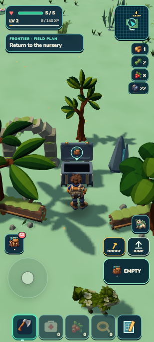
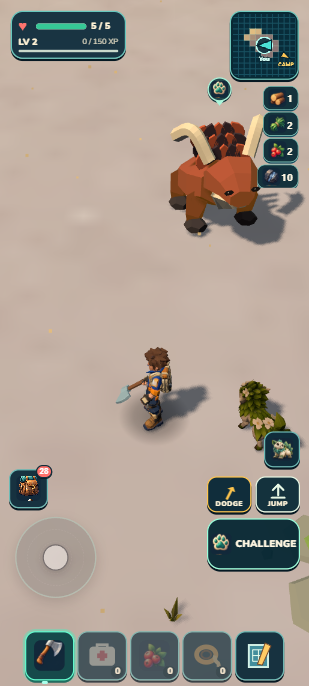

# Wildkin Frontier

**Latest local checkpoint: discover a grove and put Mossling to work.** The current continent contains59 seeded Lush groves. Bring a secured Mossling, use Bloom to open the cache, then collect food, flowers and crystal for another outing. Each grove remembers its own opened seal and remaining supplies. All1,319 tests and package checks pass; the selected visual is7.7/10 HOLD, with canopy/ruin framing and denser ground detail still needing polish. [Actual screenshots, controls and limitations](art/reviews/lush-groves/receipt.md).

 

**Continent foundation:** Walk into the shallows, swim at the surface, and follow the offshore current back toward land. Companions wait on dry ground; reloading restores your last supported shore position with the same outing and supplies. Shoreline art remains held at6.4/10, with richer landforms, dressing and swimming animation still needed. [Coast proof and limitations](art/reviews/frontier-coast/receipt.md).

 

Wildkin Frontier is an offline, single-player exploration and creature-life game in active local development. Portrait mobile is the primary play surface: five always-visible quick slots sit at the bottom, the movement stick sits above them on the left, and the selected-slot action with Jump and Dodge sits above the right side. Landscape and desktop remain supported.

Leave a physical Camp, make a short useful outing, study or bring home an individual Wildkin, and return to a world that remembers the result. The direction favors slow, dangerous exploration, recognizable regional geography, and care that happens in the world rather than through a separate creature inventory.

**Early alpha in progress; first-outing foundation complete.** A compact field plan now derives the next useful outing or Camp action from existing supplies, bonds, care, crops and abilities; it adds no quest ledger. From a fresh save with no resources or owned Wildkin, the native journey gathered and returned supplies, crafted a berry lure, bonded and secured Mossling `wildkin_wvwyyt`, settled it in a bed, fed three carried berries, built a nearby garden, planted and harvested it. The actual Bloom-tended harvest yielded four berries and advanced the plan back to Plant a berry. Final earned state is one Mossling with care3, bed and garden,6berries,1wood,1fiber,3wildflowers,50XP and health5. A separate health fixture proved Bloom healed3→5, began a24-second cooldown and cleared its hint. Developer literal reload and packaged import plus literal reload matched individual/genome, base, care, crop, pack, atlas, ecology, XP, health and purpose exactly. The packaged run loaded resources only from `http://127.0.0.1:8081` and its console was empty. All 1,243 tests and verify/world/retained-campaign/build/validate/ZIP pass;44.22 MB unpacked/20.55 MB ZIP. That journey needed a temporary landscape viewport for its garden; the portrait construction checkpoint below closes the workaround. No physical-phone or airplane-mode cold-start claim is made. See the [first-outing receipt](art/reviews/alpha-outing/receipt.md).

  

**Portrait construction checkpoint:** Build now searches at most40 deterministic nearby positions through the unchanged placement validator, covering all11 current piece families. In native portrait play, the reused earned Camp fixture placed and immediately used a bed and nearby garden without a landscape, position or camera override. The existing camera owner rotates only for portrait construction; Cancel and external closure restore the prior view, while Place keeps the useful yaw and restores temporary pitch/zoom. Landscape construction opens without changing the view, and returning to portrait restores its prior pitch. Independent review scored the result8.5/10 PASS. Developer and packaged reload matched individual/genome, base/care/crop, pack, atlas/ecology, XP, health and purpose exactly. All1,252 tests and verify/world/retained-campaign/build/validate/ZIP pass;44.22MB unpacked/20.56MB ZIP. [Evidence and limits](art/reviews/portrait-construction/receipt.md).

**Cragbreaker mining checkpoint:** Emberhorn now strikes up to three nearest active stone, iron or crystal sources within4.5m in3D, applying at most four ordinary harvest hits to each and12 total. A full five-piece iron source can retain one piece. The existing guard, save-before-effect, pickup and harvest-bonus paths remain authoritative; the first rejected hit stops the burst while prior committed effects and the ability cooldown remain. In a portrait position fixture, the ordinary ability button depleted two four-piece crystals and collected all eight shards, moving crystal14→22; a second check cracked iron5→1 and collected four ore, moving iron12→16. Partial iron1 and depleted crystal0 survived literal reload and a disclosed same-session forced resident-window cycle. The normal field-tool action at1.35m finished iron1→0, leaving iron17, crystal22, zero pending pickups and health5. Packaged import plus literal reload and Continue preserved the continuation state and Cragbreaker produced no duplicate yield while retaining its18-second cooldown. Inventory, seven owned Wildkin, selection, base/care/crop/breeding, ecology, XP and active run matched exactly; the atlas added one legitimate survey bit. Logs were empty and packaged origins were only `http://127.0.0.1:8081`. The laptop measured12.2ms for eight hits and6.4ms for four; this is not phone performance evidence. All1,260 tests passed in66.839seconds, with world/campaign/build/validate/ZIP passing at44.22MB unpacked/20.56MB ZIP. [Evidence and limits](art/reviews/cragbreaker-mining/receipt.md).

**Tidal Ward checkpoint:** Tidefin now provides a combat-owned3-second protection window separate from dodge and post-hit grace. The existing ability button stays disabled and reads WARD3s→2s→1s from the authoritative timer, then returns to the simultaneously running26-second cooldown; routine activation no longer adds a toast over the hearts. Native portrait controls showed the same northern Emberhorn charge reduce health5→3 without Ward and leave health5→5 with Ward. This was a prepared Tidefin/position fixture using WINDUP-timed DOM-button automation, not an earned capture or reflex test. Ordinary F then cleared iron5→0 and collection moved iron17→22 with no pickups. The ordinary return took24.969seconds to the Camp edge and11.694seconds more to the arch at health5; RETURN TO CAMP confirmation banked8XP for58 total and cleared the run. Developer literal reload and portable owner import plus literal reload matched the entire canonical progress state exactly. Ward was0, invulnerability was false and the ability correctly hid at Camp. Final logs were empty and packaged origins were only `http://127.0.0.1:8081`. The shared rusher/spitter warning race exposed by this test is fixed. All1,270 tests passed in66.775seconds with world/campaign/build/validate/ZIP passing at44.23MB unpacked/20.56MB ZIP. Independent final review passed the complete source, native, aggregate and package chain with no blocker; no physical-phone, airplane-mode cold-start or earned-Tidefin claim is made. [Evidence and limits](art/reviews/tidal-ward/receipt.md).

  

Seeded Sunscar crystal blooms form compact harvestable places with saved partial/depleted state. The selected R3 scored8.0/10 PASS; exact portable evidence and limitations are recorded in the [bloom receipt](art/reviews/regional-blooms/receipt.md).

 

The working release direction is one seeded continent with an ocean boundary and useful companion roles. Roughly10 habitats and30 species are a staged content target; the first alpha starts with a smaller finished set. The coast/ocean and surface-swim foundation exists; boats and the larger roster remain planned. See the [early-alpha priorities](docs/EARLY_ALPHA_PLAN.md) and [illustrated progress supplement](docs/research/living-frontier/Early-Alpha-Progress.md).

 

The Signal Cache is one validated authored location on seeded ground: open its chest to recover two iron ore and eight XP once. Distributed procedural secrets remain planned. The [discovery receipt](art/reviews/frontier-discoveries/receipt.md) includes native interaction and persistence proof. The latest [timing comparison](art/reviews/streaming-preparation/streaming-comparison.svg) shows measured desktop CPU pauses, not phone performance.

 

Actual prototype captures: selected regional overhead on the left; a regional encounter in the final portable build on the right. The [province receipt](art/reviews/regional-provinces/receipt.md) includes the revealed atlas and separates functional proof from the held visual target. The [visual fieldbook](docs/research/living-frontier/Living-Frontier-Visual-Fieldbook.pdf) also illustrates the proposed direction.

## Play locally

Recommended local runtime: Node.js 22 (the current development version):

```sh
npm install
npm run dev
```

Open http://localhost:8080/. Serve the project over HTTP rather than opening `index.html` directly. Saves are browser-local. Settings can export or restore a save backup.

Desktop controls: **WASD** move, **Shift** run, **C** sneak, **1–5** select a quick slot, **F** use the selected item, **Space** jump, **R** dodge, **E** interact, and **Q** use the companion ability. On touchscreens, use the left stick to move; tap the five bottom quick slots; use the selected action, Jump, and Dodge on the right. **Pack** opens the physical inventory and shortcut arrangement.

## Current playable foundation

- A persistent Camp, personal atlas/minimap, physical departure and return, locally saved progress, and one fixed deterministic world edition with shared terrain/ecology/scenery/wildlife descriptor inputs.
- Five persistent portrait quick slots, separated Pack access, held-input cancellation, and landscape/desktop support.
- Individual Wildkin records through capture, Camp banking, roster selection, reload, and care. Mossling body tone is visibly expressed; separate eyes, markings, size changes, and modular body parts are not shipped.
- Emberhorn Cragbreaker applies the existing resource transaction to a bounded nearby mineral set. This makes ordinary outcrops and current Sunscar blooms useful job sites without adding another mineral formation or reward ledger.
- Tidefin Tidal Ward provides three readable protected seconds through the existing ability button and combat owner. The current northern Emberhorn route proves a timed safe approach without adding a hazard, species or reward system.
- One physical nursery and garden, active-play young/crop growth, ordinary compatible Mossling pairing, and earned optional parent body-tone guidance. The first current path is deliberately bounded.
- Bounded terrain residency, shared terrain/collision sampling, a personal atlas, generated forage/scenery and existing Mossling, Tidefin, and Emberhorn encounters. Terrain retains25 published pieces plus at most nine detached candidates, preparing one per moving tick and publishing a complete neighborhood after collider installation. Bounded climbing, fall risk and surface swimming exist; broader traversal, boats and diving remain later work.
- A generation inspector for current samplers, plus irregular roughly600m seeded provinces with smooth weighted ecotones, terrain targets up to84m, regional ground color, admitted flora/resources, and at most one additional high-draw signature encounter per live wildlife set. Existing resident/count bounds remain unchanged. Final visual admission is pending.

## Proposed direction

The next frontier is not a promise of a completed campaign. Three existing Wildkin now have useful bounded roles in care/cultivation, mining and protected approach. The active local foundation also gives three province grammars distinct landform, color, ordinary life/resource recipes and sparse signature encounters. Coast and continent shape are the next world candidate after this checkpoint closes; deeper traversal, ecology and discoveries still need later slices. It does not add physical water, weather, caves/overhangs, infinite-distance simulation, DNA systems or trade. Evidence is tracked in [Current slice](docs/CURRENT_SLICE.md).

Later proposals include modular compatible Wildkin rigs and parts, broader field research and reproduction modes, habitat/food/camp systems, caves and overhang meshes, day/night and weather, DNA archives/cloning, community discoveries, and trusted online trade. These are not current gameplay systems. Mortality and elder rules remain undecided; current no-absence-penalty growth is provisional.

## Research and design references

- [Living Frontier visual fieldbook](docs/research/living-frontier/Living-Frontier-Visual-Fieldbook.pdf) — phone-friendly current evidence, proposed concepts, process diagrams, and clearly marked limitations.
- [Living Frontier research appendix](docs/research/living-frontier/Living-Frontier-Research-Appendix.pdf) · [editable Markdown](docs/research/living-frontier/Living-Frontier-Research-Appendix.md) — implementation reasoning, source ledger, and proposed regional/content workflow.
- [Research image manifest](docs/research/living-frontier/image-manifest.md) — actual versus proposed image provenance.
- [Living Frontier plan](docs/LIVING_FRONTIER_PLAN.md) · [current scope](docs/CURRENT_SLICE.md) · [regional diversity plan](docs/REGIONAL_DIVERSITY_PLAN.md) · [mobile identity](docs/MOBILE_IDENTITY.md).

Historical finite-campaign planning and review material remains available as source history; it is not the active product promise.

## Build and local checks

```sh
npm test
npm run verify
npm run build
npm run validate
npm run zip
npm run serve:submission
npm run test:browser
```

`npm run serve:submission` serves the packaged result at http://localhost:8081/. The build is written to `dist/submission/` and the ZIP to `dist/submission.zip`. `npm run test:browser` runs the local browser playtest harness. Focused checks are also available through the scripts in `package.json`; final validation status belongs in [Current slice](docs/CURRENT_SLICE.md).

## Development references

[Current objective](docs/CURRENT_SLICE.md) · [Game design](docs/GAME_DESIGN.md) · [Architecture](docs/ARCHITECTURE.md) · [Build log](docs/BUILD_LOG.md) · [Historical beta plan](docs/BETA_RELEASE_PLAN.md)

Runtime: Three.js 0.160.0, Rapier 0.20.0, vanilla HTML/CSS/JS, and one animation loop with fixed physics steps. Runtime dependencies are local; the game makes no external runtime requests; local assets load from the same server.
