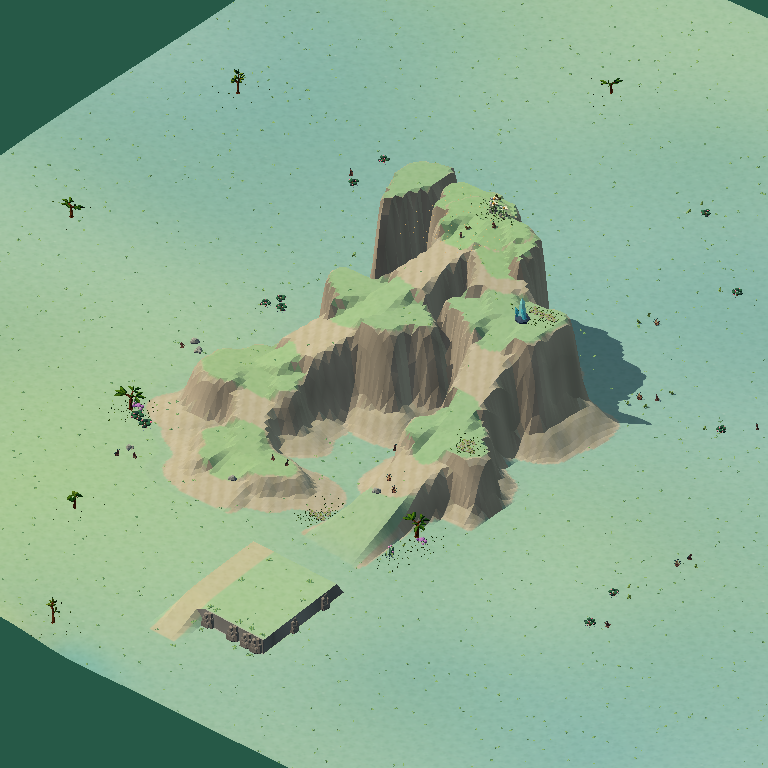
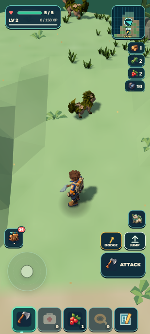

# Wildkin Frontier

Wildkin Frontier is an offline, single-player exploration and creature-life game in active local development. Portrait mobile is the primary play surface: five always-visible quick slots sit at the bottom, the movement stick sits above them on the left, and the selected-slot action with Jump and Dodge sits above the right side. Landscape and desktop remain supported.

Leave a physical Camp, make a short useful outing, study or bring home an individual Wildkin, and return to a world that remembers the result. The direction favors slow, dangerous exploration, recognizable regional geography, and care that happens in the world rather than through a separate creature inventory.

**Local pre-alpha; not a release.** Current implementation and proof are maintained in [Current slice](docs/CURRENT_SLICE.md). Skybreak supplies the first tall plateau fixture, with lower berry/fiber pockets, an upper crystal deposit and a crown Mossling habitat. Its visual target and the wider regional generator remain unfinished.

 

Actual prototype captures: selected diagnostic composition on the left; final portable portrait gameplay on the right. The [ecology receipt](art/reviews/skybreak-ecology/receipt.md) records the later home-safety correction. The [visual fieldbook](docs/research/living-frontier/Living-Frontier-Visual-Fieldbook.pdf) also illustrates the proposed direction.

## Play locally

Recommended local runtime: Node.js 22 (the current development version):

```sh
npm install
npm run dev
```

Open http://localhost:8080/. Serve the project over HTTP rather than opening `index.html` directly. Saves are browser-local. Settings can export or restore a save backup.

Desktop controls: **WASD** move, **Shift** run, **C** sneak, **1–5** select a quick slot, **F** use the selected item, **Space** jump, **R** dodge, **E** interact, and **Q** use the companion ability. On touchscreens, use the left stick to move; tap the five bottom quick slots; use the selected action, Jump, and Dodge on the right. **Pack** opens the physical inventory and shortcut arrangement.

## Current playable foundation

- A persistent Camp, personal atlas/minimap, physical departure and return, locally saved progress, and one fixed deterministic world edition with shared terrain/ecology/scenery/wildlife descriptor inputs.
- Five persistent portrait quick slots, separated Pack access, held-input cancellation, and landscape/desktop support.
- Individual Wildkin records through capture, Camp banking, roster selection, reload, and care. Mossling body tone is visibly expressed; separate eyes, markings, size changes, and modular body parts are not shipped.
- One physical nursery and garden, active-play young/crop growth, ordinary compatible Mossling pairing, and earned optional parent body-tone guidance. The first current path is deliberately bounded.
- Bounded terrain residency, shared terrain/collision sampling, a personal atlas, generated forage/scenery and existing Mossling, Tidefin, and Emberhorn encounters. A bounded climb and fall-risk foundation exists; broad climbing and swimming are later work.
- A generation inspector for current samplers. It is a development diagnostic, not a player-facing geography system.

## Proposed direction

The next frontier is not a promise of a completed campaign. It is a practical plan for larger seeded regions with distinct landform, traversal, life, resources, and discovery grammar; no predictable global path grid or random palette soup. Skybreak is the first selected terrain fixture, with evidence tracked in [Current slice](docs/CURRENT_SLICE.md).

Later proposals include modular compatible Wildkin rigs and parts, broader field research and reproduction modes, habitat/food/camp systems, caves and overhang meshes, day/night and weather, DNA archives/cloning, community discoveries, and trusted online trade. These are not current gameplay systems. Mortality and elder rules remain undecided; current no-absence-penalty growth is provisional.

## Research and design references

- [Living Frontier visual fieldbook](docs/research/living-frontier/Living-Frontier-Visual-Fieldbook.pdf) — phone-friendly current evidence, proposed concepts, process diagrams, and clearly marked limitations.
- [Living Frontier research appendix](docs/research/living-frontier/Living-Frontier-Research-Appendix.pdf) · [editable Markdown](docs/research/living-frontier/Living-Frontier-Research-Appendix.md) — implementation reasoning, source ledger, and proposed regional/content workflow.
- [Research image manifest](docs/research/living-frontier/image-manifest.md) — actual versus proposed image provenance.
- [Living Frontier plan](docs/LIVING_FRONTIER_PLAN.md) · [current scope](docs/CURRENT_SLICE.md) · [regional diversity plan](docs/REGIONAL_DIVERSITY_PLAN.md) · [mobile identity](docs/MOBILE_IDENTITY.md).

Historical finite-campaign planning and review material remains available as source history; it is not the active product promise.

## Build and local checks

```sh
npm test
npm run verify
npm run build
npm run validate
npm run zip
npm run serve:submission
npm run test:browser
```

`npm run serve:submission` serves the packaged result at http://localhost:8081/. The build is written to `dist/submission/` and the ZIP to `dist/submission.zip`. `npm run test:browser` runs the local browser playtest harness. Focused checks are also available through the scripts in `package.json`; final validation status belongs in [Current slice](docs/CURRENT_SLICE.md).

## Development references

[Current objective](docs/CURRENT_SLICE.md) · [Game design](docs/GAME_DESIGN.md) · [Architecture](docs/ARCHITECTURE.md) · [Build log](docs/BUILD_LOG.md) · [Historical beta plan](docs/BETA_RELEASE_PLAN.md)

Runtime: Three.js 0.160.0, Rapier 0.20.0, vanilla HTML/CSS/JS, and one animation loop with fixed physics steps. Runtime dependencies are local; the game makes no external runtime requests; local assets load from the same server.
