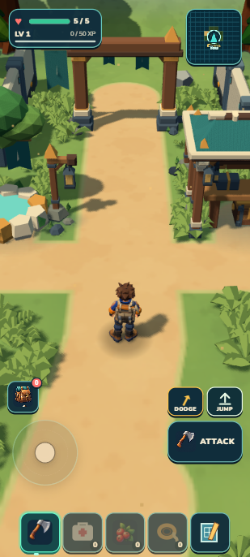

# Useful first outing — native evidence

September 13,2026. Trial batch1 began07:16UTC from3371a9d. The first-outing purpose derives from existing supplies, exact bonds, health/ability and physical Camp state. It adds no quest ledger, reward, creature, dependency or save schema.

| Before | Current portrait purpose |
| --- | --- |
|  |  |

The purpose opens the same Journal. Active observation/taming takes priority; ready Bloom emphasis also yields to those cues and blocking menus. Craft/build affordability includes selected reachable storage; feeding/planting still require berries in the backpack. A garden prompt asks for placement beside the occupied bed so Mossling's existing six-metre cultivation benefit can apply.

Independent review found the card compact/readable and clear of the minimap and primary controls. Corrected findings: spendable-resource scope and field-guide highlight priority. The reviewer retracted a proposed Travel-at-arch blocker after checking the existing automatic walk-out owner and the actual fresh journey. A root check also removed an unnecessary foundation requirement. Station panels now protect the clickable purpose card.

## Native journey and limits

Dedicated agent tab at127.0.0.1:8082 began with no resources or owned Wildkin. User's8080 tab was untouched. The route uses ordinary keyboard/UI controls, assisted by coordinates and state inspection. No inventory, creature or position grants were used. This is mechanics proof, not a claim that an unfamiliar human can find the route unaided.

- Gathered Camp fiber and southern frontier berries/wood; walked back to the arch and used RETURN TO CAMP plus confirmation. Four harvested berries, five fiber and five wood were preserved; the existing first-return milestone added two berries and15XP (25total). Literal reload preserved the earned save.
- Opened the new purpose, Work and Craft; made a lure. The native journey exposed stale resource HUD counts after spending. The successful inventory-commit owner now notifies the existing HUD/cargo refresh only for changed pack resources. Failed saves and storage-only spending emit no resource refresh. Live retry confirmed berries4→2 and fiber4→3 updated immediately.
- Quiet approach, lure feeding and bond-ready stages worked. One attempt expired during tool inspection pauses; it remains recorded as a failed attempt with its lure spent. The retry uses a bounded continuous sequence of ordinary keyboard events and the existing lure button.

## Verification and workflow trial

All1,243 tests and world/retained-campaign/build/validate/ZIP passed in one aggregate run;44.22MB unpacked,20.55MB ZIP. Focused proof covers purpose priorities, selected-storage versus pack-only spending, guidance/highlight suppression and committed craft/build/feed/plant notifications, including failed saves and storage-only transactions. The aggregate test phase took65.1seconds.

Root owns composition, ordinary journey and integration. Separate workers own the pure purpose and HUD/pack-notification chain; one independent reviewer checked contracts and actual portrait captures. One consolidated review repair plus the native-discovered stale-count fix. No generated target or visual redesign rounds were needed for this behavior-first batch. Tool navigation/inspection and an expired timed tame caused more visible rework than aggregate tests; retain this evidence when assessing the two-batch workflow trial.

The retry earned and physically secured Mossling `wildkin_wvwyyt` from `f1:w:0:-2:0`. The existing ally milestone added25XP and three wildflowers; total securedXP50. Further ordinary foraging provided eight wood, nine fiber and six berries. Bed construction spent three wood/five fiber; three Feed actions changed berries6→5→4→3; adjacent garden construction spent four wood/three fiber and Plant changed berries3→2. The existing crop owner reports `bloomTended:true,yield:4` and reached90seconds through active play.

**Portrait construction remains a release gap.** The bed was placed in portrait after moving to free ground. The garden used a temporary1280×800 landscape view and the ordinary ground-aim/Place controls, then portrait resumed for planting. Camera direction was assisted to face the work area. No structure/position/inventory grant bypassed placement. This does not establish an unaided portrait outing. Next batch should choose a legal initial preview and frame it through the existing camera owner before adding more content.

The first scripted bond continuation incorrectly used click on a pointer-only direct action, then met the normal switch to the nearby contextual BOND action; root completed the actual visible BOND control. A straight return route also hit vegetation and was rerouted. These are recorded tooling repairs, not extra creature design rounds. Reuse corrected gesture/context assumptions and serialize input owners in future timed journeys.

The quiet earned outing stayed at full health. A separate disclosed health fixture set health to3 outside Camp with the same earned active Mossling. The actual Bloom button restored3→5, started the24-second cooldown, removed its amber hint and changed the plan to returning for the ripe four-berry crop. This verifies the ability/purpose connection; it is not proof of an earned combat injury or encounter balance.

Actual HARVEST showed four berries and `Bloom +1`; the normal action changed backpack berries2→6, cleared the crop and returned the purpose to Plant a berry. The nearby nourished Mossling remained the same earned individual.

Developer literal reload and packaged import through the existing save owner followed by literal reload matched exactly across owned individual/genome, base, care, crop, inventory, atlas, finite ecology changes, XP, health and purpose. Final state: six berries, one wood, one fiber, three wildflowers; one nourished Mossling, bed and empty garden;50XP,health5. The package used only127.0.0.1:8081 resource origins and had no console warnings/errors. No new developer error occurred after the final reload; its retained log contains one older07:18 pre-candidate `animation` TypeError of unconfirmed origin. No physical-phone or airplane-mode cold-start claim.
