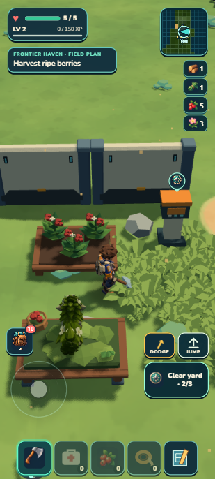
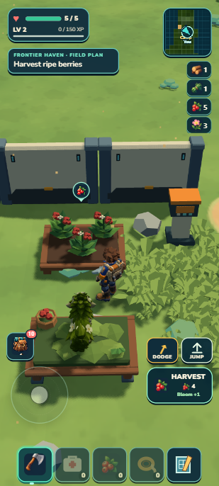
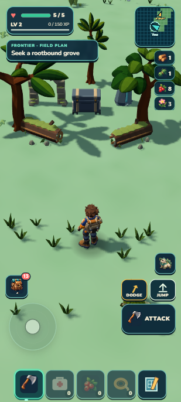
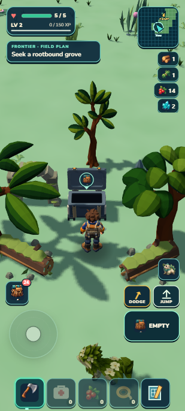
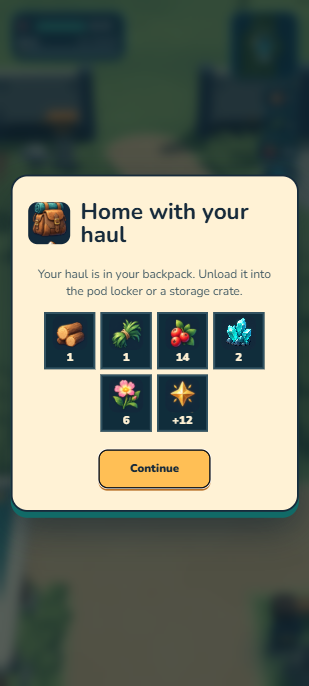
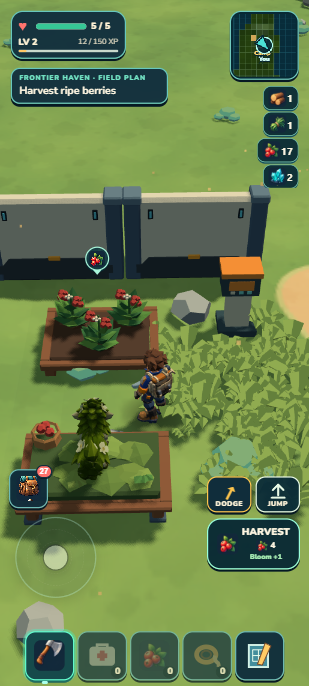
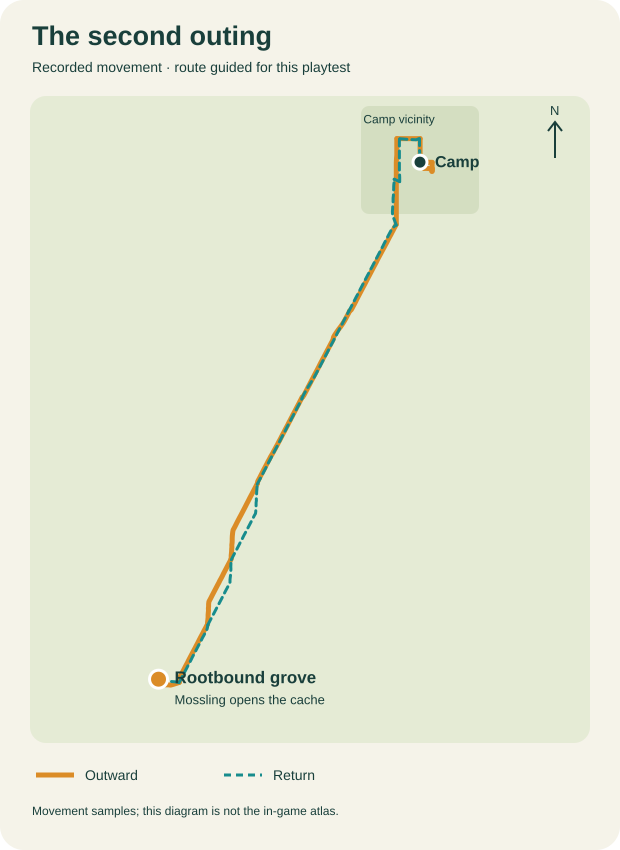
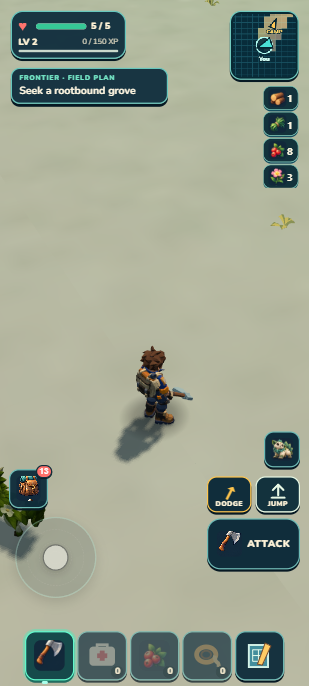
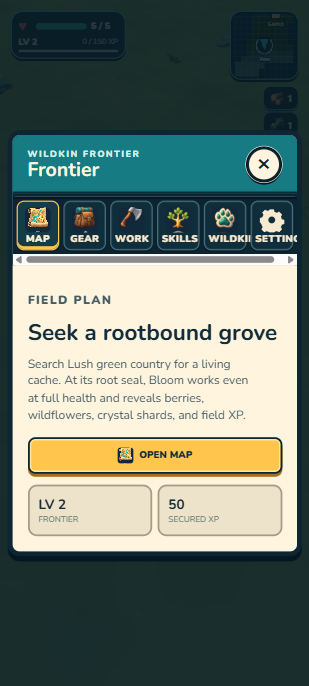

# An earned second outing — verified local checkpoint

This batch continues the previously earned first-outing save: one secured Mossling, a settled bed and berry garden, 50 banked XP, full health, and a modest backpack. The seven-individual inspection save was preserved separately. No new resources or companions were granted. The existing portrait camera and admitted models are reused; this is a connected-play and guidance correction, with no new art target or visual redesign round.

## Preparation and discovered friction

Normal movement reached the garden. Plant consumed one carried berry, changing berries 6→5. The crop naturally reached 90 seconds during inspection and became a four-berry harvest, including the existing nearby Mossling care bonus. No simulation stepping was used.

At player position approximately (3.32,7.93), the ripe garden was about 1.27 metres away and the incomplete yard console about 2.19 metres away. The HUD correctly requested a harvest, but the contextual action showed Clear yard. Walking around the east side exposed Plant normally: this was focus friction, not an unreachable garden. The source owner returned the yard console before evaluating nearby furniture.

The existing field-purpose helper also had no grove objective. Once the Camp garden and nursery became ready, their return instructions displaced exploration. The bounded correction derives an away purpose from the established Camp and active secured Mossling; safety and pending bonds retain priority, and actionable Camp care remains intact. No quest ledger or map secret marker is introduced.

After a literal developer reload, ordinary movement returned to the overlapping area at (3.46,7.77). A normal camera drag toward the garden exposed HARVEST instead of Clear yard. The actual button collected four berries (5→9); Plant then spent one (9→8). Garden and nursery selection now compare the existing visible furniture candidate with the yard console by distance. Storage and crafting stations retain priority, and activation reach, disabled status and save transactions remain unchanged. Focused purpose tests (9/9), base runtime tests (2/2) and independent reviews passed.

 

## Journey protocol

Use ordinary keyboard movement and actual UI controls. Read-only route guidance is disclosed: the chosen grove is about 528 metres southwest of Camp, and the route audit used the existing finite grove catalog and bounded terrain samples. This is a guided earned journey, not proof of unaided first-player discovery. Input helpers have explicit deadlines and release their keys; they do not alter player positions, supplies, physics or simulation time. Literal reloads are identified separately.

The south Camp fence blocked the initially suggested direct departure. The helper stopped at the obstacle; ordinary input returned through the open north exit and circled the fence. The subsequent outward terrain route completed without health loss, position writes or simulation stepping. The naturally ripe Camp crop did not displace the new grove purpose outside Camp. The actual Journal explained Lush country, full-health Bloom and the cache payoff.

At the grove, the earned Mossling's actual Bloom button changed MOSSLING SEAL to disabled OPENING at health 5. Once the lid finished, normal Open changed berries 8→14, wildflowers 3→6 and crystal shards 0→2, while 12 XP remained in the active run. The chest became EMPTY. The player kept the same single owned individual, one wood and one fiber. No encounter damage was observed; this does not prove the whole region is safe or repeat the prior Ward/combat tests.

 

The return retraced the surveyed corridor. A tree near Camp stopped the bounded input helper; an ordinary sideways detour cleared it. At the north arch, RETURN TO CAMP → Return to Camp secured the 12 field XP, changing banked XP 50→62 and clearing the active run. The same Mossling, all supplies and full health remained. Back at the garden, normal Harvest changed berries 14→18 and Plant spent one, leaving 17 berries, six wildflowers, two crystal shards, one wood and one fiber. The replanted crop naturally reached its 90-second ready state while checkpoint work continued.

The trace records 30 bounded movement legs: 178.024 seconds outward/preparation and 183.368 seconds returning/final approach, 361.392 seconds total. Sampled horizontal travel is approximately 1.25 km. These figures include the fence/tree attempts and exclude inspection pauses, UI actions and the earlier preparation before the source reload. They are not an unaided player's completion time. The route diagram shows recorded samples, including detours; it is not the in-game atlas.

 

## Checkpoint and saved continuation

One aggregate passed all **1,322 tests in 76.024 seconds**, followed by world/campaign/build/validation and ZIP. The package is **44.29 MB unpacked / 20.57 MB ZIP** (21,569,834 bytes). No aggregate was repeated for documentation or screenshots.

The selected complete export envelope matched exactly after developer literal reload and portable import plus literal reload. Portable Continue also retained that complete state: banked XP 62, no active run, health 5, one unchanged owned individual and selection, the earned bed/garden, nourishment 3, naturally ready crop, cache seal/claim, inventory, ecology and surveyed atlas. Both warning/error logs were empty. Portable resource origins were only `http://127.0.0.1:8081`. No physical-phone or cold-airplane-mode test is claimed. [Portable Camp continuation](package-camp.png).

This closes the guided earned Camp→grove→return→Camp-use story. Unaided discovery, broader danger pacing and the existing coast/grove visual debts remain open. Earlier failed-save, partial claims, mechanism motion and multi-residency proof is reused from [the grove receipt](../lush-groves/receipt.md); these unchanged systems were not independently reimplemented or retested by another harness.

## Human playtest

Continue a save with a secured, selected Mossling and a settled bed beside a berry garden. Approach the garden while facing it; where the nearby yard console overlaps, the nearer visible object should receive the action. Harvest ripe berries and plant one from the backpack. A garden button that remains hidden behind a farther console is the failure sign.

Leave through Camp's open northern arch and circle toward the southwestern green country. For this directed test, seek the clearing with two side trees, fallen logs, small ruins and a closed chest. The map should uncover as you travel; ready crops should not replace the away grove plan. Near the chest, use Bloom even at full health, wait for OPENING to finish, then Open. Expect six berries, three wildflowers, two crystal shards and twelve unsecured XP; the chest should become EMPTY.

Follow the Camp map bearing home, approach the north arch and choose RETURN TO CAMP, then Return to Camp. Expect the XP to become secured and the backpack to remain intact. Use the garden again and reopen the game. Missing supplies, a changed individual, lost map reveal or repeat cache rewards are failure signs.

## Next visible gap

The pale ground on the journey is an intentional Sunscar/Lush transition. A bounded source audit found repeated approximately 27-metre gaps between scenery patches and very small, aggressively thinned dry grass. Runtime registration is active. A next visual batch should make ordinary travel read better using the admitted kit and existing caps, then compare the same portrait view. This batch does not add grass, props, hazards, species or secret markers.

 
