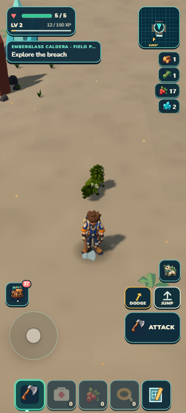
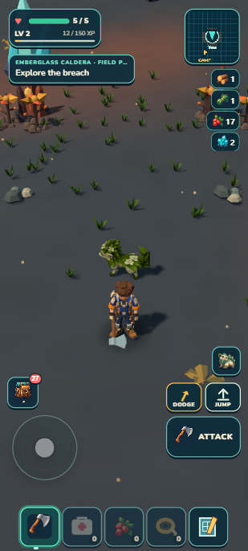

# Emberglass Caldera: a working outing, unfinished scenery

The finite Caldera habitat now has volcanic shelves, a breached crater, finite crystal/iron deposits and a territorial Emberhorn. Ordinary controls collected one crystal shard and two iron, triggered its warning and returned through the breach at full health. The visual candidate remains **HOLD 3.8/10**; it is not a finished alpha habitat.

 

The left image shows the unresolved composition; the right shows the existing creature encountered deeper in the bowl. These are native captures, not target art. The target remains [separately labelled](../../targets/caldera-v1/README.md).

## What works

| Player action | Observed result |
| --- | --- |
| Walk through the south breach | Grounded route through the final low buttresses; full health |
| Tap the field tool during a forced four-step catch-up frame | One edge delivered, crystal 4→3; no delayed second swing |
| Hold the field tool for 1.1 seconds | Intentional repeated hits, iron 5→3; two iron collected |
| Pick up the loose shard | Carried crystal 2→3 through the ordinary pickup owner |
| Approach the Emberhorn, then retreat | WARN after 1.27 seconds inside notice, health 5; RETURN then ROAM |
| Walk approximately 82 m out and back | Both minerals and the Emberhorn retire and return; mineral counts remain 3/3, at most 25 terrain residents |
| Literal developer/portable reload and Continue | Entire outing save matches exactly; earned Camp also restored exactly in both builds |

The field-plan name follows only the current habitat. The crater hint changes to “Explore volcanic shelves” after walking out. Urgent health, pending bonds and swimming retain precedence.

## Architecture and validation

One pure profile owns volcanic height/color and fixed crater geometry. The same height feeds terrain, chunk meshes, physics and queries. Existing resource, creature, scenery, inventory and persistence owners handle the outing. The shared bowl refuge owns the Emberhorn home geometry. Both foliage paths blend Caldera appearance with bounded existing meshes/cache keys. No new asset, dependency, network path or frame loop was added.

**1,378/1,378 tests pass** in 85.335 seconds, followed by world/campaign/build/validation/ZIP. Package:44.36 MB unpacked,20.59 MB ZIP (21,586,115 bytes). One aggregate was run at the integrated checkpoint. Source reviews pass: [terrain](profile-review.md), [consumers](consumer-review.md), [input edge](attack-edge-review.md). [Compact recorded evidence](checkpoint.json).

## Final visual result

| Round | Score | Result |
| --- | ---: | --- |
| R1 | 1.5 | Pale empty ground; planned content outside the camera |
| R2 | 4.0 | Better color and dressing, but HUD and framing hide the composition |
| R3 | 3.8 | Green grass corrected; floor is too empty and the right group is hidden |

  

The three-round ceiling is reached. No visual admission or tenth-habitat completion is claimed. Next establish a feasible ordinary portrait camera/HUD composition before authoring more off-axis scenery. Full transformed asset bounds and real HUD rectangles must fit the view; passing a distance or center-point test is insufficient.

## Reproduce as a player

This is a disclosed developer position fixture at the south breach, not an earned journey across the continent. Face north with the ordinary 42-degree portrait camera. Walk between the dark low shoulders; the crystal appears on the left and the iron farther right. Step to the near crystal edge, tap the tool once, and walk over the loose shard. Approach the open side of the iron and hold briefly. Each deposit should shrink and add the matching resource when its drops reach you; repeated free yield or invisible/unreachable sources are failures.

Walk toward the horned creature in the bowl, leaving room to retreat. When it turns and warns, move back through the breach. A blocked clear lane, attack before a readable warning, or a creature that never settles after you leave is a failure. Walk past the outer volcanic shelves and return: partially mined sources must keep their remaining contents. Internal starting reference: player850,-1962; crystal846.5,-1976; iron854,-1980; home850,-1986.

## Limits and retained state

The final native outing used normal keyboard listeners with read-only position guidance. A deliberate 80 ms pause tests the shared keyboard/mouse/HUD/touch edge gate; intentional held cadence was separately observed. One earlier R2 attempt ended in defeat while root left the character idle during code inspection; its collected backpack remained. That was not the successful final warning/retreat proof.

Developer and portable tabs finish at the exact earlier earned one-Mossling Camp save, including bed, garden, care, supplies, XP, ecology and atlas. The Caldera outing is preserved separately as a local test save. Browser warning/error logs were empty and portable resource origins were local. No physical-phone, new cold-offline, frame-time benchmark, GitHub push, Drive upload or alpha release is claimed. The continuous development goal remains active.
