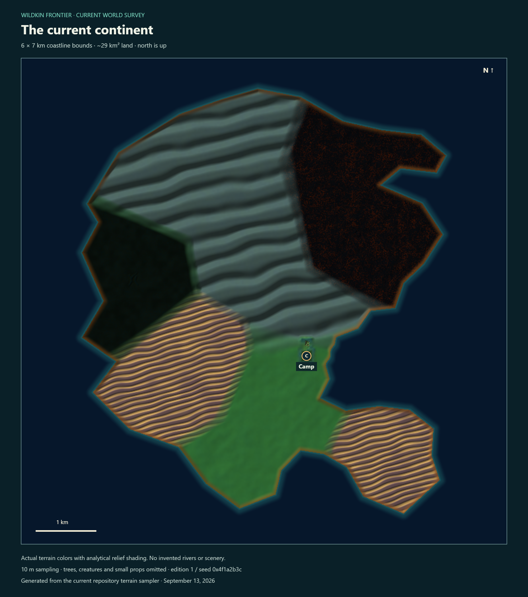

# Whole-continent survey and Scout mode

September 13, 2026 checkpoint. [Visual daily review](review.html) · [Interactive map](index.html) · [Native flight and validation](scout-receipt.md).

The map samples the actual terrain and ground colors at **10 m spacing**: 641,601 samples, about **28.96 km² of land**, within a coastline roughly **6 × 7 km**. North is up. Analytical relief shading makes slopes readable. It is a terrain survey, not stitched screenshots of the rendered world. Trees, creatures, props and small ledges are omitted. The regular ridges visible in some areas come from the current terrain grammar; they are unfinished naturalness, not an illustration effect.

[Full terrain PNG](full-continent.png) · [Full habitat PNG](full-habitats.png). Both are 2000 × 2260 pixels. Ten colored allocations do not mean ten finished habitats.

Run `npm run dev`, then open `http://localhost:8080/art/reviews/continent-restart/`. Drag to pan, use the wheel or +/− to zoom, and choose a habitat to focus it. **Save full map** exports the entire image at full resolution. This viewer does not read game saves.

For the actual trees, creatures, resources and scenery, open `http://localhost:8080/?scout=1` and choose **Continue**. Scout uses the character as the normal streaming center. Objects appear within the game's existing draw/residency distances; it does not load the entire continent at once.

| Action | Control |
|---|---|
| Move | WASD or joystick |
| Ascend / descend | Hold Space / C, or the Up / Down buttons |
| Faster horizontal movement | Hold Shift |
| Look around | Drag the right side |
| Fly / walk | G or Flight button |
| Return to regular play | Exit scout |

Scout is protected from damage, including while walking. Its progress is temporary: it starts from a copy of the ordinary save and never writes that progress back. Reloading Scout or exiting discards the temporary session. Normal settings such as sound still use their usual preferences. This is an inspection tool, not a persistent creative building mode.

To regenerate the sampled data from the repository root: `node art/reviews/continent-restart/build-survey.mjs`. Reopen the viewer and export both maps. `survey.json` records the seed, bounds and source hashes. No dependency was added for this report; the survey generator uses Node built-ins.
