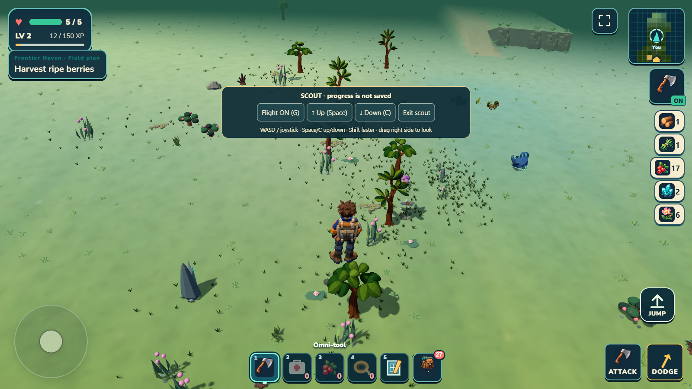
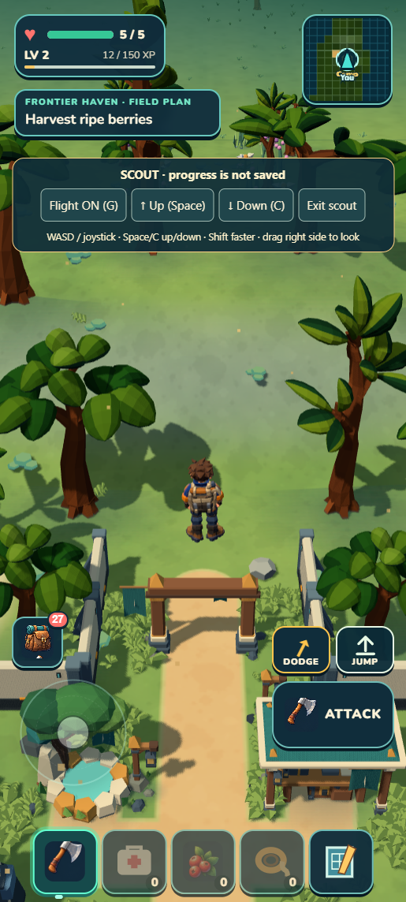

# Scout flight — final restart receipt

The owner asked for flight with the actual character, trees, creatures and decor, without danger. Open **/?scout=1**, choose Continue, and use WASD/joystick, Space/C up/down, Shift faster and G to fly/walk. Exit scout returns to ordinary saved play. See [all controls and limits](README.md).

## What passed

- The real player body flew from Camp into the first woodland resident windows, with 52 scenery residents and four active roaming creatures. Hover, ascent, terrain clearance, descent and ordinary landing worked. Full continent content was not loaded at once.
- A native inventory-open input witness left position exactly unchanged. Keyboard blur/blocking and normal jump after flight are covered by focused tests. Pointer descent stopped on release; final portrait Up raised the character to 11.54 m.
- The shared combat route rejected a direct 99-damage diagnostic and retained health 5. This is damage-route proof, not a witnessed enemy strike. Fatal flow is separately suppressed in Scout. Normal damage protection is off after exit.
- The entire ordinary save envelope matched after developer and portable Exit → Continue. Original local-storage bytes stayed exact despite temporary Scout progression. Resources, atlas and other progress use the same injected storage owner; ordinary and Author defaults remain intact.
- The final portrait panel sits above the regular action controls; all four Scout buttons fit at 412 × 915. Developer and packaged warnings/errors were empty. Packaged resources used only its local origin.
- **1,411 tests / 173 suites / zero failures**, in 103.386 seconds. World, campaign, build, submission validation and ZIP pass. A final panel-overlap repair justified the last aggregate; no further source edits followed it.

Package: **44.41 MB unpacked; 20.60 MB ZIP (21595626 bytes)**. SHA-256: `c94b10c29364fd34b5685b704305505d01987158ec07051a2ebf34881352f214`.

[Machine-readable checkpoint](checkpoint.json) · [Native proof without private saves](scout-proof.json) · [Earlier Heartwood circuit receipt](../heartwood-circuit/receipt.md).

## Ownership and limits

The existing player controller, physics body, keyboard input, progress owner and single loop remain authoritative. Scout adds a small session UI/storage adapter and pure displacement helper. Normal travel, climbing/swimming/falls, combat/ward and resource/atlas persistence were included in the focused or aggregate sibling checks. No dependency, renderer rewrite or new save format was introduced.

Root source review and native checks closed this bounded tool. An independent subagent review was unavailable at the long-thread agent limit; it is not represented as a pass. The earlier Heartwood source/visual reviews are separate. The feature is an inspection tool with a fixed temporary panel, not a polished persistent creative game mode.

Scout uses current culling/residency and may hitch at new terrain windows. It does not unlock all species or expose the entire world at once. Flight stays above terrain/water and passes ordinary scenery; it does not add flight to old separate expedition sections. Camp guidance can remain until first landing because the ordinary outing starts when grounded. No physical-phone or performance acceptance claim is made.

## Human check after restarting

Start the local server, open /?scout=1 and Continue at Camp. Hold Space or Up until above the Camp arch, then move toward the woodland. Expect the character to hover on release, with trees, bushes and roaming Wildkin below. Hold C/Down to descend; toggle Flight off to land. Hearts should remain full in Scout. Open the backpack and try moving: the character should remain still. Exit scout and Continue: the original Camp/cargo should return, with no Scout panel. Missing scenery near the character, sliding while a menu is open, stuck ascent or changed ordinary progress are failure signs.
