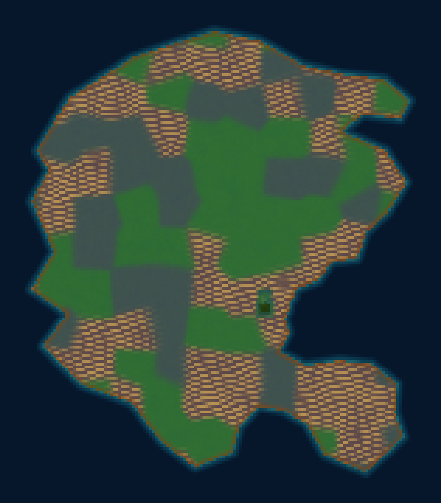
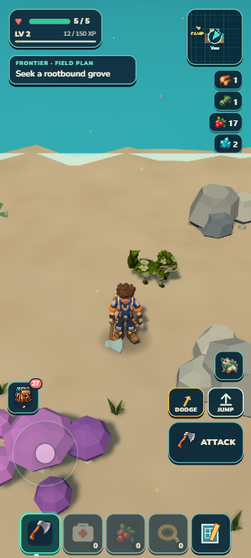
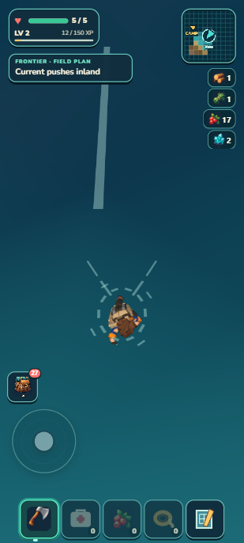
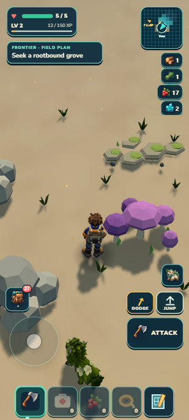

# A larger continent for exploration

September 13, 2026. The continent now spans **6 × 7 km**, with approximately **29 km² of land**, a broad eastern gulf and unequal peninsulas. The third silhouette review passed **8.3/10**. Normal controls crossed the new shore from walking to swimming and back to dry ground; residents stayed bounded. All **1,357 tests** and package checks pass (44.33 MB unpacked / 20.58 MB ZIP), and the earned Camp survives developer and portable reload exactly. There are still **three terrain grammars**, not ten completed habitats.

The [frozen generated target](../../targets/continent-v2/target.png) is a design reference, not gameplay. The overview above comes from the actual seed and reveals development geography; the player's atlas still uncovers only explored cells. The target's scale bar is illustrative.

## Scale and visual review

| Measure | Previous continent | Selected outline |
| --- | ---: | ---: |
| East–west extent | 2.467 km | 6 km |
| North–south extent | 3.550 km | 7 km |
| Approximate land area | 6.63 km² | 28.95 km² |

A rectangle is not land area. Current area uses a 25 m sample grid; report it as roughly 29 km², about 4.4 times the previous area. Ideal straight crossings at current speeds take 26–30 minutes running or 47–54 minutes walking, before terrain and route detours. This is scale arithmetic, not a timed continent crossing.

Three silhouette rounds scored **6.5 HOLD → 7.8 HOLD → 8.3 PASS**. The broad east-facing gulf and tapered northeast headland resolved the principal gaps. Stepped western notches and the thicker southwest arm remain polish debt; no fourth round was taken. This score excludes habitat vegetation, rivers, snow, weather and target landmarks. [Independent review](independent-r3-review.md).

## Ordinary controls on new land

  

A disclosed developer fixture placed the earned character near the outer peninsula at (1810.26, 987.07), 8.008 m inland. Camera yaw −0.671, pitch 42°, zoom 1; portrait viewport 412 × 915 on a laptop. Bounded ordinary keyboard events drove movement; no position writes or simulation stepping occurred during the journeys.

- Outward input for 43.008 seconds: IDLE → WALK → WADE at 5.608 s → SWIM at 10.010 s; final 31.760 m offshore, current strength 0.309, health 5.
- Releasing input let the current drift the swimmer from 31.760 to 26.437 m offshore.
- Turning toward land and holding ordinary movement for 30.009 s: SWIM → WADE at 21.218 s → WALK at 23.415 s; final grounded 10.228 m inland, health 5.
- Terrain stayed at 25 residents; ocean remained at 3 draws / 2,601 vertices / 18 wake ribbons.
- Literal shore reload restored a grounded, dry character and all carried/creature/Camp state. The exact envelope differs only by about 0.000000024 m of supported feet height and one newly surveyed atlas mask; it is not claimed as byte-identical shore state.

The later restoration of the original earned Camp **is** exact in developer reload, portable reload and portable Continue. [Browser/save proof](browser-proof.json). No physical-phone, unaided exploration or cold airplane-mode claim.

## Shared behavior and bounded costs

A validated authored polygon expands the old land field; exact nearest-edge queries and a small private spatial table keep repeated sampling economical. The old harmonic field remains a land floor in this first slice. Its radial inward direction is landward but not always the exact harmonic gradient; this inherited approximation remains explicit. Polygon, union, seed, bounds, terrain/shelf, content, ocean/current, follower and resume contracts received independent review. [Geometry and test evidence](geometry-evidence.md).

The finite discovery catalog still scans 4,368 chunks rather than the whole larger landmass. It now contains 85 groves plus Signal, below the 200 claim/POI cap, and retains all original 60 identities. The Lush place generator uses the same bounds, so it cannot decorate new distant land with an unregistered interactive grove. Sunscar mineral places retain their broader admission. Two old chest heights moved by less than 4 mm and 1 mm as their shore blend changed. All current catalog claims survive save normalization.

Conservative survey capacity including land/shelf and reveal padding is 12,914 / 16,384 atlas cells, leaving 3,470. This bounds land/coast surveying, not arbitrary trips across an unlimited ocean. [Scale and capacity method](scale-capacity.json). The developer overview is capped at 8 km spans and 180 samples per axis and imports no all-world ecology; [tool evidence](overview-evidence.md).

A repeat of the existing ten-second Lush control route measured 17.5 ms of scenery publication and a 165.2 ms slowest frame, versus 16.6 ms / 161 ms at the previous checkpoint. Median frame time remained 33.4 ms; the 95th percentile was 38.6 ms. One prepared window published, with no unfinished publication or preparation failure. [Raw journey](native-lush.json). These individual laptop runs are not proof of smooth streaming or phone performance. Earlier ecology and terrain loading hitches remain open.

## Validation and next work

1,357 / 1,357 tests passed in 83.411 seconds, followed by world/campaign/build/validate/ZIP. Package 44.33 MB unpacked; ZIP 21,579,598 bytes (20.58 MB). The first aggregate found two scenery tests that assumed the old coast selection; the geometry receipt records the narrow correction and preserved assertions. Production source stayed frozen through the final gate.

Next: allocate ten connected, nonrepeating habitat regions, then build a genuinely distinct Emberglass Caldera outing with a readable breached rim, layered scenery, useful minerals and existing Wildkin danger. Keep compact Camp/Skybreak/Signal/earned-grove witnesses where practical; this pre-alpha does not require preserving all unvisited generated geography. Use the existing terrain, scenery, resource, encounter and save owners. A region label alone is not a completed habitat.

For a human check, approach a low sandy shore, walk into teal water until a wake appears, then turn back and regain dry land controls. The companion should wait ashore. Offshore, pale streaks and the field-plan cue explain the inland current. Failure signs: a hidden deep-ocean floor, missing terrain at the water edge, a sinking companion, inability to leave shallow water, or missing supplies after reload. The new peninsula coordinates above supplement this setup as a developer fixture.

Local main checkpoint; earlier GitHub/Drive publication unchanged. The continuous goal remains active.
