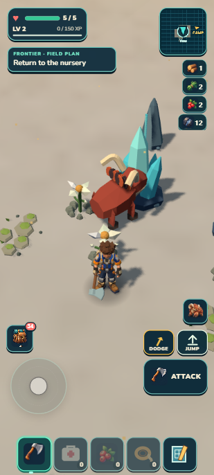
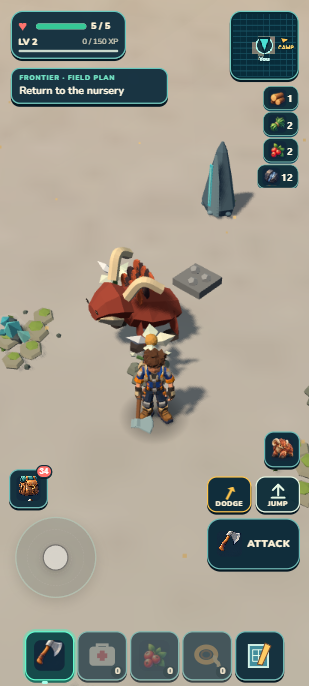
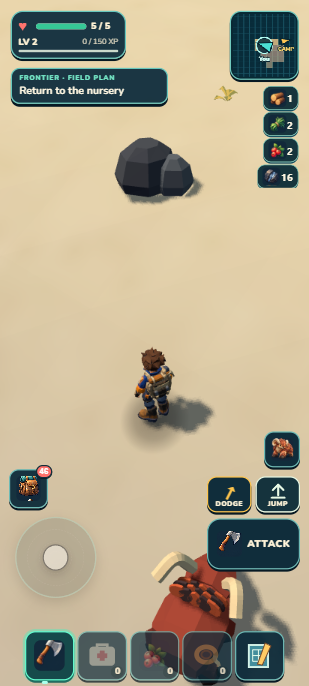
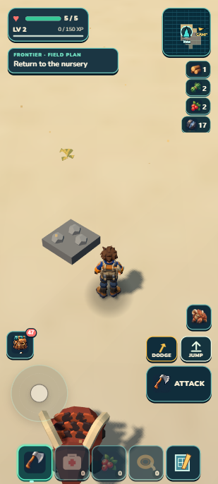
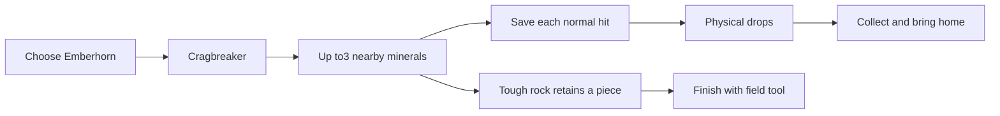

# Emberhorn cracks mineral outcrops

September13,2026 · local main checkpoint · independent contract review **PASS**.

Cragbreaker gives the existing Emberhorn a useful mineral-gathering job. Two nearby crystal deposits can break in one use; a tougher iron rock can retain one piece for the ordinary field tool. This batch reuses the current creature, amber shockwave and resource art. It does not change the held terrain/art scores.

| Before: two intact crystals | After: crystals depleted |
|---|---|
|  |  |

| Four hits leave one iron piece | Portable continuation after collection |
|---|---|
|  |  |

The captures are actual309×686 images of a412×915 portrait emulation. The after-strike image precedes final pickup collection. The partial-iron image shows16 iron already collected; the portable image shows17 after the ordinary tool finished the last piece. Stills do not prove sound or continuous shockwave motion.

## Bounded behavior

Mineral selection uses active READY stone/iron/crystal sources within4.5m in3D, nearest first and lexical stable-ID ties. At most three sources receive four ordinary hits each. Full iron has five pieces. Non-mineral, depleted, inactive and out-of-range sources are excluded. No new place recipe, asset, dependency, save schema, loop or reward authority.

Both ability and field tool call the same Camp/Rootfall guards → existing resource transaction → pickup/bonus → after-guard path. Each finite decrement saves before effects. The burst stops on the first rejection, keeps prior committed effects and spends its normal18s cooldown. It is not an area-atomic transaction. The one review repair prevents the ability result from overwriting the resource owner's precise failure toast. Combat, seals and other species retain their current behavior. Authored rocks retain regrowth; generated resources remain finite. Particles/audio are requested only on the last intended hit per source.

## Actual witness

The controls fixture adds one explicitly diagnostic Emberhorn to an existing six-Wildkin outing and resumes beside the existing Sunscar cleft. It preserves the six original individuals, Camp/breeding history and materials. It is **not an earned Emberhorn capture or a fresh-player journey**. Initial placement and later camera aiming are disclosed assists; subsequent ability/button, movement and tool effects run through the ordinary game.

| Action | Observed result |
|---|---|
| Previous build, ordinary Cragbreaker | Both crystals remain4; pack14 crystal;18s cooldown |
| Candidate, ordinary Cragbreaker | Two sources4→0;8 accepted hits; physical drops4+4 |
| Ordinary approach/collection | Crystal14→22; no pending pickups; health5 |
| Walk to nearby iron, ordinary Cragbreaker | Iron5→1;4 accepted hits; collider and visible remainder retained |
| Collect iron | Iron12→16; health5 |
| Literal page reload | Iron1 and crystals0 restored with matching visible/collider state |
| Explicit synchronous resident-window eviction/return | All three sources absent away; partial/depleted state restored on return |
| Ordinary tool at1.35m, auto harvest off | Iron1→0, collider removed; final collection16→17 |
| Portable owner import, literal reload, Continue and Cragbreaker | No duplicated yield;18s cooldown; iron17/crystal22, zero pickups, health5 |

The unload check deliberately moves the resident window through existing terrain/scenery/discovery/ecology/wildlife owners and back within one synchronous call. It does not claim an earned walk to a distant region. The retained normal-tool test first missed at2.02m, then succeeded at1.35m; range rules were preserved.

The cleft is at seed1327115068, owner(-7,1), center(-316.9878,6.2692,82.7012). Crystal IDs `f1:r:-7:1:200` and `201` are2.55m apart. Iron is `f1:r:-7:1:8`. The injected individual is `wildkin_cragbreaker_review`. Recognizable human check: select Emberhorn, approach a pale Sunscar pocket with two cyan crystal deposits, press Cragbreaker, collect the shards, then try a tougher iron outcrop. The latter should leave a visible piece that the nearby Omni-tool can finish. Reloading should not refill these finite sources. Missing drops, a solid invisible rock or refilled ore are failure signs.

## Validation and practical limits

- **1,260 tests pass**; world/retained-campaign/build/validate/ZIP pass in one aggregate checkpoint. Test phase66.839seconds. Package44.22MB unpacked,20.56MB ZIP.
- Focused real-Rapier/save-failure proof covers partial failure without duplicated drops, collider retention/removal, generated finiteness and authored regrowth. Ability tests cover active species, cooldown, failed seals, combat and interrupted feedback.
- Eight-hit activation took12.2ms; four-hit iron activation6.4ms on this laptop. These are observations, not a worst-case12-hit benchmark or physical-phone performance pass. Existing streaming hitches remain outside this batch.
- Portable inventory, seven owned individuals/selection, Camp/care/crop/breeding/sequence, capture IDs, ecology, bankedXP50 and the entire active run (XP8,health5,feet/runID) match. Atlas mask `f1:a:-7:1` changed32505315→32505319: one extra reveal bit during resumed play, no lost bits. Exact atlas parity is not claimed.
- Developer and package warning/error logs are empty at closure; observed portable resource origins are only127.0.0.1:8081. No physical-phone, airplane-mode cold start, earned Emberhorn journey or new art-admission claim. Userlocalhost8080 and the earned Camp tab were untouched.

Raw local proof is in `.dream-loop/cragbreaker-mining/`; compact portable evidence and exact hashes are in [checkpoint.json](checkpoint.json). Prior test saves were backed up before fixture imports. The attempted burst screenshot was discarded because input had not fired; screenshot emulation and a paused-title movement helper were tooling failures, not successful gameplay evidence. Pickup collection followed current positions after a stale-coordinate attempt. Only affected input/capture steps were repeated.

The scoped hybrid workflow remains provisional: two disjoint Sol production workers, one independent Sol risk review, one repair packet, root native integration and one aggregate gate. The global Dream Loop and Rapid Alpha Producer skills were not changed. Continue with a focused Tidefin survival/encounter audit before the next bounded batch. This checkpoint is local; the earlier GitHub backup and dated Drive PDFs remain unchanged.
