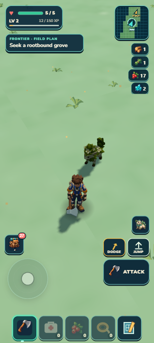
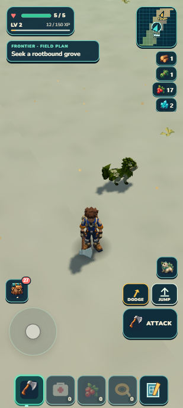
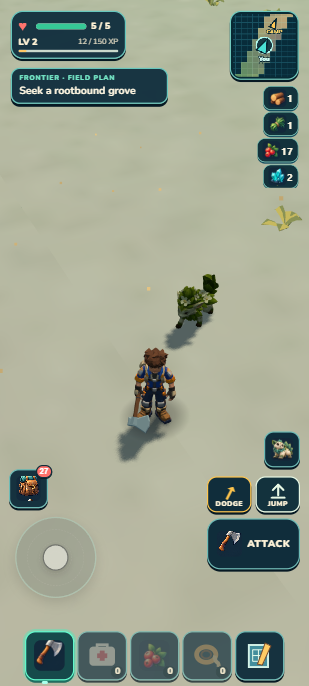
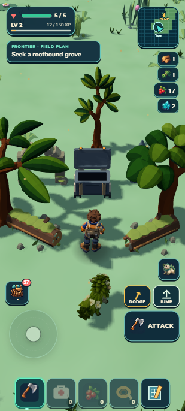
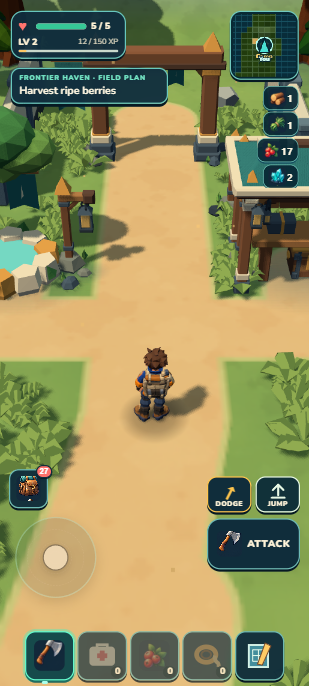

# Readable inland plants — September 13, 2026

**Local visual/source PASS, R1 8/10.** Larger existing tufts make the Lush travel view easier to read. Dry thinning, root positions, terrain, scenery and gameplay remain unchanged. This is a modest plant-scale admission; broad empty travel views remain a release debt.

 

## Scope and actual views

The earned second-outing save was preserved before diagnostics. A and B are explicit position-only save fixtures at(-99.904,219.680) and(-150,345), with no rewards added. Their camera is fixed through the existing debug owner at yaw2.696, ordinary42-degree pitch and zoom1. Capture viewport412×915, device scale1.25/host scale.6; images309×686. The generated target is841×1870 and is compared normalized to the actual view. Follower idle pose/particles vary naturally.

The source change affects only inland non-Skybreak tuft scale. Regional gain blends through province influence; maximum scale is1.24. Exact legacy starter, coastDistance<40m, Skybreak and1.12–1.50 shelf-frond scales remain. Positions, yaw, thinning, tint, geometry/material,96-candidate pool, scenery caps and every save/gameplay owner remain unchanged. The material remains unlit and double-sided; this change does not add grass lighting or cast shadows.

  

From the disclosed canonical grove approach fixture, normal W input ran2.011s and moved4.221m horizontally toward the saved-open cache. The chest, stones and approach remained readable, health stayed5/5 and carried resources stayed unchanged. This is native movement after a fixture, not another earned journey or a new cache-claim test. Final influence blending leaves the full-influence A/B/grove scale identical to the reviewed first capture; final-lush was freshly captured from frozen source.

## Review and validation

Independent review: composition3/3, lighting2/3, materials2/3, details1/1;8/10 PASS for the expressly small target. Tufts remain thinner than the generated target. Source review and focused16/16 tests pass, including low influence, starter/shore/Skybreak/fronds, deterministic witness counts30 and78, and selected forage/cache/stone clearance. One aggregate passed all1,323 tests in74.922s, world/campaign consistency, build, validation and ZIP. Package44.29MB unpacked;21,569,918-byte ZIP (20.57MB).

Two120-frame laptop samples through the existing render loop: median33.4→33.4ms, p9535.2→34.7ms, CPU render-call median3.8→4.0ms. Lush rendering stayed25calls/117,701triangles; dry stayed26/111,027. These short samples show no observed frame-cost regression here, not a physical-phone or statistically controlled benchmark. Larger leaves can increase pixel overdraw.

The complete preserved earned envelope matched developer and rebuilt portable literal reload **byte-for-byte**, and normal Continue retained it. The one Mossling, bed/garden, ready crop,17berries/sixflowers/twocrystals,62XP, cache claim, ecology and mapped route remain. Final warning/error logs were empty; portable resource origins were onlyhttp://127.0.0.1:8081. This is served portable continuation, not airplane-mode cold start.

## Limits and next work

The old.45m coast/Skybreak footprint guard is approximate even for its old maximum tuft; those tuples were kept exact. Ordinary inland grass has no global place/resource exclusion or general slope-footprint contract. Witness-specific clearance does not establish such a guarantee; a pre-existing canopy overlap remains. Existing grove7.7/coast6.4 visual holds are unchanged.

The exact proposed scenery triad and a fairer round-robin residency selection both projected zero selected anchors into A/B. Neither was implemented. [The audit](scenery-audit.md) distinguishes raw-center estimates from actual accepted geometry. Future fullness work needs an explicit density/rendering/preparation budget and actual-camera coverage target; moving six props within unchanged limits was insufficient here.

## Human check

Continue the earned Camp save. Leave through the open north arch and explore southwest toward pale Sunscar ground that gradually becomes green Lush country. Look for the existing broad folded plants: they should become easier to see while the ground remains open. Walk around or through these nonblocking plants; movement and harvesting nearby real resources should behave normally. At a rootbound grove, its chest and stone/log approach should stay visible. Floating plants, obscured harvest targets, blocked movement or new stutter are failure signs. Shore and the northern Skybreak shelves should retain their previous grass size. This is a visual check, not a timed navigation challenge.
