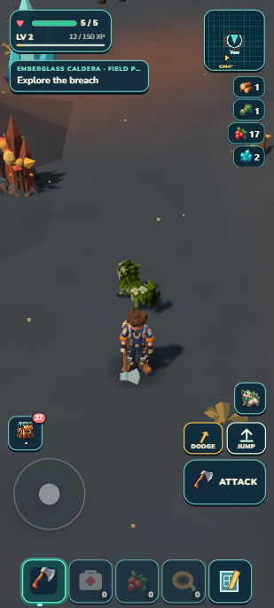
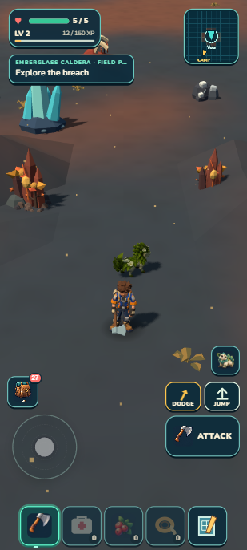
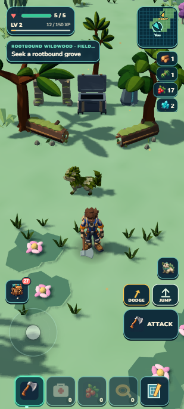
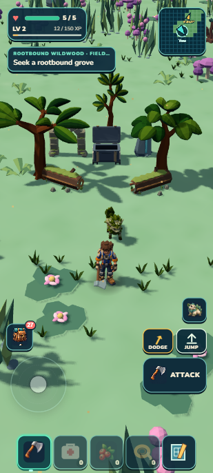
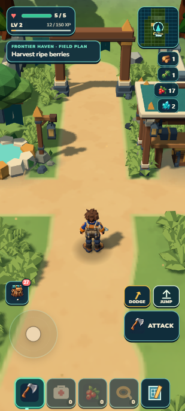
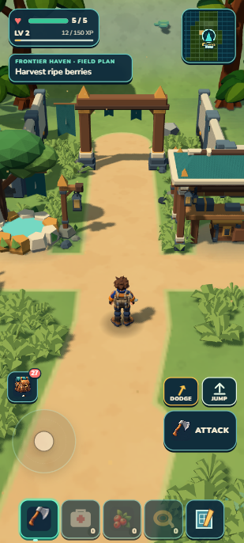
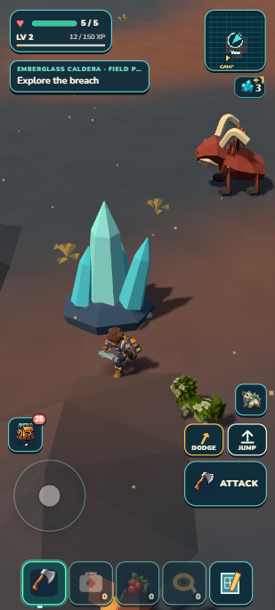
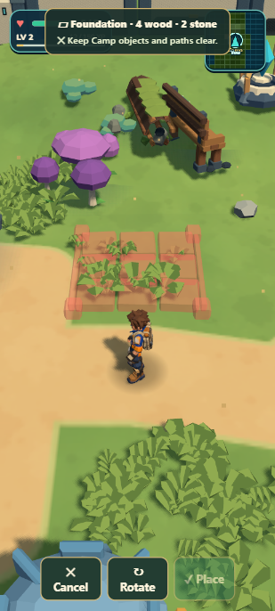
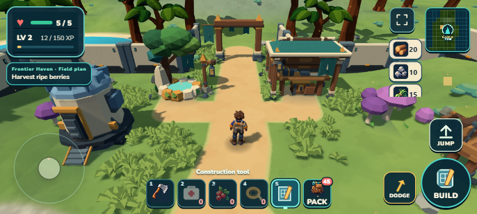

# A clearer view of the frontier

Portrait exploration now shows more of the terrain ahead, with resource counts appearing briefly after pickups. Camp placement keeps its previous close view, landscape stays unchanged, and the exact earned Camp survives developer/portable reload. **1,379 tests and package gates pass** (44.36 MB unpacked /20.59 MB ZIP). Presentation R1 passes8.8/10; fuller habitat art remains unfinished.

## Actual before and after

| Caldera before | Caldera now |
| --- | --- |
|  |  |

| Familiar grove before | Familiar grove now |
| --- | --- |
|  |  |

| Camp before | Camp now |
| --- | --- |
|  |  |

The wider portrait view exposes more complete trees and landmarks while retaining recognizable player and action controls. The existing Pack remains the persistent cargo summary. A resource row shows its exact new total for 2.2 seconds after pickup, then clears; repeated pickups refresh that interval. Health, map, field plan and all bottom controls keep their sizes and positions.

## A real pickup, then a clear view

From a disclosed Caldera position, ordinary keyboard controls walked to the crystal, tapped the field tool once (4→3 pieces), collected its physical shard (pack2→3), and returned south at full health. The row appeared immediately, then disappeared while its count remained3. The short pickup step briefly entered FALL on uneven ground without damage; this is not a claim that every step was flat or grounded. The creature was visible during approach; this slice did not repeat the prior warning/attack trial or earn a cross-continent journey.

## Building and landscape

Construction still uses 42° and9.273m, while exploration now uses 36° and11.591m. An explicitly funded diagnostic fixture proved preview and Escape cancellation; the camera restored the exact exploration values. Placement was not committed. Focused tests cover successful-placement and orientation restoration as well. Existing top-HUD overlap during construction remains separate debt.

Landscape retains32°/6.568m and persistent resource rows. The final developer and portable browsers contain the original earned Camp, not the construction grants or Caldera inspection run.

## Evidence and limits

| Check | Result |
| --- | --- |
| Complete transformed Caldera staging bounds | Right kit fully inside frame with no persistent inventory overlap; left spire about 59% → 90% inside |
| Native short retreat |180 frames; median 33.3 ms,95th 34.7 ms,max 36.2 ms (about 30 FPS in this browser witness) |
| Grove render work |67→102 draws; 265,785→400,476 triangles as more resident scenery becomes visible |
| Tests |1,379/1,379;173 suites;86.428seconds |
| Package |44.36MB unpacked;20.59MB ZIP;21,586,395bytes |
| Earned Camp reload |Entire selected envelope matches in developer and portable Continue |
| Portable requests/errors |Only local8081 origin; no warnings/errors |

Screen bounds are conservative projected geometry envelopes, not visible-pixel coverage. The old player bounding estimate included hidden fallback geometry and was discarded; player readability was judged from actual screenshots. The moving Emberhorn can still pass behind the upper health/objective HUD. This presentation pass is8.8/10; **Caldera world art remains3.8HOLD**, grove art7.7HOLD and other habitat debts remain unchanged. There is no physical-phone, cold-offline, dense-Lush frame-time or chunk-streaming performance claim here. No runtime dependency, save schema, camera owner, input abstraction or map reveal was added.

The [frozen target](../../targets/exploration-view-v1/README.md), [source review](camera-source-review.md), [HUD review](hud-source-review.md), [visual review](visual-r1.md) and [compact exact receipt](checkpoint.json) retain the implementation boundaries. This checkpoint is local; prior GitHub and Drive reports were not republished.

## Try it

1. Continue at Camp in a tall viewport. The gate and surrounding buildings should fit more completely; all five bottom slots remain visible. Open Pack to inspect the retained full inventory.
2. Gather an ordinary resource and collect its drop. Its updated count should appear briefly below the minimap, then clear. Repeated pickups keep that row visible; a stuck row or missing updated count is a failure.
3. With construction materials, choose the construction tool and a piece. Placement should zoom closer, retain a readable preview and supported/blocked message, and Escape/Cancel should return to the exploration view. Materials must not be spent on cancellation.
4. Rotate to landscape. The familiar wider layout and persistent resource totals should return; rotate back to portrait and confirm the exploration view and five-slot belt recover.

Next: establish Fungal Hollow as a distinct, fuller habitat using the admitted kit. Audit its actual terrain and complete asset bounds, then prove a native blockout in the new ordinary camera before locking production. Ten finished habitats remain the early-alpha requirement.
