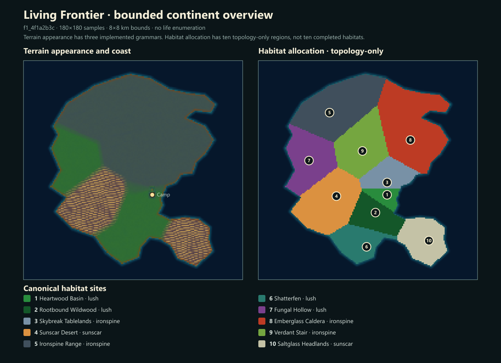
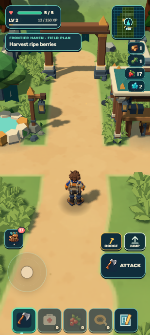
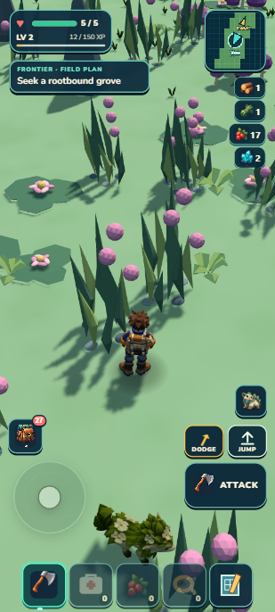
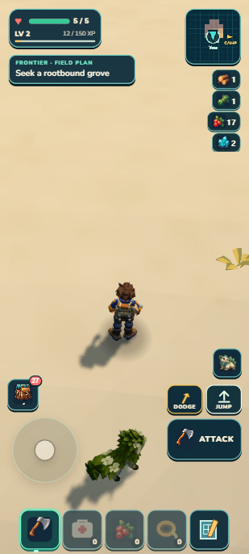

# Ten fixed habitat areas

The continent now has **ten fixed, named habitat areas**, replacing the repeating province field. All ten have connected land in the sampled topology review. Terrain transitions, resources and scenery use the new geography, while Camp and the earned Mossling/grove save remain intact. **1,361 tests and package checks pass** (44.33 MB unpacked /20.58 MB ZIP). These are ten allocations using three temporary terrain grammars, **not ten finished habitats**.

The colors on the right are diagnostic allocation colors. They are not ten completed terrain styles and are not the player's unexplored atlas. The left map comes from the actual terrain sampler. The continent retains its6×7km bounds and approximately29km²land.

## What changed

- Ten immutable authored sites replace the repeating jittered field. Every land sample belongs to one named region; local relief and details still use the world seed.
- Smooth180m distance-gap weights include all relevant neighbors at triple junctions. Existing terrain, resource, scenery and wildlife owners consume the resulting geography. Camp/starter/Skybreak geometry keeps its influence reserve.
- All ten regions have one connected land component on a25m grid for three tested coast seeds, with no assignment gaps. Two25m site adjustments removed tiny clipped fragments. See [topology audit](topology-audit.md); sub25m features and untested seeds are not proven.
- The bounded discovery scan now admits25groves plus Signal in4,368chunks, below the200claim limit. Ten previous identities remain, including Signal and the earned grove;76unvisited old sites disappear and16new ones appear. This pre-alpha regeneration is intentional.
- Ordinary full-influence inland grass avoids scaled forage footprints through a build-local3×3recipe check. Protected starter/reserve/coast/Skybreak foliage remains unchanged.

## Actual play

Disclosed developer fixtures used ordinary movement, with no earned cross-continent claim. Ten seconds on the actual Sunscar slope gained about7.8m in height and ended grounded at health5. A second ten-second walk crossed Heartwood→Rootbound and a chunk boundary, retaining25terrain residents and health5. Its scenery publication took14.5ms and maximum frame162.8ms, but portable loading overlapped the interval: these are observations, not a controlled improvement claim. The full earned Camp/Mossling/grove save matches developer reload, portable reload and portable Continue exactly. Logs are empty and portable resource origins are local only. [Native evidence](native.json).

## Validation and limits

One frozen aggregate: **1,361/1,361PASS in84.251s**; world sync, retained campaign checks, build, validation and ZIP pass. Package **44.33MBunpacked /20.58MBZIP** (21,580,349bytes). Independent [region review](source-review.md) and [foliage review](foliage-review.md) pass. Focused [life regression](life-regression.md) and [terrain consumers](terrain-consumer-regression.md) explain obsolete-witness repairs and the real overlap fix. [Source hashes and gate record](checkpoint.json).

The three base grammars are still visible. No new habitat-art score, full alpha, smooth-travel, physical-phone or cold-offline claim. Existing coastline8.3/10silhouette and earlier held art scores retain their original scope.

Next: build Emberglass Caldera's broad volcanic terrain and a distinct breached-crater outing with layered scenery, useful minerals and existing Wildkin danger. Lock a feasible normal-portrait target before production. Continue improving the remaining habitats and exploration/collection/Camp loops; the ten-habitat alpha requirement remains open.

[Provisional Caldera contract](caldera-contract.md) separates a compact crater outing from the broad volcanic habitat and keeps its first target within the normal portrait view. Future physical machines/logistics can also reward players who enjoy building productive Camps. No additional GitHub push or Drive upload was made for this local checkpoint.

The next [Caldera scene target](../../targets/caldera-v1/README.md) is now locked at target quality8/10 with camera and admitted-kit constraints. Its actual baseline and independent review are included; implementation begins after this geography checkpoint.
