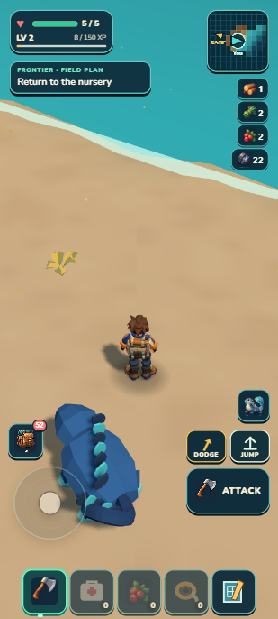
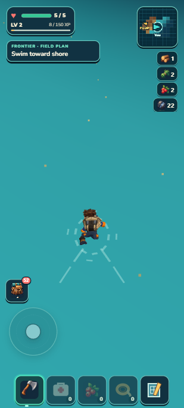

# Seeded continent and surface swimming — September 13, 2026

**Behavior PASS; selected R3 visuals 6.4/10 HOLD.** Local checkpoint on main, following `6495538`. This foundation gives the existing world a finite irregular continent, shallow physical shelves and an ocean boundary. It does not finish the continent's content or admit the target shore art.

The overview comes from the actual seed1327115068, edition1. It intentionally shows unrevealed development geography; the player's atlas continues to reveal only explored cells. The SVG and its local Node generator are included.

## What changed

- One seeded continent field supplies terrain, land footprints, water, atlas and traversal. Camp, starter/Skybreak, Signal Cache and the admitted Sunscar cleft remain reserved. The continent extends kilometres north/west, with a reachable eastern shore.
- Sea level is−2. The bounded90m land transition descends toward a12m shallow band and32m physical shelf. Only triangles with all three vertices inside the shelf are emitted; deep ocean has no terrain mesh/collider. The conservative mesh retains at least29m of shelf.
- Automatic grounded wading and surface swimming use the current upright Rapier capsule. Wading retains ordinary controls; SWIM blocks tools, jump, dodge, climb, bonding and abilities. Existing Climb motion is provisionally pitched85.5°/offset−.08m; it is not a newly authored swim animation.
- The24–45m current band composes a landward desired velocity before acceleration, independent of fixed-step frequency. Visible streaks use the same published direction. No drowning, boats, diving or aquatic-species claim.
- Followers wait on dry supported footprints during WADE/SWIM; formation, direct/steering movement, physics correction and catch-up placement reject water. Camp care/young paths remain under their existing owners.
- The existing persistence owner retains safe dry feet while live health, XP, cargo and pending bonds continue saving. Old lowered coastal feet receive physically validated candidates; old ocean positions may fall back to Camp without replacing the run/cargo.

## Native controls and exact limits

These are developer controls fixtures in agent-owned localhost tabs, not an earned Camp-to-ocean journey. The old Tidefin/save history was retained; only the coast approach position was staged. Camera yaw/pitch were set for comparison. Bounded synthetic keyboard events exercised the normal input path without advancing simulation or moving the player directly during each journey. The user's localhost8080 tab was untouched.

| Witness | Observed outcome |
| --- | --- |
| Old dry approach at325,100 | Old feet4.0235 were replaced by supported coastal feet near−.08564 after literal reload; same run/inventory/health |
| R2 ordinary shore entry | WALK→WADE→SWIM in11.855s; health5; Tidefin grounded in SHORE_WAIT. WADE touch Jump/Dodge enabled, SWIM disabled/hidden |
| Corrected current |40.009s outward swim reached32.0427m offshore, strength.3277, health5. A live downward20m Rapier ray below the surface returned no hit |
| Return | SWIM→WADE→WALK in22.804s, then5.8072s farther inland to grounded coastDistance8.114, health5. Very shallow WALK alone was not counted as dry land |
| Final R3 action/current trial |35.006s outward input with Shift reached33.8085m offshore/current.45067. Space/R/F pulses retained SWIM, tool hidden, Ward cooldown0. Releasing input drifted inland toward the beginning of the band |
| Canonical portable save | Developer literal reload and packaged import plus literal reload both exactly matched the entire sorted canonical payload. Both restored grounded IDLE at336.9695,−.95235 capsule center,100.0494; saved feet−1.49235; health5, bank58, same pack/individuals/Camp/crop/breeding/atlas/ecology |
| Packaged native shore entry | WALK→WADE→SWIM in9.908s, health5, Tidefin dry/grounded SHORE_WAIT,18 wake segments,3 ocean draws |

Final developer/package warn/error logs were empty. Packaged resource origins contained only `http://127.0.0.1:8081`. This is packaged local-origin and literal-reload evidence, not airplane-mode cold-start or a physical-phone performance claim.

  

## Visual comparison

| Round | Score | Meaning |
| --- | --- | --- |
| R1 |5.5/10| Coast/foam exists, but distant and bare; preliminary producer judgment |
| R2 |6.1/10 HOLD| Independent judgment; stronger teal and nearer diagonal shore, intended dressing still absent in the view |
| R3 |6.4/10 HOLD| Independent judgment; surface wake and darker offshore/current band improve water reading; headland, layered shallows, foam variety and close vegetation/rocks still fail the target |

R1 used325,100 at14.58m inland. R2/R3 used332.889,100.049 at7.67m inland with the same42° portrait pitch. The closer witness is disclosed and does not establish better source composition by itself. The generated target's visible underwater stones remain aspirational under the current opaque ocean surface. R3 contour rocks are physically admitted but largely off-camera. No fourth polishing round is implied by the functional admission.

`baseline-portrait.png` is actual old play; `target-portrait.png` is generated/proposed. All candidate/current/atlas/package images are actual captures. Phone viewport412×915 was emulated; saved portrait images are309×686. The vector overview is the higher-resolution source for its raster preview.

## Validation, ownership and cost

All1,300 tests passed in71.858s, followed by world/generated-data, retained-campaign, build and package validation. ZIP passed:44.28MB unpacked/20.57MB ZIP. The first aggregate had1 failure: an old high-terrain color witness now lay in ocean. The test moved to real inland Ironspine at−1575,−1550 (height69.33m,202.86m inland), retaining its>60m and<.015 color-error assertions. The final aggregate passed in full.

Focused real-Rapier tests cover shore→fully deep→shore residency, disposal, no deep floor/grass, coast resume support, water entry/fall cancellation, current timing, input suppression, dry persistence and follower footprints. Land placement siblings checked: forage, scenery, wildlife home disks, regional places, discovery anchors and grass. Existing25 terrain residents,34 scenery selection cap and other gameplay caps remain. Ocean borrows the published window:2,601 water vertices, at most3 draws,12 current streaks and18 wake ribbons/180 combined current-wake vertices. No new dependency, asset GLB, network request or RAF loop.

Principal source review repaired the shelf cutoff, inconsistent current direction, WADE touch/keyboard policy and native-discovered per-frame current accumulation. Exact selected-file/image/package hashes are in `checkpoint.json`. Raw local saves/timing traces remain under `.dream-loop/frontier-coast/`; they are not game content or committed player data.

## Next useful work

Prioritize coherent distributed habitat places and an earned early-alpha preview. Stronger shore landforms/dressing and richer swimming remain explicit visual debt; adding recolors or more tiny props to the same off-camera layout did not meet the target. The staged larger habitat/species roster, boats, diving and future continents remain later work.

Human check: from the eastern sandy coast, walk down a low entry into teal water. Movement should slow, then become surface swimming with a visible wake. Continue toward darker water: the pale moving marks and field-plan cue should explain the inward current. Turn back to a low sandy edge, regain land controls and see the companion return. Reload while swimming: you should be standing safely ashore with the same supplies. Failure signs include walking on a hidden deep floor, repeated jump/dodge in SWIM, a companion sinking or teleporting across water, lost supplies, or a reload below terrain.
