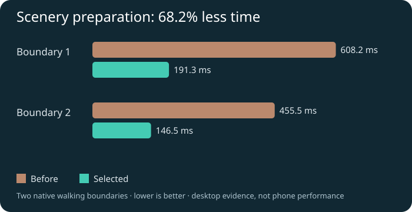
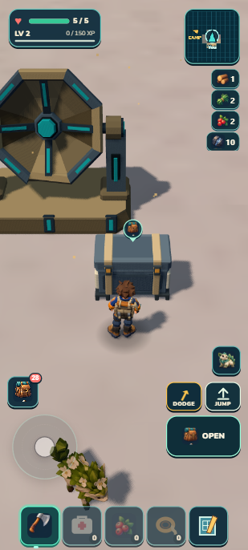
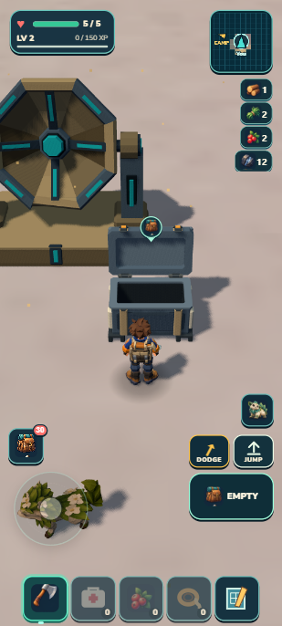

# Signal Cache and smoother scenery preparation

September13,2026. Local checkpoint after `36771e4`. One physical discovery on seeded ground, using existing first-party receiver/chest models, inventory, loot, save and presentation owners. No new dependency, asset download, UI panel, world edition or second loop. The earlier requested GitHub/Drive delivery remains separate; this checkpoint is local.

 

## What changed

Walk east of Camp to find a tall octagonal receiver on pale Sunscar ground. Its front-right chest offers two iron ore and eight carried XP once. The lid opens physically, the empty state survives travel and reload, and the nearby action uses the normal portrait control. This is one fixed authored location validated against seeded terrain, not distributed procedural secrets.

The fixed source is `f1:d:3:1:0`: receiver170,50; chest171.8,52.8. Whole-site support radius4.5m plus the chest's own footprint, both-object life/scenery clearance, canonical-world metadata, admitted model paths and an existing loot table must all pass. Both simple solid colliders are streamed with terrain residency. Save validation knows the source even while it is unloaded; nearby interaction requires residency. Failed save writes and partial pack capacity use the existing atomic reward owner.

## Measured loading improvement

Two native walking boundaries had scenery CPU bursts of608.2/455.5ms before and191.3/146.5ms after:68.2% lower combined cost. Terrain still took roughly81–91ms and ecology29–35ms at these boundaries, so loading hitches remain. The exact representative recipe-equivalence test reduces666 overlapping forage/wildlife recipe calls to98 without changing selected scenery or clearance decisions. This is a per-rebuild bounded cache; it does not retain an expanding world history.

The native runs used the isolated desktop in-app browser, same135m ordinary input route from staged(-70,-200) to(-205,-200), and no concurrent aggregate verification. Viewport sizes differed; this is an owner CPU-burst comparison, not a whole-game FPS or physical-phone benchmark. Travel completed36.648s before and35.849s after, both at health5. Raw selected boundary timings and limits are in [streaming-timings.json](streaming-timings.json). Remaining staged-publication and physics-batch hazards are in [streaming-audit.md](streaming-audit.md).

## Visual selection

The target used actual gameplay plus admitted asset renders; independent target score9/10. R1 at the original12m approach scored5.5/10 HOLD: the receiver was clipped at the top and the chest crowded the right edge. A normal5.79m walk-in exposed the practical read zone. R2 moved only the chest forward/inward and scored7/10 HOLD (composition2, lighting2, materials2, details1). The independent judge recommended stopping at R2: no useful small third pass within this camera, asset and ground scope. Selected provisionally under Chris's delegated iteration policy; no personal owner art acceptance is implied.

The target overestimated what the42degree portrait camera can frame at12m. Preserve that limitation rather than replacing the target or claiming full visual admission. R2-near is atplayer170,56.2101 after ordinary movement; the original baseline/target are at170,62. The equal-position R1-near image is retained for an honest chest-placement comparison. Receiver framing near the HUD and flat native light remain below target. Quiet instant native FPS30 is not sustained phone proof.

## Native proof and fixtures

Only isolated developer8082 and portable8081 saves were used; the user's8080 tab was not changed. The inherited review save already contained six owned Wildkin, ten iron, ten crystal and other supplies. Position/camera fixtures are explicit; no new grant, heal, forced collection or direct loot-owner claim was used to demonstrate interaction.

1. Staged south of the receiver, then ordinary keyboard movement traveled5.79m in1.533s. Another ordinary approach to the chest took0.962s and exposed **OPEN**. Pressing that visible button increased iron10→12 and carried XP0→8, marked the source claimed and animated the lid to−100degrees. Health stayed5.
2. Holding ordinary forward input for1.2s moved the player only0.480m to the chest's front solid face (z54.0997→53.6201), demonstrating collision. The player did not pass through it.
3. A distant position fixture unloaded the site tozero colliders; returning restored the same source/two colliders. Iron12 and XP8 remained. Literal developer reload restored supported position(171.6392,4.97236,54.1), open lid, claimed ID and the same rewards. [Native reload values](native-reload.json).
4. The freshly built portable version imported that save through the existing progress import API and literally reloaded. Its visible **EMPTY** action granted nothing when clicked; iron12/XP8 stayed unchanged. A normal6m target walk away completed1.487s at health5 and retained six owned Wildkin. [Portable values](package-walk.json). This proves imported continuation, not a fresh earned Camp-to-cache journey.
5. Developer and portable warning/error logs were empty. All observed portable resource origins were `http://localhost:8081`; no external dependency was requested. Temporary browser metrics and timing wrappers were restored. No physical phone or disconnected-network session was claimed.

 

## Verification and next work

All1,207 tests pass, including existing authored loot/mechanism siblings and new source admission, overlay, disposal, collider, same-residency retry, full-pack, failed-write and partial-reward reload tests. Partial claim accepts one iron/XP8, persists the other iron, and grants XP0 when the remainder fits after reload. `npm run verify` also passed world, retained-campaign, build and package validation; `npm run zip` passed. Package44.18MB unpacked /20.55MB ZIP. Exact source/image/package hashes are in [checkpoint.json](checkpoint.json).

Next: bounded terrain preparation and safe publication to reduce remaining pauses, then richer places using this discovery lifecycle. Do not mistake one authored receiver for a complete procedural-secret grammar. For human playtesting, leave Camp toward the pale ground to its east, look for the octagonal cyan-spoked receiver, approach the chest in front, and tap Open. Expected: a lifting lid, two iron and eight carried XP once; after walking away and reloading, the chest stays open/empty. Missing Open within arm's reach, a floating/buried chest, walking through it, or repeated rewards are failure signs.
