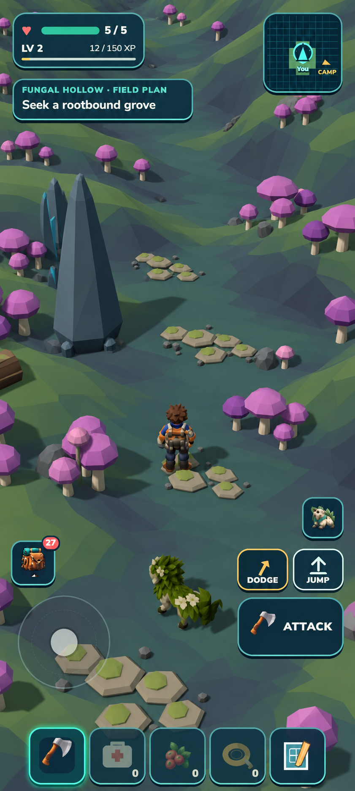
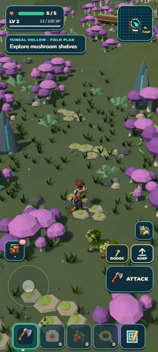
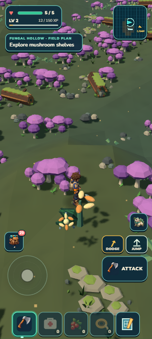
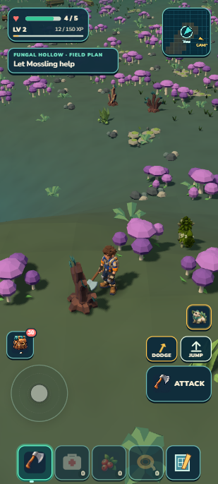
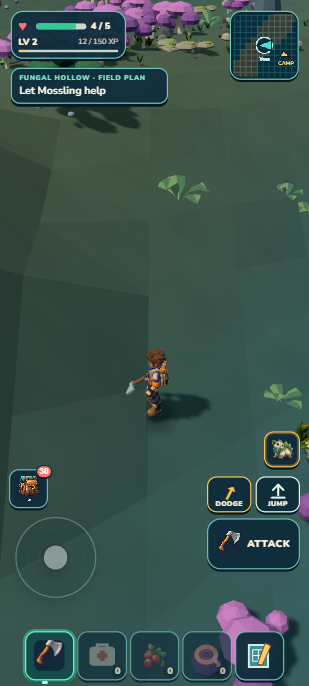
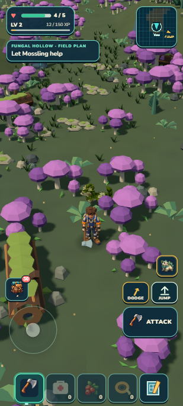

# Fungal Hollow: useful forage and an avoidable predator

Fungal Hollow now has branching terrain, fuller mushroom scenery, four finite useful flowers and an avoidable aggressive Thornprowler. Ordinary controls proved raised-bank gathering, two supported routes, attack/escape and streamed depletion. **1,400 tests and package gates pass** (44.39 MB unpacked /20.59 MB ZIP), with the original earned Camp restored exactly in developer and portable builds. Visual R2 remains **6.5/10 HOLD**: the banks still read too flat in the ordinary camera.

## Actual game and target

| Locked target — proposed art | Actual selected R2 |
| --- | --- |
|  |  |

The place uses whole Mooncap clusters, fallen logs, stone cores, pebbles and low ground cover already in the game. Its bounded three-branch terrain profile changes the wider Fungal habitat as well as the small outing. The two routes have six metres of supported terrain; the predator has a separate ten-metre home. No new asset, shader, dependency, save schema or simulation loop was added.

The independent visual comparison stayed at6.5/10 across two rounds. More props and better fitted stones did not make the terrain banks sufficiently legible. Keep this useful candidate and its honest HOLD; the next art repair needs a clearly visible bank silhouette, broad floor/bank color separation and scenery organized by those shapes. Ten allocated habitats are still not ten completed experiences.

## Walk, gather, choose a risk

Normal movement reached the elevated blossom without a jump or position change. One F tap reduced its three pieces to two; walking over the physical drop raised carried flowers from8 to9. The nearer flower was already at one piece after an earlier manual harvest and one incidental automatic harvest during a prior Continue. That extra automatic pickup is disclosed, not counted as a second manual-input proof. The other two flowers stayed at three pieces.

Approaching the Thornprowler triggered ALERT, CHASE, WINDUP, LUNGE and RECOVER. It hit once (health5→4), then RETURN followed ordinary retreat into the clear route. The actor remained alive and did not grant a bond, reward or new collectable species. State traces verify the encounter sequence; they do not independently prove that its animation telegraph is readable to a human.

Ordinary movement followed the northeast exit and continued until all four sources and the Thornprowler left residency. On the return a visible stump required a short detour. A direct side approach then met a steep channel; walking around to its gentler north ramp rejoined the supported route. This is a navigated journey, not a claim that arbitrary straight lines are walkable. The reconstructed flowers retained counts1/3/2/3, carried flowers stayed9 and the same single Thorn origin returned. No repeat reward or duplicate actor appeared.

## Portable build

The final remote test save survived portable import and literal reload. The original earned Camp was then restored and compared exactly in both browsers: selected Mossling,62 securedXP, health5,17 berries, six flowers, two crystals, bed, garden, care, crop and atlas state. Private full saves are retained only in the ignored working evidence folder.

| Check | Result |
| --- | --- |
| Source review | PASS; exact23-record kit, unchanged resident/cache ownership |
| All three solid stones | Analytic and actual2m-triangle slope≤.32; grounding difference<.12m; route, flower and full-home clearance |
| Shared consumers | Region/terrain, mesh/physics support, ecology, wildlife, both foliage paths, derived purpose and save/reconstruction |
| Aggregate |1,400/1,400 tests;173 suites;91.876seconds; world/campaign/build/validate/ZIP pass |
| Package |44.39MB unpacked;20.59MB ZIP;21592110 bytes |
| Visual | Target fitness8.7; production6.5→6.5 HOLD |
| Browser | 0 final errors; local-only packaged resource origins |

The remote start and position/AI guidance are developer fixtures, not a fresh-player discovery or a journey earned from Camp. No physical-phone, sustained-performance, unaided-discovery or alpha-release claim is made. The rejected incomplete R2 loading frame remains private and was excluded from judging. Source was frozen before the accepted reload; the formal R2 contains all23 fixed props.

## Human playtest

From the central mushroom clearing, walk to the luminous flower on the low right-hand bank. Tap the Field Tool once, then walk across the drop: one piece should disappear and one flower enter the Pack. Follow the open bend between the shelves; it should stay walkable without invisible stone walls. Approaching the prowler near the left-side flowers is dangerous; back toward the central clearing to escape. Failure signs are floating feet, blocked open ground, several harvests from one tap, a prowler appearing twice, or flowers replenishing merely because you walked away and returned. Reaching this remote habitat from Camp is not yet part of the recorded onboarding proof.

Next: review the opening Heartwood expedition from the ordinary Camp view, then scope one readable first circuit using existing forage, Mosslings and a useful Camp crafting/building payoff. Preserve the current kit and earned save; do not add a new species or framework before identifying the actual player-facing gap. Ten finished habitats remain required, and the continuous goal stays active.

Exact hashes and compact native outcomes: [checkpoint](checkpoint.json). Independent [source review](source-review.md), [visual R2](visual-r2.md), and [final contract](../../../docs/FUNGAL_HOLLOW_CONTRACT.md).
