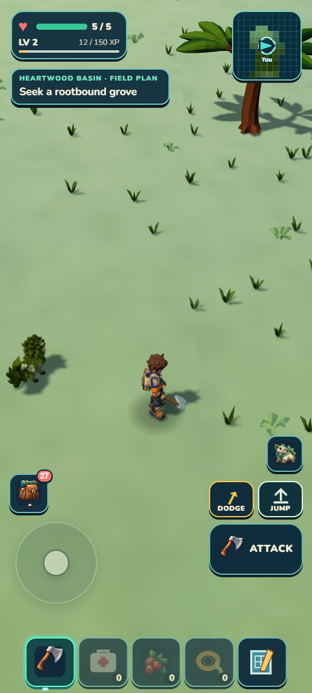
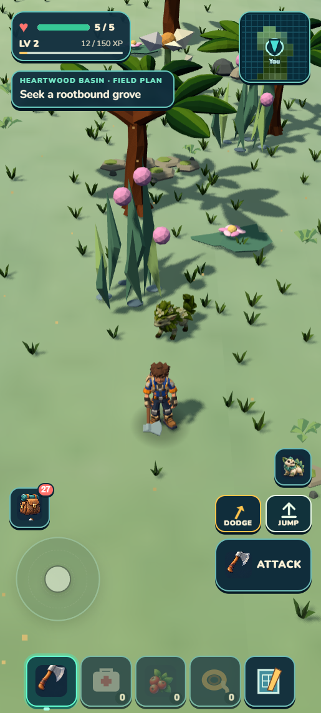
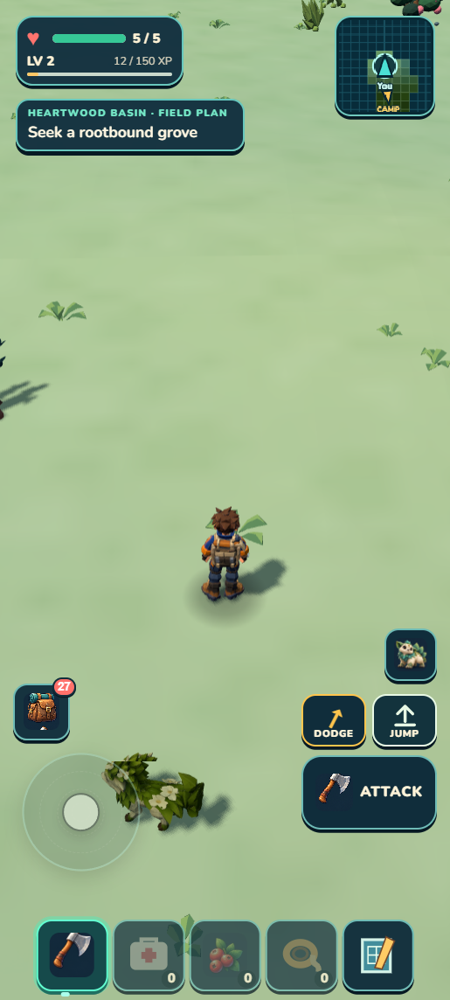
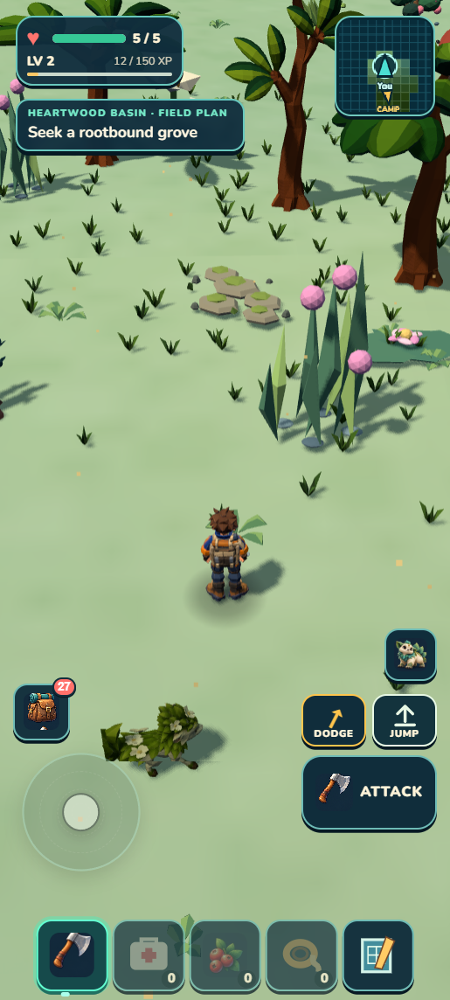
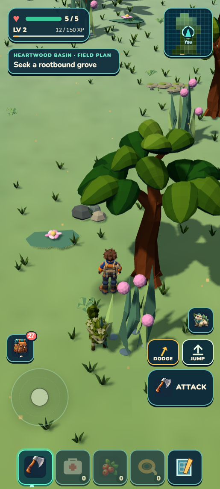
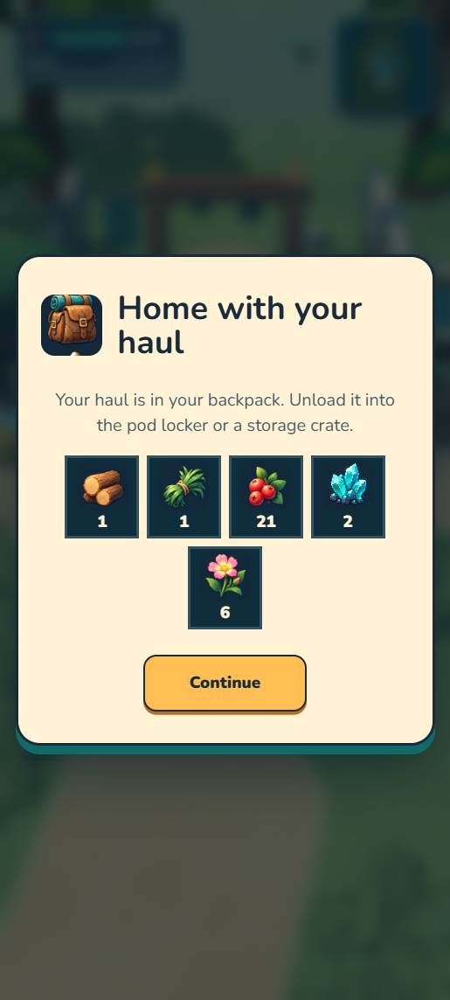
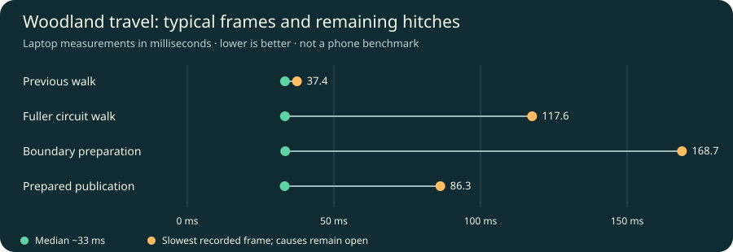
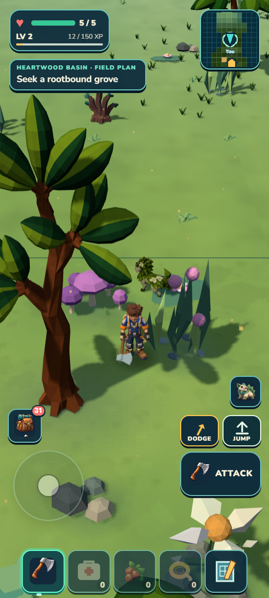
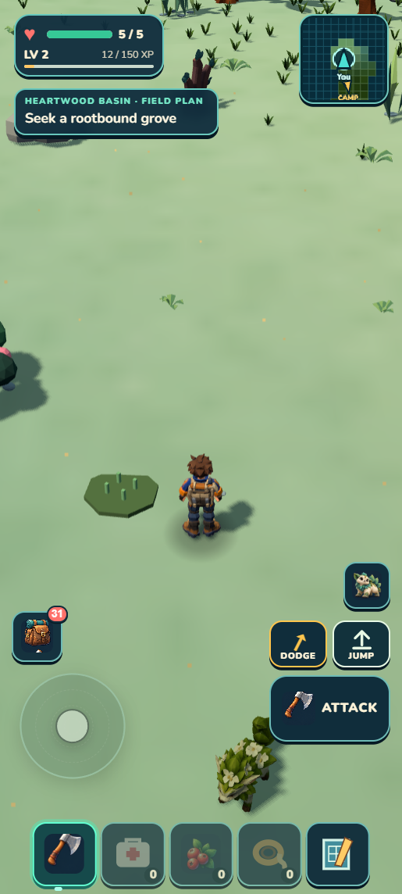

# Heartwood: a fuller first woodland circuit

Seven solid trees and 21 grouped low plants now connect the starter shelf and western forage area. The existing Camp clearing, creatures and harvestable identities remain intact. **Functional/source checks pass; broader art remains HOLD (5.9/10).** This is a useful local checkpoint toward the exploration alpha, not a finished habitat or release.

## Actual before and after

| Starter shelf before | Starter shelf now |
| --- | --- |
|  |  |

| Western forage before | Western forage now |
| --- | --- |
|  |  |

These are ordinary portrait game renders (412×915 CSS pixels, captured at 1.25×). The generated [aspiration](../../targets/heartwood-circuit-v1/target.png) changes the asset shapes, materials, grass and HUD, so its independent fitness is only **7.3/10 conditional**. Native blockouts fixed the feasible placements. The [visual reviewer](visual-r1.md) accepts the improvement and three matched native views while retaining the honest generated-reference gap.

## Playable route, useful gathering

 

The reused earned Mossling Camp supplied the starting progress. Read-only coordinates guided the route; all production movement, harvesting and return actions used ordinary controls. A preserved walking-position save resumed the production check; it was not a fresh unaided journey. The earlier private scenery previews added no physics and were removed before this proof. No resources, health or creatures were granted.

- All seven new trunks have enabled Rapier colliders and remain excluded from climbing. Forward input hit a yawed trunk, blocked straight passage and slid around its edge; ordinary movement went around it. [Contact proof](trunk-contact.json).
- Enabled automatic gathering depleted the existing western berry bush from four pieces to zero and raised berries **17→21**, with health **5/5**. Its neighboring fiber and berry sources remained unchanged. Literal reload retained the depletion and supplies.
- Ordinary walking returned through the Camp approach and used **Return to Camp → Continue**. The complete returned save, including 21 berries and 62 banked XP, matched literal developer and portable reload exactly. The separate original earned Mossling Camp was then restored exactly in both builds. [Full-envelope parity](save-parity.json). Test saves remain private.

## Bounded scenery and remaining hitches

The circuit mode permits at most **44 near /52 total /18 canopy** records inside its protected starter centers. Its 28 records are appended to immutable recipes and excluded from neighboring modes and infill. Source proof covers all 12 centers, route/forage/wildlife support, cache direction changes, coast/Skybreak precedence and exact earlier gameplay identities. This is a local limit, not the global scenery resident count. The existing runtime keeps one frame loop and transactional visual/collider publication. [Source review](source-review.md).

| Laptop witness | Median | 95th percentile | Slowest |
| --- | ---: | ---: | ---: |
| Previous walk | 33.3 ms | 34.9 ms | 37.4 ms |
| Fuller circuit walk | 33.3 ms | 35.5 ms | 117.6 ms |
| Boundary preparation | 33.4 ms | 36.3 ms | 168.7 ms |
| Prepared publication | 33.2 ms | 36.1 ms | 86.3 ms |

The actual hysteresis-boundary crossing published one prepared scenery window with **2.2 ms** in that scenery update, zero preparation failures and zero unfinished publications. The preceding direction change cancelled one prediction normally. Whole-frame hitches remain unattributed; this does not establish phone or release performance. [Measurements](performance.json).

## What still looks unfinished

 

The new thickets improve landmarks and depth, but the Camp apron and broad berry floor remain too quiet. Materials and lighting still flatten the scene, and repeated canopy/reed forms limit variety. The departure frame above was captured after the independent review; it supplies the missing native view without revising that score. Terrain foliage and prop-local scenery grass are separate owners; a lighting adjustment cannot add missing plants. [Ground-cover audit](ground-cover-next.md).

## Checkpoint and next work

**39 source +32 visual/runtime focused tests pass; one 1,406-test aggregate and world/campaign/build/validate/ZIP pass.** Package: **44.40 MB unpacked /20.59 MB ZIP** (21,593,694 bytes). Final developer and portable consoles have no warnings/errors; portable resources came only from its localhost origin. [Exact hashes and scope](checkpoint.json). Unrelated Verdant and local asset experiments are preserved. This checkpoint is local on main; no new GitHub or Drive publication.

Chris requested a PC restart and work/workflow review at this checkpoint. **Production stops here pending his direction.** Proposed later work: a bounded [native presentation study](next-presentation-contract.md), with ground coverage assessed separately, and the [Ironspine ascent and sheltered-gully outing](next-alpha-batch.md). Ten habitat allocations are not ten completed experiences. Exploration remains first; collecting and building/crafting/factory play remain overlapping motivations. Physical-phone and unaided human playtests are still pending.

For a human check: leave Camp through its northern arch and continue past the clearing into the next tree groups. Walk directly toward a trunk, then around it: the trunk should stop a straight pass without trapping you. At the berry grove, approach a berry bush with automatic gathering enabled; berries should enter the pack while the bush empties. Return to Camp and reload: supplies should persist and the same bush should stay depleted. Missing trees, pass-through trunks, a blocked approach or repeated berry yields indicate failure.
