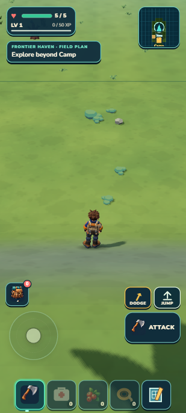
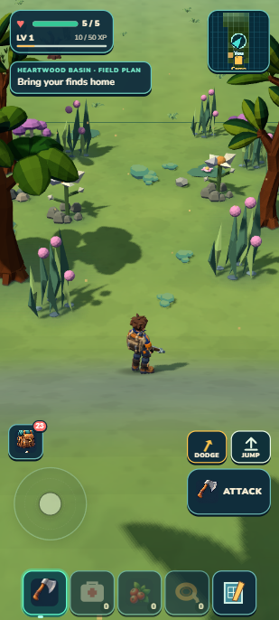
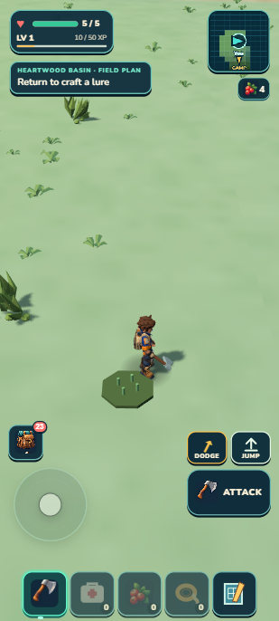
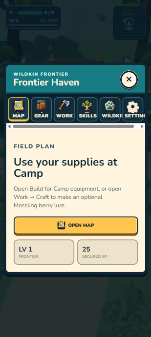
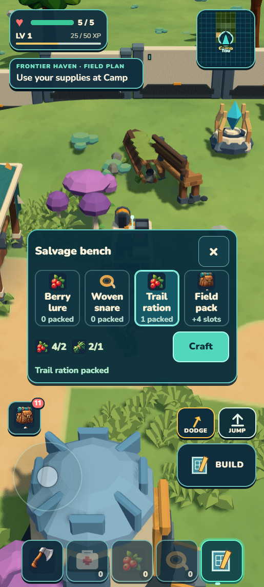
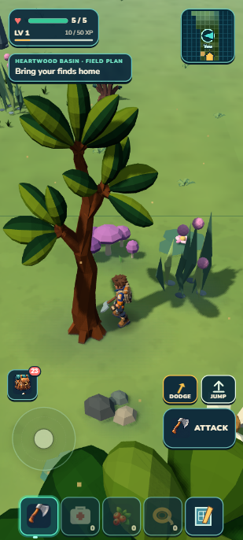
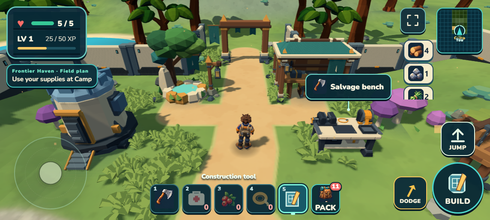

# Heartwood: explore, bring materials home, build

**September13 · local checkpoint.** The first clearing north of Camp now has four solid trees and sixteen grouped low plants. Opening and return guidance offer building supplies and optional Wildkin collecting. A fresh builder outing earned a Salvage bench and a trail ration without capturing a Wildkin. **1,404 tests and package gates pass; scoped visual R1 passes 8.8/10.**

 

The [locked target](../../targets/heartwood-opening-v1/README.md) guides grouping, canopy framing and open walking space. Its invented geometry, UI, terrain and lighting are excluded. [Independent visual review](visual-r1.md) notes some bilateral spacing still worth improving later. This is one clearing, not a completed Heartwood habitat or alpha release.

## A useful builder outing

~~~mermaid
flowchart LR
  A[Explore Heartwood] --> B[Gather wood, stone, fiber and berries]
  B --> C[Carry the haul through Camp's arch]
  C --> D[Place a Salvage bench]
  D --> E[Make trail food for another expedition]
  B -. Optional collecting path .-> F[Make a lure and seek a Mossling]
~~~

  

| Step | Actual result |
| --- | --- |
| Fresh Camp outing | Zero starting resources and no owned Wildkin; ordinary controls, no grants or position writes |
| Two trees, one rock and berry/fiber forage | 10 wood, 4 stone, 5 fiber and 4 berries collected; no pickups left behind |
| Physical return | The existing first-return milestone added 2 berries and 15 secured XP; prior observation provided 10 XP, for 25 total |
| Place Salvage bench | Spent 6 wood, 3 stone, 2 fiber; exact new bench at (3, 0, 2), using normal portrait Build→Place |
| Use physical bench | Spent 2 berries, 1 fiber; station showed working progress, then one packed trail ration |
| Final saved builder state | 4 wood, 1 stone, 2 fiber, 4 berries, 1 ration, 25 XP, health 5 and no owned Wildkin |

The initial Camp exit used visible cues; later coordinates and source records guided foraging and the return. This is a guided engineering playtest, not an unaided human-discovery claim. The complete builder save matches literal developer reload and packaged import/reload plus normal Continue. The separate original earned Mossling Camp was then restored exactly in both builds, including its individual, bed, ready garden, inventory, ecology and map. [Parity](save-parity.json).

## Physical and rendering proof

 

Permanent trees use existing scaled/yawed trunk boxes; sixteen lows stay nonblocking. Native forward and return walks passed through the center at health 5. Walking toward the tall left trunk stopped and slid along its real box; all four descriptors also match the packaged runtime. The composer changes only its twenty named props and preserves every prior record and array order. Source checks cover generated parity, idempotence, actual authored triangle support, full footprints and clear lanes. [Source review](source-review.md), [placement records](placement-specs.json).

One 180-frame walking sample recorded 33.4 ms median, 35.3 ms 95th percentile and 36.8 ms maximum, with 53–66 draws. The target view used 65 draws and 251,943 triangles. This is a short laptop witness, not a phone benchmark or a claim about streaming hitches elsewhere. Landscape remained usable after resize.

The shared development server now closes file streams when a browser abandons a response. Windows identified the exact port8080 server holding the generated world; its restart released the lock and normal world generation passed. A real-HTTP test checks complete byte delivery and an aborted response followed by successful source-file rename. The confirmed 8081/8082 review servers also restarted with that cleanup. No permissions or save files were weakened.

Validation: one aggregate covered1,404 tests, world/campaign checks, build and portable validation; ZIP passes. Package 44.40 MB unpacked /20.59 MB ZIP. Packaged resources came only from its local origin; final developer/portable error logs were empty. [Exact hashes and measurements](checkpoint.json).

## Try it and what remains

From Camp, walk through the northern arch and continue into the first four-tree clearing. The middle should remain easy to walk; approaching a trunk should stop you beside the visible wood. Farther north, gather timber, stone, fiber and berries. Return through the arch, choose Build→Salvage bench, place it on green valid ground, then use the nearby bench to craft a trail ration. Wrong signs include walking through a trunk, a plant blocking the center, a spent material reappearing after reload, or a ration missing after reopening.

The wider starter route still has sparse stretches and needs clearer natural grouping. [Next-circuit audit](next-circuit-audit.md) offers a bounded fuller candidate; it is a proposal, not implemented content. Ten unique finished habitats, broader collecting and factory progression, physical-phone play and an unaided human outing remain open. Previous habitat art holds remain separate. No new GitHub push or Drive upload belongs to this local checkpoint.
