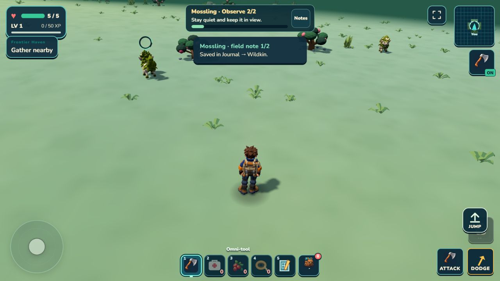
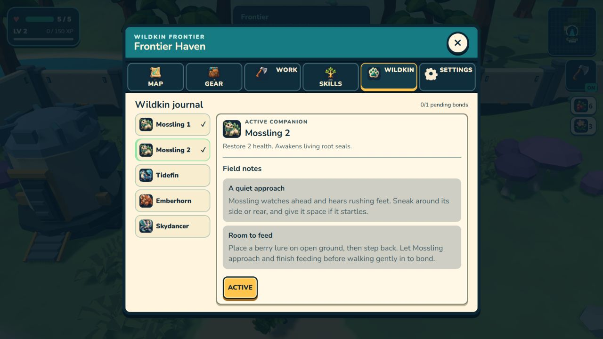
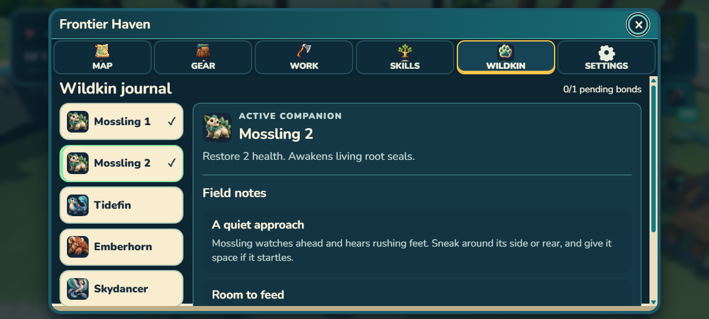

# Living Frontier F2B — individual wildlife

September 12, 2026. Selected R3: **8.1/10 PASS**, strongest usable of three under Chris's delegated iteration limit. Target fitness 8.8; R1 6.9; R2 7.8. This is independent agent judgment and producer selection, not owner playtest acceptance.

## Player result

Generated Mosslings use the existing creature, field-taming, inventory and Camp-return systems. Each capture keeps a stable individual ID, source ID, acquired outing and versioned genome. Multiple animals of one species can be owned and selected separately. The roster shows simple ordinal names; appearance genes are not presented as visible traits yet.

Terrain residency supplies sparse, deterministic animal sources. At most four generated residents, including dead/respawning records, occupy a near-player 3×3 chunk neighborhood. Two first sources live on the north clearing. Captured sources remain absent after unloading and reloading. Source identity differs from individual identity. The source history is bounded to 8,192 entries; owned animals to 64; pending bonds to the current capacity, at most four. No population simulation or unlimited storage is claimed.

Capture commits the individual, pending outing and source history before retiring the animal. Camp banking remains atomic and idempotent. Death preserves owned animals and captured-source history while clearing pending bonds. The current loss message says the pending animal returned to the wild; its original source does not respawn. This is a provisional game rule, not biological simulation.

## Native proof

Isolated developer origin 8082 retained the earlier forage test's gathered supplies. Position fixtures establish approach, retreat and Camp-gate locations; ordinary buttons/keys, feeding AI and saving perform the interactions. This is not a claim of an entirely earned walk or physical-phone testing.

- Native Camp Craft made two berry lures from 4 berries and 2 fiber. Existing pack had 10 berries/2 fiber; remaining pack had 6 berries/0 fiber and two lures.
- Desktop E placed the first lure. A retreat position fixture gave the animal space; ordinary movement/feeding reached BOND. One lure remained.
- A scoped storage-write failure on the actual bond left pending empty, source uncaptured and animal alive. The visible message invited retry. Restoring storage and pressing E again captured one individual without another lure charge. All storage overrides were removed.
- Exact first individual `wildkin_rrjqz1`, source `f1:w:0:-2:0`, acquired run `80c0b2e1-93c4-496f-947c-d6ebb5707b94`, retained its full genome in both pending runtime and saved outing. Literal outside-Camp reload restored the same record, skipped that wild source, and retained its uncaptured sibling.
- Native Camp Return confirmation secured that exact individual and emptied pending. The separate A New Ally milestone supplied 25 secured XP and 3 wildflowers; these are not capture duplication. A later reload retained the owned record, and its follower was visible and grounded on generated terrain.
- After the contextual-label fix, native PLACE BERRIES and BOND buttons captured source `f1:w:0:-2:1` as `wildkin_1b156h6` with its distinct clay/obsidian genome. The second lure was consumed once. Native Camp banking retained both Mosslings; Journal selected the second individual without replacing the first.
- A subsequent generated-ground outing had only the second selected follower visible and grounded. Both captured sources stayed absent. Diagnostic death through the existing death flow, followed by literal reload, retained both exact genomes/IDs and selected ID, with pending empty and activeRun null. Pending-loss behavior is covered by focused save tests rather than a third native tame.
- The 915×412 CSS landscape roster has readable separate entries, working scroll area and close control. This is emulated layout proof. All viewport overrides were cleared. Native packaged Continue and generated wildlife/observation rendered without warning/error logs.

## Visual loop and limits

Target feasibility 8.8/10 for encounter composition and reuse of the existing asset. R1 scored 6.9; R2 scored 7.8. R2 restored two readable live animals but they remained too distant. The final staged-only candidate narrows roam/return/flee ranges to 2.6/4.2/3.5 m. Other generated wildlife retains ordinary 4.4/8.5 m roam/return and unrestricted existing flight.

An observation progress ring uses the existing visual update and bounded geometry. R3 visibly shows it above the observed Mossling. Both animals remain separated from scenery/HUD; they are still smaller than the target, and the observation card plus temporary note toast occupy substantial upper-center space. Current Mossling mesh, materials, shape and animation remain inherited. Genome colors, eyes, crests, tails, markings and size are metadata awaiting F4 expression; this slice does not claim modular visual genetics.

The native pass found a hidden contextual-action label despite an eligible creature. Its cached offset mixed the initially unsynced visual-root height with capsule-center height, placing the label underground. Deriving its height from local body bounds and capsule dimensions fixed the actual issue; regression plus native second-animal touch actions passed. Speculative cache-refresh changes were removed. The HUD icon cache also now includes individual identity, so switching same-species companions updates its accessible name.

Workflow lesson: when a fresh spatial adapter works but the cached one fails, compare first-frame transform ownership before adding generic invalidation machinery. Confirm the visible control and actual native action after the correction.

## Images

## Verification

Final integrated verification passed **1,042/1,042 tests**, world consistency, retained campaign checks, build, validation and ZIP. Earlier intermediate verification had 1,043 tests; two speculative cache tests were replaced with the one reproduced transform-order regression. Final package is **43.94 MB unpacked / 20.48 MB ZIP**. The campaign checker still validates finite source content, not a complete procedural economy. No dependencies, paid assets, network features, push or deployment were added.

Reference author/integration: Astra root. Runtime workers: Terra and Sol. Independent target/runtime judge: Sol (`atlas_visual_judge_r1`). Image-generation backend model version is undisclosed. The final package's only change after the captured packaged encounter is the same-species HUD accessible-name cache correction; final rebuilt bytes are hashed in `hashes.json`.
