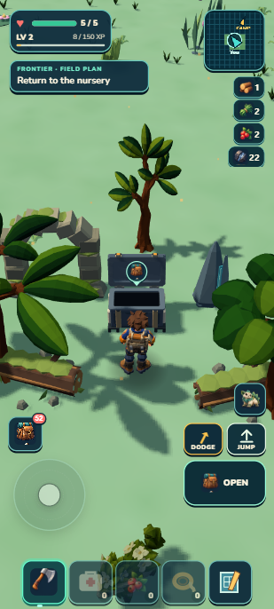

# Lush rootbound groves — selected R3

September 13, 2026. Parent baseline: `b000cab` (continent coast and swimming). This batch extends the existing seeded regional-place, discovery, companion and loot owners. It adds no asset, dependency or save authority. Source/behavior/portable checks PASS; selected visual **7.7/10 HOLD**. All1,319 tests and world/campaign/build/validate/ZIP pass. Current seed has59 supported groves plus Signal, using one initial grove composition; these are not59 distinct habitats or finished continent content.

  

## Target and ordinary view

`baseline-portrait.png` is the actual developer view before grove placement. `target-portrait.png` is a generated proposed arrangement, not a gameplay screenshot. The target was generated from that baseline with the built-in image tool and copied into the repository; original output is retained under the Codex generated-images directory. The reference asks for the unchanged mint terrain, sunlight, player/companion and HUD, with three existing alien paddle-leaf canopies, two mossy fallen logs, one stone, one small ruin arch and an articulated field chest. No stateful Rootfall copy, new surface treatment, particles or new vegetation kit.

The unchanged seeded owner is chunk `-5,9`, center `(-222.58139716172158, 11.439431508472147, 479.47494398673877)`, yaw `0.6658765729756316`. At the baseline it has Lush weight `0.9988698997`, coast distance `127.8546m`, and supported radius7. The prepared approach is local `(0,8)`, world feet `(-217.63940767724418,11.232044386342746,485.7659486708345)`. The camera uses ordinary portrait42° pitch, matching the place yaw; this controlled reference yaw is disclosed. The native projection places the center near `(155,148)` and the intended local-z2 chest near `(155,193)` in the309×686 capture, above the player near y407. Tall rear crowns may fall outside the crop; the approach and chest must remain clear.

The baseline fixture imports an existing seven-individual save, selects the owned Lichen Mossling and changes the supported approach/run ID. Health is5, bankedXP58, with22 iron and22 crystal. Prior complete coast save and this prepared fixture are retained locally in `.dream-loop/lush-groves/`. This does not claim an earned Camp-to-grove outing or fresh capture. Browser: developer `localhost:8082`, portrait412×915; capture uses the established host-fitting emulation.

## Actual play and persistence

The disclosed fixture used normal game movement through synthetic keyboard events, followed by Enter activation of the actual Bloom and Open buttons. No position writes or simulation stepping occurred during that journey. The2.492s walk reduced chest distance6.400→1.178m and exposed the MOSSLING SEAL interaction at health5. At full health, Bloom saved the seal before the lid moved. The20ms observation trace recorded OPENING/disabled at69ms, lid angles0→−0.524 at501ms→−1.400 at763ms→−1.745rad with collection enabled at1,001ms. Health stayed5; cooldown started at24s. The opening screenshot captures the early catch-release interval; the trace and open image carry the later movement evidence, not a reviewed new animation video.

Normal Open changed berries2→8, flowers3→6 and crystal22→24, retaining22 iron,1wood,2fiber,health5 and bankedXP58. FieldXP became12 and remains at risk until Camp return. The chest stayed open and its interaction became EMPTY. All seven individuals, selected Lichen Mossling, existing Camp/breeding/crop, inventory and other progress were preserved. This batch does not claim a physical Camp return or earned full expedition.

The first literal reload added two legitimate atlas bits at the new arrival position (`30373888→30374272` in chunk−5,9); it changed no other canonical field. The selected post-reveal save then matched the complete canonical payload exactly after developer restoration/literal reload and portable import/literal reload. Portable normal EMPTY activation also retained the entire save exactly. The portable chest was visibly open at−1.745rad, player grounded, health5 and fieldXP12. Both final warning/error logs were empty; portable resource origins were only `http://127.0.0.1:8081`. These are local-browser tests, not physical-phone or cold-airplane-mode proof.

Two simultaneous groves were verified in a separate prepared far-north fixture: `f1:d:-12:-49:lush-root-cache` and `f1:d:-13:-46:lush-root-cache`. Both resident registry/visual entries existed at scale.7; real downward Rapier rays hit their respective chest surface IDs at2.286m from3m above their bases, matching the.714m scaled chest height. A disclosed synchronous diagnostic changed only the terrain/discovery residency owners: original→two→one→original. The retained grove kept the same root, the removed root disappeared, and the reconstructed original retained its saved seal/claim and open lid. An initial one-chunk shift still included both in the5×5 window; the corrected endpoint moved two chunks and proved retirement. Player position was not changed by this diagnostic; the far fixture was discarded and the selected collected save restored.

Focused tests cover wrong/no companion, nearest stable-ID ties, healthy Bloom, failed seal saves, lid gating, real-catalog multi-item partial rewards, failed reward rollback, cross-site identity through unloaded reload, no repeatedXP, dry support, family-specific asset gates and Sunscar/legacy siblings. The real-catalog test first ran before the placement dependency was written; its subsequent fixture correction created an active run so fieldXP was asserted under its actual owner rather than as bankedXP. No progress behavior was changed for that test.

## Visual selection and final gate

| Pass | Score | Main outcome |
| --- | --- | --- |
| R1 |5.2 HOLD| Chest and edge logs dominated; most grove framing was outside the useful view. |
| R2 |7.4 HOLD| Smaller chest and tighter trees/logs formed a readable destination. |
| R3 selected |7.7 HOLD| Measured arch placement, asymmetric right tree and converging logs improved the enclosure. |

An independent judge selected R3 as the strongest usable version. Crown/ruin occlusion, HUD competition and sparse foreground remain visual debt. The final arch projection is below the objective panel, but overlapping leaves still weaken its silhouette. Stop after three passes under owner delegation; do not inflate this to visual admission. The generated target is an arrangement guide; actual admitted kit shapes and camera behavior own physical feasibility.

R2 deliberately shrank only generated chest instances to.7. Placement support, catalog data, root scale, collision dimensions and rotated offsets share that value; Signal and its receiver remain unchanged. The independent narrow transform review passed23 tests. The principal source review also found and repaired a family-admission mismatch: missing Sunscar-only art could hide Lush scenery/ecology exclusions while leaving its chest registered. Family-union enablement plus exact per-family admission now keep those siblings aligned.

One aggregate gate passed1,319/1,319 tests in73.884s, followed by world JSON/generated parity, retained campaign checks, build and validation. ZIP is20.57MB; unpacked submission44.29MB. Finite discovery sampling measured638.7ms in standalone Node versus about422ms for the previous catalog; definitions are indexed by chunk for runtime reconciliation, not regenerated every frame. The witnessed scene had48 draws/172,639 triangles and23 scenery residents including12 canopies, within existing caps. These are one-view figures, not a phone performance guarantee. Exact final file hashes are in `checkpoint.json`.

## Try it

From a Lush grove, approach the small chest between the logs until MOSSLING SEAL appears. With a secured Mossling selected, press Bloom, including at full health. Its lid should visibly open before OPEN becomes available. Collect supplies, leave and return or reload: the chest must remain open/empty and rewards must not repeat. With a full pack, make space and return for only the saved leftovers. Failure signs include a sealed cache opening for the wrong companion, collecting through a moving lid, missing leftovers, duplicated supplies, a chest floating above its collider, or an unrelated grove changing state.

The ordinary first-alpha route to this seeded site remains unproven. The prepared inspection save starts about6.4m from the chest; locate it through the photographed grove, not by expecting a new quest marker.

Canonical reward data is6 berries,3 wildflowers,2 crystal shards and12XP. Windows twice denied replacement-renaming `world.generated.js`; the same existing generator then wrote its exact generated bytes via a scoped local copy fallback, with prior generated bytes retained locally. No generator or retry-policy source was changed.
