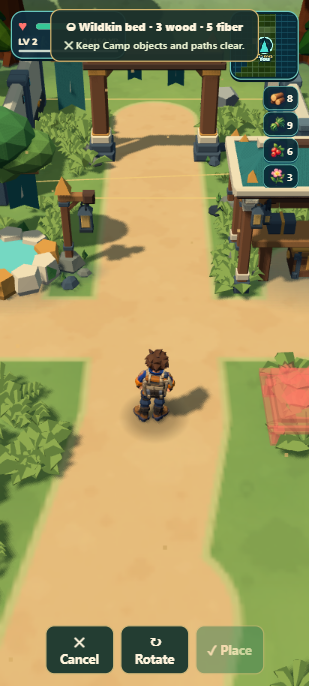
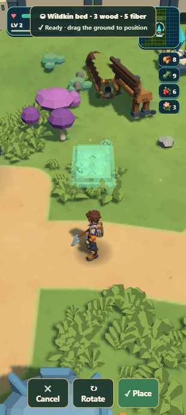
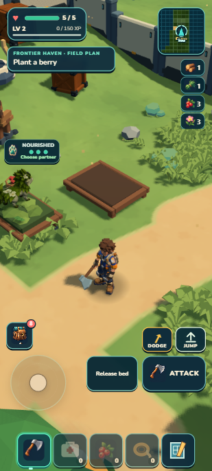

# Portrait Camp construction

September13,2026 · local main candidate after2c395aa · **8.5/10 PASS** from an independent reviewer. Scope is construction framing and its handoff to existing physical care, not new art admission or a full mobile release.

| Before | Feasible actual-camera target |
| --- | --- |
|  |  |

The target was captured with the existing game, camera and ground-aim control before production. This scoped workflow adaptation avoids inventing an art target for an exact camera interaction. No image or asset generation was needed.

| Bed placed and Mossling settled | Garden placed | After a short approach |
| --- | --- | --- |
|  |  |  |

## Actual player path

The dedicated127.0.0.1:8082 developer fixture reuses the previously earned Mossling and materials. Through existing progress/base owners, release its old bed and remove the old bed/garden for their normal full refund. The prior complete save remains preserved. This is a controls fixture, not a second fresh earned outing. Starting pack:8wood,9fiber,6berries,3wildflowers; one exact owned Mossling `wildkin_wvwyyt`,50XP,health5; player at Camp0,2.

After literal reload, ordinary portrait UI opened Field plan→Work→Wildkin bed→Build. The legal preview at3,0,2 framed automatically at yaw−90°. Place spent3wood/5fiber and immediately exposed Settle. Settle and three Feed clicks assigned the same individual and changed berries6→3. Work→Berry garden→Build automatically selected2.3,0,4.3 and yaw−135°. Place spent4wood/3fiber. The garden remained clearly visible; its3.253m range required a short approach because the nearer nourished bed still owned the contextual action. A600ms W input moved about1.29m without changing camera manually; Plant appeared and spent one berry3→2. Growth subsequently reached90 active-play seconds with4berry/Bloom+1 harvest eligibility.

All construction and care actions in this story used portrait412×915. No player teleport, camera override or landscape workaround occurred after the initial fixture/reload. Screenshot-only scale overrides are disclosed below. Final pack:1wood,1fiber,2berries,3wildflowers; care3; exact individual retained; bed/garden and ready crop;50XP,health5.

## Closure and limits

- Native visible Cancel restored the exact prior yaw.4, pitch.6 and zoom.82. Separate developer fixtures exercised blur, resize, orientation, visualViewport, Author-owner suppression, repeated open and game reset; each closed placement and restored the same view. Actual412×915→1280×800 rotation closed preview, restored landscape32° and preserved yaw/zoom; landscape Build left the view unchanged; portrait return recovered its prior pitch.6.
- Focused tests cover all11 piece families through the unchanged validator,40-candidate cap/null exhaustion, exact target, real camera projection, orientation preferences, failed-save retry, callback exceptions and once-only cleanup/listener disposal. No inventory, physics or save schema changed.
- One aggregate: **1,252 tests passed**,65.684s test phase; verify/world/retained-campaign/build/validate/ZIP passed. **44.22MB unpacked;20.56MB ZIP.** Source hashes and compact native proof are in `checkpoint.json`.
- Developer literal reload and portable owner import/literal reload matched exact individual/genome, base, care, ready crop, pack, atlas/ecology,XP,health and purpose. Portable Bloom harvest eligibility remained4. A disclosed packaged preview fixture framed the current target and visible Cancel restored its prior yaw; no resources were spent. Portable resource origins were only127.0.0.1:8081 and console logs were empty. Developer logs retained only the08:32 target-staging synthetic-pointer capture error; no final-candidate gameplay error appeared.
- Independent review found no blocker. Optional polish: the existing build caption touches the map edge in the target. Crowded Camps may require a short approach or exhaust the4m search and keep the red draggable fallback. Legal placement is not a guarantee of immediate interaction reach.
- This is emulated portrait browser proof, not a physical-phone or cold airplane-mode/offline-start pass. Unrelated user8080 and old art experiments were untouched. No new GitHub push or Drive publication is included.

## Reproduction for a player

Stand just south of the drop pod with enough wood/fiber and a Mossling selected. Open Work→Build and choose Wildkin bed. Expect a legal ghost centered ahead and a usable Place button. Place it; expect the bed to stay visible and Settle to appear. Feed the settled Mossling, then build a Berry garden. Walk a short step toward it if needed; expect Plant to replace the nearby bed action. A preview behind the edge, a sudden turn away after Place, or an unresponsive visible control is a failure.

While previewing, tap Cancel or rotate the device. Expect preview and construction controls to close and the previous view to return. Reopen Build and try Rotate/ground dragging normally; the existing red/green validation still governs placement.

## Workflow trial2

Gameplay/source/aggregate ran08:29–08:44UTC, with documentation and portable closure afterward. Two disjoint Sol production workers, root camera/composition/native work and one independent Sol reviewer. One actual target, one reviewed candidate, no corrective production round, one aggregate. Reusing the earned Camp fixture avoided repeating the first forage/bond journey. The narrower scope and reusable save mean this15-minute result cannot establish a general speed multiplier against trial1's66minutes.

Three screenshot attempts had invalid surface crops; one capture-scale Playwright click had no effect. They were discarded/retried only at the affected capture/input step. Working screenshot recipe:412×915 viewport,deviceScaleFactor1.25,host scale.6; capture247.2×549 withclip scale1, yielding309×686. Restore deviceScaleFactor1 before normal Playwright input. Changing viewport while construction is active correctly closes it, so capture setup must precede the preview session. A direct developer inspection omitted a required position argument and threw; it was an inspection error, not a gameplay exception. This reinforces the trial's rule to reuse verified tool contracts and preserve unaffected proof.

Ignored saves, lifecycle records and gate logs are under `.dream-loop/portrait-construction/`. Historical target staging was camera-assisted; the subsequent native rebuilt-Camp story was not.
