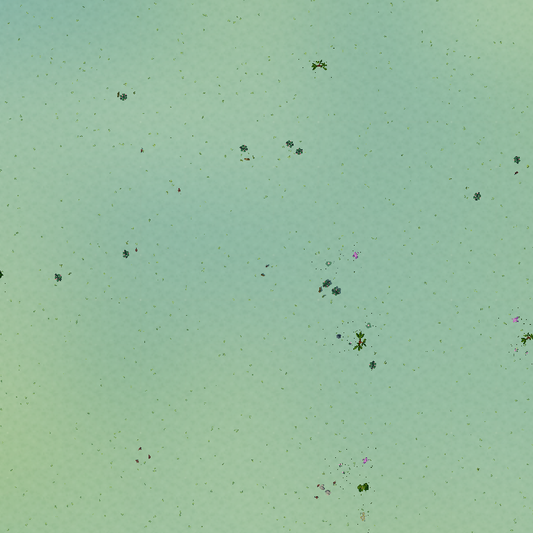
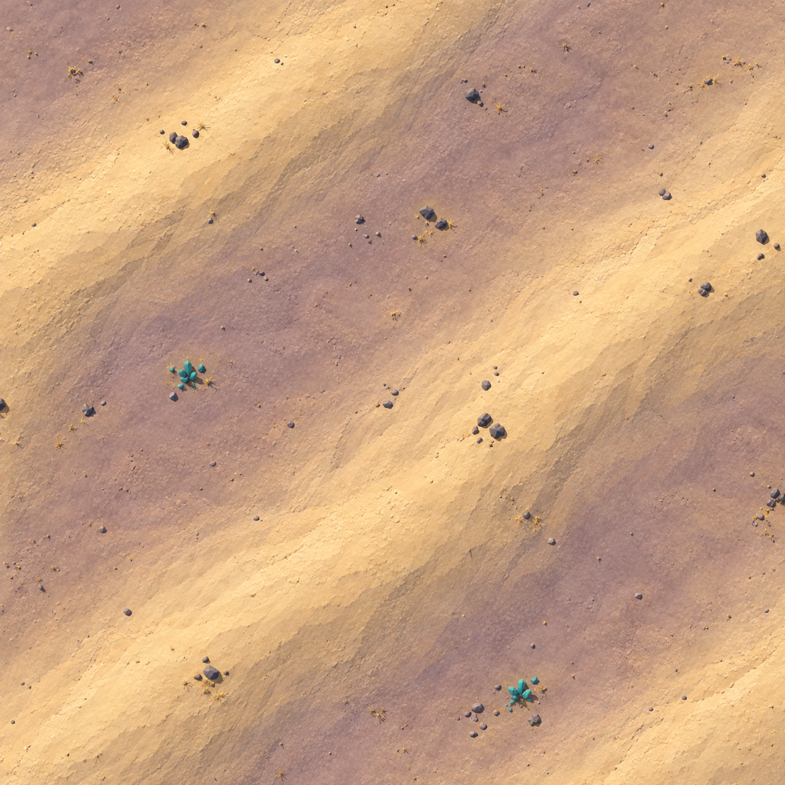
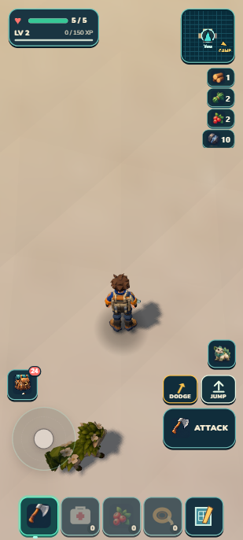

# Seeded provinces — checkpoint receipt

Status: functional foundation verified; selected R3 art remains5.5/10 HOLD. Parent: `52904c2` on local `main`. This is subsequent local work after the already delivered GitHub/Drive checkpoint. Final source/image/package hashes and quantitative checks: [checkpoint.json](checkpoint.json).

## What the slice changes

One deterministic field supplies roughly600m jittered province sites and smooth multi-site weights. Lush rolling ground, Sunscar ribs/basins and Ironspine directional ridges share the same terrain, color and ordinary life consumers. Heights can target0–84m outside the protected Camp/apron/north-route/Skybreak envelope. The established detailed Skybreak geometry and staged sources remain intact. `province*` metadata is separate from the existing `camp` section/region activation contract.

Existing admitted resources, creatures and scenery supply the first regional recipes. All residency budgets remain bounded:25 terrain chunks, inner3×3 ecology, maximum4 live generated Wildkin with at most1 ordinary regional signature,34 scenery total/18 near,640 scenery grass clusters and96 terrain grass instances per chunk. No new model, dependency, runtime network access, save authority or frame loop is added.

## Visual evidence

Fixed Sunscar witness: x=-640,z=-335; normal portrait412×915, yaw0 faces north(-Z), pitch42°. Diagnostic overhead is144m square, north up, centered at the same witness. Overhead/oblique captures temporarily remove fog and use the existing renderer for one offscreen render; these are diagnostic views, not the playable camera.

| Version | Score | Result |
| --- | ---: | --- |
| [R1](r1-verdict.md) |4.5/10|One broad painted-looking band; weak portrait relief.|
| [R2](r2-verdict.md) |5.0/10|More ribs overhead; fixed portrait still too empty.|
| [R3](r3-verdict.md) |5.5/10 HOLD|Selected strongest provisional candidate after three passes; ordinary portrait still fails the terrain-readability target.|

The target is generated from the actual baseline. It is an aspiration, not a shipped screenshot. R3 improves the overhead's ridge/basin rhythm and resource pockets. The fixed portrait still reads as broad colored planes: nearby slope/crest definition, material contrast and visible destinations need a different approach. No independent visual score proves collision, motion cadence or physical-phone performance.

## Shared contracts and performance

- Pure field tests cover deterministic IDs, alternate seeds, normalized weights, bounded height and continuous multi-profile transitions. Runtime site-window cache is bounded and preserves the pure sample result.
- The baseline comparison covers1,489 protected samples of height, ground color and surface kind; all remained exactly equal through R3.
- Terrain mesh triangles and Rapier receive the same vertex/index buffers. The existing2m regular mesh interpolates between sampled vertices; the public analytical query can differ slightly between those vertices. Skybreak retains its exact1m triangle-query path. No new stacked/overhang terrain claim is made.
- The texture color helper alone samples a globally aligned2m grid, capped at27×27 points per chunk, then interpolates the existing baked texture's color. Any grid touching the reserve/fade uses exact color sampling. Height, grounding, collision and atlas queries retain their existing authoritative path. Focused R2 error was below0.0042 per channel; one16,384-lookup Node benchmark measured66.19ms exact versus10.61ms including grid construction. This is a CPU microbenchmark, not whole-game or phone FPS.
- The native isolated cold terrain relocation measured1,377.6ms before the color-grid integration and423.4ms after it alongside R2. These are diagnostic relocations with different terrain revisions, not a controlled movement-frame comparison.
- Regional resource selection reaches the same renderer, collider and persistent-source owners. Scenery clearance calls the identical regional forage/wildlife samplers. Generic dry-fiber tint reaches independent runtime materials. Stage indices100+ retain their previous identity and priority.

## Native/portable verification

Tests used the isolated developer origin8082 and portable origin8081. The user's8080 page/save was untouched. Existing isolated saves were exported before staging positions/importing. No inventory grants, healing, direct resource hits or forced collection were used in this slice. Camera/position fixtures are developer preparation; these actions are not a fresh earned journey or a continuous Camp-to-highland expedition.

| Actual action | Observed result |
| --- | --- |
| Stage just west of Skybreak at(-70,-200), then ordinary keyboard movement135m west across the protected-region fade |36.523s, health5 throughout, influence0→1, at most25 terrain chunks and26 selected scenery. No position edits during the walk. [Record](native-boundary-walk.json).|
| Open the personal atlas after walking |The travelled strip revealed terrain colors while surrounding ground stayed hidden; Camp bearing remained visible. [Screenshot](native-atlas-portrait.png).|
| Stage south of regional crystal `f1:r:-13:-7:1`, walk toward it and let the ordinary automatic tool work; then walk to its drop |Source4→0, crystal pack6→10, no pending yields, health5. [Record](native-crystal-collected.json).|
| Stage at Ironspine(450,1000), terrain63.016m, then ordinary keyboard walk20m down the slope |5.566s, ended on supported ground near53m player-center height, health5. [Record](native-highland-walk.json).|
| Inspect lush(-275,250), then return to the previously harvested Sunscar source |Different province weights/color/life; terrain residency stayed bounded. Crystal remained depleted and pack remained10.|
| Literal developer reload after those unload/revisit operations |Supported saved position, health5, crystal10 and exact depleted source retained. [Before](native-before-reload.json), [after](native-after-reload.json).|
| Import the isolated result through the authoritative save API into the rebuilt portable build; literal reload, ordinary6m walk, and literal reload again |Same inventory/source retained, supported final position, health5,25 terrain chunks,18 scenery and2 generated wildlife. Resource origins were only localhost8081; both browser warning/error logs were empty. [Portable record](package-after-reload.json), [walk](package-walk.json).|

Native interval samples during the boundary walk averaged29.16fps with a9.70fps low window; concurrent Node verification/tooling makes this an observation rather than an isolated performance benchmark. Streaming stalls and physical-phone performance remain open. The world can be sampled farther than tested, but this slice only inspected runtime positions out to about1.1km from Camp.

Validation: **1,191/1,191 tests**, world sync, retained-campaign check, build, portable validation and ZIP PASS. Package44.17MB unpacked/20.54MB compressed. Initial aggregate failures were two exact witness count/scale expectations invalidated by R3 support filtering; tests now verify meaningful mineral-majority, admitted-mineral, size-floor and grouping requirements. Production was unchanged after the final visual capture. Retained campaign checks validate historical content, not completion of the new frontier economy.

## Repeatable human playtest

From Camp, follow the familiar north route toward Skybreak, then explore west around the outside of the plateaus. The green starter ground should gradually give way to pale ridges and mauve basins; the walk should reveal a strip in the atlas. Look for turquoise crystal among stone pockets, approach with the Omni-tool selected, gather its drops and reload. Correct behavior keeps the gathered crystal and depleted deposit. Failure signs include falling through ground, losing the saved position/health, a restored deposit or duplicated rewards. Distant regional locations above are optional developer fixture supplements; this is not a claim that an unmarked1km route is already well signposted.

The [selected1600m planning map](selected-planning.svg) is developer evidence from the same sampler, not the player's unexplored atlas. Its160×160 cells include14 dominant site IDs and all three grammars, with sampled heights0–76.742m. [Raw measurements](selected-planning.json) retain provenance.

## Remaining scope

This is a small grammar library with seed variation and coherent transitions. It does not guarantee endlessly unique regions, complete region progression, dramatic distant skylines, infinite-distance physics, rivers, physical water/swimming, weather, day/night, overhangs/cave instances, additional reproduction modes, DNA exchange or trusted online trading. The map still presents a bounded local window; the larger province map is developer evidence only.
