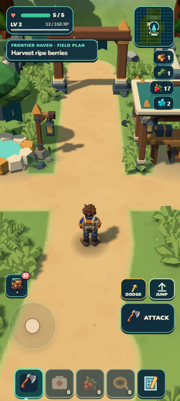

# Denser ordinary habitats — local foundation checkpoint

September13,2026. Ordinary inland travel now has denser seeded reeds, lilies, mushrooms and stone patches. Shared geometry and12.5m render cells keep the extra props bounded. Source review passes; visual R1 remains **6.8/10 HOLD** because midground composition and repeated dry stones need work. All **1,337 tests** and package gates pass (**44.30MB unpacked /20.57MB ZIP**), and the complete earned Camp save matches developer and portable reload. Normal travel works, but boundary loading still hitches; this is a local foundation checkpoint, not an alpha release.

  

## What changed

- Deterministic infill adds64–256 accepted low props per eligible near chunk, at most512 candidates. It blends density with Lush influence; the near/total ceilings are2304/2312 with12 canopies. Original and gameplay IDs retain priority; protected starter, coast and Skybreak ordered selections have exact baseline hashes.
- Near-only infill covers3×3 chunks; outer canopy recipes cover5×5. Separate immutable ordinary/infill maps reuse overlap inside the existing bounded9×9 cache. Completed recipes survive a failed visual attempt; null/dispose clears them. Fixed callback/world ownership is required for cache reuse.
- One geometry per admitted low asset is shared by12.5m cell/asset instance batches. Native frustum bounds include every instance. Both low and ground instance buffers dispose on success/failure. The old640 ground-cluster ceiling and original/staged/place priority remain.
- Exact height-only queries exit the existing analytical expression early; detailed Skybreak retains its exact interpolation. Only the real terrain runtime's immutable same-height guarantee enables scenery memo coalescing. Custom height callbacks retain authority, and point memos clear between completed chunk recipes.
- Lily support now covers its actual.921m reach with a.93m envelope. Signal discovery, regional places, scenery and ground cover share one fixed-site record; receiver/chest use5m plus each candidate footprint, and regional places retain their30m reserve. Finite discovery IDs, inventory, Wildkin, Camp and save ownership are unchanged.

`seed → terrain/support → fixed sites + ecology + places → bounded ordinary/infill recipes → shared mesh cells → existing physics/render owners`

## Actual camera and travel evidence

All game images are309×686 captures of a412×915 portrait viewport on a laptop. A=(-99.904,219.680), B=(-150,345), yaw2.696/pitch42°/zoom1 are disclosed test fixtures. They are not an earned journey, physical-phone benchmark or unaided discovery test.

| Fixed view | Resident lows | Canopies | Actual draws | Actual triangles |
| --- | ---: | ---: | ---: | ---: |
| Dry transition A | 1,102 | 7 | 40 | 140,411 |
| Lush B | 1,925 | 12 | 48 | 214,055 |

These actual draw totals are much smaller than resident potential geometry because cells outside the camera are culled. The representative2,304-prop stress fixture retains.371MiB unique geometry plus.141MiB matrices, versus207.29MiB duplicated vertex attributes in the old representation per CPU/GPU copy; it is arithmetic/CPU evidence, not phone-memory telemetry. See [instancing cost](instancing-cost.md).

Ordinary W moved through both dense regions and published new visual/collider residency. The initial dry boundary used178.6ms of scenery work and produced a286.4ms frame. Final frozen-source Lush travel: median33.3ms, p9535.8ms, maximum420.6ms; scenery boundary work 270.5ms. The exact raw journey is in [native evidence](native-final-lush.json). These hitches remain an early-alpha release blocker.

  

The Signal fixture's2.5-second walk moved5.27m toward the receiver/chest. Both discovery colliders remained registered; all640 actual ground instances were at least13.87m from either protected object. Source/focused tests also verify every selected prop footprint. The saved-open grove retained its one chest collider and a normal2-second approach. No new cache reward was claimed in these checks.

## Review, validation and limits

Independent source review PASS after fixing ground GPU-buffer retirement and closing the Signal's ordinary/infill/grass/regional-place metadata chain. Independent visual R1 **6.8/10 HOLD**: real baseline improvement, but sparse mid/lower frame, repetitive stone chains and heavy clipped foreground plants miss the [locked target](target.png). This is a delegated provisional foundation choice, not owner art acceptance. No fourth density diagnostic or target regeneration followed the judge.

Focused owner tests cover exact geometry/transforms/bounds/disposal, deterministic placement/support, protected selection hashes, cache promotion/pruning/failure, independent height callbacks and exact terrain values. Full verify:1,337/1,337 tests in81.519s, then world/campaign/build/validate; ZIP21,572,423bytes. The first aggregate exposed an outdated root test expecting infill in a protected starter fixture; its expectation was corrected and the aggregate rerun. No production defect was hidden or test skipped.

The complete earned one-Mossling Camp envelope is byte-identical after developer and portable literal reload and portable Continue. That includes62XP,17berries,6flowers,2crystals, the same individual/selection, bed/garden/care/crop, grove claim, ecology and atlas. Final console/origin checks are recorded in checkpoint.json. Physical phone, cold offline start, broader danger pacing and unaided discovery remain open. Prior PDFs/Drive and GitHub publication were not refreshed here.

## Next work

Next priority: retain or progressively prepare deterministic scenery/ground clusters using the existing streaming owner, then measure ordinary boundary travel. Current profiling places about78–79ms of a120ms visual rebuild in ground placement checks, alongside128–150ms of new-chunk recipe work. Tiny height-query optimizations will not remove that pause. Keep one frame loop and transactional physics/publication. Fuller, more coherent midground patches remain a separate visual debt; no further density/seed tuning in this batch.

Useful manual check: continue at Camp, leave through the frontier arch and travel inland until the surroundings change from dry stone country to green plants. Walk around the stones, approach the Signal receiver/chest or a rootbound grove, and return. Correct behavior has clear interactive objects and stable ground; a long pause while crossing into new surroundings is the known streaming defect, while disappearing ground, trapped movement, lost supplies or repeated rewards are failures to report.
