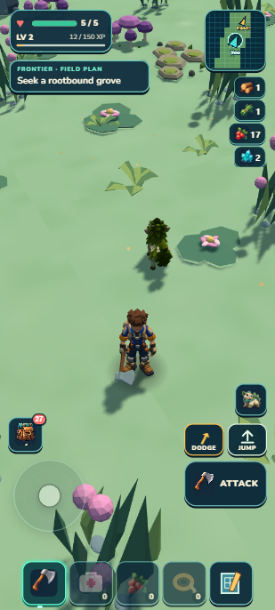
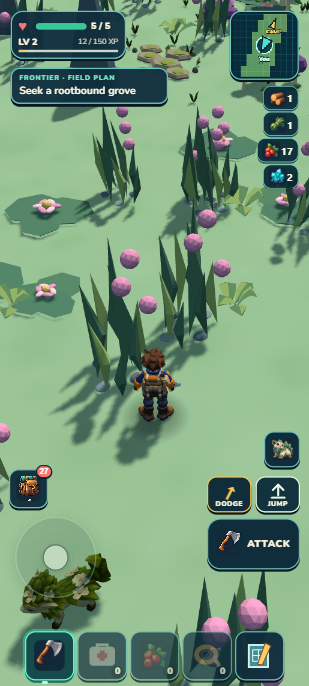
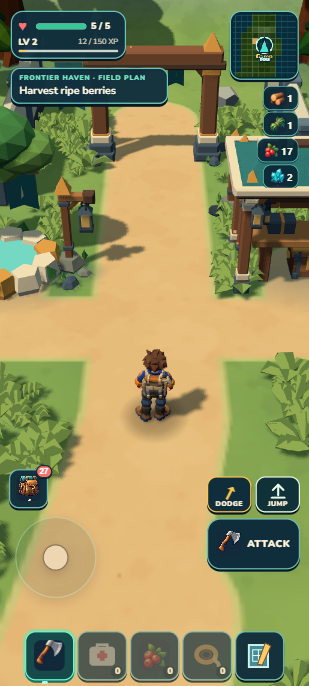

# Scenery prepared before crossings

September13,2026. Dense scenery now prepares ahead of an ordinary chunk crossing through the existing frame loop. In the same Lush laptop witness, scenery boundary work fell **270.5→16.6 ms** and the slowest whole frame fell **420.6→161 ms**. Density and deterministic placement are unchanged. All **1,350 tests** and package gates pass (**44.32 MB unpacked /20.58 MB ZIP**); the complete earned Camp save matches developer reload, portable reload and Continue. Source review passes. The earlier **6.8/10 visual HOLD** remains, and loading hitches still prevent an alpha-release claim.

  

## What changed

The existing terrain owner exposes one immutable anticipated window. Scenery advances the same deterministic recipe and visual builders in small work units, retains one detached candidate, then publishes it only when the actual full ordered window matches and physics succeeds. Complete ground-patch reuse avoids repeating terrain/clearance checks. Cold load, teleport and early arrival keep a synchronous fallback.

`movement → anticipated terrain window → complete recipes → detached shared-mesh visual → actual matching residency → physics → visible publication`

- Existing one-frame-loop scheduler: soft3ms budget, at most256 work units per update. A unit can exceed the deadline; this run reached15.5ms. No background worker or new runtime dependency.
- One speculative target. Reversal, inactive/Author, reset, failure and disposal cancel owned partial work. Zero-motion render frames retain the target only inside its existing signed preload corridor; real reversal still cancels/replaces it.
- Complete recipe arrays only; incomplete candidates stay job-local. Complete ground patches are cached before the unchanged640-cluster cut, bounded to512 entries and28 compact records each. Fixed world/callback identity and pruning prevent stale reuse.
- Exact instance matrices, colors, ordering, protected-site selection, density and physics remain. Failed physics retains the visible scene and retry; transferred visuals have one owner.

## Measured ordinary travel

The disclosed fixture begins at(-150,345), camera yaw2.696, pitch42°, zoom1. Both baseline and current held normal W for10seconds in a412×915 portrait viewport on the same laptop. No position writes or simulation stepping occurred during either walk. The saved starting position is a diagnostic fixture, not an earned journey or physical-phone test. Current end is(-158.943,363.769), center(-4,7).

| Measure | Prior density checkpoint | Reviewed preparation |
| --- | ---: | ---: |
| Scenery work at crossing | 270.5 ms | 16.6 ms |
| Maximum whole-frame interval | 420.6 ms | 161 ms |
| Median frame | 33.3 ms | 33.4 ms |
| 95th-percentile frame | 35.8 ms | 35.9 ms |

About94% less scenery crossing work and62% less maximum-frame delay in these individual runs. This does not establish stable FPS, a hard time bound or performance on phones. A first repeat measured17ms scenery/167.7ms maximum frame; the final reviewed repeat above includes extra owner profiling. Raw [current journey](native-lush-final.json) and [prior journey](../scenery-density/native-final-lush.json) retain exact samples.

The final run recorded one prepared publication, zero unfinished publications, zero preparation failures and one cancelled prediction as the direction became diagonal. The52-entry ground cache stayed below512 and used at most13 records per patch. Ecology still cost86.6ms at the crossing; terrain preparation took20.6–27.1ms per chunk and boundary terrain physics6.7ms. The161ms frame is still a visible hitch.

## Source and saved continuation

Independent source review PASS after a zero-delta-render-frame cancellation repair. Focused proof covers complete-only publication, exact synchronous/incremental output, bounded work/cache, zero-motion/moving cadence, genuine reversal, inactive/dispose, GPU cleanup, same-partial early arrival, failed preparation suppression and failed-physics retry. See [recipe evidence](recipe-evidence.md) and [visual/cache evidence](visual-evidence.md). Ground overlap reduced650 policy calls to13 in the controlled one-new-patch test. These unit/CPU fixtures are separate from the native timings.

One aggregate passed1,350/1,350 tests in77.391s, with no skipped tests, followed by world/campaign/build/validate/ZIP. Package44.32MB unpacked; ZIP21,576,637bytes(20.58MB). No source changed after that gate.

The exact previously earned one-Mossling Camp envelope was restored through the progress owner's import, then literally reloaded in developer and newly rebuilt portable tabs. Both exports and portable Continue matched the entire original envelope byte-for-byte: individual/genome, selected companion, care, crop, bed/garden, supplies, bankedXP62, atlas, ecology and claimed grove. Both warning/error logs were empty; package resource origins were only127.0.0.1:8081. [Browser proof](browser-proof.json). This is saved-continuation proof, not a repeat of the original earned outing or a cold airplane-mode test.

No appearance redesign or new visual round: reuse the [prior target and6.8HOLD](../scenery-density/receipt.md). Natural patch composition, repeated stone chains, coast/grove visual holds, danger pacing and physical-phone validation remain open.

## Next scope and reproducible human check

Chris reviewed the continent overview on September13 and explicitly asked for a quite large continent that is neither egg-shaped nor round, while continuing development. Next: measure the existing extent, then define a larger mainland with major peninsulas, deep bays and an uneven outline. Choose concrete dimensions and a feasible seed-generated overview before production. Keep streaming residency bounded and preserve coherent terrain, shoreline, land placement, atlas and swim/resume behavior. Exact dimensions and coast construction remain provisional until this audit; this request changes geography, not the current three-species content count.

For a human check, Continue the earned Camp, leave by its open exit and walk into the tall green inland country. Keep moving as fresh scenery comes into view, then reverse direction. The landscape should retain its plants and solid stones without disappearing or duplicating; a long pause, a missing patch, walking through a solid stone or a console error is a failure. Crossing can still hitch in this checkpoint. Return to Camp and reload: your creature, map and supplies should remain. The exact diagnostic route above supplements this recognizable setup; it does not replace it.

Local main checkpoint; prior remote/Drive publication remains unchanged. Shared skills, unrelated Verdant work and local art studies are preserved. Continuous goal stays active.
