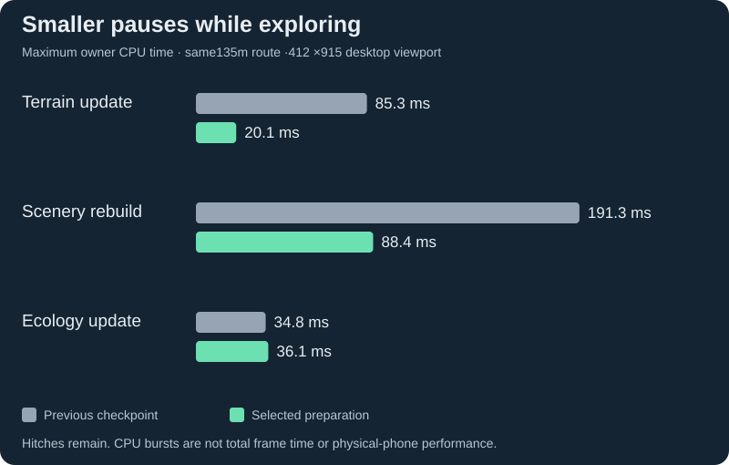
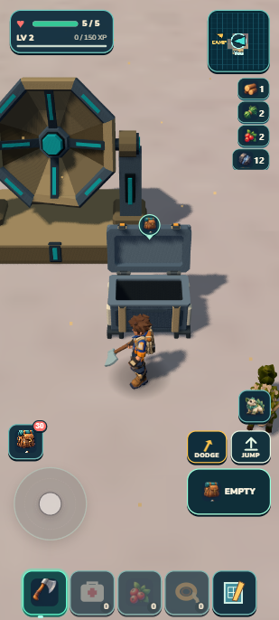

# Smoother terrain streaming

September 13, 2026. Local continuation after `0f3f240`. The world, existing assets, portrait controls, recipes and save format stay the same. This checkpoint spreads terrain preparation across ordinary movement and removes repeated scenery calculations. The earlier GitHub/Drive publication remains a separate delivered checkpoint.

## What changed for exploration

Incoming ground can now be prepared before the player reaches a loaded-world boundary. The current25 terrain residents stay published while at most one detached piece is built per authoritative tick, with at most nine held for an anticipated diagonal crossing. Axis crossings need five. Detached pieces have no live roots or colliders; a complete wanted neighborhood is installed before the old published snapshot changes. Initial load, resume and teleport still establish support synchronously.

Scenery retains overlapping pure forage/wildlife clearance recipes inside a bounded expanded9×9 window. An axis shift needs seven new recipes per domain instead of49. Within one rebuild, separate exact-coordinate height and terrain-sample maps also serve placement and ground-cover clearance. Each is capped at8,192 entries and both clear after synchronous construction, even if construction throws. A representative26-spec/338-cluster fixture drops7,861→5,692 underlying terrain calls (27.6%) with identical tested instance matrices and colors.

## Measured result

The same135m ordinary keyboard route, from a disclosed staged position west of Skybreak toward the next two residency boundaries, completed in35.564s with health5 unchanged. Maximum published terrain stayed25; five detached pieces were observed before crossings. The prior checkpoint completed35.849s, so this work chiefly reduces individual pauses rather than changing travel speed.

| Maximum owner update | Previous checkpoint | Selected | Change |
| --- | ---: | ---: | ---: |
| Terrain | 85.3ms | 20.1ms | 76% lower peak |
| Scenery | 191.3ms | 88.4ms | 54% lower peak |
| Ecology | 34.8ms | 36.1ms | No demonstrated improvement |

The two scenery boundary bursts changed191.3/146.5ms→88.4/72.7ms. An intermediate candidate with terrain preparation and retained recipes measured123.3/97.3ms before exact-point reuse. A targeted CPU profile attributed most scenery work to analytical terrain/region sampling, which justified this final bounded refinement. See [recorded timing data](streaming-timings.json) for all three candidates, profile summary, route coordinates and limits.

These are quiet desktop in-app browser owner CPU timings at412×915, one run per candidate, without concurrent aggregate tests or asset production. They are not whole-frame time or phone performance. Scenery and ecology still publish synchronously and can exceed a frame budget. Preparation may build unused pieces when movement stops or reverses: lower terrain peak does not imply lower total CPU. No asynchronous asset system, background worker, new scheduler, dependency or second loop was added.

## Correctness boundary

The shared physics batch now allocates incoming colliders disabled before retiring existing ones. An incoming descriptor/allocation failure disposes staged colliders and preserves the old ground, queries and indexes. Successful publication preserves terrain/rock traversal classifications, ordinary scenery/discovery solids, disabled same-ID replacements and section activation, then steps Rapier once.

Real Rapier tests cover injected allocation failure, old support without an extra step, retry, mixed collider families and disabled replacement. Terrain tests cover positive/negative/diagonal preparation, reversal, stationary cancellation, teleport, inactive/Author/dispose, candidate construction failure, physics failure, old snapshot/root preservation and retry. Scenery tests cover exact output, bounded recipe/point ownership, inactive/dispose, construction-failure release and physics-failure retry.

This guarantee stops at incoming allocation/construction failure. It does not promise rollback after unrecoverable engine removal, enable or step failures, and does not rewrite ecology's higher-level lifecycle. The previous [streaming audit](../frontier-discoveries/streaming-audit.md) is retained as historical baseline; the scoped terrain/allocation hazards above are now addressed.

## Native and portable proof

Only the isolated developer8082 and portable8081 saves are used. The user's8080 tab is untouched. The inherited review save has six owned Wildkin,12 iron,10 crystal,8 carried XP and an already claimed Signal Cache; this checkpoint does not claim those rewards were newly earned.

Developer boundary travel is ordinary input following an explicit starting position fixture. A later fixture returns to the Signal Cache and checks synchronous support, two discovery colliders and the existing Empty action. Literal developer reload restored the supported position near the chest, health5, six owned Wildkin,12 iron and8 XP. Exact [developer reload values](developer-reload.json) are recorded.

The freshly built portable version imported that existing review save through its normal import owner and literally reloaded. Clicking the visible Empty action granted nothing. Ordinary movement toward a6m target away from the chest completed1.490s with health5, six owned Wildkin and the same12 iron/8 XP. [Portable values](package-walk.json) include the route and local-only8081 resource origins. Developer and portable warning/error logs were empty. Timing wrappers and temporary viewport overrides were restored. This is imported continuation, not a fresh Camp-to-cache progression or physical-phone/disconnected-network test.

Existing visual targets remain held: discovery7/10 and provinces5.5/10. This performance change introduces no new art target and makes no claim that those appearance gaps are resolved.

## Final validation

All1,218 tests passed. `npm run verify` also passed world, retained-campaign, build and submission validation; `npm run zip` passed. Package44.19MB unpacked/20.55MB ZIP. The retained-campaign checker is a compatibility check and does not establish a complete frontier progression. Source, test, evidence and package hashes are recorded in [checkpoint.json](checkpoint.json). No remote push or Drive replacement is part of this later local checkpoint.

## Human check and next work

In the field, travel west past Skybreak into the pale rolling ground and keep walking as nearby terrain changes. Expect continuous solid footing and fewer long pauses; a visible missing square, a sudden fall through ground or repeated freezes are failures. Turn back near a boundary, then stand still: preparation should stop without altering visible terrain. Visit the cyan-spoked receiver east of Camp, approach its chest and reload; a previously opened chest should remain open and empty with the same cargo.

Next: richer recognizable places and discoveries using the existing lifecycle. Remaining work includes landscape readability, content variety, larger streaming budgets and physical-phone comfort/performance. Avoid expanding the streaming architecture again without a measured need.
