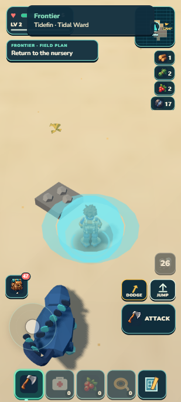
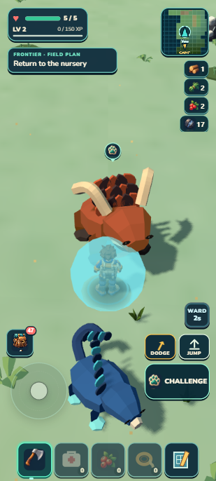
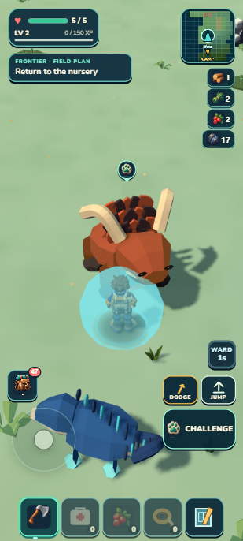
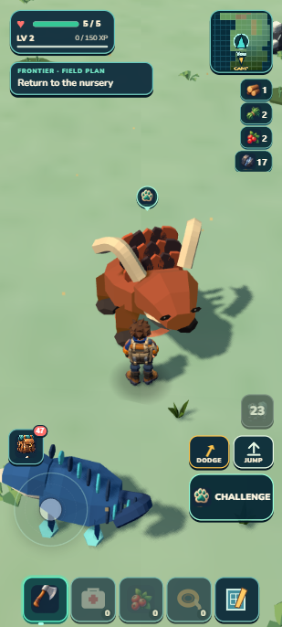
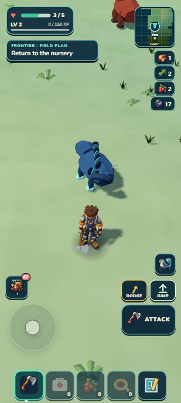

# Tidefin protects a useful outing

September 13, 2026 · local main checkpoint · independent state/interaction review **PASS**.

Tidal Ward now makes its protection readable: **WARD 3s → 2s → 1s**, then the remaining cooldown. The dome follows the same combat clock and the routine success toast no longer covers the hearts. Native play also exposed and repaired a territorial warning reset that prevented a nearby Emberhorn from charging.

| Previous active Ward: cooldown shown | Candidate: protection shown |
|---|---|
|  |  |

| Two seconds | One second | Protection expired |
|---|---|---|
|  |  |  |

| Unprotected charge: 3/5 health | Protected approach: 5/5 health | Portable Camp: haul retained |
|---|---|---|
|  |  |  |

These are actual 309×686 captures of 412×915 portrait emulation. The protected approach image precedes mining; Camp shows22 iron after collection. The locked [actual-DOM target](target-portrait.png) addressed the existing button only; it still contains the old toast. Production separately removes that routine toast. Stills do not prove continuous motion or sound. Existing terrain/art HOLD scores remain unchanged.

## Shared behavior

`playerCombat` owns a dedicated transient ward timer, independent of dodge and post-hit grace. Tidefin grants3s; its26s cooldown starts simultaneously. The existing HUD and dome consume that combat timer, with protection-specific accessible text and disabled activation. Camp, guides, title and modals retain their input priority. Failed seals grant neither Ward nor cooldown/effects; successful seal feedback remains. Other species expose zero active Ward time and retain their own abilities. No new buff framework, damage bus, loop, save schema, asset or dependency.

Both territorial rusher and spitter warnings now finish against `warnTime`, the clock already used by target eligibility. At real1/60s updates, the previous `aiTimer` threshold finished one tick earlier, reset to ROAM, then restarted WARN forever. A temporary property-write diagnostic established this cycle while the global loop and actor timers advanced. Legitimate retreat, awareness, taming and damage guards are preserved. Source review covers combat contact, projectile, guardian and fall guards; fatal-volume semantics are unchanged and no such volume is active in this outing.

## Native comparison and return

The controls save selects an already-owned Tidefin, stages a supported position north of Camp and restores only the nearby iron source to five pieces. It retains seven owned individuals, including the previous explicitly diagnostic mining Emberhorn, and earlier Camp/breeding history. This is **not an earned Tidefin capture or a fresh-player journey**. Ward uses the ordinary DOM button, automatically timed from observed WINDUP; this is not a human-reflex accessibility test. Movement and harvesting use ordinary synthetic keyboard events, without positional writes during either trial or return.

| Witness | Result |
|---|---|
| Unwarded Emberhorn contact | Actual lunge hit; health5→3; ordinary retreat completed |
| Ward triggered at WINDUP | Actual lunge contact blocked at2.3667s remaining; health stays5 |
| Continue to nearby iron | Threat returns home; player reaches source safely |
| Ordinary F, auto harvest off | Source5→0; physical collection iron17→22; no pickups left |
| Ordinary route to Camp edge | 24.969s; health5 throughout |
| Walk to Camp's existing arch | Another11.694s; RETURN TO CAMP→confirm→results→Continue |
| Bank outing | Eight XP secured; banked total58; active run null; pack22 iron/22 crystal |
| Literal developer reload | Entire canonical saved progress matches exactly; Ward0 |
| Portable owner import and literal reload | Exact saved progress again; health5, Ward0, no invulnerability; ability hidden in Camp |

The territorial Emberhorn is `f1:w:0:-3:0`, near(0,-111), and iron is `f1:r:0:-3:2`, near(4.1952,-121.6183). Camp's return arch is at(0,-6). This is an optional useful route: a player can detour, and capturing this Emberhorn removes the specific threat. No repeatable mandatory Ward gate is claimed. The nursery purpose in the final screenshot belongs to the retained earlier breeding save, not a new Ward reward.

Human check: with Tidefin selected, walk north from Camp toward the territorial Emberhorn on the ridge. Let its warning/charge develop and activate Ward before contact. The button should show its short protection countdown, hearts should stay visible, and protected contact should not remove health. Gather the nearby iron, retreat through Camp and use the return arch. Reload should retain the haul and leave no extra protection. Endless warning resets, a dome after protection expires, hidden hearts or refilled ore are visible failure signs.

## Validation and limits

- **1,270/1,270 tests pass**, one aggregate test phase66.775s. World/campaign/build/validate/ZIP pass;44.23MB unpacked/20.56MB ZIP.
- Focused proof covers Ward/grace/dodge overlap, projectile damage, expiry, reset/restore, failed seals, sibling abilities, HUD/FX hidden/pause behavior, and rusher/spitter warning escalation/projectile/retreat at real fixed steps.
- Full saved progress parity includes inventory, seven individuals/selection, Camp/care/crop/breeding/sequence, capture records, finite ecology, atlas and banked XP. No selective-only or bit-order comparison is substituted for this exact canonical comparison.
- Final developer/package warning/error logs are empty; observed package resource origins are only127.0.0.1:8081. No physical-phone performance pass or airplane-mode cold start is claimed. Current loading hitches and terrain presentation debt remain.
- All ability cooldowns and Ward remain transient and ready after literal reload. This is an existing pre-alpha policy, not a persistent cooldown implementation. Reset during active Ward is covered by runtime tests; native literal reload follows the expired Ward and completed Camp return.

Two disjoint Sol production workers, one independent Sol reviewer and root integration used a small actual-DOM target, one source review/repair packet, the native-discovered warning repair and one aggregate. Invalid target CSS/crops were discarded. Capture metrics were settled before the timed countdown. An observation timeout during the protected trial did not stop its input harness; the same completed trial was recovered rather than replayed or presented as an impact screenshot. The proposed protected-charge still was never captured. A wrong debug accessor during Camp inspection was repaired before movement. Raw local proof lives under `.dream-loop/tidal-ward/`; compact native evidence and hashes are in [checkpoint.json](checkpoint.json).

The scoped hybrid workflow remains provisional; shared Dream Loop and Rapid Alpha Producer skills are unchanged. Next planning concerns a feasible seeded continent/coast with terrain, collision, movement, ecology and atlas agreement. No coast or swimming is implemented by this checkpoint. Local main only; prior GitHub backup3371a9d and dated Drive PDFs are unchanged. The active development goal continues.
