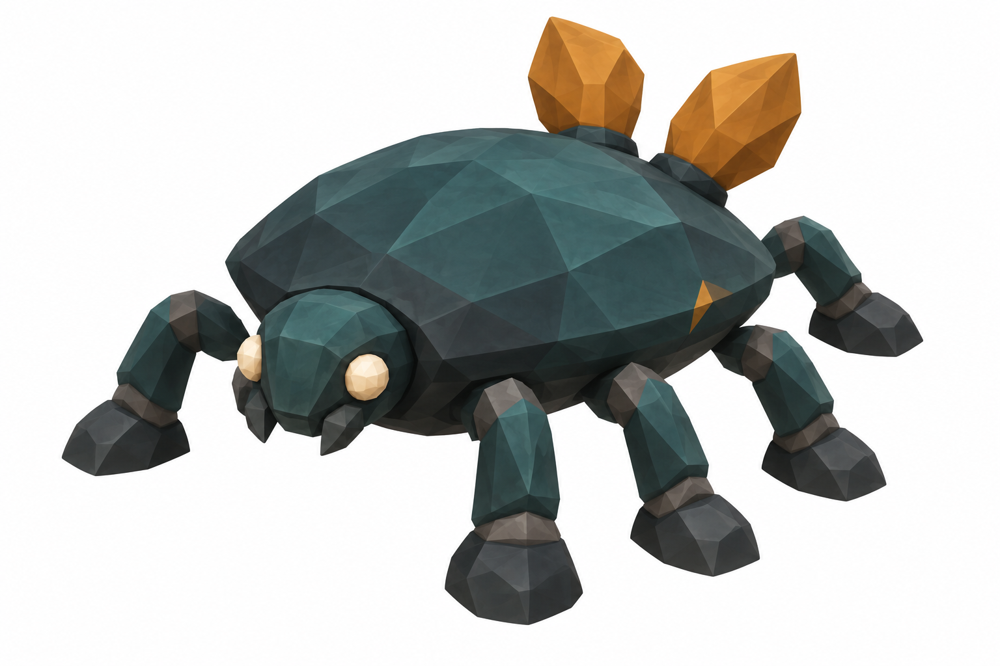

# Trailgloam — held reference candidate

September 14, 2026. **Unshipped. No GLB, rig, motion, encounter or ability was admitted.**

Trailgloam was independently selected from three concepts for an optional nearby-forage cue in Rootbound. The gameplay designer wrote the [species card](../../../docs/species/rootbound-native/TRAILGLOAM_CARD.md); the root agent authored two references using the built-in image tool (backend image model **undisclosed**). A separate reviewer inspected both images.

The first reference had only four unambiguous feet. The second improved the opaque amber frond sockets and removed a competing shell stripe, but still had only five unambiguous feet. Both failed the exact six-leg reference contract. The two-round image method is closed; **TRELLIS and Blender were not run**, so there are no fabricated source-mesh or motion claims. No paid fallback was used.

- [First independent review](../../../docs/species/rootbound-native/independent-reference-review-v1.md)
- [Second independent review](../../../docs/species/rootbound-native/independent-reference-review-v2.md)
- [Gameplay and persistence contract](../../../docs/species/rootbound-native/TRAILGLOAM_CARD.md)

The next useful method is an explicit orthographic anatomy sheet or manually constructed six-leg blockout. Preserve this appealing shell/head direction, but prove the full body plan before another guarded image-to-3D job. Opaque substantial fronds are the provisional mesh-feasibility choice; translucent membranes are deferred.

## Reference prompts and provenance

V1 requested a teal/charcoal matte faceted low saucer beetle, exactly six stout grounded legs, ivory eyes, two short broad opaque folded amber fronds anchored to the rear shell, and a restrained ochre shell stripe. Single subject on pure opaque white, no shadows, environment, text, particles or fine texture; intended body size about 0.7m high and 1.1m long. It was generated as a new image.

V2 edited V1 to expose all six feet, stagger three far-side legs into the gaps, enlarge negative space, replace the bow-like petals with two thick socketed dorsal fronds, remove the diagonal stripe, and keep only a tiny amber seam. The actual output still failed the leg-count check. These are prompt summaries, not proof of generated anatomy. Original image outputs remain in the Codex generated-images directory; repository copies and SHA-256 values are preserved in `reference/provenance.json`.
