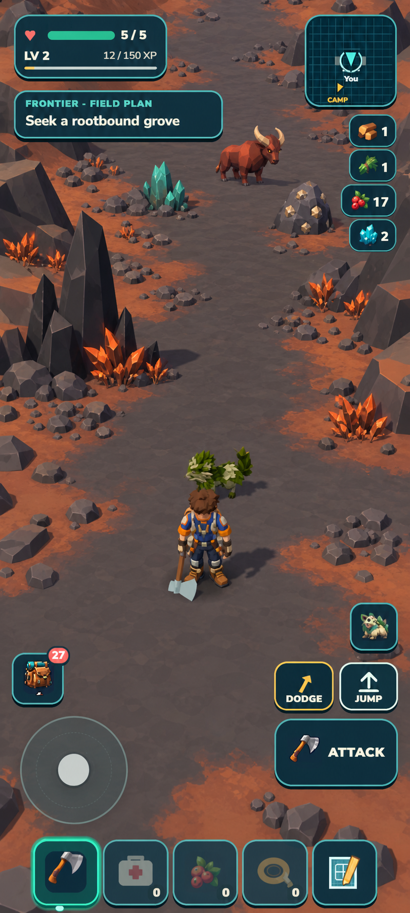

# Emberglass Caldera — locked scene direction

Generated from [the actual portrait baseline](baseline.png), with its [camera and terrain snapshot](baseline.json). The independent [target review](target-review.md) rates the direction **8/10 and suitable to lock with constraints**. This is target quality, not an implementation score.

Lock the charcoal/rust palette, asymmetric near shoulders, clustered volcanic dressing, open central route, separated mineral choices and one readable Emberhorn. Use admitted asset shapes and existing creature anatomy. The generated bull, small HUD differences and fine illustrated texture are not new production requirements. The ordinary follow view principally covers the next 5–20 metres; the full crater and distant rear rim need movement, orbit or an overview. Broad terrain supplies the solid shoulder mass; decorative spires remain visual props.

The [provisional implementation plan](../../reviews/finite-habitats/caldera-contract.md) distinguishes one compact crater outing from the roughly 5.75 km² volcanic habitat. Current production authority and file ownership are in [CURRENT_SLICE](../../../docs/CURRENT_SLICE.md). Allow at most three useful implementation/review passes under the owner's standing direction.

The source image remains in the generated-images directory; this copy preserves its metadata. No Caldera implementation or target-match claim is made at this checkpoint.
