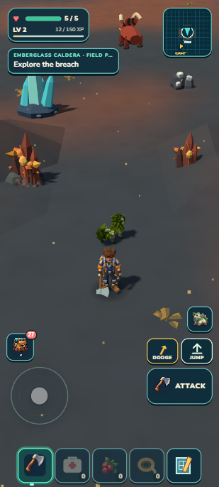

# Portrait exploration view target

September 13, 2026. This target covers camera framing and transient pickup counts only. It does not admit Caldera scenery as finished; its previous R3 art score remains3.8HOLD.

`baseline.png` is the actual e66c718 Caldera fixture at feet(850,-1962), yaw0, portrait412×915, pitch42°, requested9.273m. `native-blockout.png` is the same source, feet and heading at36°/11.591m, with a diagnostic style hiding the resource stack. Existing Pack remains. The generated `target.png` uses that successful blockout as its exact reference, without requesting additional content, lighting or material changes. Moving creatures may differ between screenshots.

The complete staged prop bounds improve from partially clipped/covered to an unobstructed right kit and mostly visible left kit. Both useful minerals and the actual creature can appear ahead. Camp's gate and the familiar grove canopy also fit more completely. Preserve the existing close construction view and landscape profile. Details and proof live in the current slice and eventual view receipt; the generated image is a proposed screenshot, not execution evidence.
