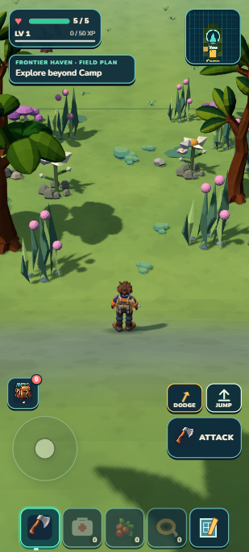
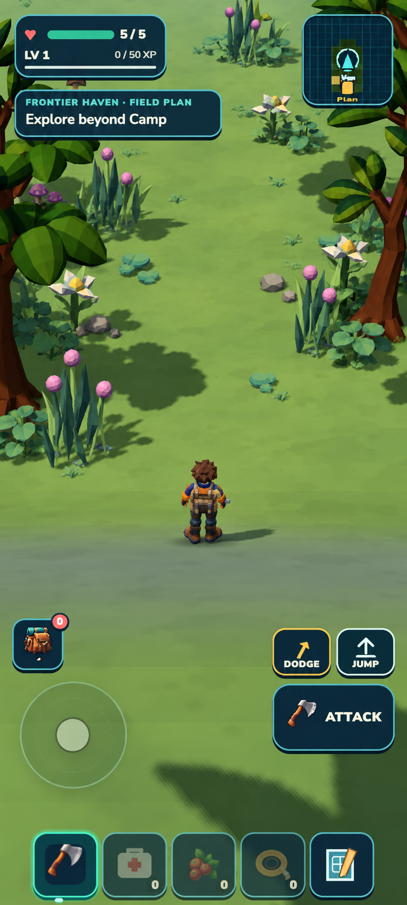

# First Heartwood clearing — locked target

September 13, 2026. This target improves the ordinary northward walk from Camp, before the starter encounters. It covers one clearing, not the whole Heartwood habitat.

  

The baseline and blockout use the default portrait exploration view: 412 × 915 CSS pixels, DPR 1.25, 36° pitch, 11.591 m requested distance, yaw north, player approximately (0, −32.857). The capture is scaled for the review panel. Twenty existing kit records form the candidate: four colliding canopy trees and sixteen nonblocking reeds, lilies, cloudflowers, mushrooms and pebble clusters.

[Independent target fitness: 8.3/10 PASS](fitness.md). Use the generated image for grouping, negative space, depth and canopy framing. Actual UI, avatar, canonical asset geometry, terrain, lighting and camera remain authoritative. Invented foliage, changed model details and generated HUD styling are excluded. This score approves a feasible target; it does not admit the implementation or prove phone performance.

Source ownership and physical acceptance are in [CURRENT_SLICE.md](../../../docs/CURRENT_SLICE.md). The prefix-only Camp composer must preserve existing content and identities, a four-metre trunk-free lane, roughly three metres of readable floor, grounded support and the actual trunk colliders. Native forward/return travel, side contact and an ordinary gathering/Camp payoff remain implementation evidence.

Reference SHA256:

- target.png: `c14222e25d301fbb2e2c92567fb629ec02637b4d6e382231107817f69d7b721dc`
- blockout.png: `922461edb4ac7eff3ff287174d8e2ad0436d6a16267555367b1a085a8437bfc8`
- baseline.png: `627cdf9cac331735fe03abf57f7ea808c8b289628ca1cbf51955546d090cdb90`

The private preview used temporary diagnostic trunk meshes. Production uses the existing authored box descriptors and requires its own collision proof. Initial browser walking sampled roughly 33 ms median frame intervals, with a 103 ms maximum; that is a laptop observation, not an optimized or physical-mobile admission.
