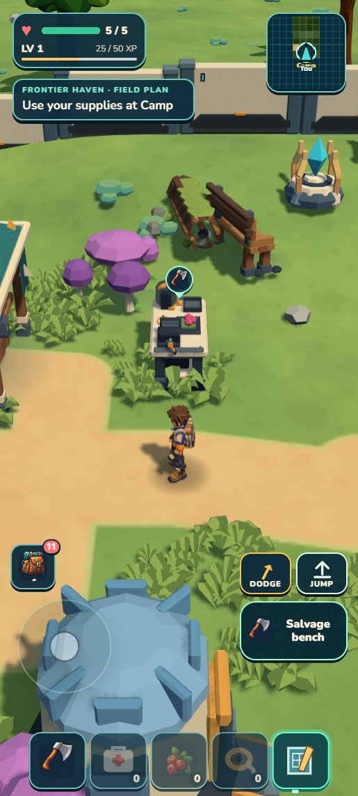

# September 13 — work and workflow review

**The game now has a larger explorable continent and more reasons to leave Camp and return. It is still a development build, not a ready early-alpha release.** Work is stopped at Chris's requested restart/review checkpoint.

[Open the illustrated review](../art/reviews/continent-restart/review.html) · [Full continent](../art/reviews/continent-restart/full-continent.png) · [Habitat allocations](../art/reviews/continent-restart/full-habitats.png) · [Restart handoff](SESSION_HANDOFF_2026-09-13.md).

| What changed today | What it gives the player |
|---|---|
| Irregular 6 × 7 km continent; ten fixed named areas | A shared geography with unequal peninsulas and a gulf, rather than repeating biome tiles |
| Signal Cache, living groves and crystal blooms | Visible destinations, useful rewards and saved depletion/opening |
| Caldera and Fungal Hollow candidates | Different local terrain/scenery, resources and avoidable threats; visual quality remains unfinished |
| Earned Mossling outing, Camp care/garden and return guidance | A connected gather → bond → explore → return loop |
| Builder outing, legal construction placement, bench and ration | A useful building/crafting path without requiring creature capture |
| Mossling utility, Emberhorn mining and Tidefin protection | Companions that help exploration and survival |
| Portrait camera/HUD, pickup feedback, swimming/coast | More usable traversal and screen space |
| Fuller Heartwood clearings/circuit and prepared scenery | More trees and clustered understory, with less synchronous crossing work |
| Full-continent maps and safe character flight | Ways to inspect the current world with the real local scenery and wildlife |

The latest circuit adds seven solid trees and 21 low plants. Actual controls proved trunk contact, four gathered berries and a physical return. Scout separately proved flight, hover, descent, landing, menu input blocking, damage suppression and exact ordinary-save isolation in developer and portable builds. **1,411 tests plus world/campaign/build/validation/ZIP checks pass.** See the [final receipt](../art/reviews/continent-restart/scout-receipt.md) for package identity and limits.

  

The remaining gap is experience and presentation breadth. Ten areas are allocated, but several still use placeholder terrain/content. Roughly 30 species, broad modular genetics/reproduction, physical factory logistics and more extreme natural terrain remain future work. The latest terrain survey peaks near 78 m; it does not yet deliver the extreme mountains and skinny plateau country Chris described. Caldera, Fungal Hollow and the broader Heartwood circuit retain explicit visual holds. Frame hitches and physical-phone performance remain unresolved.

Exploration leads the design. Collectors should find and develop useful Wildkin; builders should make Camp, crafting and later machines support chosen journeys. Routine chores should not crowd out those motivations.

| Workflow review | Proposed adjustment if Chris resumes |
|---|---|
| Strong: real controls, collision and complete-save proof found defects tests missed | Keep one concrete player journey as the acceptance example |
| Strong: disjoint workers helped camera/UI, terrain/scenery and reviews | Assign bounded file ownership; consolidate findings once |
| Weak: small prop/scale passes often left the broad floor sparse | Plan larger visible outcomes, starting with native ground-cover and lighting comparisons |
| Weak: generated targets sometimes redrew unavailable models/materials | Judge target feasibility against an actual game blockout first |
| Weak: long receipt history, repeated captures and resize problems cost time | Keep one short current handoff and one aggregate gate per frozen batch; archive detail |
| Useful: three visual rounds capped diminishing returns | Retain a usable candidate with an honest hold, then address the underlying cause |

No shared/global skill was rewritten. This is a review of the current workflow and a proposal for the next session. The final Scout slice has root source review and native/package proof; an independent subagent review was unavailable because this long thread reached its agent-thread limit. Earlier Heartwood source and visual reviews were independent. No phone-performance or alpha-release claim is made.

**Next action: Chris reviews the build and workflow, restarts the PC, then supplies fresh direction.** Ground-cover/lighting studies and Ironspine are proposals only. Current source remains local on main; earlier GitHub/Drive publications retain their own checkpoint dates.
