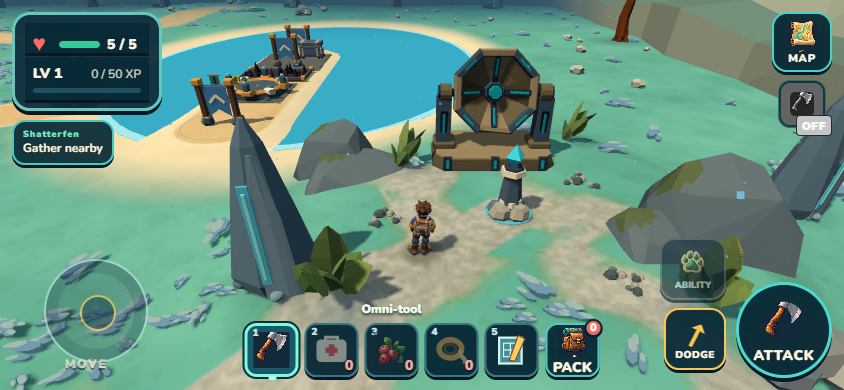
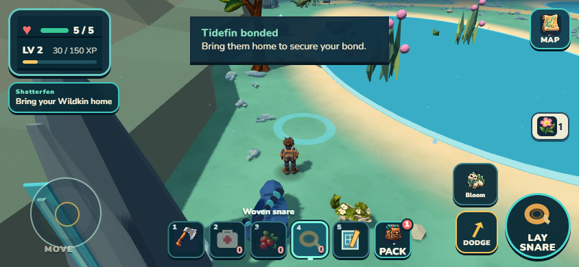
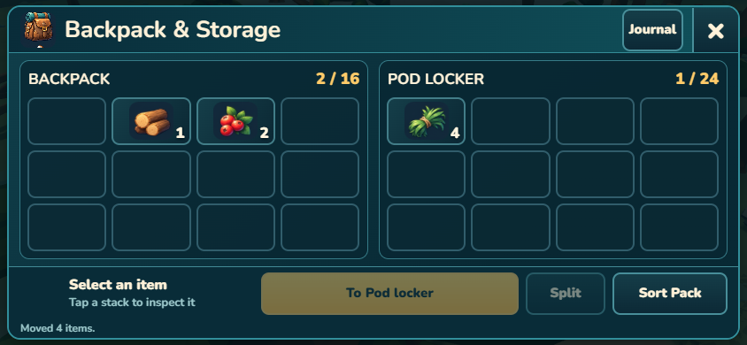

# Wildkin Frontier — overnight play handoff

September 11, 2026. A playable prototype with substantial new art and a stronger expedition loop; world polish, survival progression and exact balance remain unfinished.

The intended rhythm is **gather → prepare → explore → tame → return → store → build**. The crash-landed pod should become a useful home as you recover better equipment and reach larger wrecks. The existing game supports much of the activity loop; the wreck-led story and defended Camp expansion are the next content work.

## Playable changes and foundations

- Camp and five explorable regions, with gathering, combat, repairable passages, discovered return points, optional caches, companion abilities and a Heartwood finale.
- Freely placed Camp foundations, walls, doorways, fences, lamps, beds and crafting stations, with placement checks, rotation, removal and persistent structures.
- Four different field-taming approaches: Mossling lure, Tidefin snare, Emberhorn charge/dodge/tether and Skydancer quiet perches. Sneaking affects detection; nearby Mosslings can briefly startle together.
- A clearer Wildkin Journal, five equipment shortcuts, trail food, extraction guidance and results that give newly secured companions prominence.
- Creature action labels beside the animal, roomy touch controls, scrollable long results, and scenery fading when it hides the Explorer.
- Larger later regions and focused habitat improvements, including Shatterfen's observatory bank. This is not a claim that every empty stretch or world boundary is finished.

This checkpoint is saved locally on main; use `git log -1` for its exact commit. It is not a public release. The game remains available at http://localhost:8080/ and on this Wi-Fi at http://192.168.4.96:8080/. Use a private browser window for a fresh game without clearing an existing save.

## Added: physical inventory and mobile resume

These changes are integrated and included in the validated local package.

- A 16-slot backpack and nearby 24-slot pod/crate storage; drag, tap, split, swap and sort, with a portrait fallback.
- Carried supplies determine equipment counts. Crafting and construction use carried materials and the selected accessible storage source. Full capacity must preserve unclaimed rewards.
- Extraction keeps materials in your backpack and secures XP, companions and mission progress. **Return does not automatically unload storage.**
- Older saves retain their quantities; excess appears as withdraw-only Legacy supplies at the pod.
- Reload resumes the saved expedition, health, carried XP and pending companions. Ordinary world actors rebuild; unfinished paid taming attempts clear. This is not full simulation restoration.
- Provisional death rule: keep backpack contents, lose carried XP and unsecured companions. Exact risk/reward balance still needs your playtest.

The panel passed independent landscape/portrait review. The pod label now anchors below the canopy and opens on the normal approach without an orbit. Pack → Journal restores mobile access to Gear, Work, Skills, Wildkin and Settings.

## Fresh game: seven things to try

1. **Start at Camp and find your way out.** Use Travel at the arch to enter Forest Edge in Verdant. Move with the left control and orbit with the right. The Explorer should remain readable; note any camera obstruction, confusing label or unwanted movement while a menu is open.
2. **Gather a small starter load near the arrival path.** Look for the wood-bearing plant, stone, berry bush and fiber. Select the Omni-tool and use the nearby action. Resources should visibly respond/deplete and quantities should increase; decorative trees should not pretend to be harvestable. Collect at least 4 wood, 2 stone, 2 berries and 1 fiber for the basic building/lure check.
3. **Find Verdant Lookout and return.** Follow the explored route to the Lookout, discover it, then use Extract and return to Camp. Expect a clear return summary. In the new inventory build, your materials should still be carried; a return must not duplicate or erase them.
4. **Open storage beside the landing pod.** In the new build, move a stack into the pod, split it and take some back. Walk away after closing: you should regain movement and lose remote storage access. The locker label should appear over the pod on a normal approach; report any view where it disappears. Do not expect pod supplies to remain usable everywhere in the field.
5. **Make something useful.** Open Pack → Journal → Work → Craft at Camp, make a Berry lure from 2 berries + 1 fiber. In Build, place a Foundation for 4 wood + 2 stone, rotate its preview and walk on it. Later, a Storage crate costs 6 wood + 2 fiber. Invalid placement should explain itself and spend nothing.
6. **Try a Mossling expedition.** Equip the lure, locate a Mossling and use Sneak. Place the lure on clear dry ground, back away while it eats, then approach quietly and Bond when prompted. Avoid rushing its face. The animal, remaining supplies and action label should stay understandable; report repeated impossible placement or a paid attempt that gives no usable opportunity. Extract to secure it, then select it in the Journal.
7. **Try one short interruption, then explore farther.** In the finalized inventory build, reload during an ordinary expedition and check your pack, health and location. Do this before starting another paid tame. Then follow the repaired route toward Shatterfen: inspect its receiver, dry-bank gathering and Tidefin guidance. Report unsafe respawns, missing supplies, blocked resources or unclear return directions.

These are things to try, not a claim of a complete campaign playthrough. This cutover passed a fresh native gather → literal expedition reload → Lookout return. Separate exact-earned-quantity fixtures passed real pod transfer, local-source lure crafting, gear access and offline navigation. Earlier full starter building and earned Tidefin taming journeys preceded the inventory cutover; repeating all of them on your phone remains useful.

## What the art pass actually covers

Admitted in-game families include the blue-jacket Explorer, Mossling, crates, five-rib harvestable sapwood with corresponding depleted stump, standard/tall/spreading alien canopy trees, three crafting-station families, the buried Emberfall forge cache and moving Shatterfen receiver. Shatterfen's bank combines approved low ledges and higher rock shoulders with alien foliage and a broken gravel approach. These families have separate reference, model and gameplay reviews where applicable; some are generated assets and others deliberately authored meshes.

Remaining art includes other Wildkin and enemies, broader resource/scenery families, more varied functional ruins and wreckage, tools/weapons, and consistent terrain/boundary composition throughout all five regions. Existing prototypes keep those systems playable. Large fields and repeated boundary forms still need deliberate destinations and natural massing, rather than blanket detail.

**The replacement Tidefin is not shipped.** Its neutral mesh and limited deformation studies passed their narrow gates. The new full animation still needs action/motion review and runtime cadence integration. A revised Attack/Hurt candidate is preserved for later review; it does not inherit admission from the neutral model.

After the September11 PC restart, the playable checkpoint was pushed to the existing GitHub repository. The unfinished Tidefin and custom asset workflow also have tracked recovery copies; see [RECOVERY.md](RECOVERY.md). This backup changes no playable content.

## Equipment and crafting: present versus next

| Present in the game | Planned or incomplete |
| --- | --- |
| Omni-tool harvesting/attack, construction action, Field Tool Calibration upgrades | Distinct recovered tool tiers, cutter and purposeful ranged weapons; no claim of an implemented weapon tree |
| Berry lure, woven snare, reinforced tether, calming chime | Further species-specific equipment and tuned danger/recovery costs |
| Field medkits and trail rations | Broader survival food/medicine economy only where it improves preparation |
| Salvage bench, matter fabricator, resonance bench; foundations and shelter pieces | Wreck-unlocked blueprints, coherent station unlock pacing and unique recovered parts |
| Wood, stone, fiber, berries, wildflower, iron ore and crystal shards | Refined materials/alloys and wreck salvage with distinct sources and uses; proposed names/recipes are not implemented content |
| Persistent Camp clearing expansion | Cleared adjoining sectors with automatic emergency barricades; current low fences are not that system |
| Existing region gates, ability caches and Core finale | Fallen alien growth, ravine wreckage and cave rubble as unique physical route obstacles; a coherent crash-to-main-wreck narrative |

The smallest next story slice is one useful survey wreck, one backpack upgrade discovery, one visibly cleared obstruction and one newly defended Camp yard. Backpack upgrade capacities exist in planning/configuration; the discoverable upgrade loop is not complete. Exact costs, story names and later rescue presentation remain provisional.

## Three actual views

-  — admitted scene composition, not a generated target.
-  — ordinary earned journey using the current creature, not the unshipped replacement.
-  — final packaged UI using quantities copied from the earned run into an isolated fixture.

Final proof: **810 tests**, world/campaign checks, portable build validation and ZIP pass. Package: **42.53 MB unpacked / 20.25 MB ZIP**. Exact index SHA256: `702810366eb85b83bf89204b5874b9691201e8b905002ec9a78f4f37887237bd`. Packaged pod access/deposit, pack-plus-selected-locker crafting, Gear/Journal navigation and portrait controls pass; already-loaded offline navigation produces no runtime errors or external/failed/offline requests. Sustained phone performance and full campaign pacing remain unmeasured.

Future agents start at [SESSION_START.md](SESSION_START.md) and [CODE_MAP.md](CODE_MAP.md). The [project workflow skill](../.agents/skills/wildkin-development/SKILL.md) and [retrospective](WORKFLOW_RETROSPECTIVE.md) preserve useful methods and failures without rereading the overnight transcript.
