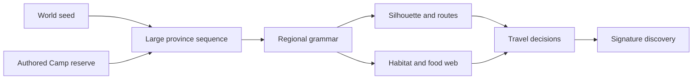

# Regional diversity: places with different rules

Design and implementation plan, September 12, 2026. These are original recommendations shaped by the owner's experience of exploration games; they do not claim research into Hytale or No Man's Sky internals. The local foundation now generates broad weighted foundations for three grammars: lush rolling provinces, pale Sunscar ribs/basins and directional Ironspine ridges. They reuse admitted flora, resources and Mossling/Tidefin/Emberhorn paths within unchanged resident bounds. Their richer food webs, discoveries and traversal identities remain provisional, as do the three other families below. Selected R3 remains5.5/10 HOLD; exact native and validation evidence is in `art/reviews/regional-provinces/receipt.md`.

## Identity before variety

Changing color, scatter density and creature rolls does not create a new place when the horizon, route choices and rewards still feel the same. Randomly mixing more parts can produce a uniform “everything soup” in which no silhouette or ecological relationship is memorable. Each region therefore needs a **grammar**: one dominant landform, a traversal question, a food web, a resource pressure and one discovery visible enough to orient toward. Seeded variation changes the arrangement inside that grammar without erasing it.

Use large core provinces joined by broad ecotones. A player should spend several outings learning a place before its grammar yields to another. Small local pockets can surprise, but they must remain subordinate to the province silhouette. No generator can promise every distant region is forever unique; it can promise stable identities, meaningful variations and controlled repetition.

## Six regional families

| Proposed family | Recognizable silhouette | Traversal and danger | Food web, resources and discovery | Seed knobs and invariants |
|---|---|---|---|---|
| **Skybreak Plateau Fields — first priority** | Clusters of tall, narrow tables with stepped caps, deep green slots and a broken skyline. Target **25–40 m local relief**; the current 16 m terrain cap is implementation tuning, not a locked design limit. | Read landing widths, climb a safe shoulder, choose exposed short jumps or slower slot-valley routes. Falls, territorial cap residents and scarce return paths make preparation matter. | Wet lowlands feed reeds, berries and Tidefin-like defenders; dry caps hold wind grass, minerals and Emberhorn-like rushers. Discovery: a cap observatory that reveals the next safe descent. | Vary cluster spacing, cap height bands, bridge gaps, erosion notches and lowland saturation. Always provide one verified ascent/descent pair, usable landings and a supply route that requires no mandatory blind jump. |
| **Floodglass Lowlands** | A wide reflective basin with reed islands, braided banks and occasional dry hummocks beneath distant high ground. | Bank softness and channels redirect travel; crossings trade speed for exposure. Dangerous water waits for explicit swimming rules, so the first version uses shallow basins and solid stepping shelves. | Fiber, berries, luminous fungi, amphibious spitters and small grazers support larger waders later. Discovery: a half-sunk seed vault reached by reading connected dry islands. | Vary channel graph, island chains, floodplain width and canopy shelter. Channels share endpoints across chunks; every required crossing has stable ground and blue-green color alone never claims physical water. |
| **Sunscar Salt Basin — foundation active** | Active terrain supplies pale long ribs and mauve-tan basins; mesas/fins remain proposed. | Current open relief creates exposed distance; shade, water and authored brittle routes remain later work. | Existing admitted dry stone/mineral/Emberhorn recipes provide a bounded first read. Succulents, burrowers and the singing needle remain proposed. | Seeded directional ribs blend continuously at broad ecotones. Richer landmarks, shelters and refill choices still require a later slice. |
| **Ironspine Mountains — foundation active** | Active terrain supplies a taller directional ridge field up to84m; knife ridges, hanging shelves and authored passes remain later detail. | Current height creates route pressure, but guarded passes, cold exposure and climber ambushes are not implemented. | Existing admitted sparse stone/mineral recipes provide a first highland read. Shelf lichen, predators and storm bell remain proposed. | Seeded ridge direction and broad blending are implemented. Two-way route proof, skyline refinement and weather remain later work. |
| **Hollowbough Archlands** | Giant alien root or stone arches cross a low forest, with suspended knots and framed sightlines. | Arches offer risky high shortcuts while root mazes below create cover, clearable blocks and ambush angles. Overhang tops and undersides require explicit geometry and collision. | Canopy fruit falls to root-floor scavengers; climbers nest above; resin, flexible fiber and spore blooms collect at joints. Discovery: a living bridge node that opens one persistent cleared shortcut. | Vary arch span, branching, socketed ledges and root density. Keep one dominant arch direction, prepared spawn sockets and matching top/underside surfaces; decorative roots never become invisible blockers. |
| **Underveil Cave Instances — future** | A visible mouth leads to a separate dark volume of chambers, shafts, crystal ribs and fungal pools. | Light, retreat distance and one-way drops make entry deliberate. A winding mouth can hide loading; reload must restore the exact cave and overworld return anchor. | Fungal mats feed pale burrowers; mineral blooms and rare research samples justify the trip. Discovery: a deep nursery fossil or dormant gate, not another surface chest. | Derive chamber graph, vertical links and deposits from world seed plus entrance identity. Always preserve a return route, bounded resident budget and separate supported surfaces; heightfield-only placement cannot represent cave floors beneath overworld ground. |

The active third grammar, **lush rolling provinces**, reuses current wet/upland plants, canopy, forage and occasional Tidefin recipes over broad green shoulders. It is implemented as a foundation rather than a claim that the full Floodglass or Hollowbough family exists. Across all three active grammars, each live wildlife set allows at most one additional high-draw regional signature and keeps every established count cap.

The first reusable local-place grammar is a Sunscar crystal bloom. The pure recipe requires at least65% Sunscar weight,95% reserve fade, a supported7m footprint at maximum0.28 slope and a107m starter-scenery buffer. Seeded4×4 macrocell candidates are priority-thinned so any3×3 chunk window contains at most one complete group. Ecology owns one finite persistent crystal at slot200 and, for clefts, an optional separated smaller crystal at201; scenery owns two Fen stones, three cloudflowers and two trail-stone groups as one admitted unit. Ordinary forage uses its final scaled footprint, scenery/grass use the whole reservation, and wildlife uses the full home movement disk. Fan and cleft make repeated places less mechanical, but two compositions do not make every distant bloom unique. Selected R3 scored 8/10; final native/portable evidence is recorded in `art/reviews/regional-blooms/receipt.md`.

## Reusable Wildkin body families

The body family is a production kit for silhouette, locomotion and readable behavior. Regional traits can alter bounded tone, accents, size and ecology after their expression paths exist; they should not imply unbuilt anatomy.

| Body family | Ecological jobs | Regional use | Status |
|---|---|---|---|
| **Low grazer / scamper** | Herd prey, seed carrier, skittish companion | Plateau lowlands, salt scrub, mountain shelves | Mossling is shipped; broader anatomy is proposed |
| **Amphibious spitter** | Bank defender, insect and small-prey hunter | Floodglass channels, damp plateau slots | Tidefin is shipped |
| **Horned rusher** | Territorial browser, mineral-lick guardian | Plateau caps, mesa feet, mountain passes | Emberhorn is shipped |
| **Membrane glider** | Fruit eater, cliff-to-cliff courier, aerial warning | Plateau gaps, arches, mountain saddles | Proposed |
| **Armored burrower** | Root/bulb eater, soil turner, cache defender | Salt basin, cave mouths, dry archlands | Proposed |
| **Hook-limbed climber** | Canopy forager, ledge ambusher, egg guardian | Root arches, mountain shelves, caves | Proposed |

Predator, prey and plant labels guide placement and behavior; they do not require a full autonomous ecosystem simulation. Each resident still fits the bounded runtime population and stable-source save contract.

## Twelve flora and decor building blocks

| Building block | Ecology and placement | Main regions | Status |
|---|---|---|---|
| Berry thicket | Food patch on sheltered, reachable soil | Lowlands, arch floor | Shipped berry asset/path; dense thicket behavior proposed |
| Reed fan | Fiber and cover at wet margins | Floodglass, plateau slots | Shipped visual family |
| Basin lily | Nonblocking wet indicator near shallow water | Floodglass | Shipped visual family |
| Verge canopy | Shade, fruit context and major framing | Lowlands, arch floor | Three shipped canopy forms |
| Mushroom ring | Decomposer cue around damp shade and roots | Lowlands, caves | Shipped visual family |
| Trail stones / fen stone | Dry footing, mineral cue and route punctuation | Lowlands, plateaus | Shipped visual family |
| Wind grass tuft | Exposed cap direction and safe landing edge cue | Plateaus, mountains | Proposed regional treatment using reusable grass geometry |
| Shelf lichen | Grazer food bound to cool rock ledges | Mountains, plateau walls | Proposed |
| Salt succulent | Water-bearing food in sheltered desert pockets | Salt basin | Proposed |
| Crystal bloom | Rare mineral-biotic landmark, sparse by rule | Sunscar foundation now; caves and mountain strata remain proposed | Current checkpoint uses one or two real finite crystals, seven support props and seeded fan/cleft compositions; R3 selected 8/10 |
| Root arch segment | Socketed overhang, climb route and resin source | Archlands | Proposed geometry/collision kit |
| Lantern fungus | Light/readability marker and cave food base | Caves, wet hollows | Proposed |

## Progression without rings or padding

Generate a sparse province graph, then embed it in geography. Camp may border two early grammars; later capability checks open selected passes, cap crossings, clearable roots and cave mouths. Difficulty follows route commitments and preparation, not circular distance bands or universal enemy stat inflation. A hard province can sit near Camp behind an obvious obstacle, while a long safe route can reach farther terrain.

Slow travel earns its time when the player chooses what to carry, which landmark to aim for, whether to spend supplies on a shortcut and when to turn back. It becomes padding when the route repeats without new information. Give a casual mobile outing a recognizable 8–15 minute subgoal—reach a shelf, survey a saddle, clear a root, return with one needed material—while longer expeditions chain those goals. Portrait view needs close silhouettes, high contrast landing edges and visible return landmarks. Pause, offline time and missed days impose no care, crop or weather penalty.

## Historical first three production slices

The sequence below explains how Skybreak was staged before the broader province slice. It is chronology, not the current mandate.

1. **One dramatic plateau fixture.** `src/world/frontierLandform.js` owns a seeded plateau cluster recipe; `frontierTerrain.js` remains the shared height/color sample; `frontierChunkRuntime.js` renders and collides with the same result. Build only enough distant silhouette support to read 25–40 m relief. Use `tools/inspect-frontier.mjs` to compare elevation, slope and access before native portrait route/fall proof. Preserve Camp exactly.
2. **Cap versus lowland habitat contract.** Extend the terrain sample with explicit, continuous surface tags only after the plateau shape is accepted. `frontierTerrain.js` owns the sample; `frontierEcology.js` and `frontierScenery.js` consume it for wet-lowland and exposed-cap recipes. Inspector output must show coherent patches and reachable essentials, rather than a palette-only difference. Keep water semantic until physical water rules ship.
3. **One ecological outing and discovery.** `frontierWildlife.js` assigns shipped Mossling/Tidefin/Emberhorn roles to safe homes; a focused discovery owner reserves the cap observatory before decoration. `frontierScenery.js` respects routes, homes and the discovery apron. Prove Camp → lowland supply choice → ascent → cap encounter → safe descent as one deliberate portrait outing before adding another regional family.

Every slice keeps absolute world sampling, separate seed domains, shared render/physics ground, bounded residents and deterministic chunk-order independence. The inspector's current default window—elevation −0.28 to 9.538 m, wetland mean 0.689 and slope p95 0.164—provides a baseline, not a target. Admit the plateau only when its map, skyline and playable route all express the same regional grammar.
