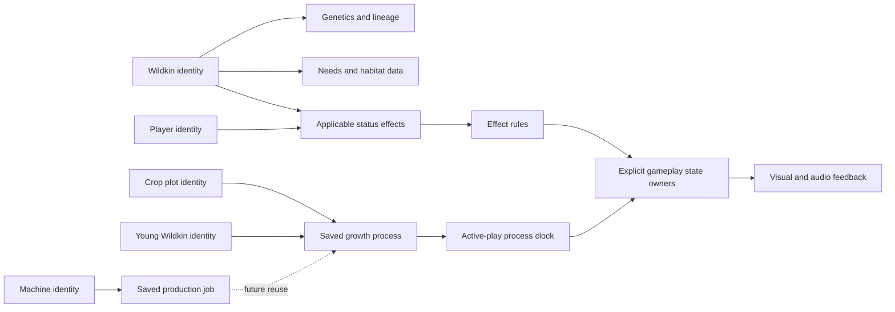

# Composable life and Camp systems

September 12, 2026. Provisional implementation choices responding to Chris's interest in modular entities, buffs, crops and machines. Current code remains vanilla JavaScript with explicit owners and one loop. No ECS dependency or framework migration is adopted.

The diagram mixes current and proposed capabilities. `Active-play process clock` is implemented for crop and young growth; machine jobs, generalized needs and effect records remain proposals. Components are small records/capabilities attached by stable identity. Focused systems apply their rules. Runtime Three.js meshes and Rapier bodies remain separately owned resources. Avoid subclass combinations for every species, trait, crop and machine variant.

| Area | Current implementation | Next useful boundary |
| --- | --- | --- |
| Player bonuses | Upgrade/skill catalog data; progress derives modifiers, applied on relevant actions or purchases | Keep permanent progression separate from temporary effects |
| Combat effects | Player combat owns hit/dodge invulnerability and knockback; companions own ability cooldown; creatures own local recovery | Bounded effect records with explicit stacking, duration, source and removal rules when a real gameplay slice needs them |
| Crops | One saved plot/growth record; physical garden adapter; 90 seconds active play through the shared clock in 5-second save quanta | Keep crop rules and transactions in their existing owners |
| Breeding | Fixed child identity/genome/lineage plus 120-second active-play growth through the shared clock; atomic start/welcome | Keep offspring rules separate from reusable timing |
| Care | One event-driven bed/individual/nourishment record; atomic berry feeding | Later per-individual needs/habitat records, with explicit limits and policies |
| Crafting | Immediate inventory transaction; 2.2-second station motion is cosmetic | A future durable production job must own input reservation, completion and output capacity before using a shared clock |

`frontierProgress` remains the save/transaction authority. `campGardenState` and `campBreedingState` validate domain data; `campGarden` and `campBreedingGrowth` now reuse `src/game/savedProcessClock.js`, a rendering-free accumulator with injected process readers and advance callbacks. Both preserve active-play-only progress, five-second quanta, pause/Author/background suppression and bounded unsaved time. The helper owns no durable state, adds no schema, ECS or offline catch-up, and gives presentation no authority to grant items. This consolidation has no claimed measured speedup.

For later buffs, separate base values from derived values so expiring a buff never permanently edits health capacity, speed or yield. Define refresh/replace/stack limits per effect; remove effects through their explicit owner on death, unloading or expiry as that effect requires. Visual particles/icons read the resulting state. Persistent versus outing-only effects is a product decision for the implementing slice, not an assumption that every timer belongs in a save.

Performance policy: movement/collision use the existing fixed step; slow processes should use bounded lower-frequency work; unloaded simulation should retain small records, with catch-up only under an explicit simulation-time rule. No missed-day care penalty or offline growth is introduced by this plan. Current crops and young advance during active play, including outings, and stop while paused, hidden, offline or in Author.

Measure frame time, allocations, draw calls, physics and active population separately before changing storage architecture. An ECS can help organize/query many component combinations, but adopting one does not by itself establish a faster game. Existing bounded residency, cheap scenery and limited AI remain essential regardless of architecture. JavaScript supports composition with ordinary object records; see [MDN's object guide](https://developer.mozilla.org/en-US/docs/Web/JavaScript/Guide/Working_with_objects). [bitECS](https://github.com/NateTheGreatt/bitECS) is an example of a JavaScript/TypeScript ECS available for later evaluation; it is not installed or selected here.
