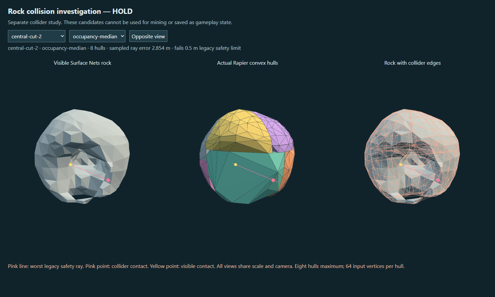
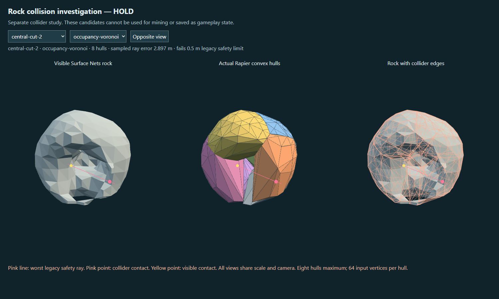
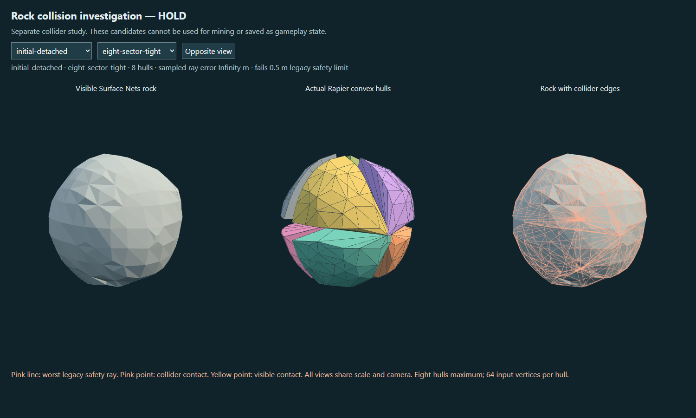

# Phase 0.5A.2 — collision investigation

**Collision gate: HOLD. Rock impact/stress/fracture experiment: HOLD, not implemented.** The owner requested safe colliders before new mining behavior and explicitly required stopping if the named fixtures remained unsafe within eight hulls per actor. Three bounded occupancy-based alternatives still fail the second central cut by approximately 2.85–2.90 m under the existing 0.5 m visible-surface limit. No alternative was installed in the mining runtime. This is a negative Stage 1 result, not completion of Stages 2–6 and not proof that every possible eight-hull method must fail.

The separate [collision inspector](../lab/voxel/rock-collision-study.html) and reproducible probe preserve the experiments. Prior lab pages, save schemas, shipping source, Surface Nets, 16³ chunks, 0.5 m samples, provisional 1.5 m fracture cells, actor/shard budgets and publication gate remain unchanged. The owner's current message explicitly authorizes committing and pushing this checkpoint. The unrelated `authoring/` and older untracked portable evidence remain untouched.

## Contract and scope

The desired player outcome was small chips, persistent weakening and occasional substantial, recursively destructible splits through native Mine controls. Its collision prerequisite failed. The delivered developer outcome is a reproducible comparison of visible rock, actual Rapier hulls and their mismatch, without installing unsafe products. Root owns the study, fixtures, tests, evidence and integration. The existing matter state/coordinator, physics and persistence remain the sole runtime authorities; the inspector has no save or edit path.

The required success chain remains Mine → authoritative proposal → ownership and collision validation → durable save → paired mesh/collider publication. Existing rejection behavior was exercised again through source and extracted-package browser runs: unsafe cut → HOLD → unchanged parent/reward state → literal reload. No damage state, stress propagation, joint planes, fracture impulses or damage overlay was added over unsafe collision. Trees, dirt and production terrain remain outside scope.

## Reproduction and competing methods

The baseline is commit `6285a0a`. Twelve fixture states use seed 9212026 and the existing authoritative pure edit functions, including both separately extracted conditioned children. This fixture construction intentionally bypasses publication so that rejected candidate geometry can be inspected; it is not a claim those later cuts are playable.

- **2.8555066 m discrepancy:** world side bite, two neck cuts, actor side bite, then central hits `[0,4,0]` and `[0,4,-0.5]`. The second central hit gives visible distance 6.0347823 m versus collider distance 3.1792758 m on the recorded ray. It reproduces exactly without relying on a fallen actor's incidental pose.
- **Conditioned child:** the existing eight-central-hit sequence produces two retained children. The first reproduces the four-sector error at **2.4517535 m**; the sibling is checked separately. Quantity/mask geometry comes from the existing extraction path.
- **Initial actor regression:** `initial-detached` means the boulder after two neck cuts, the same initial actor used by the older physics test. It is not the supported world mesh. Tight eight-sector reconstruction leaves missing ray support and a 0.8350 m first-child error. The earlier experimental eight-sector source/configuration was not retained, so this is a disclosed reconstruction of its initial/child failure modes, not an exact replay of the historical rounded 0.81 m result.

The old four-sector method groups surface points in overlapping X/Z sectors and unconditionally adds the local center of mass to every hull. This can place collider vertices in empty rock and connect across a recess. Eight-sector controls divide X/Y/Z with either 0.10 or 0.35 m overlap and retain the old COM vertex deliberately. Tight controls develop holes; wide controls recover coverage while bridging concavities.

All three new candidates instead use the occupied quarter-metre parcel probes already derived from the scalar field. Visible triangles are clipped to each resulting region before building its hull, with no added COM vertex:

| Candidate | Partition rule | Limitation observed |
| --- | --- | --- |
| Occupancy median | Greedy axis splits balancing occupied volume and extent; up to eight leaves | Deep recess survives inside a region; boundary/tangent support errors also remain |
| Occupancy gap | Axis splits prefer sparse cross-sections, with a 20% balance floor | Better on some children; cannot consistently isolate the deep recess within eight regions |
| Occupancy Voronoi | Deterministic farthest-point seeds from occupancy, six bounded centroid iterations, clipped bisectors | Reduces some excess-solid regions, but still closes the central mouth |

Every generated hull uses at most 64 input vertices through the existing deterministic point limiter. All candidates stay within eight hulls. There is no new dependency, unrestricted dynamic triangle mesh or increased physics limit. A static exact-triangle collider is used only as the diagnostic capsule-contact oracle.

## Measured errors

[Full machine-readable results](evidence/voxel-phase05a2/collision-study.json) retain every state/method, signed early/late contact error, ray counts, both player capsule profiles, rotated/rebased audits, floor observations, timing and memory samples. There are six methods × twelve states. The larger sweep uses six axial directions at 0.25 m intervals over each actual mesh bound; the existing lateral admission rays remain separately reported.

| Method | Worst legacy ray error | Worst expanded comparable-ray error | False-solid / missing-support rays, summed | Worst lab / shipping capsule error |
| --- | ---: | ---: | ---: | ---: |
| Four-sector baseline | 2.856 m | 3.619 m | 727 / 94 | 2.368 / 2.019 m |
| Eight-sector, tight | Missing hit | 3.166 m | 647 / 434 | 2.370 / 1.972 m |
| Eight-sector, wide | 2.895 m | 3.619 m | 742 / 12 | 2.370 / 2.014 m |
| Occupancy median | 2.854 m | 3.946 m | 644 / 26 | 2.371 / 1.961 m |
| Occupancy gap | 2.894 m | 3.946 m | 496 / 24 | 2.370 / 1.969 m |
| Occupancy Voronoi | 2.897 m | 2.927 m | 326 / 16 | 2.370 / 1.889 m |

These ray distances measure travel along a ray, not nearest-surface/Hausdorff distance. A small obstruction at a narrow opening can produce a large travel discrepancy. Unmatched rays include grazing cases and are conservative missing/excess-surface diagnostics, not separately measured penetration depths. They are not ignored or counted as passes. Every new candidate already fails the unchanged legacy gate on the named central cut, independently of those additional diagnostics.

The old initial actor passes its narrow legacy sample but has excess-solid and missing-support rays in the broader sweep. It therefore remains an unadmitted baseline; this report does not certify old runtime collision. The safety gate was preserved, not broadened and silently called sufficient.

Capsule casts use the actual Phase 0 lab dimensions (half-height 0.5 m, radius 0.3 m) and separately the shipping player dimensions (0.2 / 0.32 m). They run against real Rapier compounds and static visible-mesh oracles. A Rapier character-controller sweep with a 0.02 m offset also checks the worst path for each profile, with sliding disabled to expose the blocking distance. For the named cut, the median candidate lets the lab controller travel about **3.117 m** while the visible-mesh oracle allows **4.496 m**. These are controlled collision probes, not a native walking journey in the orbit-camera rock lab.

Rotating the actor by a fixed non-axis-aligned quaternion, translating it and shifting the origin by `[256,128,-256]` preserves the legacy errors within 0.000014 m on the finite comparable results. Separate four-second Rapier drops observe visible minimum floor heights between roughly -0.102 and +0.000020 m and speeds up to 0.567 m/s; these observations do **not** establish a settled/support PASS. The [paired child drop](evidence/voxel-phase05a2/paired-children.json) checks both children simultaneously, initial cross-child proxy overlap and independent poses, within two persistent bodies. Existing thin remnants and notch states are included; no new arbitrary-geometry admission claim is made.

## Visual evidence and review

Each middle-panel color is one actual Rapier-generated convex hull; the orange overlay shows their combined edges. Screenshots use the same scale and camera. They are real renders, not targets or generated illustrations.

The independent reviewer inspected source, deterministic/budget behavior, and these views plus the median child view. The reviewer supports HOLD: both occupancy approaches visibly bridge the deep mouth, tight sectors leave gaps, and a child passing one legacy sample must not be presented as global success. The review is collision-study evidence, not art or owner acceptance. Its consolidated caveats are included above: actual capsule sizes, reconstructed historical trial, signed and missing-hit results, weak initial baseline, and unadmitted floor observations.

## Reproduction and remaining gate

Run `node tools/probe-rock-collision.mjs` for the bounded numerical study and `node --test tests/voxelRockCollisionStudy.test.js` for the named regressions and determinism/budget checks. Start `node tools/serve.mjs --port 8097` and open `/lab/voxel/rock-collision-study.html`. Select **central-cut-2** and **occupancy-median**: the visible rock has an open mouth while the colored collider covers it. Select **initial-detached** and **eight-sector-tight**: the separated wedges and missing-hit warning are the failure. **Opposite view** shows the same geometry from behind. A candidate that looks closer on one child is not admitted if another fixture still fails.

For the preserved mining behavior, open `/lab/voxel/cellular-rock.html` with a fresh save. Use **Mine** on the front surface, remove the narrow pedestal's sides, press **F** to follow the fallen rock, and mine its rotated surface. Safe edits still chip the rock. If a cut reports **HOLD**, the previous actor, quantities and visible products must remain. **Save & reload** must preserve that state. Disappearing rock on a rejected cut, changed rewards, phantom rewards on reload or mining at the old source position are failure signs. Long fixed cut sequences in the regression harness are disclosed diagnostic hits; the on-screen Mine action is checked separately.

Stages 2–6 are not attempted beyond existing-runtime regression and packaging checks: no impact-damage model, seeded weakness-plane experiment, new split event, native substantial-fracture proof, damage persistence, damage overlay, multi-seed/worker-count impact study or complete-edit performance claim exists. The next bounded step requires owner review of this collider HOLD and a materially different collision strategy; do not automatically extend these candidates or start stress gameplay. The separate real-phone Phase 0 HOLD remains.

## Collider costs and validation

The final standalone Node probe ran after the browser capture and aggregate test had completed. Each distribution contains twelve fixture states, including repeated unchanged shapes in the fixed hit sequence; these are not twelve independent seeds or repeated steady-state benchmarks. Preparation below includes planning, actual hull creation and one zero-gravity Rapier step, but excludes the exhaustive diagnostic audit, floor simulation and character probes.

| Method | Planning median / maximum | Preparation median / maximum |
| --- | ---: | ---: |
| Four-sector baseline | 13.56 / 19.52 ms | 14.43 / 83.33 ms |
| Eight-sector, tight | 5.38 / 7.02 ms | 6.90 / 8.22 ms |
| Eight-sector, wide | 9.74 / 27.47 ms | 12.15 / 29.25 ms |
| Occupancy median | 69.34 / 108.91 ms | 71.22 / 111.38 ms |
| Occupancy gap | 62.05 / 93.91 ms | 63.85 / 96.40 ms |
| Occupancy Voronoi | 79.94 / 135.82 ms | 81.33 / 138.37 ms |

The machine-readable min/median/p95/max summaries are retained; at this small sample count the measured p95 equals the maximum. Maximum hull input buffers are 3,072 bytes for four-sector, 4,992 for tight eight-sector and 6,144 for the remaining methods. Sampled process peaks reach 102,446,744 heap bytes and 204,767,232 resident bytes. These include the whole Node/Three/Rapier study and retained diagnostic results, and are neither per-actor memory nor a continuously sampled peak. No damage-propagation, new mesh-generation or complete stress-edit latency exists to measure because Stage 2 did not begin.

All six paired-child trials report two independently simulated bodies, zero initial overlapping hull pairs deeper than 0.001 m, distinct final poses and zero final linear speed. That bounded pair result does not repair the failed surface/contact gate or generalize to other geometry. The single-body spinning drops, reported separately above, had nonzero end speeds.

Focused regressions pass, and `npm test` passes **1,523 tests**. Source and extracted-ZIP [mining/HOLD/reload](evidence/voxel-phase05a2/source-hold/hold-proof.json) [browser receipts](evidence/voxel-phase05a2/portable-hold/hold-proof.json) pass with no page errors or external runtime requests. The [source inspector](evidence/voxel-phase05a2/views/receipt.json) and [portable inspector](evidence/voxel-phase05a2/portable-views/receipt.json) each capture seven matched views, opposite view and an 844×390 landscape viewport without horizontal overflow. This is desktop emulation, not phone performance evidence. The lab ZIP is **1,649,296 bytes**, **4,948,591 bytes** unpacked. Its entry point and older lab pages remain intact.

`npm run verify` also passes all **1,523 tests**, world/campaign consistency, shipping build and submission validation (**63.12 MB** unpacked). `npm run zip` passes (**24.79 MB** shipping ZIP). [Source/portable SHA-256 comparisons](evidence/voxel-phase05a2/portable-hashes.json) match all three inspector files and the preserved collider, physics and mining composition modules. Shipping `src/`, vendors, dependencies and existing runtime owners have no changes.
