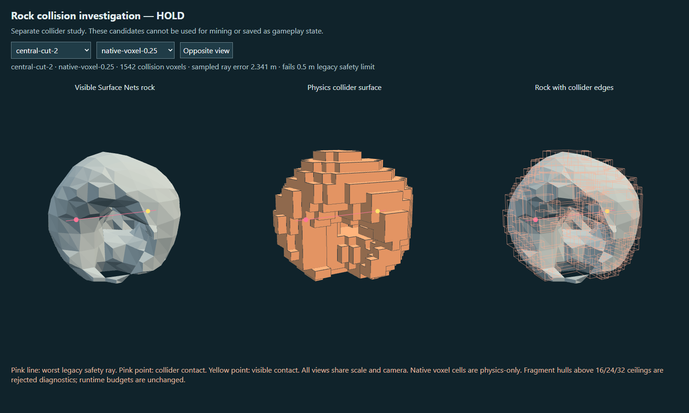

# Phase 0.5A.3 — native voxel collision experiment

**HOLD. No collision representation is adopted. Stop for owner review.** Starting point: pushed `main` at `ef900a9`. The native voxel API exists in the exact vendored Rapier 0.20.0 runtime, but both tested resolutions fail the existing surface/player gates and fall through the lab's static Surface Nets terrain/trimesh. A single fallback based on connected fracture fragments also fails. No stress/fracture gameplay, shipping migration, new material, mesher/resolution change, dependency, or increased persistent-body budget is included.

## Contract and exact runtime API

The developer outcome is an inspectable, repeatable collision comparison. The player-visible rock remains **Surface Nets, 16³ chunks, 0.5 m scalar spacing, 1.5 m fracture cells**. Collider voxels appear only in the separate physics panel/overlay. They never become the visible rock or a new matter owner. The existing mine UI, state, reward, ownership, persistence and actor publication owners are unchanged.

[Runtime receipt](evidence/voxel-phase05a3/runtime-api.json) records the vendor SHA-256, `R.version() === '0.20.0'`, the actual exported functions, and negative/positive address ray witnesses. The callable signature is `ColliderDesc.voxels(Int32Array coordinates, {x, y, z} voxelSize)`. Sizes are full extents: address zero occupies `[0, size]`, not a cube centered on zero. The runtime also exposes `setVoxel`, `propagateVoxelChange`, and `combineVoxelStates`; their existence is not a claim of a proven incremental edit contract. No online documentation or newer dependency is substituted for this runtime.

At **0.25 m**, each occupied `parcelBits` subparcel becomes one native voxel at its exact lattice address, translated by the sample's local minimum. Tests compare every resulting center to the authoritative occupied probes. At **0.5 m**, a cell is solid if any of its eight subparcels is occupied. This is a disclosed conservative, cheaper control; it does not merge material quantities or change ownership.

## Exact fixture and gameplay collision comparison

The study reuses `collisionStudyFixtures()` unchanged from Phase 0.5A.2: initial detached rock, bitten detached rock, secondary notch, seven central-cut captures, and both separately extracted conditioned children. The pure fixture generator intentionally reaches later rejected states outside publication. These are diagnostic shapes, not newly playable edits.

[Complete 24-row native study](evidence/voxel-phase05a3/collision-study.json) includes the old lateral gate, six-direction expanded 0.25 m surface probes, Phase 0 capsule (half-height/radius 0.5/0.3 m), shipping capsule (0.2/0.32 m), actual Rapier character controller, arbitrary actor rotation and `[256,128,-256]` rebase, floor observations, planning/preparation timings and memory samples. Each capsule's worst path is checked both with the original long controller sweep and with **100 actual kinematic translation + physics-step movements** of 0.1 m. Sliding is disabled for these controlled straight-path comparisons. This is collision evidence, not an earned walking journey in the orbit-camera lab.

| Test, across the fixed fixture sequence | 0.25 m native voxels | 0.5 m control |
| --- | ---: | ---: |
| Original named recess ray error, formerly 2.855507 m | 0.784782 m | 1.034782 m |
| Worst legacy ray in that same central-cut-2 fixture | 2.341409 m | 2.841409 m |
| Worst expanded comparable-ray error | 3.610623 m | 3.860623 m |
| Expanded excess-solid / missing-support rays, summed | 1,134 / 444 | 3,130 / 48 |
| Worst Phase 0 capsule error | 2.961376 m | 3.345528 m |
| Worst shipping capsule error | 3.160609 m | 3.537217 m |
| All fixtures satisfy the unchanged gates | **No** | **No** |

The exact old recess witness is preserved separately: start `[0,3.5,-5]`, direction `[0,0,1]`, visible distance **6.034782 m**. Native contact occurs at **5.25 / 5.0 m**. It improves substantially over the old convex bridge but still exceeds the 0.5 m gate. A different ray through the same cut exposes the larger 2.341/2.841 m errors; these must not be mistaken for measurements on the original ray.

On the central cut's worst Phase 0 capsule path, actual stepped controller travel is **3.050 / 2.700 m**, versus **4.496 m** against the static visible-mesh oracle. Shipping-profile travel is **3.025 / 2.660 m**, versus **4.619 m**. The 0.25 m initial rock passes only the narrow legacy ray set. Later states and the expanded tests still fail, including missing legacy support on the first child. Infinite gaps are serialized explicitly as `Infinity`, never counted as zero or a pass.

Ray travel error is not Hausdorff distance: a small occupied step across a narrow mouth can cause a long missed traversal. Unmatched grazing rays remain conservative diagnostics. The native result fails even the original gate, independently of those stricter diagnostics.

## Dynamic terrain compatibility, lifecycle and body limits

[Dynamics receipt](evidence/voxel-phase05a3/dynamics.json) uses the actual `LabPhysics.prepare/commit` static trimesh path and the actual Surface Nets mesher, with a controlled flat 16³/0.5 m scalar terrain chunk. This is the lab's real collider representation and publication path, with a reproducible flat scalar fixture instead of incidental procedural terrain. No cuboid is placed under the terrain case to hide a failed pair.

Both native resolutions fall through that trimesh after 240 steps, with **zero contact manifolds** and the lowest visible rock point near **−89 m**. An existing four-hull control rests on the **same** mesh at visible height **0.4666 m** over its 0.5 m surface. A −60 m/s native CCD drop also passes through the terrain. The same failure is reproduced in source and extracted-package browser runs. This is a version-specific installed-runtime **HOLD**, not a universal claim about every Rapier release or every voxel contact pair.

Separate cuboid-floor controls do work: both native resolutions contact, settle, sleep naturally, and wake on impulse. Rotated drops and floating-origin rebases retain floor support; global pose differences at the rebase are below 0.00002 m. The CCD cuboid drop contacts the floor and settles after 240 steps, but its early 30-step sample still has penetration/motion; neither is used to excuse terrain failure. At rest the initial quarter-metre collider leaves the visible rock approximately 0.078 m below the floor; the half-metre control leaves it about 0.172 m above it.

Both conditioned children are tested at their shared parent pose and then in a separate controlled approach: the actual siblings start separated along their centers-of-mass axis and move toward each other at 3 m/s with CCD. Contacts occur, poses remain finite, and maximum recorded child-child penetration is approximately **0.008 / 0.045 m**. The coarser collision control can overlap child collision cells even though authoritative material ownership remains disjoint. Direct `contactCollider()` null results are not interpreted as absence of native-composite contact; simulation manifold evidence is used instead.

Fresh control worlds hold exactly **1, 2 or 4 persistent dynamic rocks**. All settle on the cuboid control; the table measures 180 steps spanning their drop/contact/sleep transition, not a steady active-contact benchmark. Lab player/floor overhead is included. No runtime budget is raised.

| Collision spacing | Rocks | Step median / p95 / max, ms | Voxel input bytes | Whole-world Rapier snapshot bytes |
| --- | ---: | ---: | ---: | ---: |
| 0.25 m | 1 | 0.0108 / 0.0969 / 0.3039 | 23,508 | 20,482 |
| 0.25 m | 2 | 0.0119 / 0.0967 / 0.7491 | 47,016 | 38,464 |
| 0.25 m | 4 | 0.0159 / 0.1685 / 1.0587 | 94,032 | 74,466 |
| 0.5 m | 1 | 0.0081 / 0.0506 / 0.1315 | 3,840 | 12,253 |
| 0.5 m | 2 | 0.0091 / 0.0800 / 0.1989 | 7,680 | 21,989 |
| 0.5 m | 4 | 0.0120 / 0.1321 / 0.3761 | 15,360 | 41,533 |

These local desktop Node measurements are observations, not PC/phone frame-budget certification. Serialized snapshots are not live WASM memory. Process heap/RSS samples in the receipts include Three, Rapier, fixtures, diagnostics and allocation/GC history; they are not per-rock memory or continuously sampled peaks. The failed terrain's cheap free-fall steps are not offered as successful performance evidence.

## Rebuild, publication and ownership

The initial rock has 1,959 quarter-metre voxels, versus 320 coarse control cells. Its isolated native allocation measured **4.36 / 0.41 ms** in the lifecycle run, excluding occupancy planning. A changed secondary-notch product can be prepared and discarded while retaining the old body: **6.31 / 2.37 ms**, including occupancy planning. The 12-state study separately retains planning and total preparation distributions (including initial WASM/cold-start variation); exhaustive surface/capsule/controller audits and gameplay mesh/save work are excluded from those construction timings.

**Transactional rebuilding is a simple, measured staging mechanism at this bounded scale, but is not an adequate usable collider solution while geometry and terrain contacts fail.** No candidate is published. Incremental `setVoxel` editing would add live mutation/rollback complexity without repairing either blocker, so it was not investigated beyond verifying the exposed API.

The exact existing contract remains proposal → owned preparation → validation → save → paired product publication. The new real-Rapier rejection regression starts with the working old actor, prepares the failed native central-cut candidate, rejects it before save, and verifies unchanged actor identity, enabled old body, state, material ledger, rewards, product publication count and body count. Existing save/worker/shard failure, stale revision and ownership tests remain applicable. Source and extracted-ZIP native Mine, diagnostic rejected-edit, and literal reload checks verify the preserved runtime. No unsafe later fixture is installed to manufacture a playable success.

## Sole fallback: actual fracture-fragment hulls

[Fallback results](evidence/voxel-phase05a3/fragment-study.json) use connected fragments returned by the existing fracture/connectivity graph, with their real fragment identities and occupied cells. Visible triangles are clipped to those cells; occupied interior probes close fragments without exterior faces. Each fragment gets a deterministic, at-most-64-input-vertex hull. There is no new eight-hull algorithm and no arbitrary spatial-sector partition.

The full rocks have **41–50** fragments; conditioned children have **23 / 19**. Even their raw compounds fail the complete gameplay gates. For example, the central-cut-2 raw fragment compound has a **1.947 m** legacy error. The deterministic smallest adjacent-fragment merge is proposed, fully audited and rejected when it fails; no failing merge is accepted just to reach a target count.

| Requested ceiling | Measured result |
| --- | --- |
| 16 hulls | All fixtures remain over ceiling; tested safe-merge route stops on a failing proposal. HOLD. |
| 24 hulls | Both raw children fit but fail collision gates; full rocks remain over ceiling. HOLD. |
| 32 hulls | Both raw children fit but fail collision gates; full rocks remain over ceiling. HOLD. |

These are **ceiling feasibility comparisons**, not three successfully produced exact-count decompositions. Over-ceiling raw compounds are inspector/measurement diagnostics only. This is one bounded fallback and one deterministic merge ordering, not proof that every possible fragment merge or decomposition is impossible. No fallback is adopted and no additional method is attempted.

## Future policy — documented, not implemented

Normal mining should produce small chips. Structural stress should accumulate separately. When a dynamic rock becomes structurally weak or excessively concave, a fracture event may split it into simpler, recursively destructible bodies, instead of preserving arbitrarily complex concavity indefinitely. This is the owner's intended future policy, not authorization here to add stress, impact damage, weakness state, fracture triggers, impulses, new rewards, or new persistent bodies. Those mechanics remain absent from this experiment.

## Reproduction, review and closure

Run `node tools/probe-rock-voxel.mjs`, `node tools/probe-rock-voxel-dynamics.mjs`, and `node tools/probe-rock-fragments.mjs`. Focused regression: `node --test tests/voxelRockVoxelCollider.test.js`. The inspector remains `/lab/voxel/rock-collision-study.html`.

For owner inspection, select **central-cut-2 → native-voxel-0.25**. The left rock should remain smooth; the middle physics surface is stepped, and pink/yellow contacts separate across the open mouth. Switch to **native-voxel-0.5** to see the cheaper control. Select **fracture-fragments** to inspect the rejected raw fallback; its displayed hull count is not an admitted budget. **Opposite view** exposes the reverse side. Any passing legacy label on another shape must still say the full study is HOLD.

For preserved gameplay, open `/lab/voxel/cellular-rock.html`, use **Mine** on the rock, remove the pedestal's sides, follow the fallen rock with **F**, and mine its rotated surface. A rejected cut must show HOLD while the old rock and rewards remain. **Save & reload** must restore them. Disappearing matter, changed quantities on rejection, or duplicate rewards after reload are failure signs. Fixed diagnostic hits in the regression are disclosed fixture setup; on-screen Mine actions are tested separately.

Independent source/evidence review supports HOLD and confirms correct API/occupancy mapping, unchanged ownership and safe rejection. It also limits the fallback conclusion to the single tested merge ordering. Source and extracted-package inspectors capture seven matched views, reverse view and an 844×390 landscape layout. Both repeat the native terrain failure and successful cuboid/hull controls with no page errors or external runtime requests. This is desktop browser emulation, not real-phone evidence. The earlier phone HOLD remains separate.

**Validation:** focused native API/occupancy/deep-recess/real-candidate rollback tests pass 4/4. `npm test` and `npm run verify` each pass all **1,527 tests**; verify also passes world/campaign consistency, shipping build and submission validation (**63.12 MB** unpacked). `npm run zip` passes: **25,990,325 bytes** shipping ZIP. The isolated lab ZIP is **1,655,006 bytes**, **4,961,833 bytes** unpacked. [Source/portable hashes](evidence/voxel-phase05a3/portable-hashes.json) match every checked changed module and the preserved matter/physics/publication owners. Both source and portable inspectors additionally select all 12 fixtures at both native resolutions (24 actual inspector draws each). [Source inspector/terrain proof](evidence/voxel-phase05a3/views/receipt.json), [portable inspector/terrain proof](evidence/voxel-phase05a3/portable-views/receipt.json), [source mining/reload](evidence/voxel-phase05a3/source-hold/hold-proof.json), and [portable mining/reload](evidence/voxel-phase05a3/portable-hold/hold-proof.json) retain the browser evidence. Timings are local bounded observations with possible concurrent validation noise, not isolated hardware benchmarks. Work is local on main; no push is authorized by this request. **STOP for owner review; do not resume stress/fracture gameplay, tree/dirt, another collision search or production migration automatically.**
