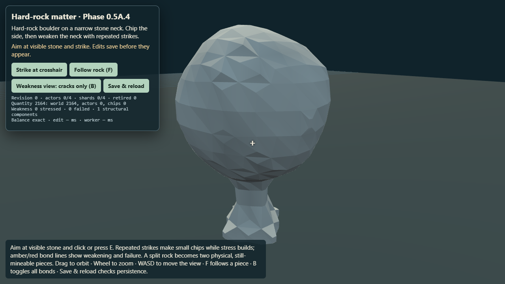
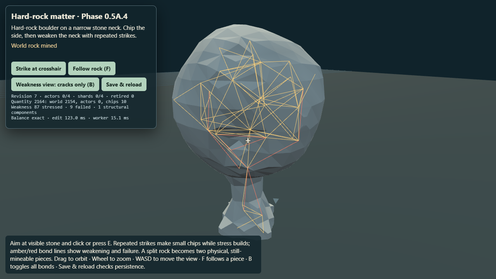
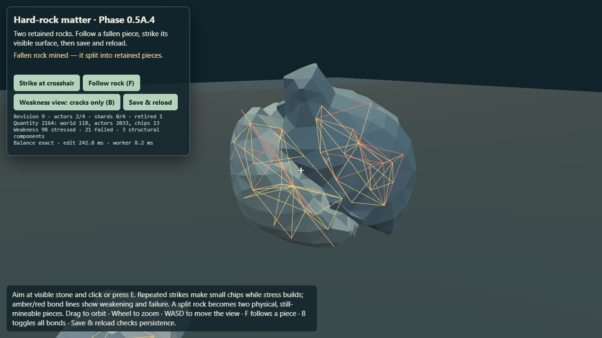
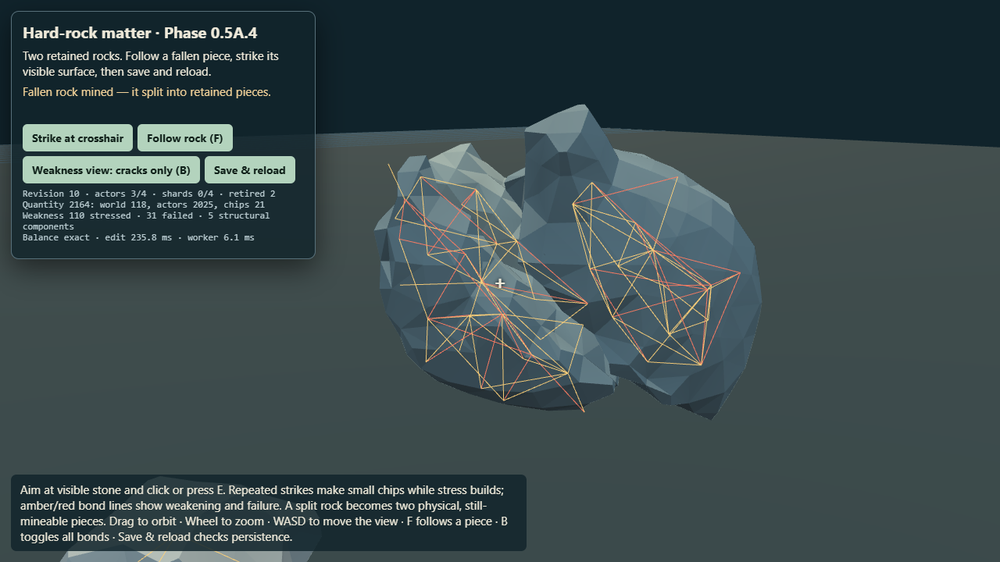

# Phase 0.5A.4 — material-aware hard-rock proof

**Result: PASS.** Independent read-only review accepted the implementation, screenshots, transaction coverage, and corrected quantity figures. `npm test` and `npm run verify` both pass **1,534 tests across 175 suites**; verify also passes world/campaign checks, build, and submission validation. `npm run zip` passes at **24.79 MB**. This is the bounded A.4 hard-rock experiment in the isolated cellular matter lab. It does not change shipping `src/`, add dependencies, or implement another material.

## What the player sees

The browser starts with one faceted, non-cubic boulder on a narrow stone neck. Clicking the visible surface produces small irregular chips. Repeated strikes show amber stressed bonds and red failed bonds in the optional weakness view (`B`). After further neck strikes, the rock detaches. It falls and rotates under Rapier, then a strike on the moved visible actor splits it into two retained rocks. Following and striking one moved child splits it again. Save & reload restores the three surviving rocks, their stress/broken-bond state, ancestry, material ownership, and saved poses.

The deterministic 1280×720 Edge/SwiftShader sequence is [playable locally](http://localhost:8123/lab/voxel/cellular-rock.html?save=hard-rock-a4-1790240022003). The durable receipt is [`playtest-hard-rock-a4.json`](evidence/voxel-phase05a4/playtest-hard-rock-a4.json). This browser-local URL requires the repository dev server on port 8123.

All requested numbered captures are in [`docs/evidence/voxel-phase05a4/`](evidence/voxel-phase05a4/): pristine, first chip, several chips, crack feedback, static detachment, rotated child, first fracture, settled children, followed child, recursive fracture, and reload. The first chip is visible but subtle; the several-chip and fracture images make the changes easier to inspect.

## Verified

- The fixture begins with **2,164 material units**. The first structural split occurs with **2,151 / 2,164 remaining (99.40%)**. At that point the account is world 118 + child actors 1,059 and 974 + consumed 13 = 2,164. The boulder therefore fractures after only 13 units, about 0.60%, have been consumed.
- The first detached actor moves about **5.12 m** and rotates about **2.34 radians** during the recorded fall. The actor follows gravity and collides with the lab floor. The split creates two fresh four-sector convex proxies; the recursive split leaves three active actor bodies and retires both parents.
- The child is mined at its new world pose. The second fracture preserves its preexisting stress and broken bonds; the struck chip accounts for 8 new consumed units. Structural separation itself awards nothing. The nested post-split ledger is world 118 + actor 974 + child actors 608 and 443 + consumed 21 = 2,164.
- Save & reload returns revision 11 with the same three active actors, retired parent IDs, quantity ledger, lineage, and structural state. Saved poses match exactly in the final receipt; the first physics step advances each body about 3.5 mm under gravity.
- Mining rays query authoritative scalar Surface Nets matter for both world and actor-local hits. A known visible deep recess misses the scalar mining ray even though the intentionally coarse physics proxy overlaps it. Tests also cover a rotated actor hit and a ray at the actor's retired pose.
- The physics proxy is a bounded compound of at most eight convex hulls; this fixture emits four sectors per actor. It supports gravity, terrain contact, rotation, and coarse blocking. It does not represent internal concavities precisely and does not decide mining hits. Tests verify finite resting actors on the existing static terrain and confirm no native voxel-collider call.
- Chip radius is 0.38 m with 0.06 m deterministic variation, below the old 1.5 m fracture-cell scale. The chip is a local irregular signed-density edit. Material removal and structural stress are separate proposals. Bond IDs, seed-biased strength/weakness, stress, and broken identities are deterministic and serialized.
- Per-impact stress visits at most 32 nodes and 96 bonds, with a graph-distance radius of 3. The graph also caps at 32,768 structural cells and 12,288 bonds. Narrow contact and unsupported fragments reduce bond strength. Connectivity stays within the bounded fixture.
- The debug `B` view shows all bonds or only cracks; amber indicates stressed bonds and red indicates broken bonds. The structure is a low-poly gameplay proof, not final production crack art.
- Hard-rock fragment policy classifies 96+ occupied probes as persistent actors, 24–95 as temporary physics shards, and 0–23 as tiny debris. Temporary shard bodies are capped at four. Boundary tests cover these thresholds; the pictured sequence creates no small detached fracture fragments or temporary shard bodies.
- Failure injection now exercises the fractured-parent/child-transfer transaction itself. Child-mesh failure, child-collider failure, persistence failure, stale worker output, and invalid ownership transfer leave the old parent, ownership ledger, rewards, retirement list, and published products unchanged. Existing stale-revision, world-chip, actor-chip, shard and save failure tests remain.
- Browser receipt records zero page exceptions and zero external requests. The local lab remains a self-contained offline-capable experiment.

## Provisional choices that worked here

- `ROCK_PROFILE` currently uses cohesion 1.0, impact energy 0.20, stress falloff 0.62, crack threshold 0.8, bond failure ratio 2.0, and a minimum of 12 broken bonds before fracture candidates are tested. These are fixture-tuned values, not balance commitments.
- A candidate split must leave at least two components of 96 occupied probes each. Small detached components are assigned to the bounded shard/debris policy. Parent and child mass derive from the fixed 1/8 m³ parcel ledger; child velocities use inherited linear velocity plus the angular `ω × r` COM offset.
- The body budget remains four persistent actors. The captured sequence reaches three. Fracture creates no resources; only actual chip loss is credited. Hidden quantization residuals remain owned and move to a resulting component rather than becoming a second reward.
- Weakness lines are a debug overlay. The actor proxy deliberately fills some visible recesses; that is an accepted gameplay approximation after the A.3 exact-collider experiments failed.

## Performance observations

Measured in Microsoft Edge headless with SwiftShader at 1280×720. These are bounded fixture observations, **not** desktop-target certification or a mobile/phone budget.

| Operation | Observed range |
| --- | ---: |
| Local chip field update | 0.0–0.4 ms |
| Structural graph build | 6.9–25.1 ms |
| Stress propagation | 0.2–0.5 ms |
| Ordinary connectivity | 11.8–28.5 ms |
| Fracture candidate search and partition | 71 ms first split; 88 ms recursive split |
| Full edit transaction | 131–253 ms |
| Surface Nets worker mesh | 4.8–35.1 ms |
| Convex collider preparation | 0.4–27.3 ms |
| Save operation | 11.3–28.9 ms |

The browser's reported frame-delta p95 reached its 50 ms clamp. Treat that as a headless stall observation, not a useful steady-state frame-rate result. The sequence peaked at three dynamic actors and four hulls each; transient shard bodies were zero. Triangle counts and per-edit timings are in the JSON receipt. The lab does not expose a reliable heap/RSS sample, so no memory budget is claimed. Individual physics-step timing was not separately isolated.

## Test and experiment coverage

The focused suite passes **38/38** tests covering scalar targeting and the physics-proxy distinction; deterministic bounded chipping; quantity conservation; bond identity, persistence, seed variation, decay and weak-neck failure; bounded stress/connectivity; recursive actors; save/reload; convex-proxy terrain contact; native voxel-collider exclusion; tier thresholds; and fracture-specific rollback. Full verification: `npm test` and `npm run verify` pass **1,534 tests / 175 suites**; verify also passes world/campaign checks, build, and submission validation (**63.12 MB**). `npm run zip` passes (**24.79 MB**). Independent review: PASS.

### Phase milestone disposition

- **A.4.0 baseline:** Reproduced the supported boulder at 2,164 units and retained A.3's documented deep-concavity failure as prior evidence. No new collider search was made.
- **A.4.1 precision/proxy separation:** Verified through the empty-recess, rotated-actor and retired-pose targeting tests.
- **A.4.2 small chip:** Verified deterministic, irregular, bounded local edits with exact parcel accounting.
- **A.4.3–A.4.4 structure and stress:** Verified stable seeded bonds, persisted damage, rapidly decaying bounded propagation, and reduced narrow-neck resistance.
- **A.4.5 crack feedback:** Verified in the browser through the weakness overlay and saved captures.
- **A.4.6 large fracture:** Verified at 99.40% quantity remaining, yielding two substantial children.
- **A.4.7 recursive child:** Verified a fallen/rotated child was targeted at its moved pose and split again.
- **A.4.8 save/reload:** Verified nested children, structural state, lineage, quantities, and saved pose records.
- **A.4.9 failure safety:** Added fracture-specific child-mesh, child-collider, persistence, stale-worker, and invalid-owner rejection coverage.
- **A.4.10 tuning:** A provisional hard-rock profile reaches a readable fracture after repeated normal strikes. No exact hit count is encoded in the architecture.

## Future

Only a later authorized phase may add a second material profile, such as dirt; directional wood grain, crystal behavior, geological layers, a production terrain migration, or production-quality crack rendering. This experiment does not authorize those changes.

## Failed approaches and limits to preserve

- A.1–A.3 showed that exact convex-physics equivalence with arbitrarily concave mined Surface Nets surfaces fails within the bounded collider policy. Native Rapier voxels also failed required actor/terrain contact. Keep their reports as negative evidence; do not repeat the search. A.4 uses a deliberately approximate convex gameplay proxy.
- No finite-element stress solver, broad world scan, alternate physics engine, new dependency, material, world streamer, or shipping terrain migration was added.
- The experiment is one supported rock/pedestal fixture and a short repeated deterministic sequence. Temporary/tiny detached-fragment runtime behavior is threshold-tested but not produced by the captured split. The proxy can fill deep recesses. Crack indicators remain debug lines. Physics resumption after reload advances bodies normally, so poses are exact at restore and then evolve.
- No real phone test, memory profile, production-frame budget, or full-world scale claim is made.

## Closure

After independent review and repository validation, mark this experiment PASS or HOLD and stop for owner review. If PASS, recommend exactly one next choice: **Phase 0.5B, a second material profile (probably dirt),** or **further hard-rock feel/presentation tuning**. Do not start either in this session.
