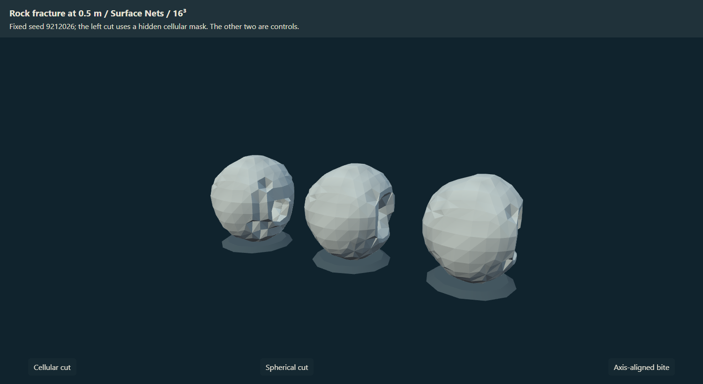
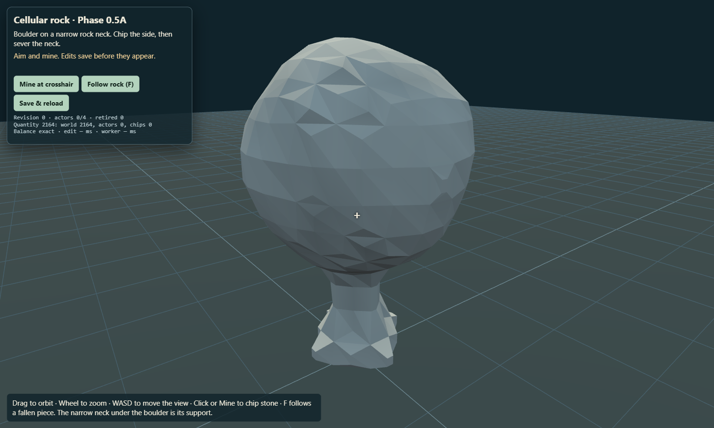
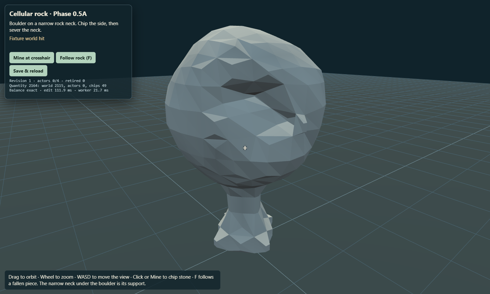
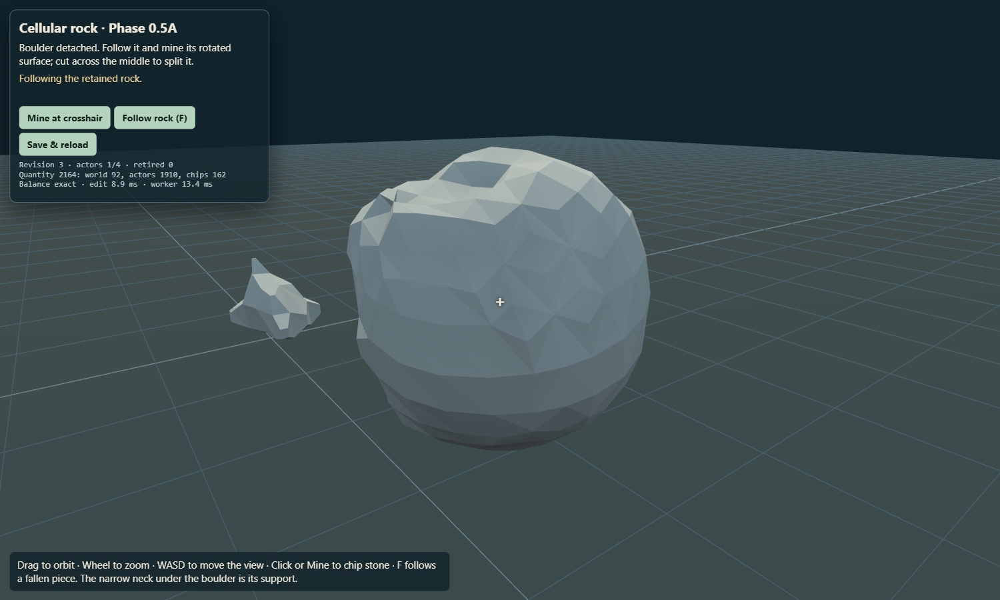
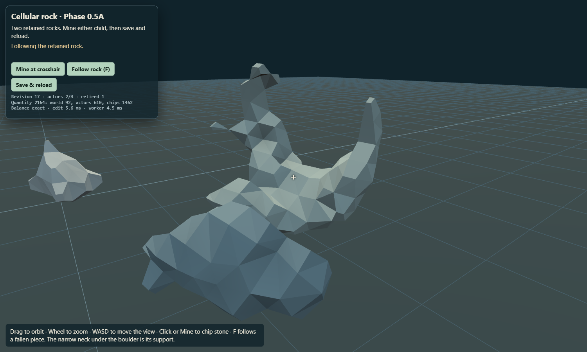
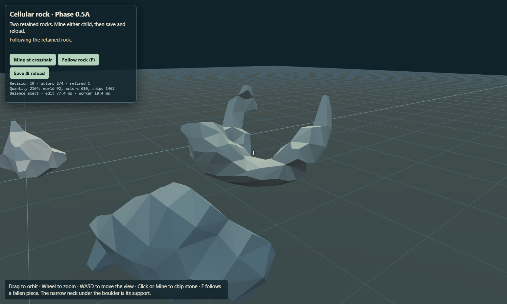
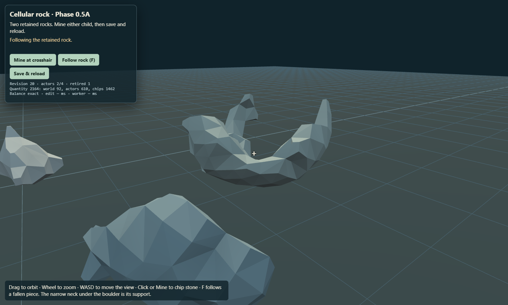

# Phase 0.5A cellular rock — isolated architecture proof

## September 24 Phase 0.5A.3 native voxel collider study — HOLD

The [bounded native voxel experiment](VOXEL_PHASE05A3_REPORT.md) verifies the exact installed Rapier 0.20.0 API and derives 0.25 m physics cells directly from authoritative occupied subparcels, with a conservative 0.5 m control. Both fail the existing surface/capsule/controller gates and dynamic contact with the actual static lab terrain/trimesh; cuboid-floor controls work. One measured connected-fragment hull fallback also fails. No representation is adopted, no visual mesher/resolution or material ownership is changed, and no stress/fracture gameplay is implemented. The future small-chip/separate-stress/occasional-split policy is documented only. **Stop for owner review.**

## September 23 Phase 0.5A.2 collision follow-up — HOLD

The [new staged investigation](VOXEL_PHASE05A2_REPORT.md) reproduces the 2.8555 m cut and 2.4518 m child errors, reconstructs the tight eight-sector initial support failure, and compares three occupied-region convex cluster methods. None passes the full chain inside eight hulls. Expanded surface rays and real player capsule/controller probes confirm further proxy defects, including weaknesses in the old initial actor that the narrow gate misses. The owner-required Stage 1 STOP applies: no new impact/stress/fracture mechanic was integrated. Source and extracted-ZIP native mining/rejected-edit/reload regressions pass; owner authorized commit/push. Prior results below remain historical.

## September 23 Phase 0.5A.1 remnant and shatter investigation — HOLD

**Gate: HOLD.** The 1.5 m rock field can shorten the original spires through local thickness conditioning, and consumed rock can produce bounded temporary Rapier shards without changing the exact reward ledger. The current four-hull retained actor collider fails a broader visible-surface test after the conditioned cuts. A representative child has a **2.45 m** proxy/surface error; the source and extracted ZIP browser run find a **2.86 m** error on an earlier actor cut. Those edits now stop before persistence or product publication. No tree, dirt, shipping migration, new scalar resolution or new mesher was attempted.

### Diagnosis before conditioning

The scripted 1.5 m baseline has 625 occupied quarter-metre parcel probes and 198 probes thinner than 0.75 m before its final cut. Raw fracture subtraction leaves 610 occupied and 195 thin probes. The two old extraction masks contain 379 and 231 probes with **zero missing, extra or overlapping probes**, and their 520 sorted Surface Nets triangles exactly equal the raw cut's 520 triangles. Thus the long protrusions originate in the cut field and genuine remaining geometry, rather than component-mask invention or mesher reconstruction. A new audit did reveal an *intermediate* orphan-negative-scalar defect: one edit had 624 raw versus 612 extracted triangles despite one occupied component. Bounded scalar normalization before connectivity resolves it; all accepted split outputs must now equal the authoritative field's triangles exactly. [Baseline receipt](evidence/voxel-phase05a1/diagnosis-scale-1.5-band-0.04-condition-off.json), [matched baseline screenshot](evidence/voxel-phase05a1/extraction-baseline.png).

### Fixed-resolution comparison and local conditioning

All comparisons keep Surface Nets, 16³ mesh chunks and 0.5 m scalar samples. The [matched screenshot set and counts](evidence/voxel-phase05a1/scale-comparison.json) uses seed 9212026, the same hits and camera, at 1.5, 2 and 2.5 m cell scales. These are **pure-field visual comparisons**, not claims that every scale can complete the authoritative detachment transaction. After eight central hits, unconditioned occupied components are **803/92** at 1.5 m, **93/96/43/39/21** at 2 m and **470/12/4** at 2.5 m. At the same point, 1 m minimum-thickness conditioning yields **338/292/92**, **78/73/43/39/6** and **470/12/4**. The coarser fields create scattered or unwieldy pieces; 1.5 m remains the provisional rock profile. [Control](evidence/voxel-phase05a1/scale-8-cuts-control.png) and [conditioned](evidence/voxel-phase05a1/scale-8-cuts-conditioned.png) images share framing.

The conditioner measures occupied quarter-metre probes, minimum axis thickness and distance from a thick core in the affected fracture-cell neighborhood. It trims distal thin groups and can sever a narrow weak connection; the old split at central hit 12 occurs at hit 8 in the conditioned replay. The [conditioned raw/extraction comparison](evidence/voxel-phase05a1/extraction-conditioned.png) shows **338/292** retained probes, exact geometry union and 149 remaining thin probes after the cut, versus 195 in the baseline cut. A 1.25 m minimum exceeded the 64-probe local edit budget; a 1.5 m attempt exhausted the fragment budget. Both HOLD rather than broaden cleanup. The 1 m minimum, unit cohesion, 64-probe edit cap and 64-probe physical-retention floor are provisional rock-only data. Foreign material and remote samples are protected by tests. Some short spires remain visible, so silhouette quality has not passed perceptual review.

### Shattering, authority and collision failure

Consumed scalar matter is partitioned by connected fracture fragments into no more than 16 disposable pieces. Pieces of 24–63 probes may use a **separate cap of four transient Rapier bodies**, each with a 3.5 second lifetime and modest impulse. Smaller/unrepresentable visual pieces use the bounded pool. Retained large components remain editable actors under the unchanged four-persistent-body/eight-hull ceilings. Disposable pieces have **no matter authority and grant no second reward**: the original fixed-parcel ledger credits consumed quantity once before publication. Tests cover budget rejection, shard motion, origin rebase, expiry, material protection, exact quantity and shard-preparation/save rollback. The earlier [pre-collision-gate browser candidate](evidence/voxel-phase05a1/runtime-partition/playtest-cellular.json) reached two children, a later child hit and reload with a maximum of three simultaneous temporary shards; that candidate is **not admitted** because its retained collider was unsafe.

The new preparation gate samples the visible Surface Nets mesh against each prepared Rapier compound from both lateral axes. It requires at least six comparable rays and ≤0.5 m worst separation. The baseline detached boulder and first edited boulder pass; a conditioned split child fails at 2.45 m. The [source HOLD receipt](evidence/voxel-phase05a1/hold-source/hold-proof.json) and [extracted ZIP HOLD receipt](evidence/voxel-phase05a1/hold-portable/hold-proof.json) reproduce an even earlier failing actor edit: 48 rays, 2.8555 m worst error, while one parent body and its four hulls remain installed. The rejected edit changes neither revision nor quantity, and literal reload preserves that parent and its content revision. A fresh save in each run also uses the **native Mine control** to cut the world rock and then its fallen actor, with [native actor screenshot](evidence/voxel-phase05a1/hold-source/native-actor-mine.png). [Before the rejected cut](evidence/voxel-phase05a1/hold-source/secondary.png) and [visible HOLD](evidence/voxel-phase05a1/hold-source/held-split.png) show the actual browser state. Both runs have no page errors or external runtime requests.

The final source HOLD run recorded edit times up to **506.2 ms**, worker times up to **55.5 ms**, collider preparation up to **139.0 ms**, and save times up to **57.4 ms** on Edge headless/SwiftShader for this tiny fixture. The extracted ZIP run reached **533.0 / 63.8 / 112.2 / 65.3 ms** respectively. These are worst observations from two short runs, not stable percentiles or a PC/phone budget pass. One persistent actor body and at most one transient shard were active at their visible checkpoints. The separate lab ZIP is **1,643,469 bytes** and unpacks to **4,935,684 bytes**.

**Failed assumption:** the current small deterministic convex compound is gameplay-safe after the local rock shape changes. The four-sector hull bridges a deep concavity. An eight-sector trial failed existing initial-rock ray checks and still missed the child by 0.81 m; a general convex-decomposition system and larger hull budget are outside this batch. Phase 0.5A.1 therefore stops at HOLD for owner review. The prior Phase 0.5A end-to-end chain remains historical pre-conditioning evidence, not a pass for this new candidate.

**September 23, 2026 · gate: HOLD for owner/perceptual review.** The bounded technical chain completes in a browser and in an extracted lab ZIP. The initial fracture representation passes its falsification probe. The admission gate stays open because the two split remnants develop conspicuous thin spires after the repeated central cuts, the full chain was driven by deterministic diagnostic hits (native Mine was checked separately for the world and fallen actor), and no independent perceptual reviewer was available. The architectural assumption still needing review is that a 0.5 m shared-corner scalar mask gives an acceptable *recursive split silhouette* within the fixed collider budget. No tree, dirt, shipping world migration or Phase 0.5B work is authorized by this proof.

## First gate: fracture field

The smallest probe ran before the actor implementation. A seeded, rotated, approximately isotropic jittered-site rock field uses full signed integer site addresses and a radius-two nearest-site search checked against a radius-four brute-force oracle. One fracture cell is selected at a hit, and its implicit signed cell mask is subtracted only from the hit's occupied patch. The 0.5 m Surface Nets result has a jagged, oblique recess distinct from the spherical and axis-aligned controls in the same actual render:

The tested rock cells are **1.5 m** across, or about three scalar intervals. This trades fracture granularity for a visible irregular silhouette; smaller cells were not adopted or claimed to work. The visible mesh remains Surface Nets with 16³ chunks and 0.5 m samples; site polygons are not rendered. Negative coordinates, seed stability, nearest-search agreement, isotropy sampling and remote same-ID patch protection are covered by `voxelFractureField.test.js`. [Probe receipt](evidence/voxel-phase05/rock-fracture-probe.json).

## Implemented chain and ownership

1. A roughly 4 m boulder begins as world-owned generator matter on a narrow rocky neck. A side hit makes an irregular bite. Two neck cuts leave one unsupported component, transfer its occupied parcels to one actor, and remove the world source without a reward for detachment.
2. Rapier gravity and contact move and rotate the actor. The browser run records a substantially changed quaternion and position before its next cut. Actor ray selection intersects the actual scalar surface, transforms the hit into the stable local sample frame, checks content revision, and edits that local field. The old source position is no longer hittable.
3. Repeated middle cuts retire the parent and produce two retained physical children. Each child keeps the original fracture domain, local field, material, lineage, pose and motion; its inherited velocity uses `v + ω × r`. A further child cut changes the child field. Tiny occupied remnants are converted through the declared 64-probe retention threshold, not promoted to bodies.
4. A literal IndexedDB reload after the child hit restores the two children, retired parent ID, world deltas, fields, poses, revisions and reward ledger. The separate namespace is `wildkin-voxel-lab-cellular-0.5a-v1` with a per-proof suffix. Existing Phase 0 namespaces are unchanged.

The shared `MatterVolume` view reads generator-plus-sparse-edits for the world and bounded snapshots for actors. Both provide density, material, fracture domain and padded snapshots in a stable sample frame. Connectivity uses occupied 2×2×2 interior probes and actual face contact, plus explicit anchors; unknown structural evidence returns HOLD. `LabWorldState` remains the serialized durable transaction owner. Worker meshes and disabled Rapier products prepare before the IndexedDB transaction; a fixed-step revision check precedes save and publication. Failure injection covers worker failure, stale worker output, collider preparation failure and a real IndexedDB abort. In those cases prior matter, reward and mesh/collider products remain installed. A delayed pose update cannot restore a retired parent.

The fixed eight-subparcel accounting model starts with **2,164 stone units**. At the final child hit it has **92 world + 379 first child + 231 second child + 1,462 consumed/reward = 2,164**. Detachment and splitting issue no reward themselves. The final state has two bodies and four convex hulls per actor, below the four-body/eight-hull caps. A real Rapier/visible-surface comparison checks several initial and edited rays to within 0.5 m; the hulls are bounded proxies, not an exact concave collision surface.

The [headed Edge receipt](evidence/voxel-phase05/headed-pc/playtest-cellular.json) and [extracted ZIP receipt](evidence/voxel-phase05/portable-final/playtest-cellular.json) record every stage, actual poses, revisions, body/hull counts, quantity, errors and external requests. Both report no page errors or external runtime requests. The deterministic browser harness uses diagnostic coordinate hits for the full split sequence and separately proves the on-screen Mine control can edit both a world rock and a fallen actor via scalar targeting.

## Validation and measurements

Focused suites: `voxelFractureField`, `voxelMatterVolume`, `voxelMatterConnectivity`, `voxelMatterOwnership`, `voxelMatterActor`, `voxelMatterTarget`, `voxelMatterPersistence`, `voxelMatterPhysics` and `voxelMatterPublication`. Existing Phase 0 suites also run under the aggregate project checks. Final aggregate test, verify and shipping ZIP results are recorded in the build log.

Visible Edge on the local PC, one 1500×900 bounded rock scene: 16 committed edit samples, median **61.6 ms**, maximum **111.9 ms**. Worker candidate median **9.2 ms**, max **21.7 ms**; collider preparation median **10.8 ms**, max **16.0 ms**; save median **12.3 ms**, max **17.3 ms** (14 samples). Final mesh contains 104 world and 344/164 child triangles. These are small-fixture measurements, not a statistically representative world benchmark. The headed automated run reports a 50 ms frame p95 after the loop's 50 ms delta clamp; this does **not** establish a 16.7 ms PC frame target. No real landscape-phone timing was taken; Phase 0's separate phone HOLD remains.

## Limits and owner review

- The recursive split's thin spikes are visible. The current sample-corner partition keeps quantized ownership exact and rejects ambiguous shared corners, yet does not prove a consistently convincing rock silhouette. This is the principal Phase 0.5A HOLD.
- The browser proof shows actual rendering and native world/actor Mine targeting, while diagnostic hits drive the long, deterministic split path. A human should inspect whether ordinary orbit/aim/mining makes that path understandable and reliable.
- Four sector convex hulls per actor pass sampled visible-surface rays. They are not a general decomposition library, and the test does not certify every concavity or every future rock cut. Unrepresentable/budget-exceeding edits HOLD before durable commit.
- Only one fixed rock fixture, one material, one domain and one bounded support area are implemented. The floor and camera are lab props. Crash recovery between durable save and publication is handled by freezing/reloading, not tested as a general world service.

**Human review:** Open `/lab/voxel/cellular-rock.html` from `node tools/serve.mjs --port 8090`. The boulder and narrow pedestal are in front of the view. Click the boulder's near side and confirm an oblique, non-cubic recess. Orbit toward the narrow neck, mine its remaining sides until the boulder falls, press **F** to follow it, then aim at its new rotated surface and mine. Continue cutting across the middle; confirm two physical remnants and no parent at the source. Mine one remnant and use **Save & reload**; confirm the same two damaged remnants and exact balance text. Failure signs include a spherical/cubic bite, a hit at the old source, overlapping parent and children, unchanged child after mining, mismatched collision, or a quantity increase on split. The screenshots above show the repeatable scripted path for comparison.
