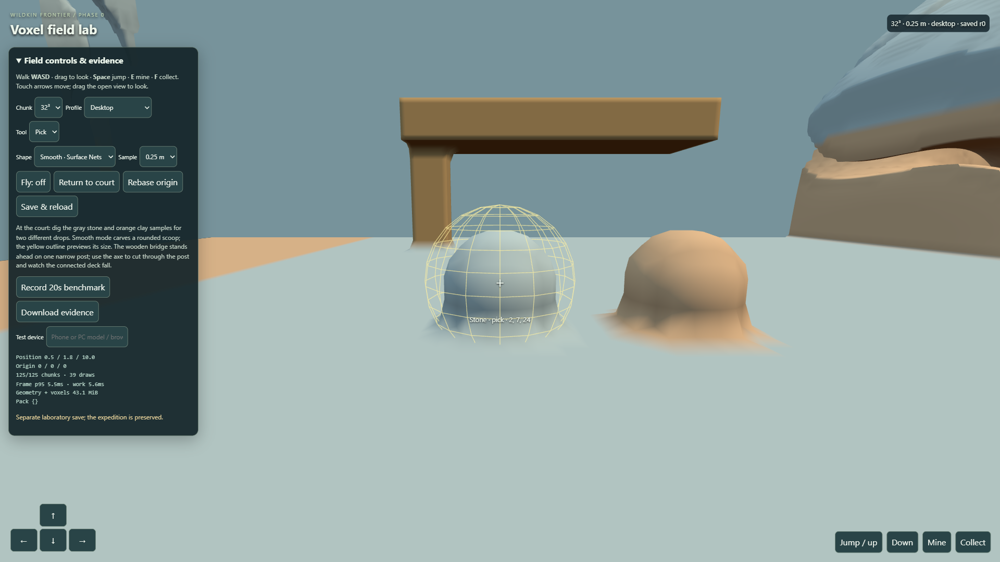
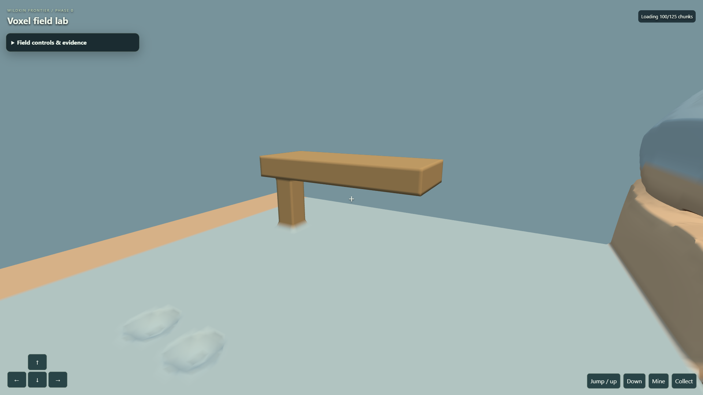
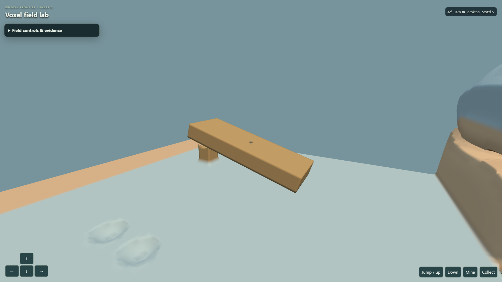

# Phase 0 smooth voxel laboratory — evidence and decision gate

**Gate: HOLD for the real landscape-phone result, deferred by Chris on September 22. No Phase 1 admission.**

The provisional choice is **Surface Nets, 16³ cubic chunks, 0.5 m scalar sample
spacing**. This produces curved metre-scale shapes and rounded digging. Keep
0.25 m as a comparison profile: it looks less faceted, but its load, support,
save and collapse costs are substantially higher. These are engineering
recommendations; the owner selected smooth destructible matter, not a specific
resolution or algorithm.

The isolated entry is `lab/voxel/index.html`. The shipping expedition, its saves,
Blender production and preserved untracked `authoring/` are untouched. The lab
is a technical court and cave-bearing procedural field, not a new habitat or
the production world. No push, migration, LOD, fluids, general support solver,
settlement or new harvest economy is part of this batch.

## What is actually smooth

Each signed density sample is addressed by integer X/Y/Z; negative values are
solid. Surface Nets interpolates density crossings into actual curved geometry.
At 0.5 m there are two sampling intervals per metre on each axis; at 0.25 m,
four. This is sample spacing, not a promise that rendered faces are cubes of
that size. The spherical cut, material lookup, worker input, static collision,
detached snapshot and save format all use this same spacing.

The smooth meshers are small first-party modules, guided by the Surface Nets
algorithm described in [Smooth Voxel Terrain, part 2](https://0fps.net/2012/07/12/smooth-voxel-terrain-part-2/).
FastNoise Lite is vendored locally with its MIT notice. Three.js and Rapier
remain the existing rendering and physics owners. No external runtime request
or additional package dependency is required.

## Correctness and ownership evidence

| Requirement | Evidence and result |
| --- | --- |
| Negative cubic X/Y/Z, 16³ and 32³ | `voxelLab.test.js`: negative/exact-boundary round trips and unsafe-address rejection. Scalar generator shell tests cover both resolutions and chunk sizes, including saved border edits. |
| Deterministic generation and worker counts | Smooth browser receipts compare actual one-worker/four-worker density and geometry hashes; equal in both resolutions. Pure mesher hashes are repeatable. |
| Material surface, AO and seams | Both smooth candidates interpolate curved geometry. Sphere tests check triangle area/winding. Surface Nets all-axis ghost vertices, normals and colors match and faces have one owner. Local eight-corner occupancy AO darkens a constant-material cavity versus a plane; it is an approximation, not global lighting. |
| Selection and edits | Actual UI picks dig stone and clay and collect distinct rewards. Scalar DDA returns the interpolated hit and a matching solid material sample, including small drift around lattice boundaries. |
| Rapid edits and collider replacement | All dirty seam neighbors are prepared before any prior product is retired; forced allocation failure retains the old batch. Rapid scalar edits finish with requested, rendered and Rapier revisions equal. An actual excavation ray has matching Three/Rapier distance. |
| Worker cancellation | Block browser harness terminates actual in-flight workers on unload and rebuilds on return; queued replacement/stale rejection also occurs in rapid edits. The same pool is used for smooth geometry. |
| Character collision | Native WASD movement is grounded on the actual smooth Rapier trimesh. Fly/aim fixtures elsewhere are explicitly identified in the browser harness. |
| Unsupported physical component | Native Axe cuts the supported post, removes its source scalar matter, and creates exactly one falling smooth body. Both resolutions pass. The visible detached snapshot stays centered on its body. |
| IndexedDB reload and failure | Literal reload retains density edits, materials, two collected rewards and one smooth body. Aborting a real write leaves state/reward/publication unchanged. Resolutions use separate namespaces; mismatched saves are rejected intact. |
| Floating origin | A fixed-step three-axis rebase preserves global player, edits and actor pose; render and physics move together. No shipping save reads or writes. |
| Mobile input | The emulated multitouch harness checks simultaneous movement/look, release, native Mine/Collect and control bounds. It proves layout/input only; physical phone timing remains required. |

Receipts: [0.5 m browser proof](evidence/voxel-phase0/playtest-smooth-0.5.json),
[0.25 m browser proof](evidence/voxel-phase0/playtest-smooth-0.25.json),
[block lifecycle baseline](evidence/voxel-phase0/playtest.json).
Independent read-only review retained the curved surfaces and matched bridge
captures and found no new stale-publication regression. Its normalization and
regression requests were completed; the remaining gate is the real phone.

The support solver intentionally floods only this bounded wood fixture.
Unknown resident neighbors conservatively support it. Smooth components cap at
4,096 samples and four bodies; block compounds cap at 64 boxes. A smooth actor
uses one conservative convex hull (bounded box fallback), which fills concave
gaps; its visible mesh uses the saved density snapshot. It is not exact dynamic
concave collision. Source removal, drops and actor ownership commit together.
Actor poses checkpoint periodically and on Save & reload; a crash can restore
the last saved pose, not an exact unsaved simulation instant.

Sibling consistency checked: both sample spacings, both chunk sizes, positive
and negative face/edge/corner neighbors, target/material agreement, both reward
materials, mesh/collider publication, source-to-debris ownership, saved/loaded
poses and origin-relative player/terrain/debris/drop representations.

## Measured chunk and resolution comparison

PC: Intel i9-11900H, 32 GB RAM, RTX 3070 Laptop GPU, Windows/Edge, visible
1920×1080 WebGL canvas, DPR 1. The mobile profile below is **844×390 touch
emulation on that same PC**. It is not a phone result. Runs were serialized.
The monitor produced approximately 2.9 ms steady frame p95; this establishes
that PC passes the 16.7 ms target in the bounded lab.

Normal-profile results, Surface Nets. “Edit max” is the slower of two disclosed
rapid-dig/collapse batches, not a well-sampled population percentile. Streaming
main work includes geometry publication and Rapier collider creation.

| Profile | Spacing m | Chunk | Resident chunks | Cold ready ms | Streaming main p99 ms | Edit max ms | Geometry + scalar estimate MiB |
| --- | ---: | ---: | ---: | ---: | ---: | ---: | ---: |
| PC | .5 | 16³ | 125 | 2,740 | 4.7 | 99.1 | 8.4 |
| PC | .5 | 32³ | 27 | 2,034 | 23.6 | 480.3 | 13.2 |
| Emulated mobile | .5 | 16³ | 75 | 1,638 | 4.6 | 100.3 | 4.8 |
| Emulated mobile | .5 | 32³ | 27 | 2,857 | 27.3 | 686.5 | 13.2 |
| PC | .25 | 16³ | 729 | 12,550 | 2.9 | 199.7 | 35.3 |
| PC | .25 | 32³ | 125 | 6,097 | 15.7 | 376.5 | 43.1 |
| Emulated mobile | .25 | 16³ | 405 | 7,527 | 3.0 | 260.4 | 19.1 |
| Emulated mobile | .25 | 32³ | 75 | 7,647 | 13.2 | 761.2 | 25.1 |

Raw [profile measurements](evidence/voxel-phase0/benchmark-smooth-surface-nets.json)
include generation/meshing, collider cost, save/support, origin cost, draws,
triangles, browser/GPU details and errors. At .5/16 PC, worker meshing p95 was
8.3 ms, collider p99 4.6 ms, support max 11.0 ms, save max 12.0 ms, and origin
shift 0.9 ms. At .25/16, support reached 51.6 ms and saves 33.9 ms. Synchronous
bounded support/save preparation is a real finer-resolution limitation;
production would need a worker and more efficient delta writes.

Normal profiles round physical radii to whole chunks, so total physical volumes
differ. The following **identical 32 m cube** removes that confound. Its bounds
align to the same 16 m world anchor for every candidate, with the same traversal
and edits. Equal triangle counts within a resolution confirm equivalent visible
volume. Generation, worker output, collider work and drawing remain real browser
operations.

| Spacing m | Chunk | Resident chunks | Triangles | Cold ready ms | Streaming main p99 ms | Edit max ms |
| --- | ---: | ---: | ---: | ---: | ---: | ---: |
| .5 | 16³ | 64 | 67,740 | 1,706 | 4.3 | 72.0 |
| .5 | 32³ | 8 | 67,740 | 971 | 22.1 | 442.2 |
| .25 | 16³ | 512 | 275,390 | 8,886 | 3.1 | 190.1 |
| .25 | 32³ | 64 | 275,390 | 3,335 | 16.5 | 372.9 |

[Normalized browser receipt](evidence/voxel-phase0/benchmark-smooth-surface-nets-normalized.json).
Targets remain PC frame p95 ≤16.7 ms, streaming main p99 ≤8 ms, typical visible
edit <150 ms and resident world ≤750 MB; phone ≤33.3 ms, ≤12 ms, <350 ms and
≤300 MB. .5/16 meets measured PC timing targets. 32³ fails the streaming target
at both resolutions. Smaller chunks pay more draw/publication overhead and
cold loading time, but bound collider pauses.

## Mesher decision

The original block candidates were actually executed, not rejected from API
inspection. [Full-adapter browser receipt](evidence/voxel-phase0/candidate-browser.json)
uses identical inputs, five warmups and 25 samples, including conversion/copy:

| Candidate | 16³ median / p95 ms | 32³ median / p95 ms | Scope finding |
| --- | ---: | ---: | --- |
| Owned JS greedy | 2.6 / 4.5 | 26.9 / 31.2 | Block baseline, local AO |
| block-mesh WASM | .3 / .5 | 2.1 / 2.3 | Fast block baseline; no AO in wrapper |
| Voxelize WASM | 4.9 / 5.5 | 67.2 / 72.5 | Block baseline; AO retained, costly conversion |

All match exposed area and the one-voxel oracle. Different AO and merging
policies prevent ranking equivalent visual outputs. None produces the requested
scalar smooth shape. Exact provenance, licenses, raw WASM limitations and earlier
baselines are in [the candidate spike](VOXEL_MESHER_SPIKE.md).

Marching tetrahedra was also measured on the exact 32 m cube at .5 m: streaming
main p99 **12.1 ms (16³)** and **77.0 ms (32³)**, versus Surface Nets 4.3 / 22.1 ms.
Its edit maxima were 122.2 / 856.8 ms.
[Smooth comparator receipt](evidence/voxel-phase0/benchmark-smooth-marching-tetrahedra-normalized.json).

An additional [CPU comparison](evidence/voxel-phase0/benchmark-normalized-smooth.json)
holds a cave-bearing 16 m cube constant across both resolutions/chunk sizes,
with one warmup and four complete-geometry repetitions. Surface Nets emits
14,832 triangles at .5 m and 60,284 at .25 m; tetrahedra emits 43,802 and
181,252. Tetrahedra's duplicated vertex buffers are roughly ten times larger
in this fixture. This supports Surface Nets without claiming all algorithms
or terrain shapes have been exhaustively benchmarked.

## Memory, packaging and verification

Geometry/scalar figures are an estimate, not total memory. Fresh-browser
empty-lab versus resident-lab measurements, with main-heap GC and process
private bytes, estimate .5 m world allocation at **113.1 / 161.2 MiB** for PC
16³/32³, and **70.9 / 132.6 MiB** for emulated mobile. This includes incremental
worker, renderer and GPU-process allocation but is not exact GPU attribution;
allocators may retain memory. [Memory receipt](evidence/voxel-phase0/memory-surface-nets-0.5.json).
It does not measure an iOS/Android browser's memory behavior.

At .25 m the same method estimates **163.3 / 277.5 MiB** for PC 16³/32³ and
**85.5 / 123.1 MiB** for emulated mobile. These noisy process deltas are not
precise per-chunk accounting; all measured cases are below the provisional
world-memory ceilings on this PC. [Finer-sample memory receipt](evidence/voxel-phase0/memory-surface-nets-0.25.json).

Final aggregate checks passed: `npm test` and `npm run verify` each passed all
1,492 tests; verify also passed world/campaign checks, rebuilt the unchanged
shipping submission and validated its 63.12 MiB directory. `npm run zip`
created the shipping 24.79 MiB archive. The selected lab build was tested
separately, including its own 1,602,825-byte portable ZIP.
`tools/build-voxel-lab.mjs` creates a separate lab ZIP with `index.html` at its
root; its 67 entries use portable forward-slash paths and total 1,602,825
compressed bytes (4,835,680 unpacked). The extracted package passed smooth
dig, collect and literal reload with zero external requests. The shipping
packaging pipeline remains unchanged. [Packaged browser receipt](evidence/voxel-phase0/package.json).

## Deferred real-phone protocol and remaining gate

Chris confirmed a phone is available but explicitly deferred this test on
September 22. No physical-device result is claimed. When it resumes, on the
same Wi-Fi open
`http://<PC-LAN-address>:8090/lab/voxel/index.html?profile=mobile&mesher=surface-nets&spacing=0.5&size=16`
in landscape. Wait for Loading to finish, open Field controls & evidence,
enter phone/browser, tap Record 20s benchmark, close the panel, then walk and
turn. Correct: independent movement/look, usable Mine/Collect and no visible
freezes. Failures: stuck movement, page scrolling, hidden controls or stalls.
Download evidence and repeat with Chunk 32³. Report frame p95, work p99 and
perceived responsiveness; desktop emulation cannot fill these fields.

Approach the gray stone and orange clay until each material label appears;
select Pick, tap Mine, then Collect. Rounded scoops and distinct Pack entries
should appear. At the bridge, select Axe and aim at the middle of the narrow
post; cut through it and watch one connected deck fall. Save & reload should
retain the holes, Pack and one body. Suspended detached matter, falling through
the floor, lost edits or duplicated resources are failures.

This Phase 0 work closes with the phone gate held by explicit owner direction.
The retained lab and provisional engineering choice do not admit Phase 1 or
production migration. Mobile compatibility is supported by emulated layout,
multitouch and performance evidence; real-phone responsiveness and memory are
still unknown.
