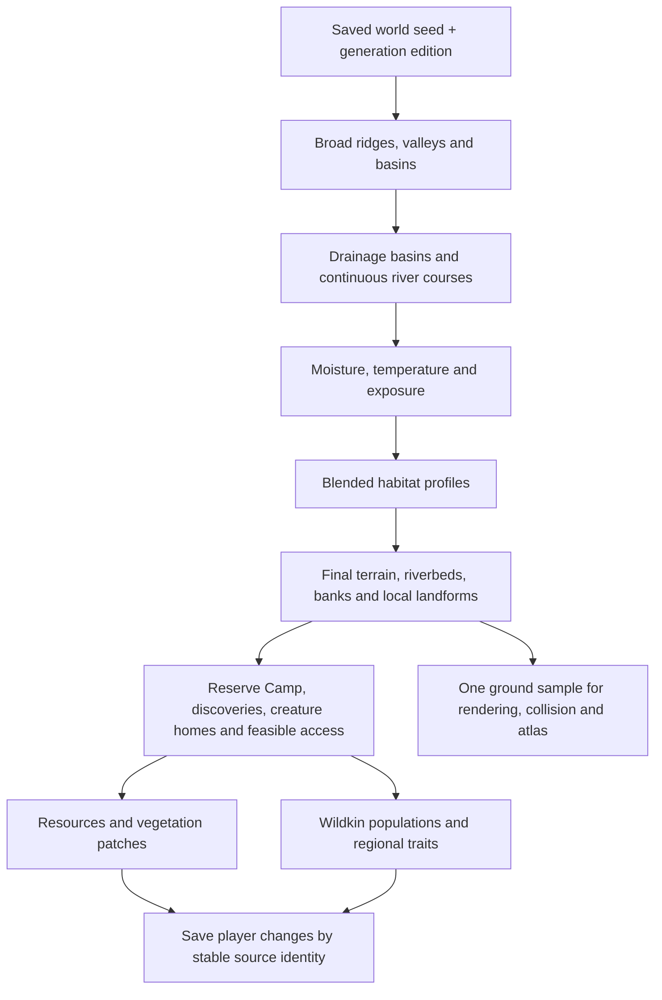

# A living world from one seed

Implementation plan, September 12, 2026. Owner direction: procedural exploration, varied habitats and individuals, dangerous slow travel, mobile/casual first with portrait primary. The local foundation now implements the first broad-province foundation described below; drainage, climate, physical water/weather, overhangs/caves and complete ecosystems remain proposed.

Current local proof: Skybreak still distinguishes true caps, shoulders and lowland fingers and stages lower supplies, upper crystal and one Mossling home. Around its exact reserve, the local foundation adds a deterministic field of jittered roughly600m sites with smooth weighted ecotones and three height grammars: lush rolling ground, pale Sunscar ribs/basins and directional Ironspine ridges, clamped to0..84m. The same weights drive color and bounded ordinary forage/scenery/wildlife recipes. Selected R3 is5.5/10 HOLD; all1,191 tests and aggregate build/validation pass. Native/portable evidence is recorded in `art/reviews/regional-provinces/receipt.md`.

**Latest explicit owner steering:** lean toward extreme geography and large biomes: tall narrow plateaus to jump between, different life/resources above and below, large mountains/deserts and unusual alien formations. Lay foundations for later weather and day/night. These are accepted direction; exact scales, algorithms and cave/architecture choices below remain provisional.

September13 continuation: `frontierDiscovery` now validates one authored receiver/chest location on the canonical seeded ground, with both object support/clearance checks. Persistent loot identity is independent of visual residency, preserving one-time and partial rewards through load/unload. Distributed regional secrets remain next-content work. A shared ephemeral scenery preparation cache removes repeated overlapping forage/wildlife recipe generation; native bursts608.2/455.5ms→191.3/146.5ms, still above a frame budget. Preserve synchronous support on initial load/resume/teleport when introducing bounded ordinary-walk preparation. Exact failure hazards and responsible owners: `art/reviews/frontier-discoveries/streaming-audit.md`.

[`REGIONAL_DIVERSITY_PLAN.md`](REGIONAL_DIVERSITY_PLAN.md) develops six regional grammars, progression principles and reusable ecology kits. Lush, Sunscar and Ironspine now have generated foundation grammars in the local foundation; their deeper ecology/discoveries and the other three families remain proposed.

## Terrain representation

Keep the current heightfield: a function gives ground height at any horizontal world position. Sample it into local chunk meshes and Rapier surfaces as the player travels. We do not need to store a giant image of the entire world. Terrain, collision, map and object grounding must share that function.

The active province field keeps the authored Camp/apron, starter route and selected Skybreak geometry exact, then fades toward a weighted regional target. Province metadata is separate from the legacy section/Camp identity so current outing, save and activation owners do not acquire a second meaning. A bounded globally aligned coarse grid accelerates mesh color sampling only (2m grid, at most27×27 samples); analytical height remains exact for rendered geometry, physics, support and atlas callers.

Use three scales deliberately: broad regional ridges/basins, medium shoulders/hollows, and restrained surface detail. Starting ranges to try are roughly 120–300m for major forms and 40–80m for middle forms; these are provisional tuning, not accepted world scale. At a portrait camera, the nearby shoulder, silhouette and route matter more than tiny noisy bumps.

Those ranges describe local landforms, not biome size. The owner's newer extreme-world steering calls for regions large enough to contain several distinct outings, with substantial height contrasts and recognizable skyline shapes. Tune biome extent and vertical range against actual travel time and portrait sightlines. A small flat clearing remains a useful test fixture, not the visual destination for the world.

The authored Camp remains a safe starting reserve with a blended apron. Reusable terrain stamps provide occasional cliff shelves, ramps and landmark foundations. A heightfield cannot represent several ground heights at the same horizontal position: cave interiors, arches and overhangs need separate geometry and deliberately authored collision. Fully editable voxel terrain is outside this foundation.

Regular meshes cover50×50m with25×25 grid cells:676vertices and1,250triangles, with additional breakpoints in the terrace chunk. Skybreak adds four bounded1m-detail chunks atx=-1..0,z=-5..-4. Public ground queries in those chunks interpolate the exact rendered/Rapier triangle, and their perimeter follows the actual neighboring coarse edge curves. Grid connectivity is reusable; world-space samples supply height and color. Farther simplified silhouettes, arbitrary overhangs and new regional detail modes remain future work.

An overhang kit may provide both a walkable top and an underside, with matched 3D collision and camera clearance. Cave floors remain separate surfaces. Decor on these models must use prepared sockets or a placement-time query against the actual eligible surface; the main terrain height cannot place it correctly. Large formations precede decoration. Ground materials and scatter both consume semantic surface/habitat data, so recoloring a texture never changes the ecosystem.

## Extreme regions and vertical habitats

Start the first dramatic landform family with a plateau field: seed controls pillar grouping, spacing, height bands and cap profiles. Use a heightfield where it resolves the shape cleanly; use reusable closed cliff/pillar meshes for narrow shafts and undercuts that exceed the grid's useful resolution. Rendering and collision must agree on the top, sides and underside. Avoid an extremely dense uniform world grid merely to sharpen a few pillars.

Treat a spawn surface as a supported position plus normal, semantic tags and stable identity. Plateau cap, cliff ledge, shaded lowland and cave floor can therefore select different plants, resources and Wildkin even at similar horizontal coordinates. The current samplers only return one ground height; multiple-surface placement is a future explicit contract, not already supported by every caller.

Generate important crossings against actual jump/climb/fall rules: usable landing area, gap width, height difference, collision and a deliberate return/descent route. Optional dangerous jumps can guard rare discoveries. Required early supplies must not depend on an impossible jump roll. Validate representative routes with real physics before admitting a new landform family.

Large desert basins, mountain chains, spires and alien rock/root structures are separate landform recipes sharing the same seed, reservation and surface rules. Region identity comes from silhouettes and navigation as well as color/scatter. Distant coarse silhouettes and vertical camera readability become prerequisites for selling large heights, rather than afterthoughts after density.

## Cave instances, time and weather

Prefer a visible overworld cave mouth that leads into a separately loaded persistent cave instance for the first deep-cave slice. Derive its seed from the world descriptor and stable entrance ID. Save its discoveries/depletion and the exact overworld return anchor; reload inside the cave must restore the same instance. Reuse the existing section/portal lifecycle after adapting it to generated instance identities. This is a proposed route, not a claim about another game's implementation or a completed cave system.

A short winding entrance can conceal loading later; a brief transition is acceptable in an early reliable version. Shallow alcoves/arches can remain in the overworld. Deep instances permit different atmosphere, life, geometry and budgets without holding an entire underground world in memory.

The rendering-free `savedProcessClock` now supplies one reusable active-play accumulator to Camp crops and young growth. It commits through their existing save transactions in five-second quanta and adds no schema, offline progress or simulation framework. A future day/night and regional-weather clock is a separate unimplemented authority driven by the existing loop; lighting, effects and creature schedules must not invent per-system clocks. Define persistence/pause rules when that slice starts. No weather, dynamic day/night, offline care penalty or absence debt ships now.

## Entity architecture

Retain the current explicit modules and composition-based data records: identity, appearance, movement, needs and habitat preferences can be independently owned inputs to the systems that use them. Mesh/physics objects wrap runtime resources with clear creation/disposal. This captures useful modularity without introducing an ECS framework or deep inheritance hierarchy now. The project currently has one loop and bounded populations; profile an actual entity-scale bottleneck before proposing an ECS migration. World shape and cave instances do not require that migration.

Chris clarified that his ECS interest concerns modular buffs/debuffs, crops, Wildkin and crafting machines, rather than a particular library. Proposed composition boundaries and the existing owners are in `SIMULATION_PLAN.md`. This clarification does not authorize an ECS migration or change active-play-only growth.

## Rivers and untamed travel

Accepted owner steering: include a river generation pass; do not give the world a predictable web of prepared paths. Some areas should require the player to clear a way through. Reachability checks must not imply visible roads or a universal corridor clearance mask.

Plan drainage at regional scale from broad basins/ridges before final detail and scatter. Give connected river segments stable identities and shared endpoints/elevations across chunk boundaries; resolve sinks as deliberate lakes/basins or a drainage outlet. Carve beds and banks, then derive wet habitat influence, crossings and vegetation from the same river description. Do not independently roll river direction per loaded chunk. A coarse drainage graph and bounded channel curves are a provisional starting approach, not a shipped hydrology or erosion simulation.

Travel should alternate open terrain, difficult scrub, riverbanks, ridge passes, occasional local animal trails and dense clearable patches. Rivers can guide exploration but cliffs, waterfalls, marshes and gorges can interrupt easy travel along them. Important discoveries need plausible approaches through walking, climbing, jumping or clearing; optional shortcuts can remain hazardous. Preserve the welcoming Camp reserve, without extending its prepared access pattern across the frontier.

Blocking vegetation must be actual harvestable/clearable objects using stable source identities, physics and saved depletion/removal. Cheap decorative grass remains nonblocking. Clearing should open real space that remains open on return; drawing thinner grass along an invisible route is not that mechanic. Choose reusable thicket/log pieces and tool requirements when this playable slice starts.

## Habitat maps are mixtures

Generate broad moisture and temperature fields, influenced by macro elevation and exposure. Blend a small set of habitat profiles continuously. Those profiles can influence smaller terrain forms, ground palette, plant families and spawn suitability. Recompute final slope/access after all terrain shaping. This avoids circular logic where final height and biome repeatedly change one another.

| Conditions | Example local expression | Exploration consequence |
| --- | --- | --- |
| Wet + sheltered + low relief | Fern hollow, thick low plants, soft banks | Food and grazing/defensive Wildkin |
| Wet + exposed + rocky | Sparse canopy, rock shelves, hardy reeds | Harder travel and different regional traits |
| Dry + warm + broken relief | Open scrub, mineral outcrops, narrow refuges | Territorial encounters and valuable supplies |

These are candidate recipes, not implemented new biomes. Recombining density, palette, landform, plant family and creature population should create related places with different identities. More combinations alone will not prevent repetition; region-scale composition and recognizable rare discoveries are also necessary.

## Placement and life

Choose landmark sites, essential local approaches and animal homes before final decoration. Reject or adapt sites using final slope, water/bank distance when physical water exists, clearance and route difficulty. Do not reserve a global network of clear corridors. Resources and plants grow in coherent patches with open pockets and deliberately clearable obstacles. Decorative grass can fill roaming ground, while solid rocks and trunks respect local interaction and safety clearances.

Wildkin habitat preferences decide suitable homes and population mixes. Their regional recipe can then influence expressed traits without rerolling the same individual on every visit. Group movement, feeding, resting, predator pressure and ambient motion are later bounded behavior slices; current denser grass does not establish an ecosystem simulation.

Water needs its own shared level, shoreline, safe-bank, swimming and spawn rules. A blue-green terrain color or moisture score is not physical water. Start with a small reliable basin/bank slice before connected rivers; avoid a large erosion or fluid simulation in the mobile foundation.

## Determinism and streaming

- One immutable saved descriptor owns seed and generation edition. Derive separate random streams for terrain, climate, plants, wildlife and discoveries, so adding a decorative variation does not move a mineral deposit.
- Use absolute world coordinates and shared edge samples. Generation must not depend on travel direction, frame timing or chunk load order.
- Regenerate ordinary world content from the descriptor; save player changes such as depletion, discoveries, captured origins and construction.
- Namespace changed-generation records, or deliberately start a fresh world when generation changes. Existing coordinate-only IDs cannot safely be reused across unrelated seeds.
- Keep bounded residents and simple near/far presentation. Distant terrain, progressive generation work and origin rebasing follow measured bottlenecks; do not claim unbounded runtime range before those are proven.

## What ships, and what comes next

| Already in the project | Still to implement |
| --- | --- |
| Global height sampler, 50m streamed chunks, shared edges/collision, exact Camp/starter/Skybreak reserve; one immutable descriptor injected through all current generation layers | Climate and drainage layers using that descriptor |
| Three broad weighted terrain grammars—lush, Sunscar, Ironspine—with0..84m regional targets and continuous ecotones | Richer landform/detail passes and three additional regional families |
| Bounded regional forage/scenery/wildlife recipes using admitted assets, stable captured individuals and personal atlas; existing caps unchanged | Discovery reservations, richer populations, regional trait distributions |
| One fixed deterministic world edition | Safe alternate-world creation, generation namespaces, distant terrain and rebasing |
| CLI inspector for same-world elevation, current wetland weight, slope and generated candidates | Climate moisture/temperature fields and regional recipe inspection |

Descriptor injection is integrated: progress exposes one immutable identity from its strictly validated atlas/ecology metadata before runtime construction. Terrain, built-in grass, forage, wildlife, scenery and scenery grass use that identity with separate domains. Default output remains exact. Alternate descriptors are supported in isolated generator tests; saved alternate worlds are deliberately still rejected. Before exposing a seed selector, add top-level save authority and namespace atlas/resource/source IDs, then validate owned, captured, pending-run and breeding provenance at every transaction/import boundary. Runtime world identity stays immutable until page reconstruction; no live seed swap.

`tools/inspect-frontier.mjs` now writes a compact JSON report and four-panel SVG under `.dream-loop/frontier-inspector/`. It accepts bounded seed, center, extent and resolution options, uses the normalized world descriptor, actual Camp surface and current terrain/ecology/wildlife/scenery samplers, and shows elevation, local slope, terrain color plus candidates, and the existing `habitatBlend.wetland` weight over identical bounds. That wetland weight combines terrain noise and lowland height; it is not the proposed climate-moisture field. Use this diagnostic with [`REGIONAL_DIVERSITY_PLAN.md`](REGIONAL_DIVERSITY_PLAN.md) to build one compelling connected sequence before expanding the palette.

Noise elevation/moisture maps and combinations are illustrated by [Red Blob Games](https://www.redblobgames.com/maps/terrain-from-noise/). [FastNoiseLite](https://github.com/Auburn/FastNoiseLite) supplies reusable noise algorithms; evaluate a local vendored implementation if it materially improves the next slice. No new dependency is adopted by this plan.
