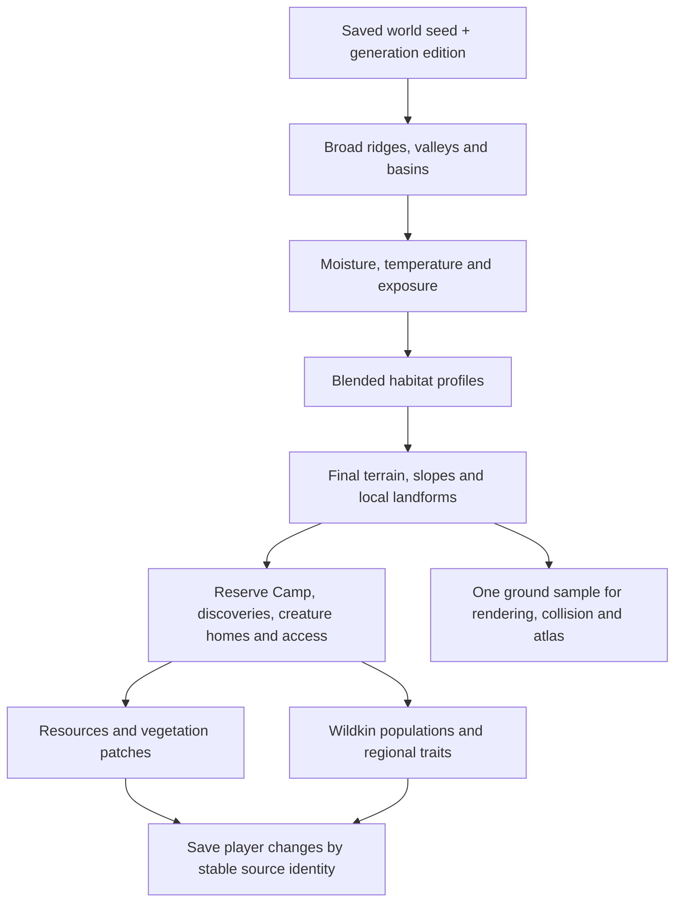

# A living world from one seed

Provisional implementation plan, September 12, 2026. Owner direction: procedural exploration, varied habitats and individuals, dangerous travel, mobile/casual first with portrait primary. This describes the intended generator; it does not claim those layers already ship.

**Latest explicit owner steering:** lean toward extreme geography and large biomes: tall narrow plateaus to jump between, different life/resources above and below, large mountains/deserts and unusual alien formations. Lay foundations for later weather and day/night. These are accepted direction; exact scales, algorithms and cave/architecture choices below remain provisional.

## Terrain representation

Keep the current heightfield: a function gives ground height at any horizontal world position. Sample it into local chunk meshes and Rapier surfaces as the player travels. We do not need to store a giant image of the entire world. Terrain, collision, map and object grounding must share that function.

Use three scales deliberately: broad regional ridges/basins, medium shoulders/hollows, and restrained surface detail. Starting ranges to try are roughly 120–300m for major forms and 40–80m for middle forms; these are provisional tuning, not accepted world scale. At a portrait camera, the nearby shoulder, silhouette and route matter more than tiny noisy bumps.

Those ranges describe local landforms, not biome size. The owner's newer extreme-world steering calls for regions large enough to contain several distinct outings, with substantial height contrasts and recognizable skyline shapes. Tune biome extent and vertical range against actual travel time and portrait sightlines. A small flat clearing remains a useful test fixture, not the visual destination for the world.

The authored Camp remains a safe starting reserve with a blended apron. Reusable terrain stamps provide occasional cliff shelves, ramps and landmark foundations. A heightfield cannot represent several ground heights at the same horizontal position: cave interiors, arches and overhangs need separate geometry and deliberately authored collision. Fully editable voxel terrain is outside this foundation.

Current regular meshes cover50×50m with25×25 grid cells:676vertices and1,250triangles, with additional breakpoints in the terrace chunk. Grid connectivity is reusable; world-space sampling supplies each vertex's unique height and color. Border heights and normal samples are shared. This is a tunable starting density; distant simplified meshes and detail around special landforms require explicit seam and physics proof before admission.

An overhang kit may provide both a walkable top and an underside, with matched 3D collision and camera clearance. Cave floors remain separate surfaces. Decor on these models must use prepared sockets or a placement-time query against the actual eligible surface; the main terrain height cannot place it correctly. Large formations precede decoration. Ground materials and scatter both consume semantic surface/habitat data, so recoloring a texture never changes the ecosystem.

## Extreme regions and vertical habitats

Start the first dramatic landform family with a plateau field: seed controls pillar grouping, spacing, height bands and cap profiles. Use a heightfield where it resolves the shape cleanly; use reusable closed cliff/pillar meshes for narrow shafts and undercuts that exceed the grid's useful resolution. Rendering and collision must agree on the top, sides and underside. Avoid an extremely dense uniform world grid merely to sharpen a few pillars.

Treat a spawn surface as a supported position plus normal, semantic tags and stable identity. Plateau cap, cliff ledge, shaded lowland and cave floor can therefore select different plants, resources and Wildkin even at similar horizontal coordinates. The current samplers only return one ground height; multiple-surface placement is a future explicit contract, not already supported by every caller.

Generate important crossings against actual jump/climb/fall rules: usable landing area, gap width, height difference, collision and a deliberate return/descent route. Optional dangerous jumps can guard rare discoveries. Required early supplies must not depend on an impossible jump roll. Validate representative routes with real physics before admitting a new landform family.

Large desert basins, mountain chains, spires and alien rock/root structures are separate landform recipes sharing the same seed, reservation and surface rules. Region identity comes from silhouettes and navigation as well as color/scatter. Distant coarse silhouettes and vertical camera readability become prerequisites for selling large heights, rather than afterthoughts after density.

## Cave instances, time and weather

Prefer a visible overworld cave mouth that leads into a separately loaded persistent cave instance for the first deep-cave slice. Derive its seed from the world descriptor and stable entrance ID. Save its discoveries/depletion and the exact overworld return anchor; reload inside the cave must restore the same instance. Reuse the existing section/portal lifecycle after adapting it to generated instance identities. This is a proposed route, not a claim about another game's implementation or a completed cave system.

A short winding entrance can conceal loading later; a brief transition is acceptable in an early reliable version. Shallow alcoves/arches can remain in the overworld. Deep instances permit different atmosphere, life, geometry and budgets without holding an entire underground world in memory.

Reserve one simulation-clock owner driven by the existing game loop for eventual day/night and regional weather. Lighting, ambient effects and creature schedules read that clock; they must not create independent timers or per-system copies. Weather derives from regional climate, elevation, shelter and bounded weather state, with pooled visual effects. Define persistence/pause rules when that slice starts; no offline care penalty or absence debt is implied. No weather or dynamic day/night ships in the current checkpoint.

## Entity architecture

Retain the current explicit modules and composition-based data records: identity, appearance, movement, needs and habitat preferences can be independently owned inputs to the systems that use them. Mesh/physics objects wrap runtime resources with clear creation/disposal. This captures useful modularity without introducing an ECS framework or deep inheritance hierarchy now. The project currently has one loop and bounded populations; profile an actual entity-scale bottleneck before proposing an ECS migration. World shape and cave instances do not require that migration.

## Habitat maps are mixtures

Generate broad moisture and temperature fields, influenced by macro elevation and exposure. Blend a small set of habitat profiles continuously. Those profiles can influence smaller terrain forms, ground palette, plant families and spawn suitability. Recompute final slope/access after all terrain shaping. This avoids circular logic where final height and biome repeatedly change one another.

| Conditions | Example local expression | Exploration consequence |
| --- | --- | --- |
| Wet + sheltered + low relief | Fern hollow, thick low plants, soft banks | Food and grazing/defensive Wildkin |
| Wet + exposed + rocky | Sparse canopy, rock shelves, hardy reeds | Harder travel and different regional traits |
| Dry + warm + broken relief | Open scrub, mineral outcrops, narrow refuges | Territorial encounters and valuable supplies |

These are candidate recipes, not implemented new biomes. Recombining density, palette, landform, plant family and creature population should create related places with different identities. More combinations alone will not prevent repetition; region-scale composition and recognizable rare discoveries are also necessary.

## Placement and life

Choose landmark sites, important access corridors and animal homes before final decoration. Reject or adapt sites using final slope, water/bank distance when physical water exists, clearance and route difficulty. Resources and plants grow in coherent patches with open pockets. Decorative grass can fill roaming ground, while solid rocks and trunks respect wider clearances.

Wildkin habitat preferences decide suitable homes and population mixes. Their regional recipe can then influence expressed traits without rerolling the same individual on every visit. Group movement, feeding, resting, predator pressure and ambient motion are later bounded behavior slices; current denser grass does not establish an ecosystem simulation.

Water needs its own shared level, shoreline, safe-bank, swimming and spawn rules. A blue-green terrain color or moisture score is not physical water. Start with a small reliable basin/bank slice before connected rivers; avoid a large erosion or fluid simulation in the mobile foundation.

## Determinism and streaming

- One immutable saved descriptor owns seed and generation edition. Derive separate random streams for terrain, climate, plants, wildlife and discoveries, so adding a decorative variation does not move a mineral deposit.
- Use absolute world coordinates and shared edge samples. Generation must not depend on travel direction, frame timing or chunk load order.
- Regenerate ordinary world content from the descriptor; save player changes such as depletion, discoveries, captured origins and construction.
- Namespace changed-generation records, or deliberately start a fresh world when generation changes. Existing coordinate-only IDs cannot safely be reused across unrelated seeds.
- Keep bounded residents and simple near/far presentation. Distant terrain, progressive generation work and origin rebasing follow measured bottlenecks; do not claim unbounded runtime range before those are proven.

## What ships, and what comes next

| Already in the project | Still to implement |
| --- | --- |
| Global height sampler, 50m streamed chunks, shared edges/collision, authored Camp reserve | One saved seed passed into every generation layer |
| Two blended habitat influences and a staged rolling transition/terrace | Broader climate fields and several distinct regional terrain profiles |
| Bounded forage/scenery/wildlife, stable captured individuals, personal atlas | Discovery reservations, richer populations, regional trait distributions |
| One fixed deterministic world edition | Safe alternate-world creation, generation namespaces, distant terrain and rebasing |

Next bounded slice: wire the existing descriptor through all samplers and runtime owners while retaining the current default result. Prove same-seed reproduction, cross-chunk continuity and independent random streams with alternate test seeds. Do not offer a seed selector until atlas, resource depletion and captured-source identities are scoped to that world.

Then produce a small visual generator inspector showing elevation, moisture, habitat mixture, slope and placements for the same area. Use it to build one compelling sequence of connected regions before expanding the palette. Root owns integration and generation order; separate workers can own pure fields, an inspector or habitat/content recipes with explicit file ownership.

Noise elevation/moisture maps and combinations are illustrated by [Red Blob Games](https://www.redblobgames.com/maps/terrain-from-noise/). [FastNoiseLite](https://github.com/Auburn/FastNoiseLite) supplies reusable noise algorithms; evaluate a local vendored implementation if it materially improves the next slice. No new dependency is adopted by this plan.
