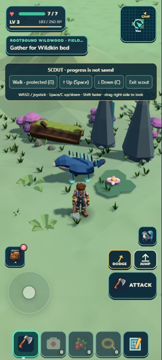
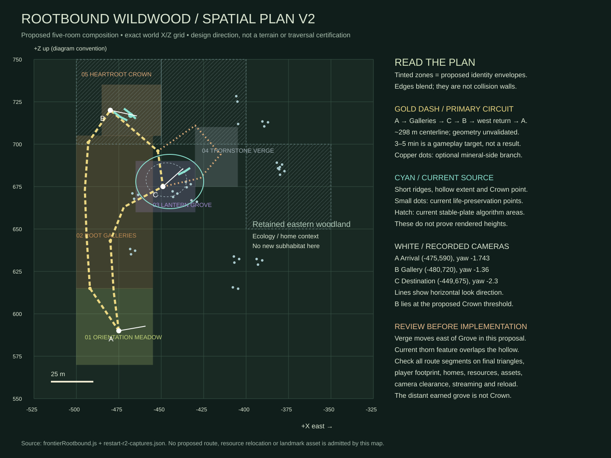
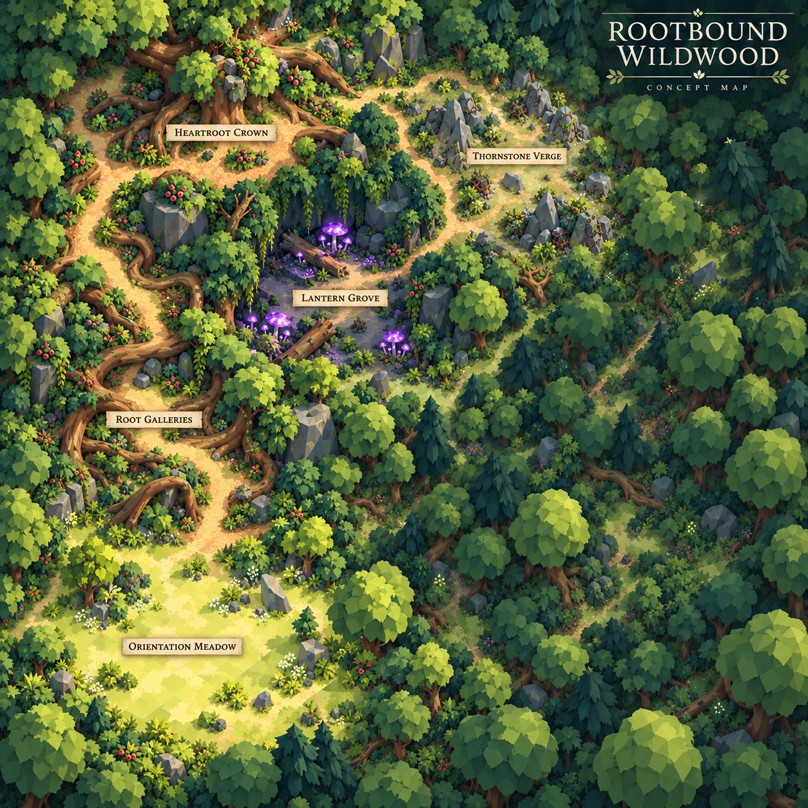
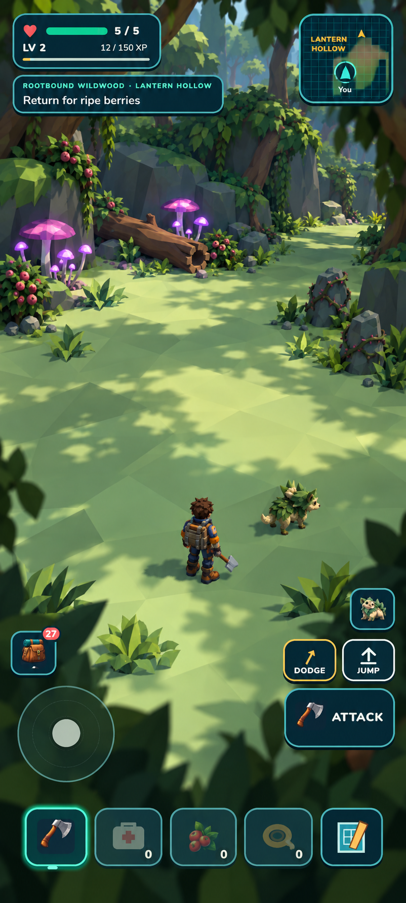

# Rootbound Wildwood — living dossier V1

**Stopped checkpoint:** fourteen existing root/leaf groups now connect Gallery shoulders and outer Grove edges, with all 57 curated groups admitted. Independent review retains the partial region gain; the full showcase remains unfinished. Chris requested stopping at this checkpoint; fresh direction is required. [Actual before/after gallery](../../../art/reviews/rootbound-wildwood/connected-edges-r1/review.html).

**Latest runtime status:** one retained TRELLIS Trailgloam now lives on the western Grove edge, alongside the unchanged two Mossling homes. It is an attackable, skittish observer with slow roaming, not catalog-bondable and not a complete companion. No asset experiments; faster escape motion and exact foot contact are deferred. [Actual in-game evidence](../../../art/reviews/trailgloam-encounter-r1/review.html). Older candidate-only statements below are historical.

**Showcase direction:** prioritize a diverse, full, living Rootbound that rewards exploring, looking closely, harvesting and observing Wildkin. Use good-looking useful models even when they differ from a target. Review reusable parts, credible arrangement/scale/tint variants and useful bendable root/trunk authoring; judge actual placement and interaction. [Practical review direction](../../ROOTBOUND_ASSET_REUSE_REVIEW.md).

Rootbound is the current focus: a shaded, root-sculpted woodland built around readable clearings, low ridges, thornstone seams and a damp hollow. Its proposed Heartroot Crown landmark must not be confused with the player's retained earned grove. This dossier preserves the existing [packet](PACKET.md), source evidence and held trials; proposed content remains distinct from implemented gameplay.

## Future illustrated field journal

These dossiers are also intended as a reusable source for player-facing habitat, Wildkin, material and discovery entries. Each should connect a strong illustration with identification cues, ecological relationships and useful observations. Keep player knowledge, discoverable secrets and production notes separate, with one traceable fact source. Read the [field-journal content contract](FIELD_JOURNAL_SOURCE.md) for the proposed entry structure and review requirements. No journal or discovery-unlock system is implemented by this documentation.

[Showcase V1 status](SHOWCASE_V1.md) separates the playable milestone from dossier completeness.

## Actual, retained foundation

The retained region now has faceted shoulders and connected low-cover bands, followed by six larger existing-kit assemblies at the Galleries and Heartroot Crown. The paired Gallery edges and close Crown boundary are independently retained as useful blockout progress; the long Gallery stretch remains too open. The Grove colony and earlier useful work remain. Asset experiments are paused. [Latest actual enclosure comparison](../../../art/reviews/rootbound-wildwood/enclosure-r1/review.html).

Latest implemented detail: the Lantern threshold now carries a modest irregular faceted ground surface through the actual terrain and collision mesh. Independent review retains it, the developer and packaged poses agree, and the scoped crossing/support checks pass. [Actual integrated ground comparison](../../../art/reviews/rootbound-wildwood/terrain-facets-r3/review.html). This is one local floor treatment, not completion of the five proposed rooms.

Trailgloam's retained TRELLIS model now has an independently reviewed fitted eight-leg animation diagnostic. It is still an asset candidate rather than a spawned encounter. [Actual translated motion and remaining work](../../../art/reviews/trailgloam-travel-r1/review.html).

`src/world/frontierRootbound.js` owns a bounded Rootbound profile, clearing palette preservation, two ridge/clearing/hollow relief language, and curated fixed scenery. `frontierScenery.js` gates Rootbound curation to its profile/default world and retains protected identity sampling. Existing eligible visual roles are the admitted paddle/canopy, fallen-log, mushroom-ring, fen-stone and related low-kit families recorded in the packet/review receipts. The exact protected harvestables, wildlife homes, grove and route remain authoritative in the packet and current source.

Use the [current spatial plan](SPATIAL_PLAN.md) for the five proposed subhabitat locations and route hypothesis. Original packet diagrams are preserved as history; current source and native captures remain implementation evidence.

This first illustrated map explores ecological identity and massing. Its dramatic hollow walls and root crossings are not approved construction details. The technical map governs planned locations; neither map proves a walkable route.

## Environmental direction — proposed, not simulated

A cool-temperate, rain-fed woodland: approximately 10–19°C seasonal daytime design range, high canopy humidity, damp organic hollows, and drier exposed thornstone ribs. These are design cues for value zoning and ecology, not a weather, temperature, moisture, crafting, or save system.

| Zone | Ground / climate cue | Existing role | Proposed ecological emphasis |
|---|---|---|---|
| Root ridge | drier, wind-exposed, darker roots | route edge / landmark | sparse thornstone and exposed fallen wood |
| Open clearing | brighter leaf litter, usable floor | safe orientation | retained forage visibility and low clustered growth |
| Lantern hollow | damp, shaded, enclosed | visual discovery room | fungi/rings and decomposing wood |
| Thornstone seam | mineral-grey, broken slope | risk/readable edge | stones, low thorns, constrained passage |
| Grove threshold | established vegetation | earned-home continuity | no identity or footprint change |

## Constituent priorities

1. **Root architecture and canopy mass** — visual gap remains; the held buttress-tree trials are historical, not admitted.
2. **Hollow floor ecology** — mushroom, log and low-cover families should cluster by damp shelter rather than uniform scatter.
3. **Thornstone seam** — use existing stone family only where full support and portrait framing prove it reads.
4. **Named harvestable presentation** — future names/visual distinctions may map to existing wood/stone categories, but no runtime inventory type is proposed.
5. **Wildkin niche** — preserve Mossling and its Bloom ability relationships; a Rootbound-native candidate needs a separate visual and gameplay review before admission.

See constituent dossiers for bounded families. No new asset, decor, harvestable, discoverable, Wildkin or system is accepted by this document.

## Zone field guide

### Root Galleries — implemented terrain language; proposed richer landmark read
Root Galleries are the drier, raised corridors between root ribs. Their walking floor should remain visibly broad while the sidewall rises in broken, low buttresses. The local microclimate is cool and intermittently sunlit: canopy gaps dry the leaf litter after rain, while root undersides retain dark humus. The player purpose is orientation—choose the quiet gallery for safe travel or follow the more crowded ridge edge toward stone and discovery. Existing relief and curated records establish this grammar; a future root-architecture asset would make the gallery silhouette legible beyond current low props.

### Lantern Grove — proposed hollow ecology on implemented clearing palette
Lantern Grove is the humid basin: shade, decomposing wood, shallow moss colour and grouped fungi. It is not water or a new wetness mechanic. The floor stays traversable and visually lighter in its center so a player can read companions, forage and return direction under the HUD. Mushroom rings belong near log ends and root hollows; pale blooms occupy the transition from clearing to shade. This creates proposed vegetation shelter around a future creature pocket; Bloom is Mossling's ability, not a separate species or flower asset.

### Thornstone Verge — implemented stone seam; proposed mineral story
The Verge is a grey-green, droughtier seam where shallow soil gives way to thornstone. It should read as a side-edge decision, not a wall: fragmented upright forms, exposed stone chips and low hardy cover frame an open travel lane. Stone harvest presentation can use a unique Rootbound visual/name while feeding the shared **stone** crafting category. The value is recognizability and route contrast, not a new mineral economy.

### Heartroot Crown — proposed landmark and discovery anchor
Heartroot Crown is a proposed old-root landmark, not the existing earned-grove threshold. Its intended character is sheltered canopy, stable leaf litter and fewer thornstone intrusions. A later discoverable can be a visual/root landmark or lore-facing observation; its location and relationship to existing content require spatial and gameplay review.

## Climate and material gradient

| Measure | Galleries | Lantern Grove | Verge | Crown |
|---|---:|---:|---:|---:|
| Day air (design range) | 12–18°C | 10–15°C | 13–19°C | 11–16°C |
| Relative moisture cue | medium | high | low–medium | medium–high |
| Light/value | broken mid-dark | diffuse dark | exposed mid | warm filtered mid |
| Dominant material | weathered root/leaf litter | humus, log, fungi | thornstone, dry root | old root, settled litter |

These are composition references; the game has no temperature or moisture simulation.

## Material and harvestable presentation

| Provisional field name | Zone | Visual distinction | Shared category | State |
|---|---|---|---|---|
| Galleryfall wood | Galleries | pale split rootwood with dark bark seams | wood | proposed visual naming |
| Lanterncap forage | Lantern Grove | clustered low luminous-cap silhouette, never a floating glow | food | proposed presentation |
| Verge thornstone | Verge | grey-green angular shard with oxidized root marks | stone | proposed presentation |
| Crownfiber | Crown edge | long muted gold-green strands at root base | fiber | proposed presentation |

The names are working labels, not accepted UI strings or new item IDs. Existing harvesting and its categories stay authoritative.

## Ecology relationships

Root ribs create shade and a protected windbreak; fallen wood retains moisture; fungi group around that wood; thornstone interrupts soil depth and pushes low cover into seams; open clearings preserve forage visibility. Mossling movement needs supported open floor; its two current default-world source homes are in the retained eastern woodland, outside the proposed five-room circuit. Bloom is its companion ability. Pale flowers at sheltered clearing margins are a vegetation proposal, not a second species. Trailgloam is a native candidate with a retained eight-legged, paired-frond TRELLIS model and fitted movement diagnostic; gameplay admission remains pending; its possible niche is low-light root-hollow scouting, not replacing Mossling or creating a new encounter mechanic.

## Player purpose

**Composite harvestables:** Chris proposed independently harvestable tree parts, such as cutting a crossing root while the trunk and canopy remain. All harvested parts should regrow on much longer timers, with nearby structures suppressing regrowth for settled clearings. The [composite-harvestable dossier](constituents/composite-harvestables.md) connects this to modular art, saved partial state and safe regrowth. These are design directions, not implemented composite destruction or building suppression.

Exploration includes easy travel and optional places reached through current climbing or harvestable clearing. See [traversal and discovery intent](TRAVERSAL_INTENT.md). Difficult access can be intentional; an unavoidable trap is a defect. Broader decor destruction and emergency evacuation remain future proposals.

A Rootbound visit should offer a readable safe gallery, a richer hollow edge, a thornstone-side choice, and a clear return cue at the Crown. Harvestables remain familiar crafting inputs; the habitat adds visual reason and spatial memory. Discoverables should reward looking at a landmark, not demand a new quest, inventory field or interaction rule.

## Reference and production backlog

The [V2 spatial plan](SPATIAL_PLAN.md) and [visual reference plan](VISUAL_REFERENCE_PLAN.md) guide the map and subhabitat targets. Existing review captures under `art/reviews/rootbound-wildwood/` are actual gameplay evidence. The connected buttress-root now has a reviewed reference and an exported raw geometry master, independently scored 7.2/10 for bounded Blender cleanup; see its [illustrated source/target card](constituents/root-architecture.md). It is not admitted in game. Broader Rootbound tree/wood, mineral, forage and discovery families need developed reference dossiers. Trailgloam has earlier construction references to assess and reuse. Each constituent proceeds through separate target, independent review and bounded production stages; this dossier does not imply asset admission.

## Five connected subhabitats

### Orientation Meadow
**Implemented:** the retained clearing palette and existing ordinary ecology. **Proposed:** a bright, low-relief entry meadow with short grass/leaf-litter scale, medium moisture, scattered Crownfiber margins and an uninterrupted safe route. The open floor could suit a future Mossling encounter, while pale flowers frame the gallery ecotone; no present Meadow resident is asserted. Its landmark is a visible dark rootline ahead, its discoverable purpose is orientation, and it transitions into Galleries through increasing root exposure rather than a hard border.

### Root Galleries
Dry-to-medium ribs rise one to three metres at room edges, with broken warm light and Galleryfall wood. Safe travel follows the broad inner gallery; a richer side route follows root pockets toward thornstone. The landmark is a connected buttress/root silhouette. The selected [buttress-root target](../../../art/targets/rootbound-wildwood/constituents/buttress-root/selected.png) is a reference direction, not admitted geometry.

### Lantern Grove
A humid, low, dark hollow transitions from Galleries through fallen wood and thicker shade. Lanterncap forage/fungi group at log/root contact; Proposed pale flowers belong at the lighter outer margin. Its safe line remains a dry center; the riskier edge is visually denser and can host a future Trailgloam niche. The landmark is a low lantern-cap/log cluster, never a magical light source.

### Thornstone Verge
This is the exposed, lower-moisture seam: grey-green shards, short hardy growth and sharper side relief. Verge thornstone is a proposed stone-category presentation. The safe route stays on the clearing-facing edge; a risk/reward route samples the seam without closing travel. A broken thornstone line is the landmark and transition from root humus to shallow mineral soil.

### Heartroot Crown
**Proposed zone, relationship unproven:** a sheltered old-root landmark with warm filtered light, deep litter and stable moisture. It is not asserted to be the retained earned grove; any overlap must be verified in source/route evidence. Its purpose is a future visual discoverable and return landmark, with proposed open creature-friendly margins and no new progression mechanics. It transitions from Galleries via denser root collar and fewer thornstone intrusions.

## Visual references

See the new [five illustrated subhabitat references](SCENE_REFERENCES.md), with independent artistic/practical review and an implementation brief. Camera mismatch and asset gaps remain explicit; these are provisional scene references rather than gameplay proof.

The selected portrait direction remains [the Rootbound target](../../../art/targets/rootbound-wildwood/concepts/selected.png); layout and composition references remain linked above. The buttress target supplies the desired connected low-root silhouette. Owner-provided references are preserved under the Rootbound target/review history and guide palette/massing only; native captures remain the implementation authority.

## Constituent dossier index

These are initial working cards, not yet complete production dossiers. Expand them after the current TRELLIS tests and workflow review.

| Constituent | Working dossier |
| --- | --- |
| Orientation Meadow | [Subhabitat card](constituents/orientation-meadow.md) |
| Root architecture | [Buttress roots and trunk anchors](constituents/root-architecture.md) |
| Rootbound wood and trees | [Regional wood family](constituents/rootbound-wood-tree.md) |
| Thornstone and minerals | [Stone family](constituents/thornstone-mineral.md) |
| Forage and fungi | [Lantern Grove forage family](constituents/forage-fungus.md) |
| Wildkin | [Verified distribution, Mossling and Trailgloam dossiers](constituents/wildkin.md) |
| Heartroot Crown | [Landmark and discovery card](constituents/heartroot-crown.md) |

[TRELLIS experiment history](../../TRELLIS_EXPERIMENT_LEDGER.md) records successful Mossling settings and the current root trial. [Focused goal](../../ROOTBOUND_FOCUSED_GOAL.md) records the active scope, source-quality priority and working six-attempt allowance.
