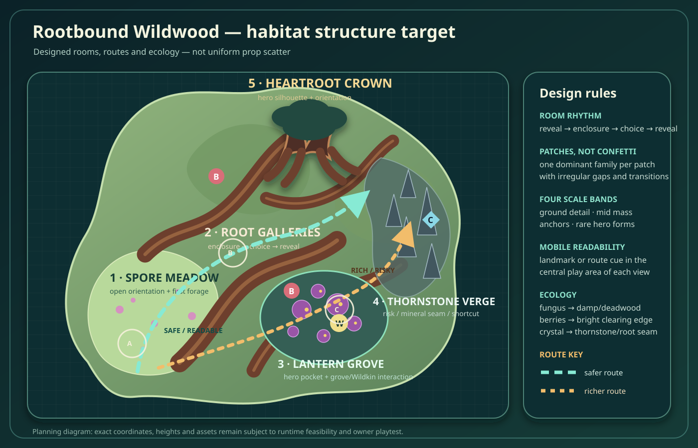
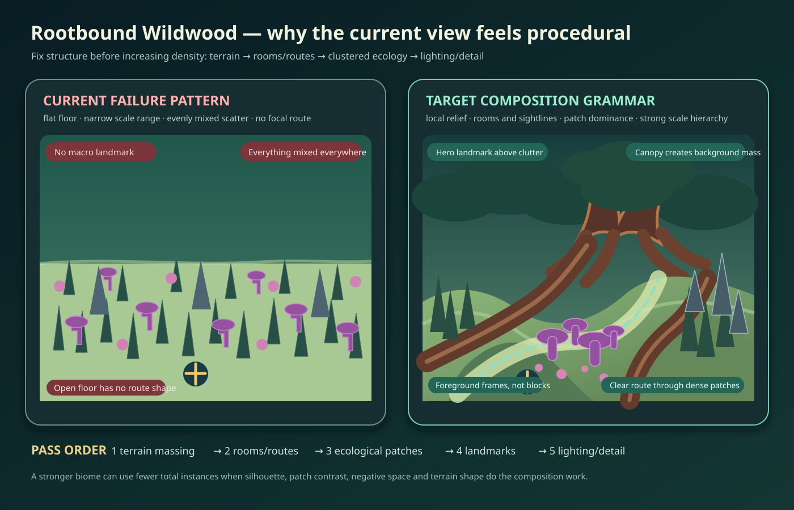

# Rootbound Wildwood — habitat packet

**Status:** production target and review contract, not accepted runtime content.  
**Priority:** exploration first; Wildkin collection second; Camp/building consequences later.  
**Primary surface:** ordinary portrait mobile play, with landscape/desktop support.  
**Related skill:** [habitat-development](../../../.agents/skills/habitat-development/SKILL.md).





## One-line fantasy

A tangled alien forest where enormous surface roots divide the land into sheltered rooms, luminous fungal clearings, fallen-log passages, and darker thornstone pockets that reward careful navigation rather than uniform wandering.

## Player purpose

Rootbound Wildwood should be a **readable but partially enclosed exploration habitat**:

- enter through an open edge that lets the player orient;
- choose between a safer winding route and a denser, richer route;
- read roots, mushrooms, stone thorns, light, and ground moisture as ecological signals;
- find useful forage, a grove interaction, a Wildkin encounter, or a memorable discovery;
- use visible landmarks and openings to return without following a glowing quest trail.

It should feel denser and more secretive than Heartwood Basin, but not like an impassable hedge maze.

## Current phone-capture diagnosis

The owner captures show a functional scene with attractive individual low-poly assets, but the habitat does not yet read as a designed wildwood.

### Main visible problems

1. **Flat local terrain**
   - The ground reads as one broad plane.
   - Large-scale continent height does not help when each normal camera view lacks mounds, hollows, shelves, root ridges, or local elevation changes.
   - Props appear placed on a surface rather than growing from or responding to the land.

2. **Even procedural scatter**
   - Grass blades, pink puff plants, purple mushrooms, flowers, and gray spires are mixed at similar frequencies across most of the view.
   - The eye cannot infer soil, moisture, shelter, disturbance, or sub-habitat.
   - Repetition becomes more obvious because gaps and clusters have similar size everywhere.

3. **Weak hierarchy**
   - Most plants live in a narrow medium-size band.
   - There are many repeated marks but few dominant forms.
   - No single background landmark, midground room edge, or foreground frame clearly organizes the image.

4. **Insufficient negative space**
   - Open ground exists, but it is accidental rather than shaped into paths, rooms, or vistas.
   - Dense areas do not feel especially dense because surrounding areas use nearly the same mixture.

5. **Weak “wildwood” identity**
   - The scene reads closer to an alien meadow with mushrooms and spikes.
   - Large roots, trunks, fallen wood, canopy masses, sheltered pockets, and layered forest edges are underrepresented.

6. **Limited scale variance**
   - Repeated plant types are close in height and width.
   - Small ground details, mid-height masses, large anchors, and rare hero-scale forms are not clearly separated.

7. **Flat value and color structure**
   - Pale green ground occupies most of the frame.
   - Purple/pink accents are spread everywhere, reducing their power to identify special fungal pockets.
   - Background foliage and foreground interactables often have similar visual weight.

8. **Weak navigation story**
   - The screenshots do not clearly communicate where the player came from, where a destination is, or which route is safer/richer.
   - The minimap supplies more structure than the world itself.

The solution is not simply “more plants.” The first improvement should be **terrain + negative space + clustered composition**, followed by ecology and asset variety.

## Habitat identity hierarchy

### Macro — recognizable from a distance

Rootbound should be recognizable by:

- dark layered canopy masses and a broken, uneven skyline;
- one **Heartroot Crown** hero landmark: a large split trunk/root arch or clustered ancient tree mass visible through openings;
- broad exposed-root ridges that appear to hold the land together;
- occasional narrow thornstone silhouettes, concentrated at one side rather than distributed everywhere.

The region should not share Skybreak’s open plateau skyline, Heartwood’s welcoming starter clearings, or Fungal Hollow’s mushroom-dominated basin.

### Meso — rooms and routes

The habitat should alternate between:

- open orientation clearings;
- root-walled corridors;
- dense fungal/deadwood pockets;
- raised root shelves and shallow hollows;
- fallen-trunk crossings or arches;
- a riskier thornstone edge with better materials or a shortcut.

A player should experience a rhythm of **reveal → enclosure → choice → reveal**, not constant visual density.

### Micro — readable ecology

Small details should co-occur:

- mushrooms around deadwood, damp hollows, and shaded root bases;
- berry plants at brighter clearing edges;
- fiber/reeds in low moist seams;
- flowers in limited light pockets rather than across the whole forest;
- crystals or mineral fragments where thornstone cuts through roots/soil;
- Mosslings and future native Wildkin near the signals relevant to their behavior.

## Provisional subzones

The final runtime implementation may use different names. The important part is distinct spatial and ecological behavior.

### 1. Spore Meadow — orientation edge

**Role:** entry, visibility, first forage, and a view toward the Heartroot Crown.

- broadest negative space in the habitat;
- low rolling ground with two or three shallow mounds;
- sparse low grasses and small puff plants;
- fungal accents grouped around the edges, not filling the center;
- one visible route opening and one partially hidden richer route.

This is the player’s visual reset before denser travel.

### 2. Root Galleries — enclosed traversal

**Role:** the core wildwood identity and route choice.

- two or three broad surface-root ridges create walls, shelves, and gateways;
- fallen trunks bridge small hollows or form crawl-under/around silhouettes without blocking the camera;
- vegetation follows root edges and sheltered sides;
- open floor lanes remain at least comfortably wider than the player/companion clearance;
- occasional high roots or trunk arches frame the route.

Avoid a single global maze. Galleries should reconnect and offer glimpses of the landmark.

### 3. Lantern Grove — useful destination

**Role:** luminous fungal clearing, grove reward, observation/bond opportunity, and memorable screenshot.

- a shallow damp hollow or sheltered bowl;
- a few large fungus/tree anchors;
- small luminous caps and flowers concentrated near them;
- a clear central interaction area with enough camera space;
- one existing Mossling/grove relationship or one future native Wildkin niche;
- high-value resource placement justified by moisture, deadwood, or Bloom interaction.

This should be a hero pocket, not the visual treatment of the entire habitat.

### 4. Thornstone Verge — risk and reward edge

**Role:** sharper terrain, reduced visibility, mineral/resource reward, and a faster or more dangerous route.

- gray-green stone thorns appear in lines, clusters, or outcrops, never evenly across Rootbound;
- ground becomes firmer, darker, or more broken;
- fewer mushrooms and more hardy reeds/low scrub;
- sightlines tighten, but important threats remain telegraphed;
- a shortcut or richer resource pocket makes the choice meaningful.

This subzone can help transition toward Ironspine, Sunscar, or another rocky neighbor without becoming a repeated copy.

### 5. Heartroot Crown — hero landmark

**Role:** orientation, story implication, and eventual deeper interaction.

- visible from multiple openings;
- substantially larger silhouette than ordinary trunks;
- asymmetrical roots and canopy;
- not necessarily reachable in the first pass;
- may later support a discovery, nest, field note, rare individual, shortcut, or Camp-related material.

For the first improvement slice, its job is primarily spatial: make the habitat memorable and navigable.

## Terrain grammar

Use terrain to generate composition before increasing instance count.

### Required local terrain forms

1. **Root ridges**
   - long, curved, asymmetrical raised forms;
   - provisional relief: roughly 1–4 m locally, with occasional larger hero roots;
   - create edges, shelves, gateways, and occlusion.

2. **Damp hollows**
   - shallow bowls or channels, roughly 0.5–2 m below surrounding ground;
   - host fungus, fiber, flowers, or grove content;
   - avoid water simulation unless separately scoped.

3. **Raised shelves/hummocks**
   - small traversable high points for visibility, resources, or route choices;
   - break the flat floor without becoming miniature repeated hills.

4. **Deadwood/fallen-trunk crossings**
   - authored prop/landform relationships that frame or cross a hollow;
   - can create a bridge, obstacle, or landmark;
   - must use honest collision and mobile camera clearance.

5. **Thornstone seams**
   - concentrated linear/clustered outcrops tied to one edge or geological seam;
   - not a globally scattered decorative family.

Terrain noise alone is insufficient. Each form needs a spatial purpose.

## Distribution rules

### Patch model

Do not sample each asset independently from one uniform density field. Compose patches with dominant families.

Each visible local area should usually contain:

- **25–40% readable open floor/route space**;
- **30–45% low and mid vegetation in clusters**;
- **10–20% large anchors/obstacles/room edges**;
- **5–10% special resources, hero accents, or interaction pockets**;
- remaining space as transitions and exclusions.

These are composition guides, not renderer quotas.

### Cluster behavior

- Choose patch centers from terrain/environment signals.
- Give each patch one dominant asset family and one or two supporting families.
- Vary patch radius, orientation, edge softness, and internal density.
- Leave irregular gaps inside large patches.
- Use exclusion around paths, interaction clearances, camera spaces, and important creature telegraphs.
- Avoid repeating the same patch spacing or asset count in adjacent chunks.
- Permit some near-monoculture pockets; natural variety comes from different patches, not every plant mixed together.

### Scale bands

Use at least four readable scale bands:

1. **Ground detail:** tiny sprouts, debris, petals, spores, stones.
2. **Low/mid mass:** grasses, reeds, mushrooms, bushes, rootlets.
3. **Anchors:** trunks, root buttresses, large fungal masses, deadwood, thornstone groups.
4. **Hero:** Heartroot Crown or rare landmark-scale formation.

At portrait scale, medium filler should not be so frequent that it erases the anchors.

## Flora and resource kit

Reuse admitted assets first, then produce a small targeted kit. Candidate additions:

1. **Buttress-root tree family**
   - 2–3 silhouette variants;
   - strong base/root mass;
   - sparse canopy variants to preserve camera visibility.

2. **Fallen alien log/root arch**
   - straight, forked, and arched variants;
   - honest collision descriptors;
   - optional fungus attachment sockets.

3. **Lantern fungus cluster**
   - large anchor cluster, not just many small caps;
   - 2–3 color/value variants within the Rootbound palette;
   - optional emissive restraint for readability, not neon everywhere.

4. **Broadleaf shade mass**
   - lower, wider silhouette than current blade clusters;
   - useful for patch edges and foreground framing.

5. **Moisture/fiber reed**
   - confined to hollows/channels;
   - distinct from generic grass.

6. **Thornstone cluster**
   - grouped base and varied heights;
   - appears as a geological family, not single repeated cones.

Trellis 2 can generate candidate source models for these kits. Use the asset-forge skill, serialize GPU jobs, preserve raw meshes, and judge actual game-sized renders before admission.

## Palette and lighting

Rootbound should use **value zoning**, not only color variation.

- open route floors: lighter, warmer, or less saturated;
- dense root galleries: darker teal/green midground masses;
- exposed roots/deadwood: warm brown/red-brown;
- fungal destination accents: concentrated magenta/violet/pale cyan;
- thornstone verge: desaturated gray-green/blue-gray;
- hero landmark: strongest dark/light silhouette contrast.

Keep pink/purple accents rare enough that they can mark a fungal destination. Introduce subtle local ground color changes for moisture, leaf litter, deadwood, and exposed root soil. Lighting should help rooms read but remain compatible with the project’s restrained low-poly style and mobile cost.

## Landmark and route rules

Every normal portrait view should usually provide one of:

- a distant landmark;
- a framed route opening;
- a meaningful nearby interaction;
- a readable threat/resource signal;
- a return cue.

The player should not need the minimap for every local decision.

### Route set

- **Safe route:** wider, brighter, more open, lower reward.
- **Rich route:** denser Root Galleries/Lantern Grove route with better forage or encounter.
- **Risk route/shortcut:** Thornstone Verge or elevated root shelf with fall, ambush, or visibility risk.

Routes can reconnect. Do not build a theme-park path or a globally repeated network.

## Wildkin and gameplay relationship

### Existing Mossling

Use the existing Mossling/Bloom relationship rather than inventing another root-opening system. Rootbound can give Bloom a clear ecological home through:

- living grove/cache signals;
- recovery on longer routes;
- berry/garden consequences after return;
- visible Mossling behavior around root/fungal pockets.

### New native species

A later Rootbound-native Wildkin should fill a role Mossling does not. Good directions include:

- sensing hidden trails or ecological signals;
- revealing safe footing through dense root/fungal areas;
- interacting with spores, deadwood, or canopy signals;
- creating an alternate route or reducing one specific habitat risk.

Do not add a universal navigation key or duplicate Bloom’s healing/grove role. Use the `wildkin-species-development` skill.

## Mobile composition rules

The screenshots show that the HUD occupies substantial upper-left, upper-right, lower-left, lower-right, and bottom areas.

- Keep the central 35–45% of the screen as the primary route/interaction reading zone.
- Place hero landmarks high-center or upper-middle when possible, not permanently behind objective/minimap panels.
- Avoid putting essential ground cues directly under the joystick or action cluster.
- Use large silhouette and value differences; tiny color-only distinctions will fail on a phone.
- Test arrival, approach, combat/encounter, and return views with the real HUD, not a clean editor camera.
- Maintain enough foreground clearance that the player and follower remain visible.
- Use occasional foreground framing, but do not let foliage constantly occlude the character.

## First bounded production slice

Do **not** attempt to finish the whole habitat in one unattended run.

### Slice goal

Make one 3–5 minute Rootbound circuit visibly different from the current even-scatter meadow by changing structure first.

### Protected content

- existing save and exact resource/Wildkin identities;
- accepted Camp and Heartwood work;
- shared terrain/collision/sample owners;
- current Mossling/grove transaction;
- current resident and package limits;
- unrelated habitats.

### Round 1 — structural pass

- choose repeatable bounds near the current Rootbound route;
- introduce at least two root ridges, one shallow fungal hollow, and one open orientation clearing;
- establish a visible Heartroot Crown proxy/landmark using admitted assets or a simple bounded placeholder;
- shape safe/rich route alternatives;
- reduce uniform scatter inside the slice and compose 3–5 distinct patches;
- capture matched overhead and portrait views;
- walk the route and verify support/collision/streaming.

### Round 2 — ecological/visual repair

Based on independent review:

- fix the three largest structural/readability gaps;
- concentrate mushrooms/flowers into the Lantern Grove;
- move thornstone into one readable seam;
- improve scale hierarchy and ground/value zoning;
- add at most one or two asset candidates if the admitted kit cannot create the required silhouette;
- complete one useful forage/grove/encounter story and literal reload.

Then checkpoint. If the habitat remains weak for the same reason, record HOLD and change method next session rather than spending the night on micro-tuning.

## Acceptance checklist

A provisional PASS requires:

- three matched portrait views that do not look like the same uniformly scattered field;
- recognizable arrival, gallery, and destination subzones;
- at least three local terrain forms visible or felt during traversal;
- one hero landmark visible from more than one location;
- a safe/rich route choice readable without coordinates;
- ecological clustering tied to terrain/environment rules;
- one useful normal-input interaction and persistent result;
- stable collision/support, bounded streaming, and no duplicated/deleted saved identities;
- independent score of at least 8/10 overall with no critical axis below 6.5;
- honest physical-phone/performance status.

## Rootbound scorecard

| Axis | Current screenshot diagnosis | Target |
| --- | --- | --- |
| Silhouette identity | Repeated grass/mushroom/spire field | Root/canopy skyline plus Heartroot Crown |
| Terrain shape | Locally flat | Root ridges, hollows, shelves, crossings |
| Patch composition | Even mixed scatter | Dominant clustered patches and deliberate gaps |
| Landmarks/navigation | Weak | Hero landmark, route openings, return cues |
| Ecological logic | Assets appear everywhere | Terrain-linked co-occurrence and resource signals |
| Traversal/danger | Mostly open wandering | Safe, rich, and risk/shortcut choices |
| Mobile hierarchy | Similar visual weight | Clear central route, anchors, readable interactions |
| Performance/lifecycle | Needs measurement | Composition improvement without blind cap increases |

## Evidence and file layout

Suggested output:

```text
art/reviews/rootbound-wildwood/
  baseline-overhead.png
  baseline-arrival.png
  baseline-gallery.png
  baseline-destination.png
  r1-*.png
  r2-*.png
  receipt.md

art/targets/rootbound-wildwood/
  layout-target.svg
  composition-target.svg

docs/habitats/rootbound-wildwood/
  PACKET.md
```

The receipt should report actual player experience and limitations first. Test counts and hashes support that report; they do not replace it.
