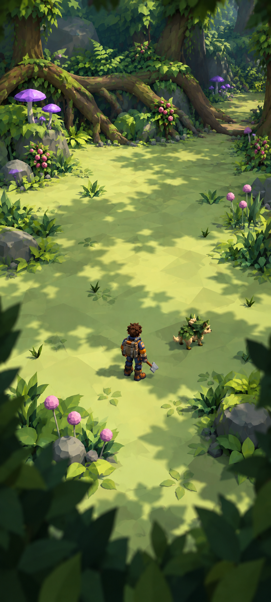
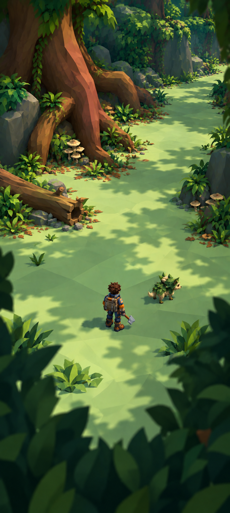
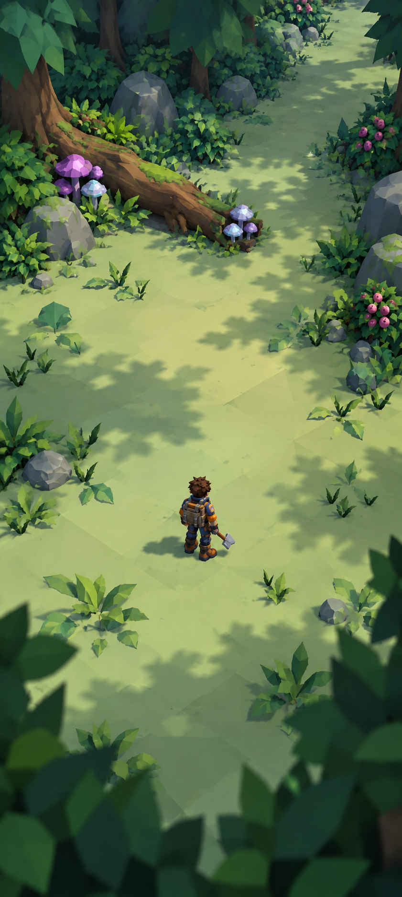
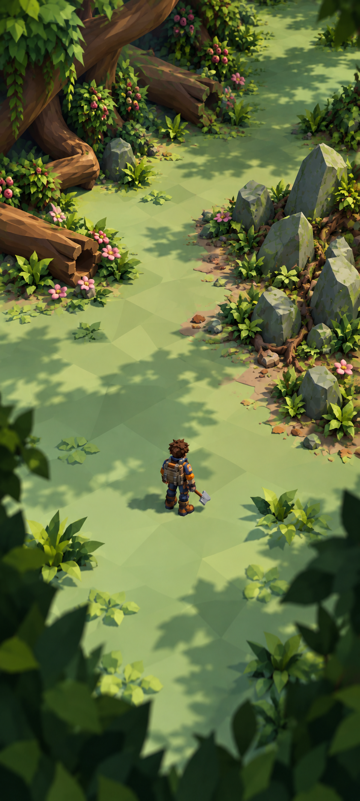
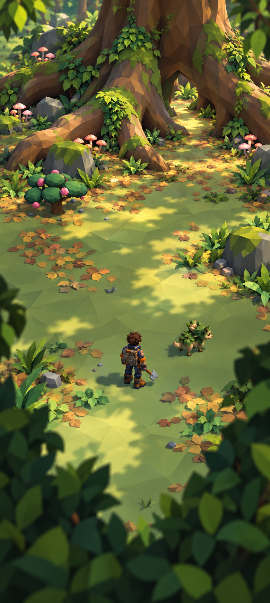
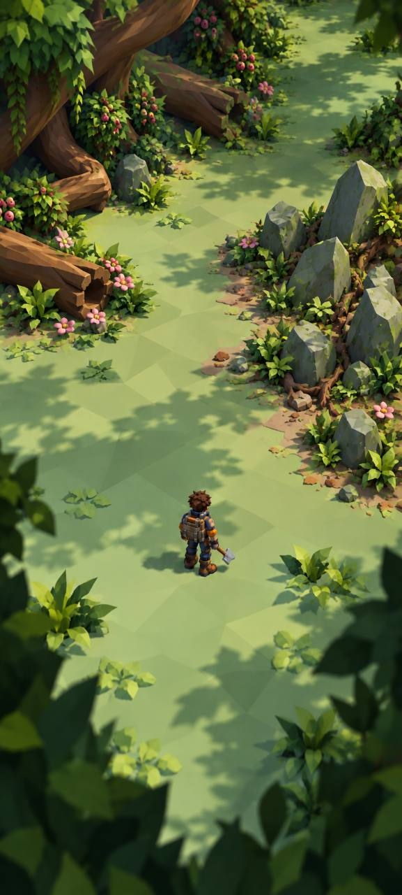

# Five illustrated subhabitats

Five generated V1 illustrations supply provisional art direction. Independent review found useful ecological grouping, connected forms and palettes, but **none is an exact native-camera acceptance target**: the player sits lower than in the current game and framing remains cinematic. New southern Galleries and east Verge also need native comparison poses. [Independent review](../../../art/targets/rootbound-wildwood/concepts/dossier-v2/scene-reference-review.md) · [Implementation brief](../../../art/targets/rootbound-wildwood/concepts/dossier-v2/implementation-brief.md).

## Orientation Meadow

Retain broad quiet ground, clustered edge growth and a nearby rootline cue. Keep a genuinely open meadow; avoid applying the same corridor treatment everywhere. Background openings are design suggestions, not proven passages.

## Root Galleries

Retain the connected bent/tapered buttress, grounded log and sheltered fungi. This proposes a southern extension beyond the recorded ridge area. The defining roots need a separate construction target and reviewed model; optional climb/clear pockets should use actual eligible interactions.

## Lantern Grove

Retain grounded log/fungus contacts and quiet interaction floor. Review calls for stronger humid/shaded identity and smaller cap scale; this version remains too bright and open for the final Grove treatment.

## Thornstone Verge

Retain the clear exit and broken side cluster. Mineral identity remains weak: generic boulders and wood dominate. Develop a distinctive shard-family reference. The proposed eastern location comes from the technical map, not this illustration.

## Heartroot Crown

Retain warm rootwood, leaf litter and the quiet approach. The huge hollow arch is an aspirational separate landmark asset, not the current buttress target or a proven passage. [Composite harvestables](constituents/composite-harvestables.md) could let selected roots be cleared while the landmark persists, with slow regrowth and building suppression per owner direction; these behaviors are not yet implemented.

## From reference to construction

Prioritize the connected root asset and a measured local placement. Reuse admitted logs/fungi where they visually fit; create targeted missing mineral and landmark forms. Each brief needs dimensions, tool-aware construction, asset/system matches, deferred aspirations and comparison poses. Preserve detailed masters and review simpler runtime derivatives separately. Exact prompts are saved beside the images. Actual model renders and ordinary gameplay provide implementation evidence.

## Owner-selected ground treatment

Chris highlighted the softly crinkled, faceted ground rather than perfectly flat expanses. The desired treatment combines shallow geometric undulations with readable planar shading and restrained color variation. Keep broad walkable areas comfortable; increase broken relief toward roots and mineral seams. Truly flat areas remain appropriate when deliberate. Do not equate painted triangular color patches with verified geometric relief. [Scoped terrain assessment](TERRAIN_FACETS_PLAN.md) identifies the current owners and next practical step; no terrain change is implied by this reference.
