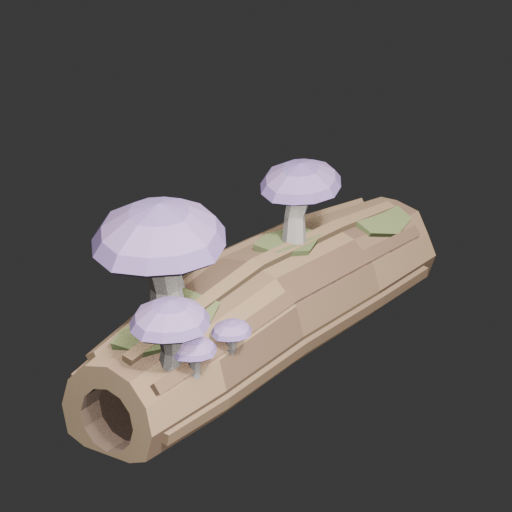
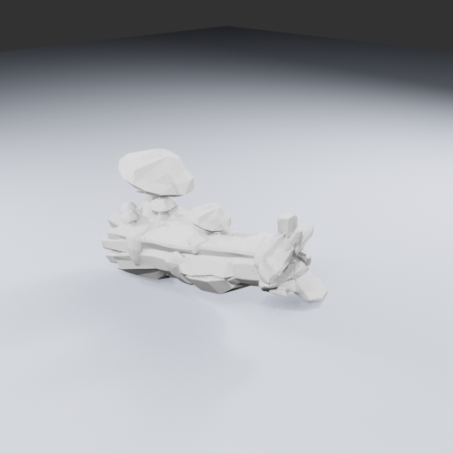
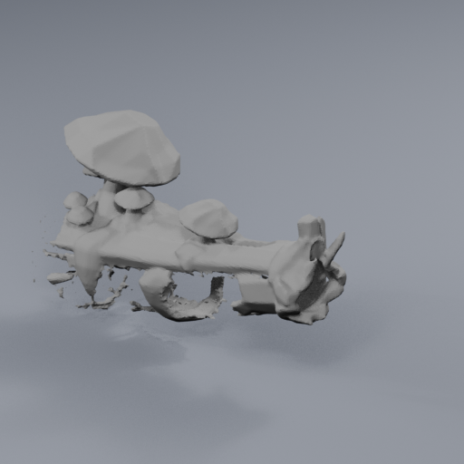

# Lantern forage and fungus constituent

**Dossier key:** `rootbound.flora.lanterncap`. **Asset study key:** `rootbound.asset.lantern-log`. **Status:** proposed regional presentation and new prop study; no new food, harvesting behavior or placement admitted.

## Illustrated identification

V2 is the independently selected construction target: it preserves six attached caps and the bent log while simplifying bark and cap undersides into broad planes. The detail-rich V1 remains below as a source study. Neither image is proof of a usable model or game placement.

Dusty violet caps, stout pale stems and dark decaying rootwood identify the proposed Lanterncap colony. One broad mature cap anchors a group of smaller caps near the broken end, with a second group farther along the log. Moss gathers in damp creases rather than coating every surface. Keep bare wood between groups and an irregular age/scale hierarchy; avoid an evenly spaced ring pasted onto a log.

The [independent reference review](../../../../art/targets/rootbound-wildwood/constituents/lantern-log/reference-review.md) conditionally retains this as a high-detail source target. Dense bark flakes, gills and moss are source detail to simplify in a separate derivative. The left-end hollow is a shallow visual recess, not a promised tunnel or enterable cavity. Hidden depth and underside still require actual model inspection.

## Draft field entry

“In the cool shade, violet caps gather where old wood gives way. Look for pale stems near a fallen limb's broken end; the smallest caps often shelter beneath the oldest.”

This is proposed descriptive journal prose. It makes no claim that the current decorative mushrooms can be eaten or harvested. Publish practical gathering advice only after the corresponding interaction is implemented and verified.

## Ecological relationships

| Topic | Proposed direction | Practical effect |
| --- | --- | --- |
| Subhabitat | Lantern Grove, along the dry lip beside humid deadwood | Cluster beside the open interaction floor, rather than across it |
| Climate cues | Approximately 10–15°C grove design range, shaded and relatively moist | Muted dark wood, violet caps and restrained olive moss; no weather simulation |
| Growth pattern | Two irregular groups following damaged wood | Show mature, intermediate and young caps; preserve visible stem-to-wood contact |
| Transition | Dry Galleryfall rootwood gives way to softer broken wood and cap clusters | The change should read through material and growth pattern, not a hard zone boundary |
| Wildkin relationship | Trailgloam's proposed deadwood-edge foraging niche | One deliberate encounter setting if later admitted, not repeated residents at every log |
| Neighboring flora | Low pale blooms at clearing margins; fiber strands at supported root bases | Keep the central floor quiet and readable |

Lanterncap is a proposed regional food-facing label, not a registered item or a recolored berry already admitted as food. A future common crafting/food category could preserve a distinctive local look and name, but the catalog, inventory, pickup and save contract must be decided together.

## Current source evidence and reuse boundary

`ROOTBOUND_CURATED_SCENERY` in `frontierRootbound.js` contains the existing decorative `lantern-log` at X−444/Z678 (asset_fallen_log, scale .95, yaw .45), plus `lantern-ring-a` at X−442/Z678 and `lantern-ring-b` at X−444/Z681 (asset_mushroom_ring, scales .9/.85). These are source records, not proof that every record is currently resident or supported in a loaded save. The shared scenery owner applies footprint guards and publishes runtime instances separately.

The existing log/ring assets remain unchanged. A new integrated log-colony candidate can supply planted cap attachments, a deliberate broken-end silhouette and irregular clustered growth. It must first prove those advantages in actual renders. The current three source records are a possible bounded comparison site, not authorization to replace them blindly or to count this art study as an improved encounter.

The [executed source kit census](../../../../art/targets/rootbound-wildwood/constituents/lantern-log/existing-kit-census.json) measures 590 triangles in 27 mesh parts for the fallen log and 1,760 triangles in 30 parts for the mushroom ring. Their complete transformed envelopes are approximately 2.844 × 1.136 × 2.317m and 1.871 × 1.042 × 1.592m respectively (X/Y/Z, Y-up), including their surrounding details. Both source records have role `prop` and no authored collision descriptor. These facts do not prove harvesting or collision behavior of an eventual replacement. The proposed 1.6m log is deliberately smaller than the existing complete log envelope; preserve that scale difference for later player-view review rather than blindly reusing its placement scale.

## Production contract

The first manual candidate is an actual editable model, with 22 individually closed components, 1,452 triangles and a complete 1.622 × .561 × .825m envelope (Blender Z-up). Sixteen final log triangles supply .342m² of ground contact; all six local stem/log and cap-underside checks pass. Seven actual views at 512/96/48px are retained. [Independent R3 visual review](../../../../art/source/lantern-log-v1/manual-r3/visual-review.md) scores it **5.7/10, HOLD for art/runtime**: the cap colony reads, but the straight bark strips and regular recessed end resemble manufactured wood. That review guided the focused repair below. No current decorative record was replaced.

R4 removes the raised strips, cuts four broad grooves, breaks the end outlines and corrects palette conversion while preserving all twelve stem/cap meshes exactly. The actual repair has 16 components / 1,390 triangles and .355m² of grounded log surface. Forty-two matched R3/R4 images make the change directly assessable. [Independent R4 review](../../../../art/source/lantern-log-v1/manual-r4/visual-review.md) retains it at **6.3/10, still HOLD for art/runtime**: color and end detail improve, but the thin extruded body and blade-like far tip still miss the target's fuller wood mass. Stop repeating this five-section/rim method. The [proposed raw TRELLIS follow-through](../../../../art/source/lantern-log-v1/geometry-ply-proposal.md) led to the separately reviewed R5 raw-geometry run below.

Two guarded full-export TRELLIS attempts are held before export: [V1 evidence](../../../../art/source/lantern-log-v1/quality512-r1/run-receipt.md) records 6,755,672 decoded faces; [V2 evidence](../../../../art/source/lantern-log-v1/quality512-r2/run-receipt.md) records 2,218,798, still above the unchanged 750,000-face limit. This paired observation does not isolate a single cause or prove that simpler references always reduce geometry. No raw GLB resulted. The [illustrated asset study](../../../../art/source/lantern-log-v1/review.html) retains both targets and terminal evidence. Those are historical full-export failures. R5 uses a separately reviewed geometry-only output contract, not an unchanged retry or a textured-export cap increase.

R5 completed one fresh input-pinned geometry-only TRELLIS run and exact Blender inspection: 1,077,634 vertices / 2,218,798 triangles; a 41,776,379-byte untouched PLY and 21 neutral views. The model has fuller irregular wood but detached pieces and an incomplete-looking underside. [Independent raw review](../../../../art/source/lantern-log-v1/geometry-ply-r5/visual-review.md) scores the untextured material 4.4/10 and retains it as a source study, with cleanup/runtime HOLD. The [CPU topology audit](../../../../art/source/lantern-log-v1/geometry-ply-r5/topology-audit.md) confirms 67,425 boundary edges and 99,060 nonmanifold edges, so a measured reconstruction plan is needed before a derivative. Keep R4 too; raw and colored scores are not directly comparable. No texture, normalization, game placement or harvest behavior was added. [Actual R5 gallery](../../../../art/source/lantern-log-v1/review.html#raw-r5).

The original image prompt proposed a log about 1.6m long and .42m thick, with a mature cap about .42m wide. The subsequent measured manual plan deliberately uses a .5m mature cap and approximately .825m complete grounded height. These are design choices, not recovered image measurements or a claim about the final mesh. Report its actual complete envelope and review apparent scale beside the actual player before placement. Do not stretch it independently on axes to force every starting dimension.

Judge the defining bent log, broken end, planted cap stems and unequal cap hierarchy at full, 96px and 48px sizes. Use actual side/rear/underside views to check unseen contacts and the shallow recess. Preserve a high-detail master, then simplify geometry/materials in a separate derivative with matching cameras. Never hide an absent attachment under a fabricated glow. Keep ground support and collision based on the complete actual envelope, with no invisible collider filling an apparent playable passage.

## Future harvesting and regrowth

The [composite-harvestable direction](composite-harvestables.md) permits a future fungus group to be harvested separately from supporting wood. An initial static TRELLIS mesh does not automatically provide that separation. A later modular preparation needs stable part boundaries, persistent harvested state and corresponding visual/collision changes before claiming selective gathering.

All harvested parts should regrow on long timers, and qualifying nearby structures suppress regrowth by owner direction. Exact timers, influence distance and behavior after removing structures remain undecided. Safe regrowth must not intersect or trap players, companions or buildings. None of those behaviors is implemented by this reference or model study.

## Latest actual reconstruction — R6 closes HOLD

One reviewed voxel reconstruction closes the raw mesh surfaces but fails the single-component gate: 124,172 triangles in 240 surface components. A read-only diagnostic retains 42 matching R5/R6 views and exact unchanged-source proof. Actual images show major lower-log volume loss and small fragments. Preserve the raw master, manual R4 and this partial topology gain; no asset is admitted and no seventh Lantern repair belongs to this visit. [Matched illustrated comparison](../../../../art/source/lantern-log-v1/review.html#cleanup-r6) and [independent review](../../../../art/source/lantern-log-v1/cleanup-r6/terminal-visual-review.md).

## Owner direction: a reusable log, fungus and moss kit

Chris's image review found useful visual quality and proposed separating this asset into reusable log, mushroom and moss models. Deliberately kitbash them into varied scenery, then present each arrangement as one composite harvestable: successive damage breaks off parts and drops their respective mushrooms, moss and wood. This makes component-level reuse an appropriate next direction; the held whole-object scores do not discard the useful pieces or override the owner's positive observation.

The retained manual R4 already has separate mushroom geometry; the raw TRELLIS source must not be assumed to have semantic log/mushroom/moss segmentation. Inspect and select components before reuse. A future kit needs stable part identities, checked surface attachments, intact/broken-stage targets, support-aware removal and long regrowth with nearby structure suppression. Damage thresholds, order, yields and targeting remain open. No kit variation, damage-drop behavior or semantic extraction has been implemented by this note. [Composite harvesting contract](composite-harvestables.md).

[Current modular reuse assessment](../../../../art/source/lantern-log-v1/modular-kit-assessment.md) identifies six retained R4 stem/cap pairs and three surface-fitted moss patches. The retained wood remains a provisional component candidate with visible thin-body debt; review it at intended size before demanding a replacement. Use attractive useful pieces even when the whole earlier model scored below its target.
