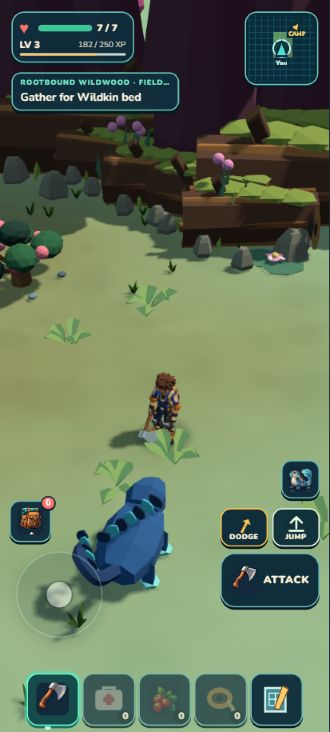

# Heartroot Crown and discoverable constituent

**Retained runtime blockout:** six large visual-only assemblies now reuse the existing tree/root kit across Galleries and Crown. Four maintained composite recipes, no model generation or new collision/harvest rules. Crown is an overlapping rear boundary, not a completed climbable hero tree. See the [actual comparison](../../../../art/reviews/rootbound-wildwood/enclosure-r1/review.html).

Heartroot Crown is a proposed old-root landmark zone; its relationship to the retained earned grove is unverified. Its proposed discoverable role is a visual/lore-facing root landmark that reinforces return orientation. The Crown must preserve all existing identities, forage, wildlife and grove continuity.

The existing scenic reference is aspirational. A feasible asset target should focus on a warm sheltered root-collar silhouette at normal portrait scale. It does not authorize a quest, progression gate, collectible schema, or new interaction mechanic.
