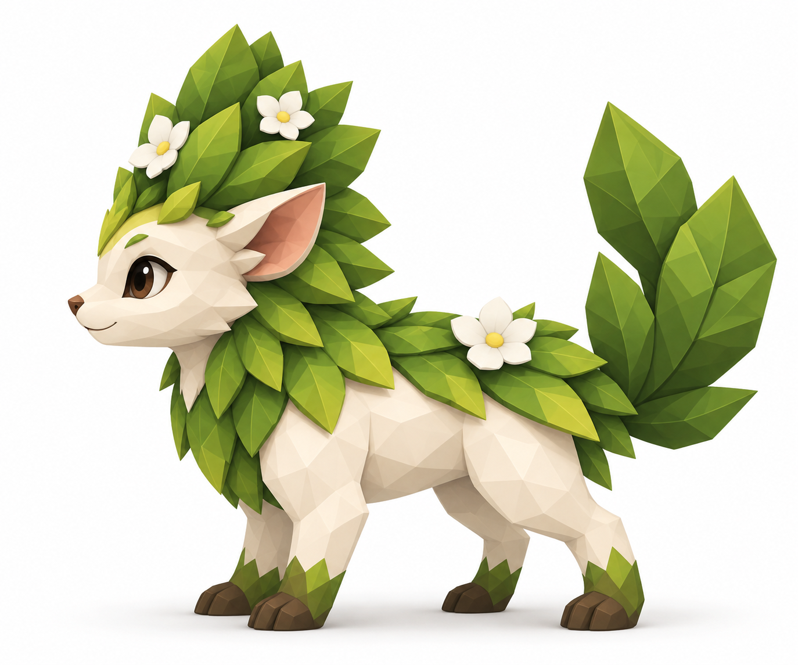
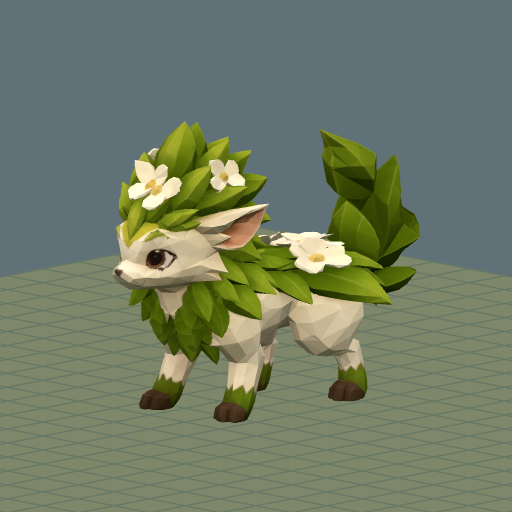
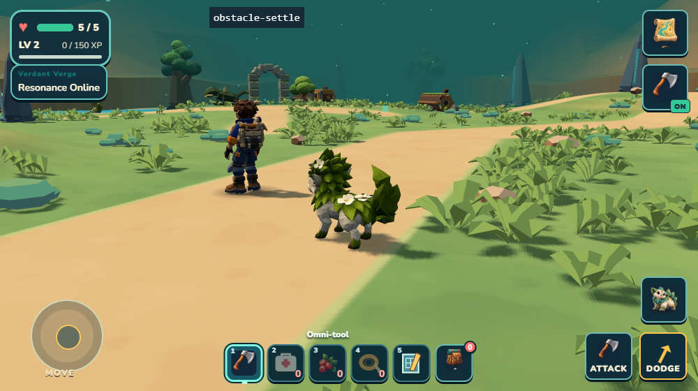

# Mossling — the familiar woodland grazer

**Dossier key:** `rootbound.species.mossling`. **Existing species ID:** `mossling`. **Visual ID:** `asset_wildkin_mossling`. **Status:** existing game species; Rootbound-specific composition remains proposed. **Audience:** field-entry draft with separate production evidence.

## Illustrated identification

Mossling's cream face and body, tall green leaf mane, white flowers, large ears and four planted feet make it readable against dark rootwood. Preserve the recognizable face and leaf silhouette when making smaller journal or gameplay images. Its appearance should not become a generic green quadruped.

## Draft field entry

“A small garden travels with the Mossling. Leaves shelter its shoulders, and pale flowers nestle among them. It watches before it approaches. Give it room, and the woodland feels a little less empty.”

This is proposed journal prose. The illustration is a design reference; it does not prove current animation or Rootbound encounter staging.

## Source-backed observations

The current companion catalog calls Mossling a cautious forest grazer and names its ability **Bloom**, described as restoring two health and awakening living root seals. The catalog's displayed habitat text still names the earlier Verdant Verge location; do not silently replace that runtime wording with Rootbound in a player-facing entry. The ordinary field-taming guide uses berries, stepping back while it feeds, then approaching gently.

The [Rootbound source census](../../../../art/reviews/rootbound-wildwood/dossier-ecology/census.json) records two default-world Mossling homes: approximately X−416/Z740 and X−380/Z686, in the retained eastern woodland. Both source recipes are SKITTISH, with 4.4m roam and 8.5m leash radii. These are source settings, not a current loaded-resident or player-save count. They have not been moved into the new Meadow or Crown proposal.

## Rootbound ecology proposal

Mossling belongs visually on the edge of a broad supported clearing, where its feet and face remain visible and a retreat direction is easy to read. Keep tall roots behind or beside it, not across its ordinary movement disk. Medium-moisture leaf litter and sparse forage connect this pocket to the woodland; berry feeding is supported by the existing bond guide, while any detailed wild diet or flower symbiosis remains lore design.

A future Meadow encounter would need a separately admitted home and measured resident cost. Until then, the eastern homes are the actual Rootbound distribution. No population simulation, preferred-temperature mechanic, breeding dependency or new Camp requirement is implied.

## Player knowledge layers

| Layer | Content | Publication condition |
| --- | --- | --- |
| Identification | Cream body, green mane, white flowers, large ears | Compare with the actual current rendered model |
| Observation | Cautious approach and retreat; berry bonding guide | Confirm the ordinary encounter before journal publication |
| Companion knowledge | Bloom's catalog description | Verify the relevant present ability behavior; keep secrets out of the basic identification entry |
| Designer-only | Rootbound source IDs/home coordinates and proposed scene placement | Never expose implementation IDs or claim a new discovery location |

## Production evidence and open checks

These are retained actual V3 images, distinct from the generated identification reference above. A fresh factory/file check confirms that the game still loads `assets/models/mossling-v3/model.glb`, matching the V3 asset record. The gameplay image shows an earlier Verdant Verge scene and its camera/HUD; it is not a fresh capture of Rootbound, a proposed Meadow resident, or current full-game acceptance. [Image provenance](../../../../art/source/mossling-v3/dossier-evidence/README.md) preserves that distinction.

Later V4 eye-overlay experiments did not replace V3. Their visible-iris mapping remained incorrect, producing extra or floating eye fans. Preserve the current face, body, texture, rig and clips; any resumed eye work first needs a camera-aligned surface/UV diagnostic and independent evidence that it improves the actual eyes. Rootbound encounter composition does not depend on that optional experiment.

The preserved [Mossling V3 asset record](../../../../art/source/mossling-v3/asset.json) documents a 19,999-triangle, one-material, 1K-texture model with 23 bones and five clips. Its existing source is an editable Blender file and the model is already part of the game. The record explicitly leaves continuous motion and owner phone acceptance pending; structural asset checks do not close those perceptual gates.

Use the [existing reference review](../../../../art/targets/mossling-neutral-v3/reference-review.md), model provenance and actual runtime factory when revising this species. Preserve the liked texture, face, flowers and existing capture/ability roles. Rootbound composition work should first expose the current creature clearly rather than rebuild it without a diagnosed problem.

Sources: `src/companions/companionCatalog.js`, `src/world/frontierWildlife.js`, the linked deterministic census and asset record. No species implementation changed here.
