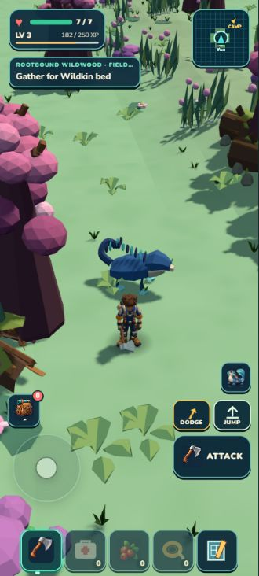
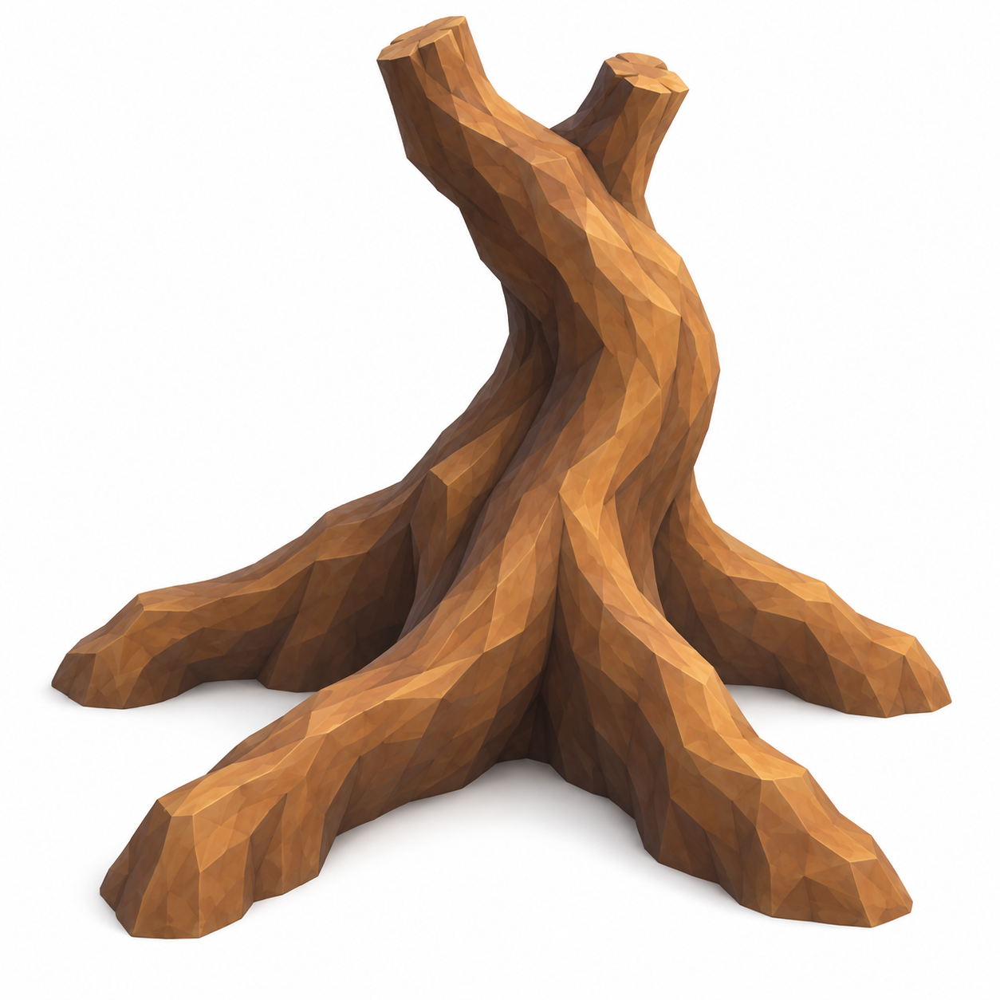
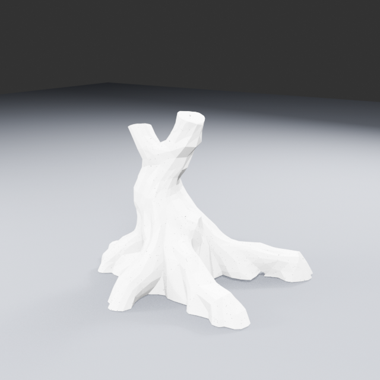
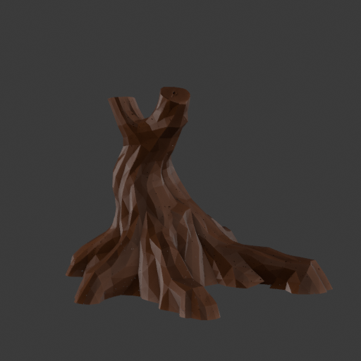

# Root architecture — Rootbound constituent brief

**Retained runtime blockout:** six large visual-only assemblies now reuse the existing tree/root kit across Galleries and Crown. Four maintained composite recipes, no model generation or new collision/harvest rules. Crown is an overlapping rear boundary, not a completed climbable hero tree. See the [actual comparison](../../../../art/reviews/rootbound-wildwood/enclosure-r1/review.html).

## Key and current state

**Dossier key:** `rootbound.asset.buttress-root`. **Constituent:** Root Galleries buttress-root anchor. **Scene role:** a connected root web that gives the Galleries a memorable side silhouette, frames a readable floor, and offers a future optional traversal/clear-access question under [Traversal intent](../TRAVERSAL_INTENT.md). It must not turn the main outing into a mandatory climb test.

The selected direction is the [buttress-root selected V2 target](../../../../art/targets/rootbound-wildwood/constituents/buttress-root/selected.png). It is an image reference, not recovered orthographic geometry. The first quality 512 run held before export. A separately reviewed geometry-only run now has a verified raw PLY and exact Blender import: **raw fit 7.2/10, GO for cleanup; no textured GLB or runtime admission**. Prior studies and useful parts remain archived evidence; reuse requires current fit, topology, contact, and visual review.

The actual master contains 514,489 vertices and 1,029,792 triangles. The independent [raw geometry review](../trellis-geometry-visual-review.md) retains its useful curved trunk, fork and broad roots, while identifying root cadence, tip cleanup and a clearer bend as improvement opportunities. White inspection lighting obscures fine surface judgment. Preserve this high-detail master while comparing a separately prepared derivative under clearer matching lighting.

The first Blender derivative now has 154,468 triangles with nearly unchanged dimensions. A uniform five-metre root spread gives approximately 3.917m height; this preserves generated proportions rather than stretching to the design envelope below. Independent review retains the derivative as preparation evidence but holds art/runtime admission pending stronger broad-root grouping and fork character. The saved file contains one face-bearing mesh component plus 98 unused vertices to remove before export. [Compare actual raw and derivative views](../../../../art/source/rootbound-buttress-trellis/geometry-ply-v1/review.html). Materials, segmentation, collision and in-game fit remain open.

## Design envelope

### Structural R2 — actual partial improvement

The separately planned and independently reviewed R2 broadens the two camera-near root webs and adds a restrained middle-trunk bend. Its [matching actual Blender comparison](../../../../art/source/rootbound-buttress-trellis/geometry-ply-v1/structural-r2/review.html) receives **6.6/10, HOLD for art/runtime; retain useful partial improvement**. The model still reads as many narrow root struts rather than the target's four broad plates, and the upper fork remains unchanged. More material polish or stronger versions of the same displacement are not the next repair: a future attempt needs reviewed structural reconstruction, while another Rootbound constituent can advance.

The high-detail derivative retains 514,489 vertices and 1,029,792 triangles; it is 24,756,512 bytes. Exact triangle indices and Z values are preserved. The actual float32 indexed surface audit finds zero collapsed triangles and zero nonpositive raw-to-edited normal dots; this does not certify global intersections or manifoldness. Maximum root displacement is 0.1432m and trunk displacement 0.0652m. Raw master and earlier reduction remain available. This is one counted structural repair, with no runtime or composite-harvesting admission.

The provisional design envelope is approximately4.5m tall,5m root spread and1.5m trunk-base width. These are intended construction dimensions, not measurements recovered from perspective. The readable structure is four broad grounded root directions, a continuous fused collar, one thick curved trunk and two fork stubs. The selected target is explicitly canopy-free. Valleys between the roots should remain legible; a hollow walk-through arch is not required by this target.

Each foot descends with a visible outer curve and a concave valley into the collar. Trunk taper is gradual at the lower third, then faster after forks; branch bends occur as recognizable elbows/arcs, not straight pipes. Ground contact must look loaded into the soil at each foot, with no floating canopy or detached roots.

## Future modular boundary plan

No current TRELLIS mesh is asserted to be segmented. If admitted later, a production build may separate: root-web/base, trunk-and-fork core, canopy/wood masses, harvest-removable outer wood pieces, and non-harvestable structural remnant. Boundaries must follow natural collars or branch unions so removal does not expose arbitrary cuts. Composite harvesting is an owner-accepted slow-regrowth and building-suppression design direction; production still needs a separate current contract before runtime work.

## Kit and gap

Existing Rootbound low kit can support logs, fungi and thornstone edges. It does not supply a demonstrated matching buttress silhouette. The current TRELLIS trial is the new-asset attempt for that gap. Judge its actual geometry before choosing cleanup, reuse of earlier useful pieces or a changed method; preserve the original master.

## Player draft journal

“Beyond the bright meadow, the old roots gather into low galleries. Their feet grip the ground like knuckles, leaving a sheltered way through the middle. The biggest crown is a landmark, not a promise of treasure.”

## Production notes and next gate

Keep the primary lane readable. Optional climb/clear access requires only current natural-climb eligibility and no-trap/essential-interaction proof, not universal walk reachability. The next review must inspect actual neutral model views, connected root/trunk contacts, silhouette at Rootbound portrait scale, triangle/material cost, collider/support fit, and whether the candidate remains HOLD or is admissible for a bounded habitat placement.
