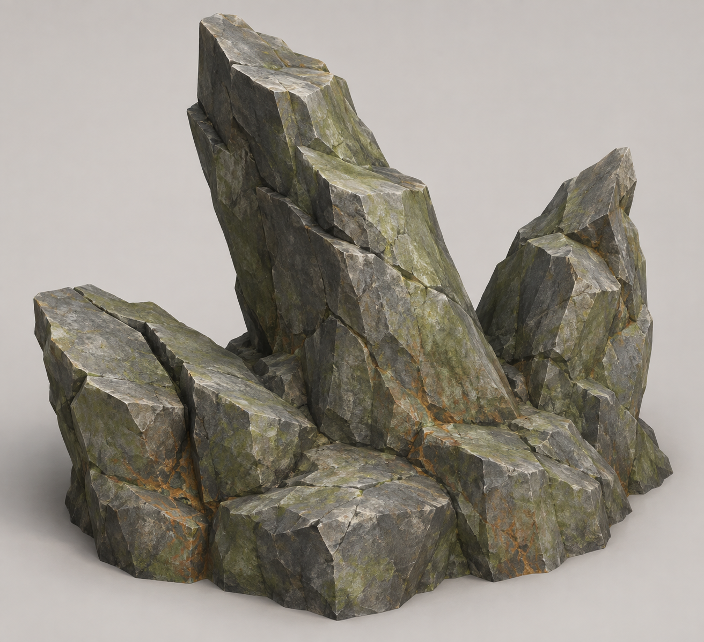

# Thornstone — fractured stone at the woodland edge

**Dossier key:** `rootbound.material.thornstone`. **Status:** proposed local mineral identity and generated design target; no unique model, item or harvesting behavior admitted. **Audience:** production dossier with clearly marked future field-entry prose.

## Visual target

Three unequal stone teeth share a wide broken bedrock foot: one leaning stepped wedge, one shorter offset tooth and a low split plate. Broad desaturated gray faces carry olive stains and sparse warm root-shaped mineral scars. The scars are surface coloration, not living roots or magical veins. The V1 image is a detailed source study; its realistic fine texture exceeds the current game's simplified materials. Independent review retains its useful silhouette for a measured construction plan with deliberately simplified materials. A second generated style target is optional, not a gate.

The proposed envelope is roughly 1.6m wide × 1.1m deep × 1.45m high, a design choice rather than a recovered measurement. Its broad accessible lower face should read as a possible work surface. A later production plan must inspect all sides and build a grounded substantial volume; a single generated view does not specify hidden back faces or fracture depth.

[Exact prompt and source notes](../../../../art/targets/rootbound-wildwood/constituents/thornstone/prompt-v1.md) · [Independent reference review](../../../../art/targets/rootbound-wildwood/constituents/thornstone/reference-review.md).

## Habitat relationship

| Topic | Intended expression | Current limit |
| --- | --- | --- |
| Home | Thornstone Verge, the drier eastern Rootbound seam | Proposed x[-430,-405], z[675,710] in the spatial plan; not an admitted relocation |
| Climate | Approximately 13–19°C daytime design range, lower moisture than Lantern Grove | Narrative/ecology cues only; no temperature or wetness simulation |
| Arrangement | Unequal clusters on exposed side slopes and root-eroded soil, with quieter gaps between them | Avoid evenly spaced identical cones and continuous stone walls |
| Transition | Mineral faces become more exposed as damp wood/fungal cover thins | Keep separate visual reasons for Grove and Verge |
| Wildlife | Optional mineral edges may frame observation space | No exclusive Wildkin resident, spawn or mineral-dependent ability specified |
| Exploration | An optional side seam with visible return/open escape space | Current climbing eligibility and actual collision decide accessible surfaces; the target is not traversal proof |

## Shared material, local identity

Thornstone is a proposed Rootbound presentation of the existing **stone** resource category. Its different name and shape should help players remember where they gathered it while remaining compatible with recipes that already consume stone. This dossier does not create a new mineral economy, special tool requirement, rare drop or recipe. The exact player-facing name remains provisional.

Current `RESOURCE_TYPES.rock` is named Rock Outcrop, yields `stone`, is solid, and uses existing harvesting/drop feedback. The curated Rootbound `thorn-a` and `thorn-b` scenery instead use shared `asset_fen_stone` near the present hollow. Those decorative records are not automatically rock resource nodes. A visual replacement must not silently claim harvestability or change neighboring habitats that use the same shared asset.

## Production and physical brief

Five defining features worth implementing are the asymmetrical height hierarchy, broken angled crowns, broad stepped shoulders, substantial connected foot, and restrained gray/olive/rust material separation. Edge chips support those larger forms; they are not the primary silhouette. Avoid transparent gaps that a solid convex collider would falsely block, needle-thin peaks, separate hovering flakes, evenly repeated prisms and emissive crystal styling.

A clean isolated object like V1 can inform a later TRELLIS input study, but it has not been independently certified as a generation input. A Blender route would use measured irregular closed wedge sections with deliberate steps and fractures, rather than stretching identical cones. Choose that method only through a tool-informed plan and independent review. Preserve a detailed master; review a separate simpler runtime derivative using matched views.

Existing scenery batching, resource state and collision owners remain authoritative. A static decorative version and a harvestable version have different admission needs; selecting a pretty shape does not decide either contract. Any new collider must fit the actual model and its local scale, preserve the relevant route opening and unload with its source. No map relocation or collider is implemented here.

## Damage, regrowth and building influence

The owner-proposed composite harvesting system could later support stone chunks breaking off while yielding ordinary stone. Whether Thornstone uses those stages or an initial whole-node harvest remains undecided. If staged, child shapes need stable identities, readable break boundaries, one reward owner and safe support-aware remnants. Damage thresholds, yield amounts and fracture order are not specified.

All harvested parts should regrow slowly, with qualifying nearby structures suppressing regrowth. Exact timers, distances and the policy after structure removal remain open. Generated Frontier forage currently uses finite persistent depletion; the older non-finite rock default is 17 seconds. Neither current behavior is the intended final long-regrowth design. See [composite harvesting](composite-harvestables.md) for the shared future state and safety requirements.

## Draft field-journal entry

“Where the roots loosen their grip, Thornstone shoulders through the dry soil. Its gray-green faces split along old scars. Fresh breaks reveal the darker stone within.”

Publish as a discovered field entry only after the mineral has a recognizable admitted appearance and an actual discovery source. Gathering tips and recipes should be populated from the implemented resource contract, not copied from provisional production choices.

## Evidence needed next

Independently select the usable target and its material adaptation. Then review the actual constructed front, sides, back, underside and 96/48px views. Later placement needs a matching ordinary portrait screenshot, readable interaction if harvested, actual support/collision, streamed state and saved depletion/regrowth proof as applicable. No such model or gameplay result is claimed by the illustration.

## Reuse and variation review

The main wedge, shorter tooth, low split plate and bedrock foot are potential authored kit parts. Existing stone remains the proposed yield for each harvested stone part; surface staining is not a separate loot material. Two or three variations could shift which tooth dominates, rotate the short wedge, use modest height differences and vary the gray/olive balance within this mineral family. Preserve coherent fracture directions and substantial grounded bases; do not scale all axes independently until the rock becomes a thin spike.

For a first placed study, a connected fixed outcrop may be the shortest useful result. A later intentionally multipart version can serve varied scenery and composite harvesting. Separate parts need deliberate interfaces and support rules, but the reference need not be copied object-for-object. Judge the actual placement for visual variety and approachable harvest surfaces rather than exact target likeness.
