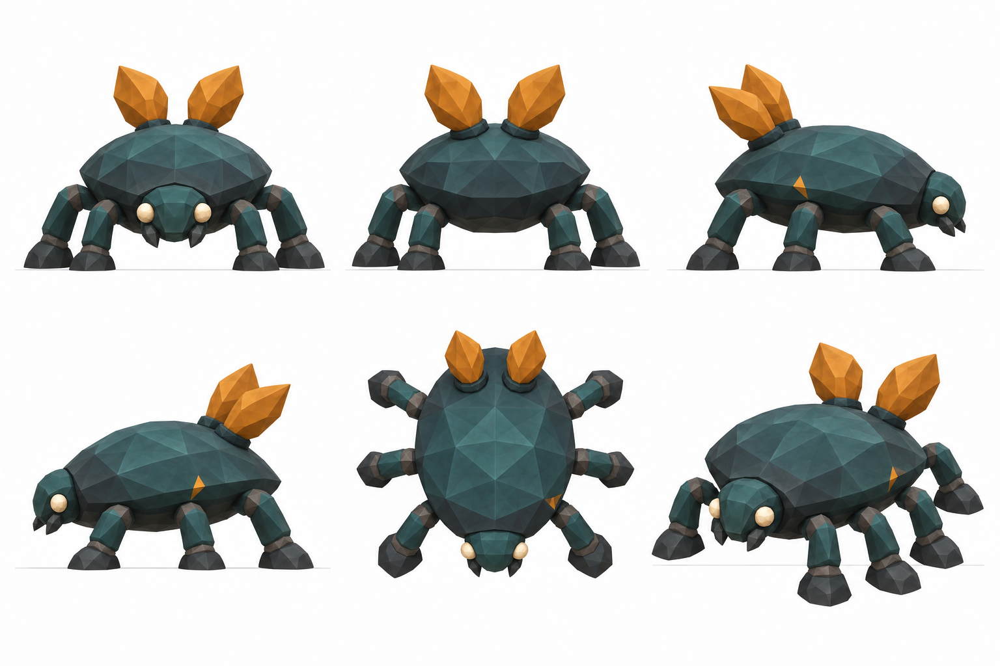
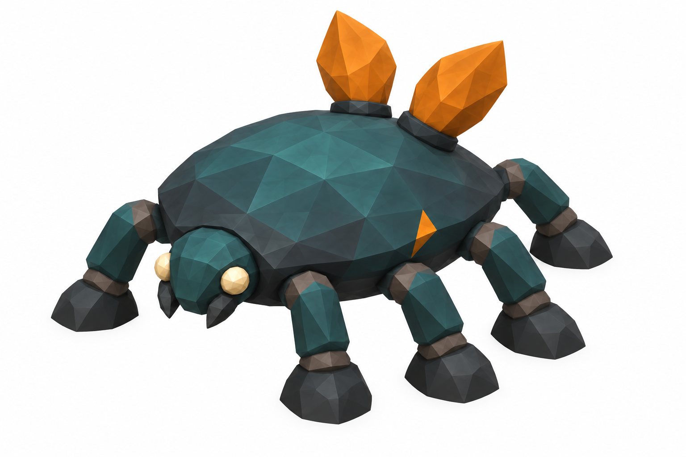
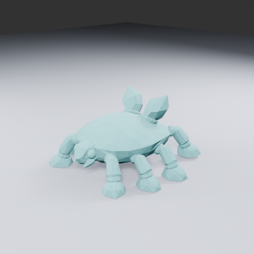
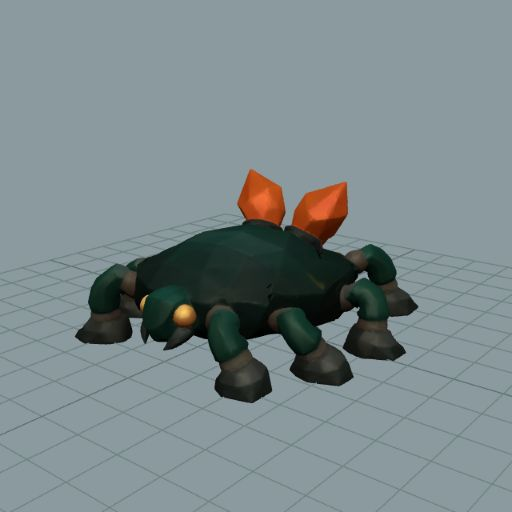
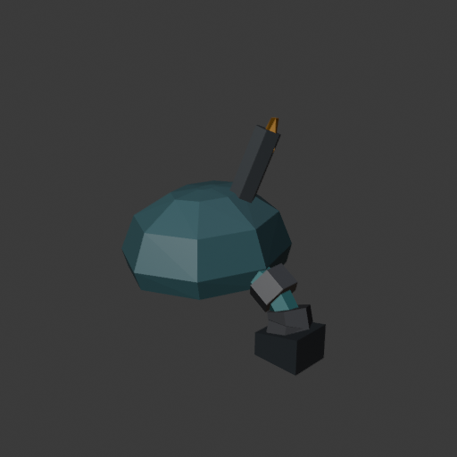
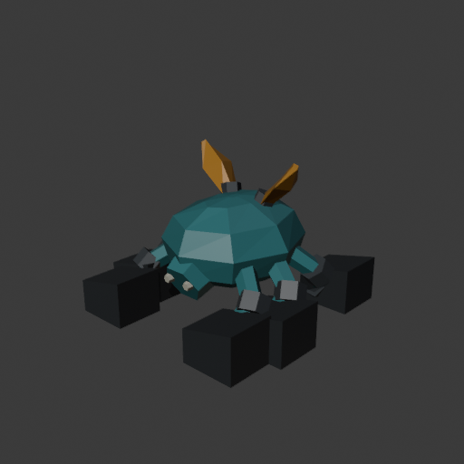

# Trailgloam — a patient observer beneath the roots

**Dossier key:** `rootbound.species.trailgloam`. **Working species ID:** `trailgloam`, not registered in game. **Status:** retained textured TRELLIS derivative with 59,376 triangles and 42 inspection views; actual anatomy is eight legs, four per side. The 1,804,432-triangle master remains preserved. A fitted 29-bone rig and exported eight-leg diagnostic are now retained; gameplay motion and runtime admission remain pending. Manual R6 preserved; R7 hoof repair paused. Construction sheet retained; older model and single-image-generation holds remain historical. **Audience:** designer draft and proposed field-entry source.

## Original illustrated body plan

The original agent-proposed construction sheet shows a low charcoal/dusky-teal saucer body on six thick articulated legs. The retained TRELLIS model has eight, which are kept as a useful variation; this sheet is historical design direction rather than its rigging template. Two opaque amber dorsal fronds rise from separate sockets; small ivory eyes and one restrained amber seam complete the identity. The fronds are solid folded forms, not transparent wings or floating lights. Complementary top and side views establish the six attachments; an occluded foot in a front view is not evidence of a missing leg.

The [independent sheet review](../../../species/rootbound-native/independent-anatomy-review-v1.md) permits construction reference only. The sheet is unsuitable as direct single-image TRELLIS input. The latest owner TRELLIS-first direction prompted a separate experimental input review. The [selected single-subject target](../../../../art/source/trailgloam-v1/rotation-1-reference/target-v2.png) is now [approved for one TRELLIS experiment](../../../../art/source/trailgloam-v1/trellis-trial/reference-review.md): normal far-side occlusion is declared uncertainty, and hidden-side anatomy required post-generation inspection. The later rig inspection establishes eight usable legs, superseding the earlier assumed six-leg count without requiring limb removal. Earlier input holds are historical. The prepared manual hoof repair is paused before Blender execution.

## TRELLIS conditioning target

Use TRELLIS for the organic master and Blender for useful cleanup and targeted anatomical repair. Do not confuse the manual R6 model below with a TRELLIS result.

## Actual TRELLIS model

[Reference versus actual models and trial receipts](../../../../art/source/trailgloam-v1/trellis-trial/review.html). This 34.13MB PLY preserves 889,679 vertices and 1,804,432 triangles. Blender imported the float32 coordinates and triangle order exactly. Keep this master and the successful separately simplified textured derivative from TRELLIS's own postprocess. Raw surface edge defects are cleanup diagnostics; they do not erase the useful shape. No new Wildkin is registered or spawned.

## First fitted motion study

The retained eight-leg TRELLIS surface now has a fitted 29-bone rig and a complete 1.1-second alternating four-foot diagnostic. Independent review retains the usable fit: no visible stretching or detached hooves in the matched neutral, loaded and gait frames. Its 59,376 triangles and UVs are preserved. The 0.9m scale and 8cm body compression are provisional. Cuff seams, blocky hooves and upright fronds remain art debt; actual gameplay travel, transitions, collision and the full clip set remain unproven. [Illustrated actual motion review and interactive export](../../../../art/reviews/trailgloam-rig-r1/review.html).

## Draft field entry

“In the hush beside old logs, two amber fronds turn above a dark shell. Trailgloam waits for the hurried footsteps to pass. Watch quietly and its patient searching may draw your eye to something you overlooked.”

This describes intended fiction, not a current encounter or an unlocked journal entry. No discovery reward is specified.

## Ecological dossier

| Topic | Proposed design | Practical constraint |
| --- | --- | --- |
| Home | One dry floor pocket on Lantern Grove's humid deadwood edge | Select inside the mapped Grove envelope only after actual ground, camera and retreat inspection; no spawn coordinate is admitted |
| Climate | Cool shaded grove, approximately 10–15°C daytime design range, high relative moisture | Art/ecology cues only; no temperature or wetness simulation |
| Food association | A decomposing-wood/fungal forager that accepts a berry lure | Wild diet is lore design; berry bonding is a proposed reuse of the existing supply transaction |
| Shelter | Low root valleys and fallen logs near a clear floor apron | Do not enclose its home under a root that the current follower cannot traverse |
| Activity | Patient searching and brief frond turns toward nearby activity | No day/night schedule or time-dependent spawn rule is implemented |
| Disturbance | Retreat when rushed or struck | Needs actual readable telegraphs and a supported retreat; no new combat role |
| Regional materials | Nearby Lanterncap/ordinary forage gives the encounter a visible reason | Regional labels remain proposed; no invented food item or resource spawn |

Meadow-to-Grove transitions should make discovering it feel earned: brighter open floor, then lower light and clustered deadwood cues. Do not place an identical specimen in each room. The Verge remains a contrasting exposed seam rather than another Trailgloam habitat.

## Proposed play loop

Observe the fronds from the clear apron, place a berry lure on usable ground, step back during inspection, then approach quietly to bond. Bank the captured individual through the existing physical return, select it for a later outing, and call **Spore Sense** near ordinary available resources. The cue should point briefly to one nearby existing source; collection still uses the normal tool. No source means no charged cooldown and no misleading marker.

The independently reviewed [gameplay plan](../../../species/rootbound-native/rotation-1-gameplay-plan.md) specifies a provisional 12m horizontal search, 2.2m vertical limit, 1.2s cue and 8s cooldown. Those are tuning proposals, not implemented behavior. It reuses the existing lure/feed/ready capture transaction; no supplies are promised back after an ordinary interruption. Save rejection must preserve the existing retry behavior. The cue never proves that a resource behind a root is reachable.

## Differentiation and knowledge layers

Mossling offers recovery and living-root interactions; Trailgloam would help notice one nearby collection opportunity. It must not become a mandatory route key, healer, mineral breaker or automatic harvester. Camp production, breeding, genetics, maintenance and special drops are not part of first admission.

Basic journal prose can reveal the shell/fronds and patient temperament. Practical bonding and companion tips stay draft until their corresponding gameplay is proven. Internal coordinates, source IDs, cooldown filters and future hidden discoveries belong in production notes rather than player prose.

## Model history and next feasible method

Preserve the reviewed sheet and all earlier manual work. R1/R2 blockouts exist; the [R3 shell-port audit](../../../../art/source/trailgloam-v1/manual-blockout-v1/r3-terminal-audit-hold.md) stopped before a new mesh or render. The old card's statement that no model work existed was stale. None of those candidates is admitted, rigged or spawned.

A future changed-method candidate could use independently closed shell and articulated leg segments, with measured overlaps hidden inside dark joint cuffs, rather than repeatedly attempting one perforated shell with welded leg ports. That is a provisional modeling proposal requiring independent feasibility review, not permission to hide visible gaps or skip grounded six-leg motion. A beetle's segmented anatomy may suit this construction, but actual rendered attachments and joint poses must prove it.

The [segmented R4 planning review](../../../../art/source/trailgloam-v1/segmented-r4-plan/independent-review.md) now closes HOLD after one focused proof correction. It retains the segmented-cuff idea but rejects claimed closure/contact evidence based on names, proxy boxes/capsules and copied overlap requirements. The revised 2.14 × 2.08 × 1.8025m bound is a planning proxy, not an actual model envelope. No R4 Blender build was launched. A later builder needs actual generated solids and measured contacts before proceeding; do not repeat the same planning loop or promote its receipt into anatomy proof.

The earlier manual plan's 1.45 × 1.55 × 1.70m headline envelope is not a current production promise: later reviews found its foot extents inconsistent. Recompute the entire envelope from the chosen parameters before construction. No exact real-world size was recovered from the sheet.

## Admission still required

Fit the retained actual model with eight distinct leg chains, two substantial frond roots, clean underside/feet and readable 48/96px silhouettes. Then establish fitted eight-leg locomotion, frond movement, actual exported scale/materials and collider fit. Only one cohesive species admission can add catalog, individual validation, encounter, bonding and cue presentation. Ordinary discover/bond/return/select/use/reload proof and sibling-companion preservation remain required. Neither this dossier nor its illustrations implements those systems.

## Actual one-limb construction probe

The changed-method R5 probe builds ten actual closed solids / 264 triangles: one supporting body, one three-segment limb with cuffs and hoof, and one collar/blade pair. Independent CPU reproduction and Blender float32/index parity pass; all named CPU contact measurements pass. One guarded Blender run supplies nine real side/three-quarter/underside images at 512/96/48px.

The bent limb and closed joins are useful, but the dark collar hides almost all of the amber blade. Keep the attachment lesson without claiming a successful full species or target match. The remaining five legs, head, second frond, animation and gameplay are absent. Review blade exposure and collar proportions before a separately planned full build. [Illustrated partial test](../../../../art/source/trailgloam-v1/method-probe-r5/review.html) · [Independent visual review](../../../../art/source/trailgloam-v1/method-probe-r5/visual-review.md).

## Complete model from the new construction method

One full Blender candidate now exists: 50 separate closed solids / 1,024 triangles, a proposed 2.34 × 2.27 × 1.643m envelope, six grounded feet, visible ivory eyes and two exposed amber folds. Twenty-one actual views cover seven directions at 512/96/48px. The new candidate fixes the partial probe's hidden fronds. Large block-like feet remain visible art debt; evaluate their effect on the creature rather than rejecting different target proportions by rule.

The reviewed CPU construction is the source of the actual mesh arrays, and Blender verifies float32 XYZ/index/topology/winding and hoof grounding. Small root-anchor insets fixed four shallow surface protrusions before the one full build; other body proportions and frond exposure remain unchanged. This is a neutral model candidate, not an animated or playable species. [Actual illustrated model](../../../../art/source/trailgloam-v1/full-r6/review.html) · [Independent review](../../../../art/source/trailgloam-v1/full-r6/visual-review.md) · [Execution facts](../../../../art/source/trailgloam-v1/full-r6/execution-receipt.json).

Independent full-model decision: **retain with specific debt**. Preserve the teal body/forward face, six grounded chains and visible amber cues. Focus any next mesh repair on the oversized dark hooves rather than rebuilding the creature to match the concept exactly.

## Retained TRELLIS organic master

The current preferred organic master is the actual TRELLIS result: 889,679 vertices and 1,804,432 triangles, preserved unchanged with an exact Blender import and 21 neutral views. The first review mistakenly reported six legs; closer top and side inspection establishes eight. Independent review retains that anatomy and its stronger organic body/feet. The teal above is inspection clay, not a generated texture. The manual foot repair is paused, and its earlier candidate remains preserved.

Built-in TRELLIS remeshing, simplification, UV generation and texture baking are being tested as a separate export stage. A dense raw master is an intermediate asset, not a model rejection. The first standalone attempt reproduced that master exactly but stopped on a Windows flex_gemm import error before mesh processing; the saved decoded state allows a focused export retry without regenerating the creature. Follow the [actual comparison and latest export evidence](../../../../art/source/trailgloam-v1/trellis-trial/review.html). Rigging, animation, encounter and runtime admission remain separate outstanding work.

The native postprocess retry now **succeeds**: a textured59,376-triangle GLB (3.89MB), with42 actual matched textured/neutral inspection views and an editable Blender scene. Independent review retains the teal shell, amber fronds, warm face and readable leg ring as the preferred next production asset. The high-detail master remains intact. Next is fitted scale and six-leg rig/topology preparation, not another visual rebuild or immediate encounter placement. [Actual reduced model and review](../../../../art/source/trailgloam-v1/trellis-trial/review.html#simplified).
