# Early alpha — procedural frontier progress

## New local progress: denser seeded habitats

Ordinary inland travel now has denser seeded reeds, lilies, mushrooms and stone patches. Shared geometry and12.5m render cells keep the extra props bounded. Source review passes; visual R1 remains **6.8/10 HOLD** because midground composition and repeated dry stones need work. All **1,337 tests** and package gates pass (**44.30MB unpacked /20.57MB ZIP**), and the complete earned Camp save matches developer and portable reload. Normal travel works, but boundary loading still hitches; this is a local foundation checkpoint, not an alpha release.

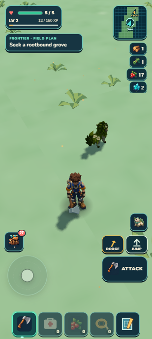 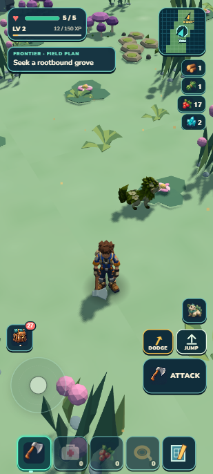 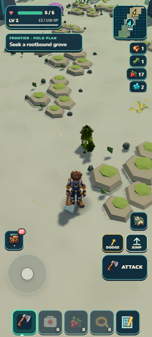

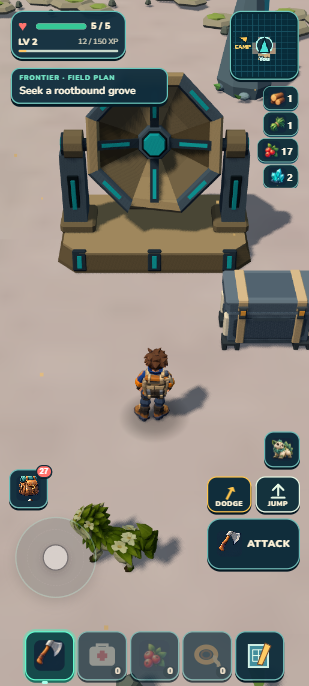 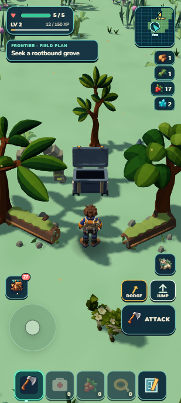

The seed now places more of the existing kit, with asset geometry shared across small cullable cells. More props do not automatically make a natural habitat: layered midground patches and repeated stone shapes remain the visual judge's main gaps. Normal travel works, but loading new ground/scenery can still pause a frame. [Actual screenshots, measurements and limits](../../../art/reviews/scenery-density/receipt.md).

Next priority: retain or progressively prepare deterministic scenery/ground clusters using the existing streaming owner, then measure ordinary boundary travel. Current profiling places about78–79ms of a120ms visual rebuild in ground placement checks, alongside128–150ms of new-chunk recipe work. Tiny height-query optimizations will not remove that pause. Keep one frame loop and transactional physics/publication. Fuller, more coherent midground patches remain a separate visual debt; no further density/seed tuning in this batch.

This local illustrated supplement is newer than the existing PDFs and Drive upload. The full staged creature/research/continent vision remains; this is groundwork for a playable alpha, not content-complete release.

## Previous earned round trip

The previously earned one-Mossling save now connects Camp preparation to a useful habitat trip without adding a quest ledger. At the overlapping Camp spot, the nearer visible garden receives Harvest or Plant instead of the farther yard console; storage/stations and existing reach, action and save rules retain priority. Away from Camp, the derived plan points an established Mossling player toward Lush green country and explains full-health Bloom and the cache payoff.

  

The earned save began this leg with one secured Mossling and50 banked XP. A legitimate four-berry harvest followed by replant left8 carried berries. Ordinary input crossed open country, reached a rootbound grove at health5, used Bloom and collected the cache, adding6 berries,3 wildflowers,2 crystal shards and12 field XP.

  

Read-only catalog and terrain guidance identified the route; it did not write player positions, grant resources or advance simulation. This is a guided earned outing, not proof that a new player would find the grove unaided. The physical return secured the twelve field XP, increasing banked XP from 50 to 62. The next harvest and replant left 17 berries, six wildflowers and two crystal shards. Developer and portable reload preserved the entire selected save, including the same Mossling, Camp, cache claim and surveyed map. All 1,322 tests and package checks pass; the ZIP is 20.57 MB. Exact controls and limits are in the [alpha-preview receipt](../../../art/reviews/alpha-preview/receipt.md).

  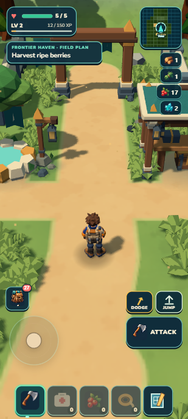

Thirty bounded movement legs took about six minutes and covered approximately 1.25 km, including fence/tree detours. Inspection pauses and UI actions are excluded; this is not an unaided completion-time claim.

The next provisional visual priority is readable Sunscar/Lush ecotone travel using the existing grass, scenery and resident caps. The actual route exposed roughly27m gaps between substantial props and grass that reads too small in portrait play. This finding does not promise more assets, higher caps or a new biome. The roughly10-habitat/30-species direction remains staged; danger pacing, physical-mobile proof and refreshed report distribution remain limited.

## Prior checkpoint: grove cache mechanics

Follow an open clearing between alien trees and mossy logs. Bring a secured Mossling, use Bloom to awaken the chest, watch its lid open, and collect supplies for the next outing. The current continent has59 supported locations using one initial grove composition. Existing Sunscar mineral blooms give Emberhorn a different kind of destination.

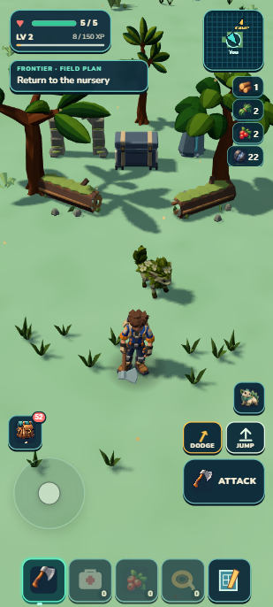 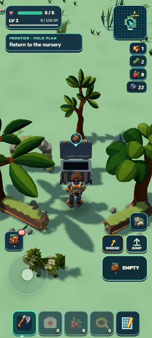

| Player action | Verified result |
| --- | --- |
| Call Bloom at full health | The grove seal saves and the lid visibly opens |
| Try to collect during opening | Collection waits for the moving lid to finish |
| Open the cache |6 berries,3 flowers,2 crystal shards and12 unbankedXP |
| Return with more pack space | Only saved leftovers remain; XP does not repeat |
| Stream away or reload | Each grove keeps its own seal, claim and remaining supplies |

All1,319 tests and the integrated package gate passed at this earlier mechanics checkpoint. Developer and portable save continuation matched the complete selected payload. The selected visual is **7.7/10 HOLD** after three passes: canopy/ruin framing and ground density need more polish. Native testing used a disclosed Mossling/approach fixture. No new species, assets, menus or online service were added. [Exact evidence and limitations](../../../art/reviews/lush-groves/receipt.md). The published Drive PDFs retain their earlier checkpoint.

## New local foundation: a continent and its coast

The seed now defines a finite irregular landmass surrounded by ocean. The same classification controls terrain, land-based resources and Wildkin, the atlas, the water surface and swimming. This implements the bounded-continent direction; three regional grammars exist, while about10 habitats/30 species remain a staged destination.

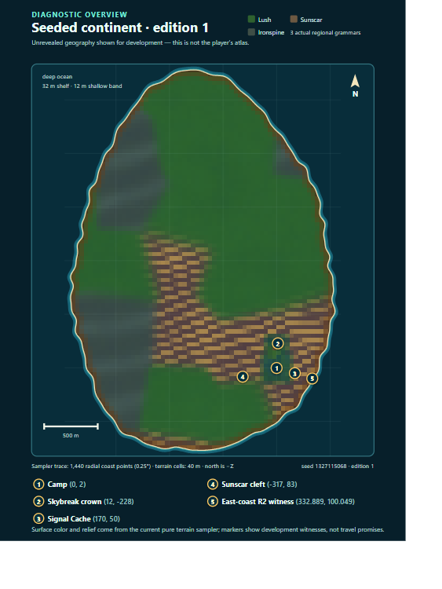

| Player action | Current result |
| --- | --- |
| Walk into the sea | Slow wading, then automatic surface swimming |
| Swim farther offshore | Visible currents increasingly push toward land |
| Bring a companion | It waits on dry shore and can follow again after your return |
| Reload during a swim | Resume on supported dry land with the same outing and supplies |
| Explore the edge | The personal atlas reveals the coast and water you actually visited |

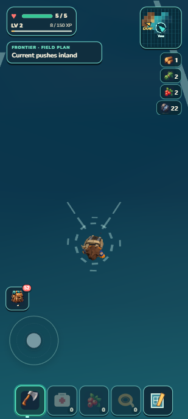 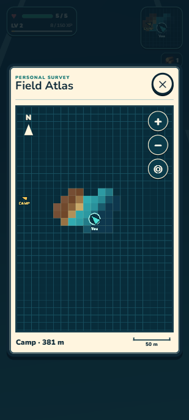

Independent behavior review passed; all1,300 tests and package checks passed. Selected visual R3 remains **6.4/10 HOLD**: the wake/deep-water band is readable, but stronger shore landforms, visible rocks, vegetation and a richer swim animation are still needed. Tests used a disclosed exploration-save fixture and desktop portrait emulation. Boats, diving, aquatic species and a physical-phone release are not claimed. [Detailed receipt](../../../art/reviews/frontier-coast/receipt.md). This local supplement does not replace the previously uploaded PDFs.

September 13,2026. This supplement follows the published Visual Fieldbook and Research Appendix. Images labeled **actual** come from the running prototype. The original PDFs retain their recorded publication checkpoint; this page carries newer implementation evidence.

## The experience we are working toward

**Explore a dangerous alien habitat → find something worth bringing home → improve Camp → care for a distinctive Wildkin → prepare for a harder outing.**

Chris's latest priority is a playable early alpha soon. The working world scope is one seeded continent surrounded by ocean, with later boats opening additional continents. Roughly10 habitats and30 species are a staged content target; the first alpha uses a smaller finished set. Portrait mobile/casual comes first, with five bottom quick slots, movement above the left side and contextual actions above the right.

Each Wildkin should change what the player can do. Mossling supports recovery and cultivation, Emberhorn adds bounded multi-source mining, and Tidefin now provides a readable three-second protected approach. Ward has passed its native comparison, physical Camp return, canonical developer/package reload parity and aggregate gate; independent final review passed the complete source, native, aggregate and package chain with no blocker. [Current effects versus proposed uses](../../EARLY_ALPHA_PLAN.md).

Large regions, extreme heights and distinct upper/lower habitats remain the destination. Rivers should follow terrain, while dense areas may need clearing; the world should not become a predictable web of paths. New content should differ in silhouette, traversal, resources, behavior and discoveries—not merely color.

## Actual: a useful first outing

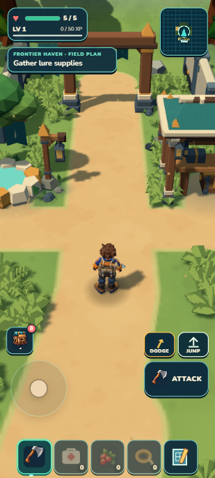 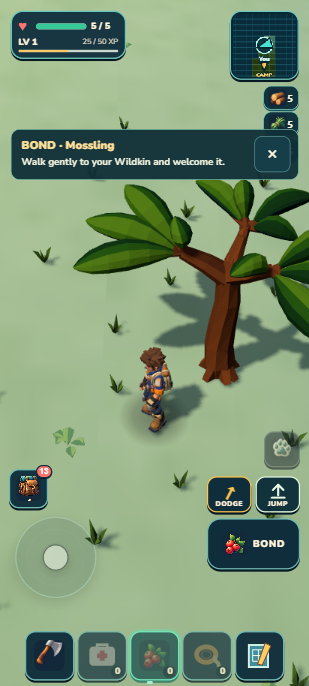

A compact plan now points to the next action already supported by the game: gather the exact berry-lure ingredients, craft at Camp, approach a quiet Mossling, physically return and secure the bond, then gather for its bed. The plan is derived from existing inventory, bond, care, crop, health and ability state; it creates no quest ledger or extra reward authority. Craft/build guidance includes selected reachable storage, while feeding and planting still require a berry in the backpack.

The fresh native journey began with no resources or owned Wildkin and secured exact Mossling `wildkin_wvwyyt` after one timed attempt expired during inspection. The earned Mossling was settled in a bed, fed three carried berries and given a nearby planted garden. The actual HARVEST prompt showed4berries/Bloom+1; harvesting changed pack berries2→6, cleared the crop and returned the purpose to Plant a berry. Final earned state is one cared-for Mossling, its bed and garden,6berries,1wood,1fiber,3wildflowers,50XP and full health5.

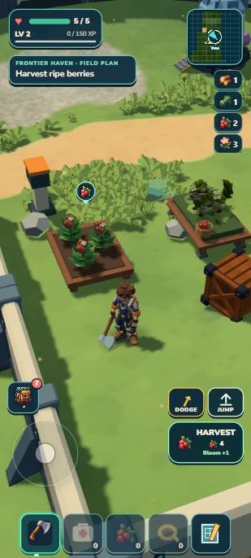 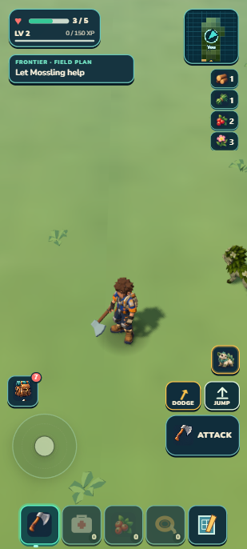

The earned outing stayed at full health, so Bloom was checked in a clearly separate health fixture. The actual button healed3→5, started a24-second cooldown, cleared its hint and exposed the ready-crop return purpose. Developer literal reload and packaged import plus literal reload then matched the owned individual/genome, base, care, null crop, pack, atlas, ecology,50XP, health5 and Plant a berry purpose exactly. The final pack held6berries,1wood,1fiber and3wildflowers. Packaged resources came only from `http://127.0.0.1:8081`; its console was empty. The developer console had no errors since final reload, with one older unattributed pre-candidate error retained in history.

## Actual: clear portrait construction

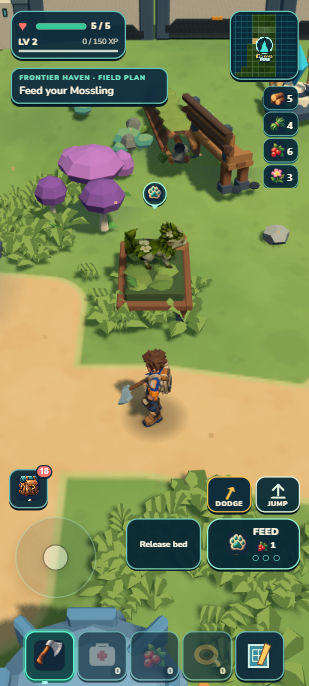 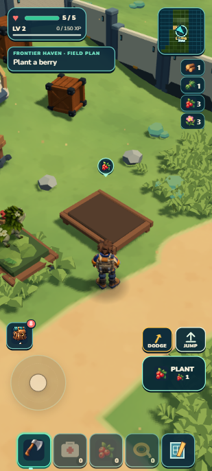

Construction now tests at most40 deterministic nearby positions through the unchanged validator used by payment, placement and reload; all11 current build families use the same rule. The existing camera owner rotates only during portrait construction. Cancel or external closure restores the prior view; successful Place retains the useful yaw and restores temporary pitch/zoom.

Native play reused the earned/refunded Camp fixture. Normal UI completed bed Build→Place→Settle→Feed three times and garden Build→Place at(2.3,0,4.3)→walk600ms/1.29m→Plant with no landscape, position or camera override. The garden is3.253m from the starting position: the rounded3.2m-ring candidate sits just outside interaction reach, and the ordinary short walk closed it. Independent review scored8.5/10 PASS. Visible Cancel and seven external owner/event paths restored exact camera state; landscape open retained its view and returning to portrait restored the prior portrait pitch.

Developer and packaged reload matched individual/genome, base/care/crop, pack, atlas/ecology,50XP, health5 and purpose exactly. The final fixture retained a ready90-second Bloom+1/yield4 crop and pack1wood,1fiber,2berries,3wildflowers. All1,252 tests passed in65.684seconds; verify/world/retained-campaign/build/validate/ZIP pass at44.22MB unpacked/20.56MB ZIP. This closes the earlier landscape workaround, but it is not a fresh outing or physical-phone claim. [Evidence and limits](../../../art/reviews/portrait-construction/receipt.md).

## Actual: Cragbreaker mining

An ordinary portrait ability activation now selects the three nearest active stone, iron or crystal sources within4.5m in3D and applies up to four normal harvest hits to each,12 total. It uses the existing guard, save-before-effect, pickup, harvest-bonus and depletion path. A full iron source has five pieces and can retain one. The first rejected hit stops the remaining burst while already committed effects and the ability cooldown remain.

The Emberhorn/position fixture depleted two four-piece crystals and collected all eight shards, moving crystal14→22. A separate iron check cracked iron5→1 and collected four ore, moving iron12→16. Partial iron1 and depleted crystal0 survived literal reload and a disclosed same-session forced resident-window-away/back cycle, not an earned walk. Normal field-tool F at1.35m finished iron1→0, leaving iron17, crystal22, zero pickups and health5.

Packaged import plus literal reload and Continue preserved the continuation state; Cragbreaker produced no duplicate yield and retained its18-second cooldown. Inventory, seven owned Wildkin, selection, base/care/crop/breeding, ecology, XP and active run matched exactly. The atlas correctly added one survey bit rather than matching byte-for-byte. Logs were empty and packaged origins were only `http://127.0.0.1:8081`. Activation measured12.2ms for eight hits and6.4ms for four hits on this laptop; this is not phone performance evidence. All1,260 tests passed in66.839seconds, and world/campaign/build/validate/ZIP passed at44.22MB unpacked/20.56MB ZIP. [Evidence and limits](../../../art/reviews/cragbreaker-mining/receipt.md).

## Actual: Tidefin's protected approach

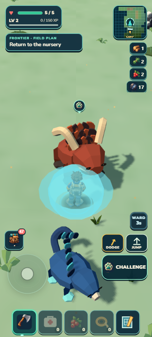 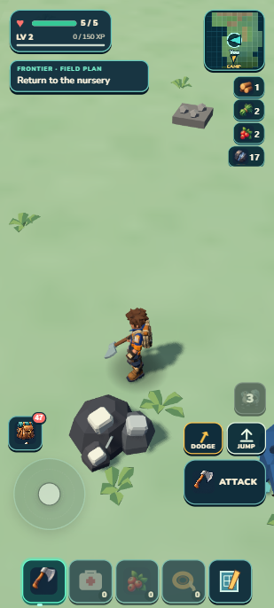 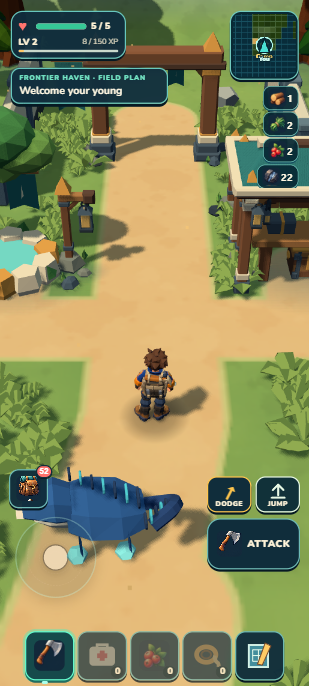

Tidal Ward now owns a three-second protection window in combat, separate from dodge and post-hit grace. The existing ability button remains disabled while protected and reads WARD3s→2s→1s from that authoritative timer before returning to the concurrently running26-second cooldown. The cyan presentation follows the same time, and routine activation no longer adds a toast over the visible hearts. All abilities retain the existing reload-ready policy.

In a controlled Tidefin/position fixture, ordinary portrait controls approached the northern territorial Emberhorn. WINDUP-timed DOM-button automation recorded the same charge at health5→3 without Ward and5→5 with Ward. This proves the routed damage difference, not reflex timing or an earned Tidefin capture. Ordinary F cleared nearby iron5→0 and collection moved iron17→22 with no pickups. The ordinary route reached Camp edge in24.969seconds and its physical arch11.694seconds later at health5; RETURN TO CAMP confirmation banked8XP for58 total and cleared the run. Developer literal reload and portable owner import plus literal reload matched the entire canonical progress state exactly. Ward was0, invulnerability was false and the ability correctly hid at Camp. Final logs were empty, and package origins were only `http://127.0.0.1:8081`. Native investigation also found and fixed a shared rusher/spitter clock race that had restarted WARN one fixed tick before territorial target eligibility; real warnings now escalate and leaving range still produces retreat. All1,270 tests passed in66.775seconds; world/campaign/build/validate/ZIP passed at44.23MB unpacked/20.56MB ZIP. Independent final review passed the complete source, native, aggregate and package chain with no blocker. No physical-phone, airplane-mode cold-start or earned-Tidefin claim is made. [Evidence and limits](../../../art/reviews/tidal-ward/receipt.md).

## Actual: a place worth investigating

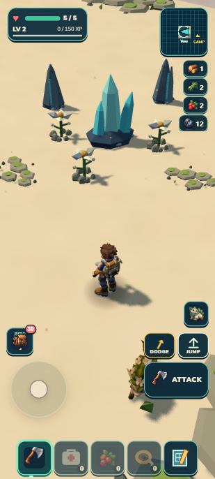 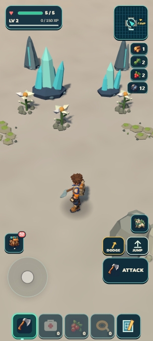

The Sunscar bloom is a small reusable natural place: real harvestable crystals surrounded by cloudflowers and dark rocks. The seed chooses location, orientation and one of two arrangements. Terrain support and regional conditions determine whether a candidate exists. Nearby content makes room for the complete place.

This is early composition variety. Two arrangements do not establish an inexhaustible catalog of unique discoveries. Every visible crystal uses the existing harvesting and saved finite-depletion path; no new collection menu or decorative fake crystal is introduced. Exact selected score and lifecycle evidence: [bloom receipt](../../../art/reviews/regional-blooms/receipt.md).

## Actual: an earlier physical discovery

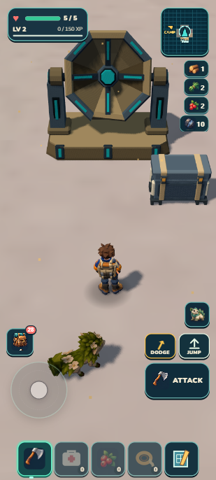 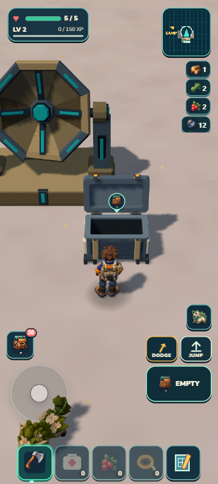

The Signal Cache offers an ordinary Open action and a one-time reward: two iron and eight XP. It is one authored location on validated generated ground. It establishes a working interaction/persistence path for future discoveries; it does not yet distribute rare secrets through the world. [Evidence](../../../art/reviews/frontier-discoveries/receipt.md).

## Actual: broader geography and less waiting

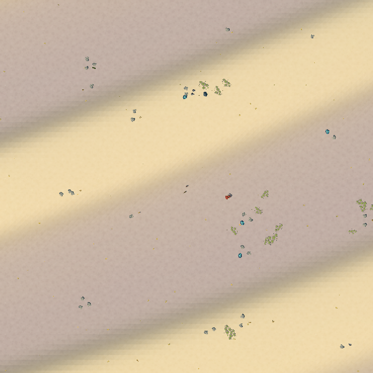

Three broad terrain grammars share the same seed field: lush rolling land, Sunscar ribs/basins and taller Ironspine ridges. Camp and the initial plateau route stay protected. The overhead shows structure better than the ordinary portrait view; visual richness remains unfinished. [Province evidence](../../../art/reviews/regional-provinces/receipt.md).

Terrain prepares incoming pieces while moving, and scenery reuses overlapping generation work. On the same135m desktop route, maximum terrain update fell85.3→20.1ms and scenery191.3→88.4ms. These are measured CPU pauses, not phone FPS. Hitches and physical-phone verification remain open. [Timing and lifecycle evidence](../../../art/reviews/streaming-preparation/receipt.md).

## What the alpha keeps—and postpones

| Focus for early alpha | Keep as later work |
| --- | --- |
| Recognizable habitats, useful resources and readable threats | An enormous biome/species catalog |
| A complete outing and physical Camp return | Online shared-world discovery services |
| Individual capture, body-tone inheritance, care/garden/pairing | Full modular anatomy and cross-species genetics |
| Simple preparation and visible progression | Deep statistics or a large research menu |
| Stable local saves, bounded residency and portrait controls | Unbounded-distance simulation and universal device claims |

Earthlike and alien reproduction, habitat-driven research, DNA storage/cloning, player breeding lineages and trading remain part of the design direction. Base colors and eye colors are separate traits; only current body tone is visibly expressed. Mortality/elder rules remain undecided. The first alpha should make the existing small set of systems enjoyable before multiplying them.

## How work is being prioritized

One batch should produce a player-visible outcome with a useful beginning and end. Independent workers handle genuinely separate owners. One focused review produces one repair list; tests cover the changed risks. Visual passes are capped at three, and previously held art is not reopened just to chase a score. Save, collision and offline failures still require repair. The scoped hybrid remains provisional after two trial batches and does not modify the global Wildkin, Dream Loop or Rapid Alpha Producer skills. With Tidefin's independent PASS, the coast/continent foundation is the next world candidate; it requires a focused audit before production and does not yet imply swimming, boats or finished water ecology.

The [current slice](../../CURRENT_SLICE.md) and [Living Frontier plan](../../LIVING_FRONTIER_PLAN.md) own the live next task and release priorities. This page is an illustrated checkpoint, not a promise that the remaining systems are implemented.
